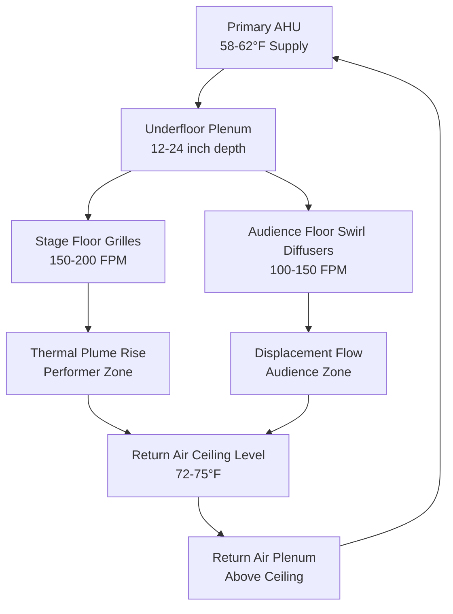
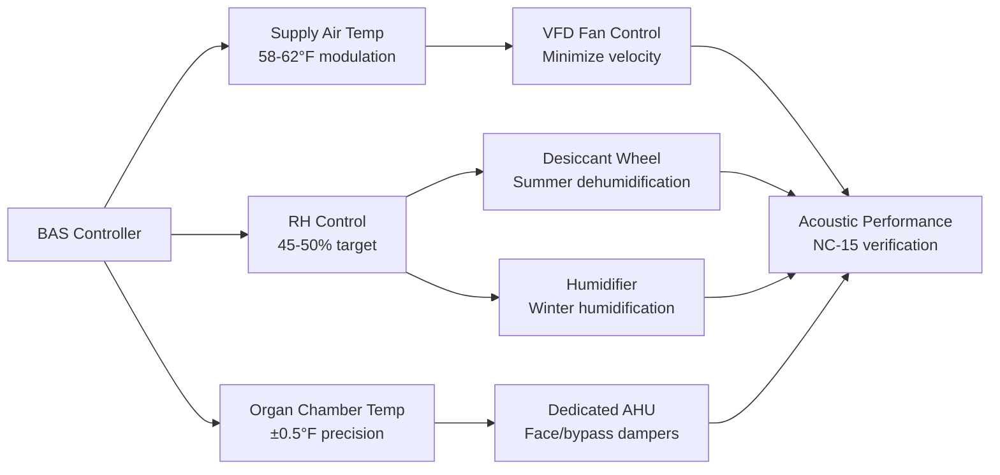

## Overview

Symphony hall HVAC design represents the most demanding acoustic environment in climate control engineering. The system must maintain precise environmental conditions for instrument preservation while operating at noise levels below 15 dBA (NC-15), often requiring airflow velocities below 400 FPM and specialized acoustic attenuation exceeding 60 dB. The critical interaction between thermal stratification, relative humidity control, and acoustic transmission shapes every design decision.

## Acoustic Performance Requirements

### Noise Criteria and Sound Power

Symphony halls require NC-15 or lower background noise levels, translating to approximately 25-28 dBA in the seating area. The relationship between duct velocity and generated sound power follows:

$$L_w = 10 \log_{10}\left(\frac{V^3 \cdot A}{10^{12}}\right) + K$$

where $L_w$ is sound power level (dB), $V$ is air velocity (FPM), $A$ is duct area (ft²), and $K$ is a constant (typically 85-90).

To achieve NC-15, maximum duct velocities must be restricted:

| Location | Max Velocity | Typical Size |
|----------|--------------|--------------|
| Main supply ducts | 800 FPM | 48" × 24" |
| Branch ducts | 500 FPM | 24" × 12" |
| Terminal devices | 300 FPM | Custom diffusers |
| Underfloor plenums | 200 FPM | Full stage width |

### Vibration Isolation

All mechanical equipment requires isolation to prevent structure-borne transmission. The required isolation efficiency is:

$$\eta = \left(1 - \frac{1}{\sqrt{1 + (2\zeta r)^2}}\right) \times 100\%$$

where $\zeta$ is damping ratio (0.05-0.10 for steel springs) and $r$ is frequency ratio ($f/f_n$). Minimum frequency ratio of 4:1 is required, demanding natural frequencies below 4-6 Hz for typical mechanical equipment.

## Instrument and Material Humidity Requirements

### Critical Relative Humidity Control

Musical instruments exhibit dimensional changes proportional to moisture content following:

$$\frac{\Delta L}{L} = \alpha_{MC} \cdot \Delta MC$$

where $\alpha_{MC}$ is the moisture expansion coefficient (0.0015-0.0025 per 1% MC change for wood) and moisture content relates to RH through sorption isotherms.

**Target environmental parameters:**

- **Relative humidity:** 40-60% (optimal: 45-50%)
- **Temperature:** 68-72°F during performances
- **RH stability:** ±5% maximum variation
- **Seasonal drift:** <2% per week

String instruments (violins, cellos) with thin wood sections (2-4 mm) respond rapidly to RH changes, exhibiting time constants of 24-48 hours. Pianos with larger mass exhibit time constants of 7-14 days.

### Latent Load Calculations

Audience metabolic moisture generation dominates latent loads:

$$q_{latent} = N \cdot SHR \cdot q_{total} \cdot \frac{1-SHR}{SHR}$$

For a 2,000-person capacity hall at 400 BTU/hr per person and sensible heat ratio of 0.75:

$$q_{latent} = 2000 \times 400 \times \frac{1-0.75}{0.75} = 266,667 \text{ BTU/hr}$$

This requires dehumidification capacity of approximately 22 tons of moisture removal during summer performances.

## Underfloor Air Distribution Systems

### Design Principles

Underfloor air distribution (UFAD) provides superior acoustic performance by eliminating overhead ductwork and utilizing low-velocity displacement ventilation. Supply air temperature differential drives the system:

$$Q = \rho \cdot c_p \cdot \dot{m} \cdot \Delta T$$

where supply air temperature depression of 8-12°F below space temperature creates natural convective flow. Supply air is introduced at 58-62°F through floor grilles at velocities below 200 FPM.

**UFAD system components:**

### Thermal Stratification Management

Vertical temperature gradient in displacement ventilation follows:

$$\frac{dT}{dz} = \frac{q_{conv}}{A \cdot \rho \cdot c_p \cdot u_z}$$

where $q_{conv}$ is convective heat gain, $A$ is floor area, and $u_z$ is vertical velocity. Target gradient is 0.5-1.0°F per foot of height, limiting stratification to 8-12°F between floor and ceiling in a 40-foot hall.

## Organ Pipe Temperature Stability

### Pitch Variation with Temperature

Pipe organ pitch varies directly with absolute temperature of the air column:

$$\frac{\Delta f}{f} = \frac{1}{2} \cdot \frac{\Delta T}{T}$$

where $f$ is frequency in Hz and $T$ is absolute temperature in Rankine. For concert A (440 Hz) at 70°F (530°R), a 2°F temperature change produces:

$$\Delta f = 440 \times \frac{1}{2} \times \frac{2}{530} = 0.83 \text{ Hz}$$

This 0.83 Hz shift is audibly detectable. ASHRAE Standard 55 allows ±3°F variation, but organ installations require ±1°F maximum.

### Temperature Control Strategies

**Zone-specific setpoints:**

| Zone | Temperature | Control Band | Airflow Pattern |
|------|-------------|--------------|-----------------|
| Organ chamber | 70°F | ±0.5°F | Laminar, low velocity |
| Stage platform | 68-70°F | ±1°F | UFAD displacement |
| Audience seating | 70-72°F | ±2°F | Displacement + mixing |
| Upper galleries | 72-74°F | ±3°F | Natural stratification |

Organ chambers require dedicated precision air handling with modulating face and bypass dampers for continuous temperature control independent of the main hall system.

## Performer Thermal Comfort

### Metabolic Heat Generation

Performing musicians generate 450-600 BTU/hr depending on instrument and exertion level:

- **String players (seated):** 450 BTU/hr (1.3 met)
- **Woodwind/brass (seated):** 500 BTU/hr (1.4 met)
- **Percussion (standing):** 550 BTU/hr (1.6 met)
- **Conductor (active):** 600 BTU/hr (1.7 met)

Stage sensible load for 100-piece orchestra:

$$q_{stage} = 100 \times 500 = 50,000 \text{ BTU/hr (4.2 tons)}$$

### Asymmetric Thermal Radiation

Stage lighting adds 15,000-30,000 BTU/hr radiant load directly on performers. The mean radiant temperature ($MRT$) experienced by performers differs from air temperature:

$$MRT = \sqrt[4]{\sum_{i=1}^{n} F_i \cdot T_i^4}$$

where $F_i$ is view factor to surface $i$ and $T_i$ is surface temperature in Rankine. Overhead lighting at 150°F with view factor of 0.3 can elevate MRT by 8-12°F above air temperature.

UFAD systems address this by providing localized cooling at floor level where seated performers draw conditioned air directly into their microenvironment.

## Audience Chamber Conditioning

### Load Diversity and Peak Demand

Audience sensible heat follows:

$$q_{sensible} = N \cdot SHR \cdot q_{total}$$

At 400 BTU/hr per person and SHR of 0.75:

$$q_{sensible} = 2000 \times 0.75 \times 400 = 600,000 \text{ BTU/hr (50 tons)}$$

Peak cooling demand occurs 30-45 minutes into performance as thermal mass saturates. Precooling the space to 66-68°F before doors open and allowing controlled drift to 72°F during performance reduces peak equipment capacity by 20-30%.

### Air Distribution Patterns

**Comparison of distribution methods:**

| System Type | Velocity | Noise Level | Temp Gradient | Energy Use |
|-------------|----------|-------------|---------------|------------|
| Overhead mixing | 400-600 FPM | NC-20 to NC-25 | 2-4°F | Baseline |
| High-sidewall | 300-500 FPM | NC-18 to NC-22 | 3-5°F | 105% |
| Underfloor displacement | 150-250 FPM | NC-12 to NC-15 | 8-12°F | 85% |
| Radiant + DOAS | N/A (radiant) | NC-10 to NC-12 | <2°F | 75% |

Underfloor displacement ventilation achieves superior acoustic performance while reducing energy consumption by 15% compared to overhead systems.

## System Integration and Control

Integrated control sequences maintain the critical balance between acoustic performance, environmental stability, and energy efficiency:

The control system prioritizes instrument protection (RH and organ temperature) over occupant comfort during unoccupied periods, shifting to balanced control during performances.

## Design Checklist

**Critical symphony hall HVAC requirements:**

- [ ] Acoustic analysis confirming NC-15 at all occupied locations
- [ ] Duct velocity verification: mains <800 FPM, branches <500 FPM, terminals <300 FPM
- [ ] Vibration isolation with frequency ratio >4:1 (natural frequency <6 Hz)
- [ ] Humidity control system maintaining 40-60% RH year-round
- [ ] Underfloor plenum depth 12-24 inches with access for maintenance
- [ ] Organ chamber dedicated precision control ±0.5°F
- [ ] Stage platform supply air 58-62°F at <200 FPM
- [ ] Precooling sequence to 66-68°F before audience arrival
- [ ] Acoustic treatment: silencers >60 dB insertion loss at 125-500 Hz
- [ ] Equipment location >100 feet from performance space or in isolated vault

---

**Reference Standards:**
- ASHRAE Standard 55: Thermal Environmental Conditions for Human Occupancy
- ASHRAE Handbook - HVAC Applications, Chapter 5: Places of Assembly
- ANSI S12.2: Criteria for Evaluating Room Noise
