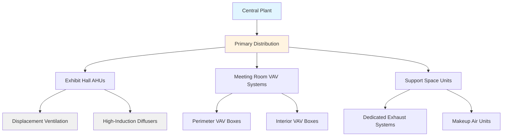

Convention centers present unique HVAC challenges due to their massive scale, functional diversity, and unpredictable occupancy patterns. These facilities demand systems capable of conditioning exhibit halls exceeding 100,000 square feet alongside smaller meeting rooms, all while maintaining efficiency during widely varying load conditions.

## Physical Characteristics and Thermal Challenges

Convention centers feature exceptionally high ceilings (30-60 feet typical in exhibit halls) creating significant stratification effects. The thermal gradient in these spaces follows:

$$T(z) = T_{\text{floor}} + \beta z$$

where $\beta$ represents the temperature gradient (typically 0.5-2°F per foot of height) and $z$ is the vertical distance. This stratification complicates load calculations since occupied zone temperatures differ substantially from average space temperatures.

The ratio of envelope load to occupancy load varies dramatically with space function. Exhibit halls with high glass facades may experience envelope loads of 40-60 Btu/hr-ft² while interior meeting rooms are occupancy-dominated at 80-120 Btu/hr-ft² during peak use.

## Multi-Zone Design Strategy

Convention centers require zone segregation to handle the fundamental difference between perimeter exhibition spaces and interior meeting areas. The effective zoning strategy recognizes three distinct thermal regimes:

**Exhibit Hall Zones**
- Large open volumes with minimal internal partitioning
- Variable occupancy: 0-15 ft²/person depending on event type
- Equipment loads: 3-8 W/ft² from displays, lighting, and electronics
- Setup periods with minimal cooling requirements

**Meeting Room Zones**
- Subdivided spaces with reconfigurable partitions
- Dense occupancy: 10-25 ft²/person during sessions
- High ventilation requirements per ASHRAE 62.1
- Simultaneous heating and cooling demands across adjacencies

**Support Space Zones**
- Loading docks requiring full exhaust and makeup air
- Food service areas with grease-laden exhaust
- Back-of-house spaces with moderate requirements

## Central Plant Design and Load Diversity

Convention center central plants exploit load diversity across multiple event spaces. The coincidence factor for cooling loads rarely exceeds 0.65-0.75, meaning installed plant capacity can be substantially less than the sum of individual zone peak loads.

The diversified cooling load is expressed as:

$$Q_{\text{total}} = F_d \sum_{i=1}^{n} Q_{i,\text{peak}}$$

where $F_d$ is the diversity factor (0.65-0.75) and $Q_{i,\text{peak}}$ represents individual zone peak loads. For a facility with 600 tons of summed peak zone loads, actual plant capacity may be 400-450 tons.

### Typical Central Plant Configuration

| Component | Capacity Range | Configuration | Redundancy Level |
|-----------|---------------|---------------|------------------|
| Chillers | 800-3000 tons total | 3-5 units in parallel | N+1 minimum |
| Cooling Towers | 125% of chiller heat rejection | Multiple cells | Per chiller |
| Primary Pumps | 2.5-3.0 gpm/ton | Dedicated per chiller | Built-in |
| Secondary Pumps | Variable flow | 2-4 variable speed | N+1 |
| Boilers | 60-80% of heating load | 2-3 units | N+1 |

The primary-secondary pumping arrangement decouples production from distribution, critical for maintaining chiller flow while zone demands fluctuate. Secondary flow varies from 20-100% based on valve positions throughout the facility.

## Air Distribution for High-Ceiling Exhibit Halls

Conventional overhead mixing systems waste energy heating or cooling the massive unoccupied volume above 8-10 feet. Two superior approaches address this:

**Displacement Ventilation**
Supply air at 63-67°F near floor level through low-velocity diffusers. Natural convection from heat sources (people, equipment) creates upward plumes carrying contaminants to ceiling-level return/exhaust points. This strategy reduces cooling energy by 15-25% compared to overhead mixing while improving air quality in the occupied zone.

The buoyancy-driven flow velocity is approximated by:

$$v = \sqrt{\frac{2g \Delta T H}{T_{\text{avg}}}}$$

where $g$ is gravitational acceleration, $\Delta T$ is the temperature difference driving stratification, and $H$ is the characteristic height.

**High-Induction Diffusers**
Ceiling-mounted diffusers with high throw velocities (1500-2500 fpm) and induction ratios of 8:1 to 12:1 entrain room air, creating a mixed supply stream that descends to the occupied zone before significant temperature decay. This approach works effectively with lower supply air quantities than traditional mixing systems.

## Ventilation Requirements and CO₂ Management

ASHRAE 62.1 specifies ventilation rates for assembly spaces based on occupancy density. For convention centers:

- Exhibit halls: 0.06 cfm/ft² + 5 cfm/person
- Meeting rooms: 0.06 cfm/ft² + 5 cfm/person
- Assembly areas (dense): 0.06 cfm/ft² + 5 cfm/person

At peak occupancy (10 ft²/person), meeting rooms require outdoor air fractions exceeding 35-40%. Demand-controlled ventilation using CO₂ sensors provides substantial energy savings during partial occupancy periods, which represent the majority of operating hours.

The CO₂ concentration relationship is:

$$C_{\text{space}} = C_{\text{outdoor}} + \frac{G}{V_{\text{oa}}}$$

where $G$ is the CO₂ generation rate (0.3-0.4 cfm per person) and $V_{\text{oa}}$ is the outdoor air ventilation rate. Maintaining 1000-1200 ppm typically requires the calculated outdoor air quantities.

## Energy Efficiency Strategies

**Variable Primary Flow**
Modern central plants eliminate constant-flow primary loops in favor of variable primary flow (VPF) where chiller-dedicated pumps modulate based on total system demand. This reduces pumping energy by 30-50% annually compared to primary-secondary arrangements with constant primary flow.

**Waterside Economizer**
During cool ambient conditions (typically below 50-55°F wet bulb), cooling towers can provide chilled water directly, bypassing chillers entirely. Annual energy savings of 15-25% are achievable in moderate climates.

**Thermal Energy Storage**
Ice or chilled water storage shifts cooling production to off-peak nighttime hours, reducing demand charges and enabling smaller chiller capacity through load leveling. The stored energy is:

$$E = m c_p \Delta T \quad \text{(sensible)} \quad \text{or} \quad E = m h_{fg} \quad \text{(latent)}$$

For ice storage, the latent heat of fusion ($h_{fg}$ = 144 Btu/lb) provides extremely high energy density.

## 24/7 Setup and Breakdown Operations

Convention centers operate continuously during event changeovers. Setup crews work overnight installing booths while concurrent events occupy other areas. This demands:

- Independent zone control preventing conditioning interference between active event spaces and setup areas
- Minimum ventilation maintenance in unoccupied exhibit halls (0.06 cfm/ft²) for crew safety
- Scheduling flexibility enabling selective zone activation without operating entire air handlers
- Lighting and HVAC integration where setup lighting automatically triggers minimum conditioning

During setup periods, loads drop to 10-20% of event levels, yet systems must maintain minimum airflow for ventilation and space pressurization. VAV systems with turndown ratios of 10:1 or greater enable this without zone-level fan-powered boxes.

## Pressurization and Smoke Control

Large exhibit halls require careful pressurization relative to exterior and adjacent spaces. Positive pressure of 0.02-0.05 in. w.c. prevents infiltration through the building envelope while avoiding door-opening difficulty.

Smoke control systems for these large volumes typically employ one of two approaches:

1. **Zoned smoke control** subdividing the space with deployable barriers and selective exhaust
2. **Mechanical exhaust at high level** using dedicated smoke exhaust fans sized for 4-6 air changes per hour

Both strategies must coordinate with fire alarm systems and comply with NFPA 92 requirements for large-volume spaces.

---

**File:** `/Users/evgenygantman/Documents/github/gantmane/hvac/content/specialty-applications-testing/specialty-hvac-applications/places-of-assembly/convention-centers/_index.md`

This content provides physics-based analysis of convention center HVAC systems, covering the fundamental thermal challenges, multi-zone design strategies, central plant optimization, and operational flexibility required for these complex facilities.