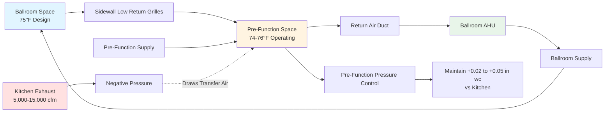

## Ballroom HVAC Design Fundamentals

Ballrooms present exceptional HVAC challenges due to extreme occupancy density variations (50-500 persons per 1,000 ft²), divisible space configurations requiring independent zone control, high ceilings creating thermal stratification, and adjacency to high-exhaust kitchen facilities. The primary engineering challenge is designing systems that efficiently handle banquet configurations generating 250-300 Btu/h per person versus dance events producing 550-800 Btu/h per person, while maintaining acceptable comfort conditions throughout 18-28 ft ceiling heights.

Successful ballroom HVAC design requires coordination between airwall partition placement, chandelier locations dictating air distribution constraints, pre-function space integration for load diversity benefits, and catering kitchen hood makeup air that can overwhelm ballroom pressurization if improperly designed.

```mermaid
graph TD
    A[Ballroom HVAC System] --> B[Divisible Space Zones]
    A --> C[Configuration Adaptability]
    A --> D[Vertical Stratification Control]
    A --> E[Adjacent Space Integration]

    B --> B1[Independent AHU per Zone]
    B --> B2[Airwall Partition Sealing]
    B --> B3[Zone Isolation Dampers]
    B --> B4[Individual DDC Control]

    C --> C1[Banquet Mode<br/>250-300 Btu/h·person]
    C --> C2[Dance Mode<br/>550-800 Btu/h·person]
    C --> C3[Theater Seating<br/>225-250 Btu/h·person]
    C --> C4[Reception Standing<br/>400-500 Btu/h·person]

    D --> D1[Supply Air Temperature Control]
    D --> D2[Throw Distance Calculation]
    D --> D3[Ceiling Height Compensation]
    D --> D4[Chandelier Interference]

    E --> E1[Pre-function Return Air]
    E --> E2[Kitchen Hood Makeup]
    E --> E3[Service Corridor Isolation]
    E --> E4[Loading Dock Vestibule]

    style A fill:#e1f5ff
    style C fill:#fff4e1
    style D fill:#ffe1e1
    style E fill:#e8f5e9
```

## Occupancy Configurations and Load Diversity

Ballroom sensible and latent heat generation varies dramatically based on activity type and seating density. Understanding these load variations is critical for system sizing and control strategy development.

| Configuration | Occupancy Density | Sensible Heat | Latent Heat | Total per Person | Ventilation per ASHRAE 62.1 |
|---------------|------------------|---------------|-------------|------------------|----------------------------|
| Banquet Seated | 10-15 ft²/person | 175 Btu/h | 75 Btu/h | 250 Btu/h | 7.5 cfm/person |
| Theater Seated | 7-10 ft²/person | 165 Btu/h | 60 Btu/h | 225 Btu/h | 7.5 cfm/person |
| Classroom Seated | 15-20 ft²/person | 165 Btu/h | 60 Btu/h | 225 Btu/h | 7.5 cfm/person |
| Reception Standing | 6-8 ft²/person | 275 Btu/h | 175 Btu/h | 450 Btu/h | 7.5 cfm/person |
| Dance Activity | 10-12 ft²/person | 350 Btu/h | 400 Btu/h | 750 Btu/h | 20 cfm/person |

The heat generation rate during dancing approaches light exercise activity levels, with metabolic rates reaching 400-450 Btu/h and latent heat fractions exceeding 50%. This creates two distinct design challenges:

**Sensible cooling capacity:** Dance mode requires 2.5-3 times the sensible cooling of banquet mode. Systems must handle this variation without excessive supply air quantities during low-load conditions.

**Latent removal capacity:** Dance events generate high moisture loads requiring apparatus dew point temperatures 5-8°F lower than banquet events. Variable speed fan control alone cannot address this requirement.

### Load Calculation for Divisible Ballrooms

For divisible ballrooms with operable airwall partitions, each zone must be calculated independently assuming worst-case occupancy. The total installed capacity exceeds the diversity-adjusted whole-ballroom load:

$$Q_{total} = \sum_{i=1}^{n} Q_{zone,i} > Q_{ballroom} \times f_{diversity}$$

Where:
- $Q_{zone,i}$ = Individual zone design capacity (Btu/h)
- $Q_{ballroom}$ = Whole ballroom capacity if undivided (Btu/h)
- $f_{diversity}$ = Diversity factor (typically 0.85-0.95 for convention centers)

This non-diversity approach ensures acceptable conditions when airwalls divide the space into separately-occupied zones with different event types occurring simultaneously (common scenario: banquet in one section, dance in adjacent section).

## Divisible Ballroom Zoning and Partition Coordination

Airwall partitions create acoustic and thermal barriers dividing large ballrooms into 2-4 smaller spaces. HVAC systems must maintain zone independence while avoiding air transfer through partition gaps that degrades acoustic separation and zone temperature control.

### Airwall Partition Air Leakage

Operable partitions achieve Sound Transmission Class (STC) ratings of 50-55 when properly sealed, but require positive pressure differential management to prevent air transfer. The air leakage through partition seals follows orifice flow principles:

$$Q_{leak} = C_d \times A_{gap} \times \sqrt{\frac{2 \times \Delta P}{\rho}}$$

Where:
- $Q_{leak}$ = Leakage airflow (ft³/min)
- $C_d$ = Discharge coefficient (0.6-0.65 for partition seals)
- $A_{gap}$ = Effective gap area (ft²)
- $\Delta P$ = Pressure differential across partition (lb/ft²)
- $\rho$ = Air density (lb/ft³)

To maintain acoustic integrity, pressure differential across partitions should not exceed 0.02-0.03 inches water column. This requires precise supply and return airflow balancing for each zone, typically using DDC-controlled modulating dampers that maintain zone static pressure setpoints ±0.005 inches water column.

### Zone Independence Control Strategy

Each divisible section requires:

1. **Dedicated air handling unit or zone-specific coils:** Independent temperature control prevents thermal transfer through partition leakage
2. **Zone isolation dampers:** Automatic dampers in supply and return ducts close when zones are combined, preventing airflow imbalances
3. **Pressure monitoring:** Static pressure sensors verify zone isolation and trigger alarm conditions if pressure differentials exceed limits
4. **Coordinated economizer operation:** Outdoor air dampers modulate together across all zones to prevent inter-zone pressure differentials

The control sequence must address mode transitions (combined to divided operation) by gradually ramping zone setpoints and airflows to prevent pressure transients that generate audible air noise through partition seals.

## High Ceiling Thermal Stratification

Ballroom ceiling heights of 18-28 ft create significant thermal stratification that reduces effective cooling capacity and increases equipment sizing requirements. Warm air accumulation near the ceiling represents "lost" cooling capacity that does not contribute to occupied zone comfort.

### Stratification Calculation

The temperature gradient in a space with heat input and high ceilings can be approximated:

$$\frac{dT}{dz} \approx \frac{Q_{internal}}{A_{floor} \times \rho \times c_p \times v_z}$$

Where:
- $dT/dz$ = Temperature gradient (°F/ft)
- $Q_{internal}$ = Internal heat gains (Btu/h)
- $A_{floor}$ = Floor area (ft²)
- $v_z$ = Average vertical air velocity (ft/min)
- $\rho$ = Air density (lb/ft³)
- $c_p$ = Specific heat of air (Btu/lb·°F)

For typical ballroom conditions with minimal air movement, temperature gradients of 0.5-1.5°F per foot of height are common, resulting in ceiling temperatures 10-25°F above occupied zone temperatures. This stratified air contains significant sensible heat that must be replaced with additional cooling.

### Stratification Mitigation Strategies

**High-velocity supply air:** Jet velocities of 1,500-2,500 fpm at supply outlets create turbulent mixing and room air entrainment that prevents stratification. The throw distance must reach 75-90% of the space dimension:

$$L_{throw} = V_o \times \frac{T_o}{50} \times K_{trajectory}$$

Where:
- $L_{throw}$ = Throw distance to 50 fpm terminal velocity (ft)
- $V_o$ = Initial outlet velocity (fpm)
- $T_o$ = Effective outlet diameter (inches)
- $K_{trajectory}$ = Trajectory correction factor (0.8-1.2 depending on mounting)

For a 24 ft ceiling height with perimeter high sidewall diffusers, throw distance to room center should be 40-50 ft, requiring outlet velocities of 2,000+ fpm.

**Supply air temperature differential:** Colder supply air temperatures (12-16°F below space temperature) increase air density, causing downward projection that counteracts natural stratification. However, excessive temperature differentials create cold drafts in the occupied zone and require humidity control to prevent condensation on diffusers.

**Chandelier coordination:** Decorative chandeliers create physical obstructions to airflow patterns. Supply outlets must be located to avoid direct impingement on chandelier elements while maintaining adequate throw distance. This often requires custom air distribution layouts coordinated with lighting designers during early design phases.

## Kitchen Hood Makeup Air Integration

Ballrooms adjacent to catering kitchens must provide makeup air for kitchen exhaust hoods, which can exhaust 5,000-15,000 cfm depending on equipment type and diversity. Improperly integrated makeup air systems create pressure imbalances affecting ballroom comfort and door operation.

### Makeup Air Capacity Requirements

Type I kitchen hoods (grease-producing appliances) require exhaust rates based on appliance duty and hood configuration per ASHRAE 154:

| Hood Type | Exhaust Rate | Typical Makeup Air |
|-----------|--------------|-------------------|
| Wall-mounted canopy | 200-300 cfm/ft hood length | 80-90% of exhaust |
| Single island canopy | 300-400 cfm/ft hood length | 80-90% of exhaust |
| Double island canopy | 400-500 cfm/ft hood length | 80-90% of exhaust |
| Backshelf/passover | 150-250 cfm/ft hood length | 80-90% of exhaust |

The remaining 10-20% represents infiltration through doors and transfer air from adjacent spaces. Ballrooms should not provide more than 25-30% of total kitchen makeup air to prevent excessive pressurization loads.

### Ballroom Pressurization Impact

When kitchen exhaust operates, the facility experiences negative pressure unless adequate makeup air is provided. The pressure relationship follows:

$$\Delta P_{building} = \frac{(Q_{supply} - Q_{exhaust})^2 \times \rho}{2 \times C_d^2 \times A_{leakage}^2}$$

This pressure differential affects ballroom door operation (doors become difficult to open against pressure differential exceeding 0.15 inches water column) and can cause transfer air from pre-function spaces or exterior infiltration.

The preferred solution provides dedicated kitchen makeup air units with pre-heating and minimal cooling, positioned to discharge directly into the kitchen environment. Ballroom systems maintain slight positive pressure (0.02-0.05 inches water column) relative to kitchen spaces, preventing kitchen odors from entering the ballroom while allowing controlled transfer air through service corridors.

## Pre-Function Space Integration

Pre-function areas (lobbies, foyers, and corridors adjacent to ballrooms) offer load diversity benefits and return air integration opportunities, but require careful pressure relationship management.

Pre-function spaces typically operate at lower occupancy densities (30-50 ft²/person) with lower heat gains, creating cooling load diversity. Some ballroom designs utilize pre-function spaces as return air plenums, with low sidewall return grilles that collect air for return to ballroom air handlers. This approach provides several benefits:

- **Reduced ductwork:** Eliminates need for extensive return ductwork in ballroom ceiling
- **Improved air distribution:** Longer airflow path through space improves mixing
- **Acoustic buffering:** Reduces return air noise transmitted into ballroom
- **Load diversity:** Pre-function loads partially offset by using space as return plenum

The primary design constraint is maintaining acceptable pre-function space temperatures while serving as a return plenum. Pre-function areas require supplemental cooling when ballroom return air temperatures exceed pre-function design conditions.

## System Selection and Capacity Staging

Ballroom HVAC systems must efficiently handle the wide load range between minimum occupancy (setup/teardown at 10-20% of design load) and peak dance events (100-120% of design banquet load). Single-capacity systems cycle excessively at low loads, creating temperature and humidity swings.

### Recommended System Configurations

**Variable air volume (VAV) with zone reheat:** Each divisible section receives dedicated VAV terminals with hot water or electric reheat. Supply airflow modulates from 30-40% minimum to 100% maximum, maintaining proper air distribution at all load conditions. This approach provides good part-load efficiency and excellent zone control.

**Multiple small air handling units:** Instead of one large AHU serving entire ballroom, 2-4 smaller units serve separate zones. Units stage on/off based on load, with lead-lag rotation. This provides built-in capacity staging and maintains high equipment efficiency at part load.

**Variable speed drives with multi-stage cooling:** Single large AHU with VFD fan control and 2-3 stages of DX cooling or 2-way chilled water valve. Provides economical solution for smaller ballrooms (<10,000 ft²) where divisible zones are not required.

The total system capacity should be based on simultaneous dance occupancy at design conditions, even though this represents a rare worst-case scenario. Attempting to size for "average" conditions results in inadequate capacity during peak events, which generate the most customer complaints and revenue impact.

---

## Components

- Divisible Ballroom Design
- Airwall Partition Integration
- Individual Zone Control
- Ballroom Capacity 500 To 3000
- Banquet Seating Configuration
- Theater Seating Configuration
- Classroom Seating Configuration
- Reception Standing Configuration
- Kitchen Adjacency Coordination
- Loading Dock Proximity
