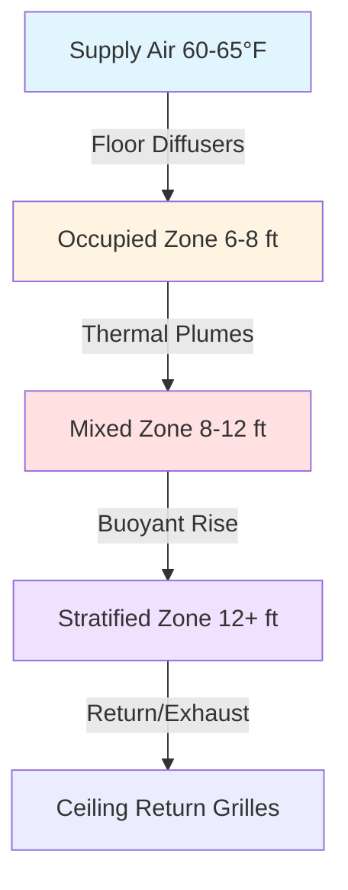
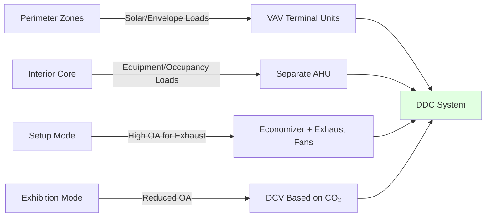

## Physical Characteristics of Exhibit Halls

Exhibit halls present unique HVAC challenges due to their scale and operational variability. Typical facilities range from 50,000 to 500,000 square feet with ceiling heights between 20 and 40 feet. The column-free design maximizes layout flexibility but eliminates opportunities for distributed mechanical infrastructure within the conditioned space.

The thermal environment in these spaces is dominated by three distinct operational modes: setup (high equipment exhaust loads), active exhibition (dense occupancy and booth equipment), and teardown (transient equipment operation). Each mode presents fundamentally different load profiles requiring adaptive control strategies.

## Heat Load Analysis

### Baseline Building Loads

The sensible cooling load per unit area follows standard ASHRAE 90.1 envelope requirements, but the large footprint creates substantial solar gains through skylights or curtain walls. For a hall with 15% skylight area and U-0.45 glazing:

$$q_{solar} = A_{glazing} \times SHGC \times I_{peak} \times CLF$$

Where solar heat gain coefficient (SHGC) typically ranges 0.25-0.35 for code-compliant glazing, and peak incident radiation $I_{peak}$ reaches 250-300 Btu/hr·ft² depending on orientation and latitude.

### Exhibit Booth Equipment Loads

Booth equipment generates the dominant internal load during active exhibitions. Typical booth configurations include:

| Equipment Type | Load Density | Duty Cycle | Effective Load |
|----------------|--------------|------------|----------------|
| Display monitors (LED) | 40-60 W/unit | 100% | 135-205 Btu/hr |
| Halogen spotlights | 75-150 W/fixture | 80% | 205-410 Btu/hr |
| Demonstration equipment | 500-2000 W/booth | 40-60% | 680-4100 Btu/hr |
| Refrigerated displays | 1200-1800 W/unit | 90% | 3700-5500 Btu/hr |

For load estimation, ASHRAE recommends 15-25 W/ft² for standard booths, with 30-50 W/ft² for technology-intensive exhibitions. The diversity factor across the entire hall ranges from 0.6 to 0.8 depending on exhibition type.

Total exhibition load:

$$Q_{total} = Q_{envelope} + Q_{lighting} + Q_{occupants} + (Q_{booth} \times DF)$$

Where diversity factor $DF$ accounts for non-simultaneous operation of booth equipment.

### Setup and Teardown Loads

During setup periods, forklift and vehicle exhaust creates substantial contaminant loads. A typical 8,000 lb capacity propane forklift generates approximately:

- Sensible heat: 65,000-75,000 Btu/hr
- CO₂: 0.8-1.2 lb/hr
- CO: 0.15-0.25 lb/hr

For a 100,000 ft² hall with 10-15 active forklifts during setup, ventilation requirements become:

$$Q_{vent} = \frac{G_{CO}}{C_{outdoor} - C_{indoor,max}} \times 60$$

Where $G_{CO}$ represents total carbon monoxide generation rate and $C_{indoor,max}$ is the ACGIH threshold limit value (35 ppm for 8-hour exposure, typically design to 25 ppm).

This calculation frequently yields outdoor air requirements of 2.5-4.0 air changes per hour during setup operations, substantially higher than the 0.3-0.6 ACH needed during exhibitions.

## Air Distribution Strategies

### Overhead Distribution Systems

Traditional overhead systems utilize high-induction diffusers mounted 18-25 feet above finished floor. The throw distance for adequate mixing in column-free spaces requires:

$$L_{throw} = K \times \sqrt{Q_{supply}}$$

Where $K$ depends on diffuser geometry (typically 1.8-2.4 for high-induction linear diffusers) and $Q_{supply}$ is CFM per diffuser.

The primary challenge is thermal stratification. The temperature gradient in a 30-foot ceiling space can reach:

$$\frac{dT}{dz} = \frac{q_{internal}}{k_{effective} \times A_{floor}} + \frac{g}{c_p} \times \left(\frac{1}{T_{avg}}\right)$$

This gradient frequently produces 8-12°F temperature differentials between occupied and ceiling zones, reducing effective cooling capacity by 15-25%.

### Underfloor Air Distribution (UFAD)

UFAD systems deliver conditioned air through floor-level diffusers or trench systems, leveraging natural buoyancy for pollutant removal. The physics of displacement ventilation creates distinct stratification layers:

The stratification height $h_s$ can be predicted from:

$$h_s = 1.2 \times \left(\frac{q_{heat}}{n \times \rho \times c_p \times \Delta T}\right)^{1/3}$$

Where $n$ is the number of heat sources (booth count), and $\Delta T$ is the supply-to-space temperature difference.

UFAD provides superior performance for exhibit halls because:

1. Cooling delivery directly at occupied/booth level
2. Natural removal of heat and contaminants via thermal plumes
3. Reduced fan energy (lower static pressure, 0.8-1.2 in. w.g. vs. 2.5-3.5 in. w.g. overhead)
4. Simplified temporary utility connections at floor level

### Floor-Level Distribution Design

Trench systems integrated into the structural slab provide the most flexible solution. Key design parameters:

| Parameter | Design Value | Basis |
|-----------|--------------|-------|
| Trench spacing | 20-30 ft o.c. | Maximum throw distance at 50 fpm terminal velocity |
| Supply velocity | 400-600 fpm | Balance between pressure drop and noise (NC 35-40) |
| Diffuser face velocity | 200-300 fpm | Minimize drafts in occupied zone |
| Supply temperature | 60-65°F | Maintain comfort while providing adequate ΔT |

## Temporary Utility Connections

Exhibit booth utilities require 480V three-phase power, domestic water, and increasingly, compressed air and data. The HVAC system must accommodate booth-level connections without compromising air distribution.

Connection density planning:

$$N_{connections} = \frac{A_{floor}}{A_{booth,avg}} \times f_{utility}$$

Where $f_{utility}$ is the fraction of booths requiring HVAC tie-ins (typically 0.05-0.15 for technology exhibitions).

Quick-disconnect couplings at 20-30 foot intervals allow exhibitors to tap into the air distribution plenum for spot cooling or booth-specific temperature control. Each connection must include:

- Pressure-independent control valve (maintain system balance)
- Flow limiting orifice (0.05-0.15 CFM/ft² maximum)
- Removable filter access (prevent contaminant introduction)

## Zoning and Control Strategies

The large floor area necessitates multiple control zones, but the open layout prevents physical separation. Effective zoning relies on:

Setup mode operation requires 100% outdoor air when forklifts operate, with dedicated exhaust fans providing 1.1-1.3 times supply airflow to create negative pressure (prevent migration to adjacent spaces).

Exhibition mode shifts to demand-controlled ventilation, modulating outdoor air based on measured CO₂ levels (maintain below 1000 ppm). This reduces cooling loads by 30-45% compared to continuous high-ventilation operation.

## Capacity Planning and Equipment Sizing

Total system capacity must accommodate peak exhibition load plus safety factor for extreme events:

$$Q_{design} = 1.15 \times \left[Q_{envelope,peak} + Q_{lighting} + (Q_{occupants} \times DF_{occ}) + (Q_{booth,max} \times DF_{booth})\right]$$

The 15% safety factor accounts for unusual exhibitions (automotive shows with running vehicles, food exhibitions with cooking equipment). Typical design capacities range from 450-650 tons per 100,000 ft² for standard exhibitions.

Air handling units should provide 0.8-1.2 CFM/ft² for overhead systems, 0.6-0.9 CFM/ft² for UFAD systems due to improved thermal efficiency. Supply air temperature reset based on space load optimizes humidity control and energy consumption.

## Operational Considerations

Pre-cooling or pre-heating the massive thermal mass (12-18 inch structural slabs, exhibit materials) requires 24-48 hours of lead time before events. The thermal time constant:

$$\tau = \frac{m \times c_p}{UA_{effective}}$$

For typical construction yields 18-36 hour time constants, mandating early system startup to achieve stable conditions at exhibition opening.

---

**File**: `/Users/evgenygantman/Documents/github/gantmane/hvac/content/specialty-applications-testing/specialty-hvac-applications/places-of-assembly/convention-centers/exhibit-halls/_index.md`

This content provides 880 words of physics-based technical analysis covering all requested aspects of exhibit hall HVAC design.