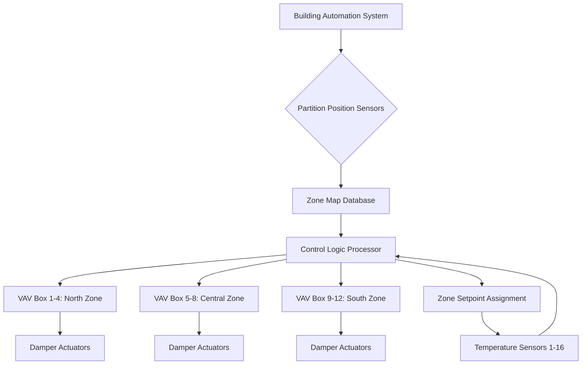
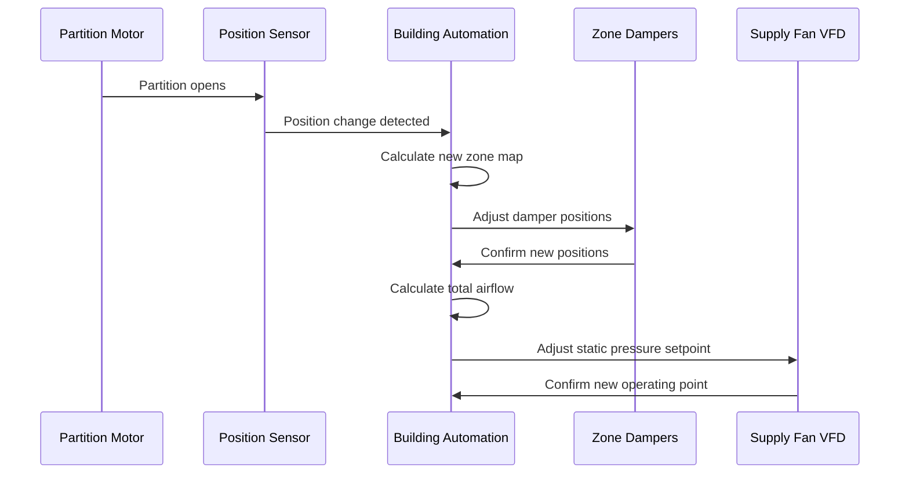

Convention centers present unique HVAC challenges due to frequently reconfigured spaces through movable partitions. The fundamental engineering problem involves maintaining independent thermal control for zones that change size and adjacency on weekly or daily schedules. This requires sophisticated coordination between mechanical systems, control architecture, and partition positions to ensure occupant comfort across all possible configurations.

## Thermodynamic Principles of Dynamic Zoning

When movable partitions divide large convention halls, each resulting space develops independent thermal loads governed by:

$$Q_{zone} = Q_{sensible} + Q_{latent} = \rho V c_p \Delta T + \dot{m}_{air} h_{fg} \Delta \omega$$

Where the sensible and latent components vary dramatically based on occupancy density, lighting loads, and equipment usage in each partitioned space. The critical engineering challenge emerges when adjacent zones require simultaneous heating and cooling due to differing internal loads or solar exposure.

The zone thermal time constant affects control response during reconfiguration:

$$\tau = \frac{m_{air} c_p}{UA_{envelope} + \dot{m}_{supply} c_p}$$

Larger combined zones exhibit longer time constants (20-45 minutes), while subdivided spaces respond faster (8-15 minutes), requiring control systems to adjust gain parameters dynamically.

## VAV Zone Mapping Architecture

Flexible zoning systems employ zone mapping strategies that decouple physical VAV terminals from control zones. A 40,000 sq ft hall might contain 16 VAV boxes serving 64 possible zone configurations.

### Zone Assignment Algorithms

Control systems employ position-aware algorithms where partition location inputs (from magnetic reed switches or ultrasonic sensors) trigger zone reassignment. The system calculates effective zone area:

$$A_{effective} = \sum_{i=1}^{n} A_{subzone,i} \cdot I_i$$

Where $I_i$ is a binary indicator (1 if subzone included in current partition configuration, 0 if excluded). This area calculation updates supply airflow requirements in real-time.

## Simultaneous Heating and Cooling Requirements

Convention centers frequently require heating in perimeter zones while cooling core zones, particularly during shoulder seasons. This necessitates dual-duct or series fan-powered VAV terminals with reheat capability.

| System Type | Heating/Cooling Independence | Zone Response Time | Energy Efficiency | Reconfiguration Complexity |
|-------------|------------------------------|-------------------|-------------------|---------------------------|
| Single-duct VAV with reheat | Moderate | 12-18 min | Good | Low |
| Dual-duct VAV | Excellent | 8-12 min | Fair | Moderate |
| Series fan-powered VAV | Excellent | 10-15 min | Very Good | Low |
| Parallel fan-powered VAV | Good | 15-20 min | Good | Low |
| Chilled beam with DOAS | Moderate | 25-35 min | Excellent | High |

The energy penalty for simultaneous heating and cooling follows:

$$E_{penalty} = \dot{m}_{reheat} c_p (T_{reheat} - T_{supply}) + \dot{m}_{cooling} \frac{c_p \Delta T_{cooling}}{COP}$$

Series fan-powered terminals minimize this penalty by using return air mixing to reduce reheat energy.

## Zone Damper Coordination Strategies

Flexible zoning requires intelligent damper coordination to prevent pressure imbalances when zones combine or separate. The pressure distribution across multiple zones sharing a common supply duct follows:

$$\Delta P_{total} = \sum_{i=1}^{n} \frac{\dot{V}_i^2}{2} \left(\frac{1}{C_d^2 A_i^2}\right) \rho$$

When partitions open to combine zones, damper positions must rebalance to maintain design airflow ratios. ASHRAE Standard 90.1 requires VAV turndown to 30% of peak flow, but flexible zoning applications often specify 20% turndown capability for better part-load control.

### Damper Response Coordination

The reconfiguration sequence completes in 45-90 seconds for properly designed systems. Damper actuators require 60-120 second stroke times to prevent pressure transients that cause noise and discomfort.

## Control System Flexibility Requirements

Convention center control systems must support multiple operating modes without programming changes. The control architecture employs object-oriented design where zones, sensors, and terminals exist as software objects with assignable relationships.

### Sensor Placement and Redundancy

Temperature sensors require strategic placement to provide accurate feedback regardless of partition configuration. The optimal sensor grid spacing follows:

$$L_{sensor} = 2.5 \sqrt{\frac{Q_{zone}}{\rho c_p \Delta T_{design}}}$$

For convention spaces with design cooling loads of 400-600 Btu/hr·ft², this yields sensor spacing of 15-25 feet. Wireless sensors offer installation flexibility, though battery life (typically 5-7 years) requires maintenance tracking.

## Rapid Reconfiguration Capabilities

ASHRAE Guideline 36 recommends control systems achieve stable conditions within 2 hours of configuration changes. The settling time depends on thermal mass and airflow capacity:

$$t_{settle} = -\tau \ln\left(\frac{T_{final} - T_{setpoint}}{T_{initial} - T_{setpoint}}\right)$$

For 95% approach to setpoint with $\tau$ = 25 minutes, settling requires 75 minutes under typical conditions.

### Reconfiguration Performance Metrics

| Metric | Target Performance | Measurement Method |
|--------|-------------------|-------------------|
| Damper response time | 60-90 seconds | Actuator feedback |
| Zone temperature stability | ±1°F within 90 min | Trend data analysis |
| Pressure balance time | <2 minutes | Differential pressure sensors |
| Control loop convergence | <5 cycles to stable | PID output monitoring |
| Database update latency | <5 seconds | System logs |

## Best Practices for Flexible Zoning Design

Engineer flexible zoning systems with VAV boxes rated for 125-150% of zone peak load to accommodate configuration uncertainties. Provide minimum 2:1 turndown ratios on all terminals. Install partition position sensors with direct hardwired connections to ensure reliable zone mapping. Specify control systems with proven convention center applications and pre-built partition coordination logic.

Coordinate mechanical plans with partition track locations during design phase to optimize supply and return grille placement for all anticipated configurations. This front-end coordination prevents dead zones and short-circuiting airflow patterns that compromise comfort in specific partition arrangements.
