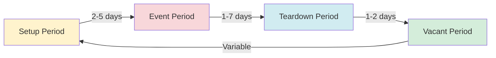
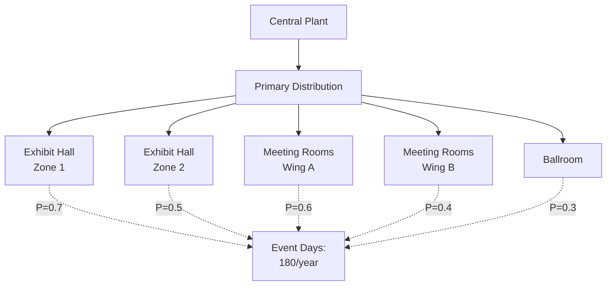

## Load Diversity Fundamentals

Convention centers present unique HVAC challenges due to temporal and spatial load diversity. Unlike continuously occupied buildings, convention facilities experience dramatic load variations based on event schedules, partial space utilization, and setup/teardown cycles. Understanding diversity factors is essential for economical central plant sizing and thermal storage implementation.

### Diversity Factor Definition

The diversity factor represents the ratio of the sum of individual maximum demands to the coincident maximum demand:

$$D_f = \frac{\sum_{i=1}^{n} Q_{max,i}}{Q_{coincident}} \geq 1.0$$

Where $Q_{max,i}$ is the peak cooling load for zone $i$ and $Q_{coincident}$ is the actual simultaneous peak load. Typical convention center diversity factors range from 1.3 to 2.0, meaning the central plant can be sized at 50-77% of the sum of zone peaks.

The simultaneous use factor is the reciprocal:

$$f_{sim} = \frac{1}{D_f} = \frac{Q_{coincident}}{\sum_{i=1}^{n} Q_{max,i}}$$

For convention centers, ASHRAE research indicates $f_{sim}$ values between 0.5 and 0.8 depending on facility size and event scheduling patterns.

## Event Schedule Impact on Loads

Convention center loads fluctuate dramatically across four operational phases:

### Load Profile by Phase

| Phase | Occupancy | Lighting | Equipment | Ventilation | Typical Load Factor |
|-------|-----------|----------|-----------|-------------|---------------------|
| Setup | 10-20% | 50-70% | 30-50% | Minimum | 0.25-0.35 |
| Event (occupied) | 100% | 100% | 80-100% | Design | 1.0 |
| Teardown | 10-20% | 50-70% | 20-40% | Minimum | 0.20-0.30 |
| Vacant | 0-5% | 10-20% | 5-10% | Off/minimum | 0.05-0.15 |

The total cooling load during each phase follows:

$$Q_{total} = Q_{envelope} + (Q_{occupancy} + Q_{lighting} + Q_{equipment}) \times f_{load} + Q_{ventilation}$$

Envelope loads remain constant, but internal and ventilation loads scale with the phase-specific load factor $f_{load}$.

## Partial Occupancy Scenarios

Convention centers rarely operate all spaces simultaneously. Exhibit halls may host events while meeting rooms remain vacant, or vice versa. The probability-based load estimation accounts for this:

$$Q_{design} = \sum_{i=1}^{n} (Q_{zone,i} \times P_{occupied,i})$$

Where $P_{occupied,i}$ is the probability that zone $i$ is occupied during peak conditions. Historical data from facility management systems provides these probabilities.

### Zoning Strategy Impact

Proper zoning enables selective conditioning:

## Central Plant Sizing vs Peak Loads

Central plant capacity must balance between undersizing (inadequate cooling during peak events) and oversizing (poor part-load efficiency during typical operations). The design cooling capacity is:

$$Q_{plant} = f_{sim} \times \sum_{i=1}^{n} Q_{zone,i} \times f_{safety}$$

Where $f_{safety}$ is typically 1.10 to 1.15 to account for future load growth and extreme weather. For a convention center with 10,000 tons of summed zone peaks, typical plant sizing would be:

$$Q_{plant} = 0.65 \times 10,000 \times 1.10 = 7,150 \text{ tons}$$

This represents a 28.5% reduction from peak sum, translating to significant capital cost savings.

### Plant Configuration Considerations

ASHRAE Guideline 36 recommends multiple chiller staging for convention centers:

| Configuration | Efficiency at 25% Load | Efficiency at 50% Load | Efficiency at 100% Load |
|---------------|------------------------|------------------------|-------------------------|
| Single large chiller | 0.75-0.85 kW/ton | 0.55-0.65 kW/ton | 0.50-0.60 kW/ton |
| Two equal chillers | 0.60-0.70 kW/ton | 0.55-0.65 kW/ton | 0.50-0.60 kW/ton |
| Three staged chillers | 0.55-0.65 kW/ton | 0.52-0.62 kW/ton | 0.50-0.60 kW/ton |

Multiple smaller chillers provide better part-load performance during setup, teardown, and partial occupancy phases.

## Thermal Storage Applications

Thermal energy storage (TES) systems offer substantial benefits for convention centers by decoupling instantaneous load from chiller operation. The storage capacity required depends on the load profile shape factor:

$$V_{storage} = \frac{\int_{t_1}^{t_2} (Q_{load}(t) - Q_{chiller}) dt}{\rho \times c_p \times \Delta T \times \eta}$$

For chilled water storage with $\Delta T = 15°F$ (8.3°C) and system efficiency $\eta = 0.90$:

$$V_{storage} = \frac{Q_{peak-hours} \times 12,000 \text{ Btu/ton-hr}}{62.4 \text{ lb/ft}^3 \times 1.0 \text{ Btu/lb-°F} \times 15°F \times 0.90} = 14.4 \times Q_{peak-hours} \text{ ft}^3\text{/ton-hr}$$

### Load Leveling Strategy

TES enables constant chiller operation during occupied periods:

```mermaid
gantt
    title Thermal Storage Load Leveling - Event Day
    dateFormat HH:mm
    axisFormat %H:%M

    section Building Load
    Setup phase (low)           :done, 06:00, 4h
    Event (peak)                :crit, 10:00, 8h
    Teardown (moderate)         :active, 18:00, 3h
    Night setback               :21:00, 9h

    section Chiller Operation
    Constant baseload           :done, 06:00, 15h
    Storage charging            :active, 21:00, 9h

    section Storage
    Discharge period            :crit, 10:00, 8h
    Charge period               :active, 21:00, 9h
```

TES systems can reduce chiller capacity by 30-40% while shifting electrical demand to off-peak hours, generating substantial utility cost savings under time-of-use rate structures.

## Design Recommendations

Based on ASHRAE research and field studies:

1. **Diversity Factor Application**: Use $D_f = 1.5$ for initial sizing of convention centers exceeding 200,000 ft², reducing to $D_f = 1.3$ for facilities below 100,000 ft².

2. **Occupancy Probability**: Analyze 3-5 years of event scheduling data to establish zone-specific probability factors. Default to $P = 0.60$ for exhibit halls and $P = 0.40$ for meeting spaces in absence of data.

3. **Thermal Storage**: Consider TES for facilities with peak-to-average load ratios exceeding 2.0 and favorable utility rate structures (peak/off-peak differential >$0.08/kWh).

4. **Monitoring**: Install submetering on major zones to validate diversity assumptions and refine plant operation strategies over time.

Proper application of load diversity principles allows convention center HVAC systems to achieve capital cost reductions of 20-35% while maintaining thermal comfort during all operational phases.
