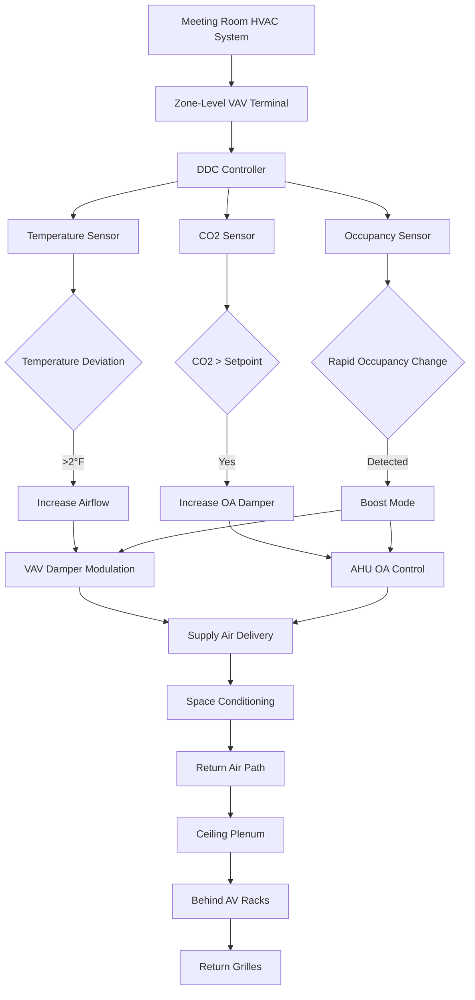

Convention center meeting rooms present unique HVAC challenges due to rapid occupancy fluctuations, high-density audiovisual equipment loads, and the need for individual thermal comfort in spaces that frequently reconfigure. These rooms—ranging from 10-person breakout spaces to 100-person divisible conference halls—require responsive systems that balance energy efficiency with occupant comfort during highly variable use patterns.

## Ventilation Requirements and CO2-Based Control

ASHRAE 62.1 specifies minimum ventilation rates for meeting rooms based on occupant density and floor area. The standard prescribes:

$$V_{bz} = R_p \times P_z + R_a \times A_z$$

Where:
- $V_{bz}$ = breathing zone outdoor airflow rate (cfm)
- $R_p$ = people outdoor air rate (5 cfm/person for conference rooms)
- $P_z$ = zone population
- $R_a$ = area outdoor air rate (0.06 cfm/ft²)
- $A_z$ = zone floor area (ft²)

For a 1,200 ft² divisible meeting room designed for 60 occupants, the minimum outdoor airflow calculates to:

$$V_{bz} = 5 \times 60 + 0.06 \times 1200 = 300 + 72 = 372 \text{ cfm}$$

**CO2-based demand control ventilation (DCV)** offers substantial energy savings by modulating outdoor air based on actual occupancy. The relationship between occupancy, CO2 generation, and steady-state concentration follows:

$$C_{ss} = C_{oa} + \frac{N \times G}{V_{oa} \times 60}$$

Where:
- $C_{ss}$ = steady-state CO2 concentration (ppm)
- $C_{oa}$ = outdoor air CO2 concentration (~400 ppm)
- $N$ = number of occupants
- $G$ = CO2 generation rate per person (~0.3 cfm at sedentary activity)
- $V_{oa}$ = outdoor air ventilation rate (cfm)

Setting a control setpoint of 1,000 ppm allows the system to reduce outdoor air during low occupancy periods while maintaining code compliance and air quality.

## Thermal Load Dynamics and Response Time

Meeting rooms experience step-function load changes as occupants enter for scheduled sessions. The sensible heat gain from occupants follows:

$$q_{sensible} = N \times SHG$$

For sedentary adults in a 72°F space, $SHG$ = 245 BTU/hr per person. A room transitioning from empty to 40 occupants generates an instantaneous 9,800 BTU/hr sensible load increase.

The **thermal time constant** of the conditioned space determines how quickly temperature rises without adequate HVAC response:

$$\tau = \frac{m \times c_p}{\dot{Q}_{cooling}}$$

Where:
- $\tau$ = time constant (hours)
- $m$ = thermal mass (lbm of air + furnishings)
- $c_p$ = specific heat (0.24 BTU/lbm·°F for air)
- $\dot{Q}_{cooling}$ = cooling capacity (BTU/hr)

Meeting rooms with light construction and minimal thermal mass may exhibit time constants of 15-30 minutes, requiring rapid HVAC response to prevent temperature drift exceeding 2°F during occupancy transitions.

## Audiovisual Equipment Heat Loads

Modern meeting rooms contain significant electronic loads from projection systems, displays, computing equipment, and videoconferencing infrastructure. These loads exhibit distinct thermal characteristics:

| Equipment Type | Typical Load Density | Diversity Factor | Heat Distribution |
|----------------|---------------------|------------------|-------------------|
| Ceiling-mounted projectors | 500-1,200 W each | 0.8 | 70% radiant, 30% convective |
| Large format displays | 300-600 W each | 1.0 | 50% radiant, 50% convective |
| AV rack equipment | 2-5 W/ft² | 0.7 | 80% convective, 20% radiant |
| Laptop docking stations | 50-100 W each | 0.5 | 60% convective, 40% radiant |

The high radiant component from projection equipment creates elevated mean radiant temperature (MRT), which affects thermal comfort independently of air temperature:

$$PMV = f(T_{air}, T_{radiant}, RH, v_{air}, M_{met}, I_{clo})$$

Where PMV (Predicted Mean Vote) accounts for both air and radiant temperatures. A 5°F increase in MRT from projection equipment requires approximately 2-3°F reduction in air temperature to maintain equivalent comfort.

## System Design Strategies

**VAV terminal sizing** must accommodate both peak loads and maintain minimum airflow for ventilation. The peak cooling airflow calculates as:

$$\dot{V}_{peak} = \frac{q_{sensible}}{1.08 \times \Delta T}$$

For a room with 15,000 BTU/hr peak sensible load and 20°F temperature differential:

$$\dot{V}_{peak} = \frac{15,000}{1.08 \times 20} = 694 \text{ cfm}$$

The terminal must also deliver minimum ventilation at turndown ratio, requiring careful selection to avoid excessive discharge velocities during heating or low-load conditions.

## Individual Room Control and Zoning

Each meeting room requires independent temperature control to accommodate:
- Variable occupant density (10-100 persons)
- Diverse thermal preferences across simultaneous meetings
- Operable wall configurations that combine/divide spaces

**Zoning strategies** include:

1. **One VAV box per room** - Provides complete independence but increases cost and coordination complexity
2. **Shared VAV with zone dampers** - Economical for smaller breakout rooms with similar load profiles
3. **Series fan-powered terminals** - Maintains air circulation during low outdoor air periods, improving comfort response

Control sequences must incorporate **occupancy-based setback** with rapid recovery capabilities. Unoccupied setpoints of 78°F cooling / 65°F heating reduce energy consumption while allowing 30-minute pre-occupancy boost cycles to establish comfort conditions before scheduled events.

## Return Air Configuration

Strategic return air placement prevents short-circuiting and ensures effective removal of heat from concentrated sources:

- **Low sidewall returns** - Capture stratified warm air from occupants and projection equipment
- **Ceiling plenum returns behind AV racks** - Direct removal of high-density equipment loads
- **Minimum 10 ft separation** from supply diffusers to prevent mixing losses

Transfer grilles in operable walls must provide minimum 1 in² per cfm for pressure equalization when rooms combine, preventing door slamming and comfort complaints.

## Performance Metrics

System effectiveness for meeting room HVAC centers on:

| Metric | Target Value | Measurement Method |
|--------|--------------|-------------------|
| Temperature recovery time | <20 minutes for 5°F deviation | Trending during occupancy transitions |
| CO2 steady-state value | <1,000 ppm at design occupancy | Continuous monitoring |
| Temperature uniformity | <3°F variation across space | Multi-point measurement |
| Acoustic performance | NC 30-35 | Sound level measurement at design flow |

Meeting these targets requires integrated controls, properly sized equipment, and commissioning that validates performance across the full range of occupancy scenarios typical in convention center operations.
