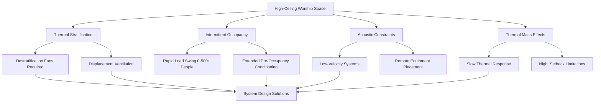

# HVAC for Houses of Worship

Houses of worship present distinct HVAC challenges that differentiate them from conventional commercial buildings. Churches, synagogues, mosques, and temples typically feature high ceilings, massive construction with significant thermal mass, intermittent occupancy with extreme load swings, and stringent acoustic requirements that constrain equipment selection.

## Unique Design Challenges

### High-Ceiling Thermal Stratification

Worship spaces commonly feature ceiling heights of 20-60 feet, creating pronounced thermal stratification. Warm air accumulates at the ceiling level during heating season, reducing occupied zone comfort and efficiency. The temperature gradient can be quantified as:

$$\frac{dT}{dz} = \frac{Q_{conv}}{k \cdot A}$$

Where $\frac{dT}{dz}$ is the vertical temperature gradient, $Q_{conv}$ is convective heat transfer, $k$ is thermal conductivity, and $A$ is cross-sectional area.

### Intermittent Occupancy Load Calculations

Peak occupancy occurs only during services, creating extreme load variability. The instantaneous sensible cooling load from occupancy can be calculated as:

$$Q_{sensible} = N \cdot SHG \cdot CLF$$

Where $N$ is number of occupants, $SHG$ is sensible heat gain per person (typically 250 Btu/hr for seated adults), and $CLF$ is cooling load factor accounting for thermal mass effects.

For a 500-seat sanctuary:
$$Q_{sensible} = 500 \times 250 \times 0.85 = 106,250 \text{ Btu/hr}$$

Latent load becomes significant with high occupancy density:

$$Q_{latent} = N \cdot LHG = 500 \times 200 = 100,000 \text{ Btu/hr}$$

Total occupancy load: 206,250 Btu/hr (17.2 tons) appearing within 15-30 minutes of service start.

### Thermal Mass and Recovery Time

Historic masonry construction with stone or thick brick walls exhibits high thermal mass that delays thermal response. The time constant for temperature change is:

$$\tau = \frac{\rho \cdot c \cdot V}{UA}$$

Where $\rho$ is density, $c$ is specific heat, $V$ is volume, $U$ is overall heat transfer coefficient, and $A$ is surface area. For massive construction, $\tau$ may exceed 8-12 hours, requiring extended pre-occupancy conditioning starting 3-5 hours before services.

## HVAC System Approaches

| Building Type | Primary System | Distribution | Key Considerations |
|---------------|----------------|--------------|-------------------|
| Traditional Church | Hydronic radiant + displacement ventilation | Floor/pew heating, low sidewall supply | Thermal mass preheating, silent operation |
| Modern Sanctuary | VAV with perimeter induction | Ceiling diffusers with throw control | Acoustic liner in ductwork, variable scheduling |
| Historic Restoration | High-velocity small-duct | Concealed in-pew or under-floor | Minimal visual impact, code limitations |
| Mosque | Dedicated outdoor air + radiant floor | Under-carpet radiant with overhead DOAS | Shoe removal accommodation, wash station loads |
| Synagogue | Split zoning for multiple spaces | Separate systems for sanctuary/classrooms | Diverse occupancy schedules, Sabbath controls |

### Ventilation Requirements

ASHRAE Standard 62.1 classifies houses of worship as "Places of religious worship" requiring 0.06 cfm/ft² plus 5 cfm/person. For a 5,000 ft² sanctuary with 500 occupants:

$$V_{ot} = R_a \cdot A_z + R_p \cdot P_z = (0.06 \times 5000) + (5 \times 500) = 2,800 \text{ cfm}$$

This outdoor air requirement creates significant conditioning load during extreme weather.

## Acoustic Constraints

Background noise levels must remain below NC-25 to NC-30 to avoid interfering with speech intelligibility and music. This necessitates:

- Supply air velocities limited to 400-600 fpm at diffusers
- Duct velocities below 800-1,000 fpm in occupied spaces
- Equipment placement in remote mechanical rooms with vibration isolation
- Lined ductwork with acoustic attenuation

Sound power level from diffusers must satisfy:

$$L_{p} = L_{w} - 10\log_{10}(Q) - 20\log_{10}(r) + 2.5$$

Where $L_{p}$ is sound pressure level, $L_{w}$ is diffuser sound power, $Q$ is directivity factor, and $r$ is distance from source.

## Design Recommendations

**System Selection:** Prioritize systems allowing variable capacity control to match intermittent loads. VAV systems, modulating condensing boilers, and variable-speed equipment provide optimal part-load efficiency.

**Controls Strategy:** Implement occupancy-based scheduling with astronomical clock backup. Enable adaptive pre-occupancy start based on indoor/outdoor temperature differential and thermal mass characteristics.

**Stratification Mitigation:** Install ceiling-mounted destratification fans on 20-30 foot centers for spaces above 20 feet high. Low-speed operation during occupied periods prevents draft complaints while recovering ceiling heat.

**Humidity Control:** Maintain 30-50% RH to preserve organs, pianos, and wooden furnishings. Dedicated dehumidification may be required in humid climates during unoccupied periods.

**Energy Recovery:** Apply energy recovery ventilation to condition the substantial outdoor air requirement. Enthalpy wheels or plate heat exchangers reduce conditioning energy by 50-70%.

## ASHRAE Applications Guidance

The ASHRAE Handbook—HVAC Applications Chapter 4 "Places of Assembly" provides specific guidance for houses of worship, emphasizing the need for quiet operation, flexibility for varying occupancy patterns, and preservation of architectural character in historic structures. Design conditions should account for ceremonial clothing that may differ from typical office attire.

## Conclusion

Successful HVAC design for houses of worship requires understanding the interaction between thermal mass, intermittent occupancy patterns, architectural constraints, and acoustic requirements. Proper load analysis accounting for rapid occupancy swings, combined with system selection prioritizing quiet operation and variable capacity, delivers occupant comfort while respecting the unique character of these spaces.

