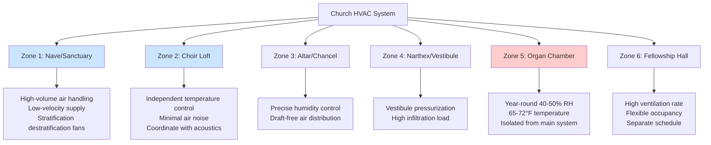

## Overview

Church buildings present unique HVAC challenges due to high ceilings, intermittent occupancy, acoustical constraints, and preservation requirements for historic elements. The designer must balance thermal comfort in occupied pew zones with protection of sensitive components including pipe organs, stained glass windows, and architectural finishes. ASHRAE Handbook - HVAC Applications Chapter 3 (Places of Assembly) and Chapter 24 (Museums, Galleries, Archives, and Libraries) provide the technical foundation for church climate control systems.

## Thermal Stratification in High-Ceiling Spaces

Church naves typically feature ceiling heights of 20 to 60 feet, creating significant vertical temperature gradients. The stratification factor quantifies this effect:

$$
\Delta T_{\text{strat}} = \frac{q_{\text{convective}}}{A_{\text{floor}} \cdot h_{\text{eff}}} \cdot (H - H_{\text{occ}})
$$

Where:
- $\Delta T_{\text{strat}}$ = temperature difference between ceiling and occupied zone (°F)
- $q_{\text{convective}}$ = convective heat gain (Btu/hr)
- $A_{\text{floor}}$ = floor area (ft²)
- $h_{\text{eff}}$ = effective convective heat transfer coefficient (Btu/hr·ft²·°F)
- $H$ = ceiling height (ft)
- $H_{\text{occ}}$ = occupied zone height, typically 6 ft

For a traditional nave with 40-ft ceilings and 500 congregants, stratification can produce temperature differentials of 15 to 25°F between the ceiling and pew zones during heating season.

## Pew Zone Heating Load Calculation

The occupied pew zone requires precise load calculation to avoid under-conditioning. The peak heating load accounts for infiltration, envelope losses, and warm-up requirements:

$$
Q_{\text{pew}} = Q_{\text{envelope}} + Q_{\text{inf}} + Q_{\text{warmup}}
$$

$$
Q_{\text{warmup}} = \frac{V_{\text{occ}} \cdot \rho \cdot c_p \cdot (T_{\text{set}} - T_{\text{night}})}{t_{\text{warmup}}}
$$

Where:
- $V_{\text{occ}}$ = volume of occupied zone (ft³)
- $\rho$ = air density, 0.075 lb/ft³
- $c_p$ = specific heat of air, 0.24 Btu/lb·°F
- $T_{\text{set}}$ = occupied setpoint temperature (°F)
- $T_{\text{night}}$ = night setback temperature (°F)
- $t_{\text{warmup}}$ = warmup time (hr), typically 2-4 hr before service

Churches operating on intermittent schedules (2-3 services per week) require rapid warmup capability, increasing installed heating capacity by 30 to 50 percent above steady-state loads.

## HVAC Zoning Strategy

Proper zoning segregates spaces with different thermal and occupancy patterns. The typical church requires minimum four zones:

## Pipe Organ Humidity Requirements

Pipe organs demand stringent climate control to prevent pitch drift, pipe corrosion, and leather component deterioration. The organ chamber requires:

- **Temperature:** 65 to 72°F year-round (±2°F tolerance)
- **Relative Humidity:** 40 to 50% year-round (±5% tolerance)
- **Air Changes:** 2 to 4 ACH, with filtration to MERV 11 minimum

Humidity control is critical. Dimensional changes in wooden pipes follow:

$$
\Delta L = L_0 \cdot \alpha_{\text{wood}} \cdot \Delta \text{MC}
$$

Where moisture content change correlates to RH through the sorption isotherm. A 20% RH swing produces approximately 1% dimensional change in wooden pipes, sufficient to detune the instrument.

The organ chamber must be isolated from the main nave system using dedicated air handling equipment with precise humidification control (steam or ultrasonic) and year-round operation.

## Stained Glass Window Protection

Historic stained glass windows are vulnerable to thermal shock and condensation. Design requirements include:

- **Prevent surface condensation:** Maintain glass surface temperature above dewpoint by ≥5°F
- **Avoid high-velocity airflow:** Limit air velocity near glass to <50 fpm to prevent thermal stress
- **Control solar heat gain:** Interior surface temperatures can reach 120 to 140°F on south/west exposures
- **Protective glazing:** Consider exterior storm glazing with vented airspace for high-value windows

The critical condensation check:

$$
T_{\text{glass,interior}} > T_{\text{dewpoint,interior}} + 5°F
$$

This requirement often necessitates perimeter heating (radiant panels, baseboard convectors, or warm air curtains) along window walls during winter operation.

## Traditional vs Contemporary Church HVAC Approaches

| Design Aspect | Traditional Churches | Contemporary Churches |
|--------------|---------------------|----------------------|
| **Ceiling Height** | 30-60 ft, requiring stratification control | 15-25 ft, conventional distribution |
| **Occupancy Pattern** | Intermittent (2-3 services/week) | Frequent (daily activities) |
| **Ventilation Strategy** | Natural ventilation supplement, lower ACH | Mechanical ventilation, 15-20 CFM/person |
| **System Type** | Radiators, unit heaters, minimal cooling | Central air handling, full AC |
| **Humidity Control** | Organ chamber only | Whole-building humidification/dehumidification |
| **Ductwork** | Concealed in walls, minimal | Exposed or acoustically treated |
| **Acoustic Constraints** | Severe (NC 25-30) | Moderate (NC 30-35) |
| **Temperature Setback** | Deep setback (50-55°F), long warmup | Moderate setback (62-65°F) |
| **Historic Preservation** | Strict limitations on penetrations | Design flexibility |

## System Selection Criteria

**For Traditional/Historic Churches:**
- Hydronic radiant systems (in-pew radiant panels, perimeter baseboard)
- High-induction diffusers to combat stratification
- Separate organ chamber conditioning
- Minimal ductwork visible in worship space
- Compliance with State Historic Preservation Office (SHPO) requirements

**For Contemporary Worship Spaces:**
- Variable air volume (VAV) systems with occupancy-based control
- Underfloor air distribution (UFAD) for flexible seating
- Integrated audio-visual system coordination
- Energy recovery ventilation for high outdoor air rates
- Building automation with service schedule programming

## Design Recommendations

1. **Conduct detailed load analysis** accounting for intermittent occupancy and warmup requirements
2. **Specify low-noise equipment:** Fan systems at NC 25-30, terminal units with acoustical lining
3. **Implement destratification:** Ceiling fans (reversible, low-speed) or high-induction supply diffusers
4. **Protect sensitive elements:** Dedicated systems for organ chambers, archival storage
5. **Enable occupancy-based control:** CO₂ sensors for ventilation demand control, programmable schedules
6. **Coordinate with architectural elements:** Conceal ductwork, registers, and equipment from primary sightlines
7. **Plan for preservation compliance:** Engage SHPO early for historic buildings, minimize penetrations
8. **Address vestibule infiltration:** Maintain slight positive pressure (0.02-0.03 in. w.c.) in narthex relative to outdoors

## Reference Standards

- **ASHRAE Handbook - HVAC Applications:** Chapter 3 (Places of Assembly)
- **ASHRAE Standard 62.1:** Ventilation for Acceptable Indoor Air Quality (15 CFM/person for places of religious worship)
- **ASHRAE Handbook - HVAC Applications:** Chapter 24 (preservation environment criteria)
- **National Park Service Preservation Brief 24:** Heating, Ventilating, and Cooling Historic Buildings
- **AIA Historic Resources Committee:** Guidelines for HVAC system installation in historic structures

## Components

- Traditional Nave Design
- Contemporary Worship Space
- Sanctuary Seating 200 To 2000
- Altar Chancel Area
- Choir Loft Hvac
- Organ Chamber Conditioning
- Narthex Vestibule Hvac
- Fellowship Hall Multipurpose
