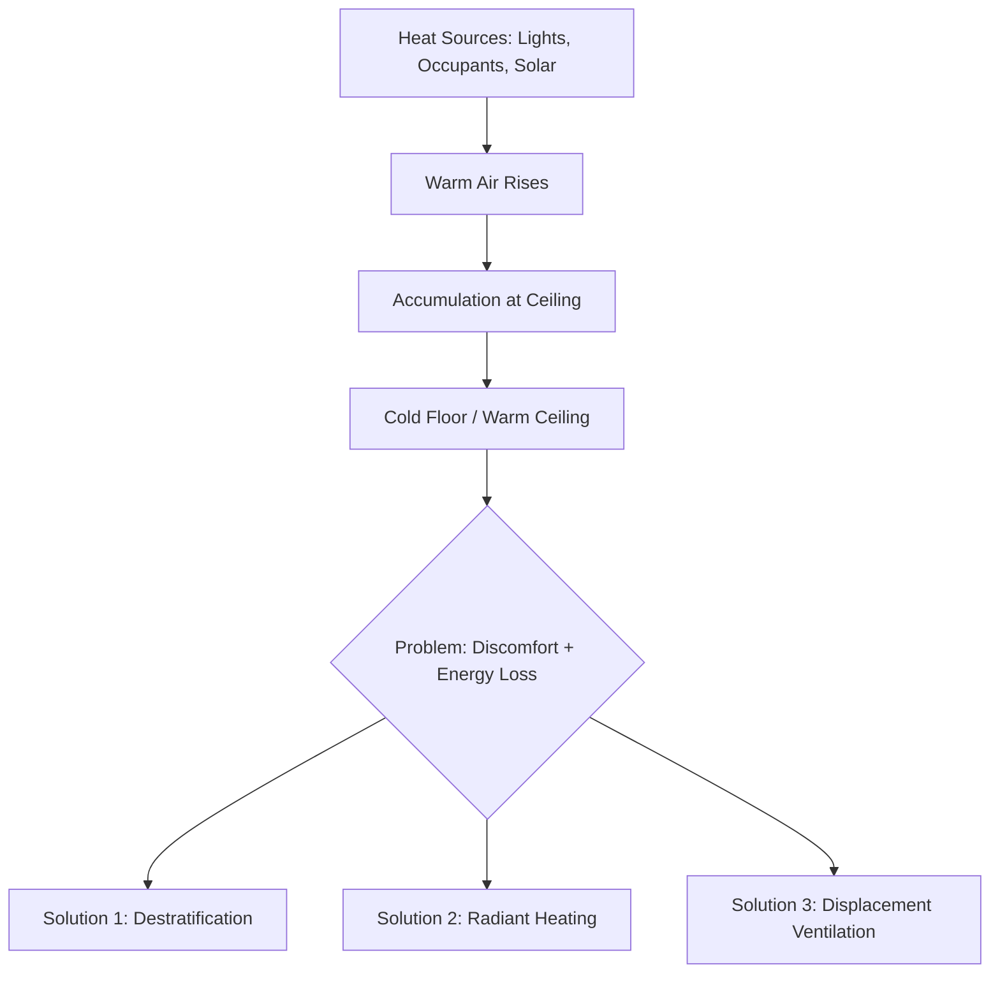
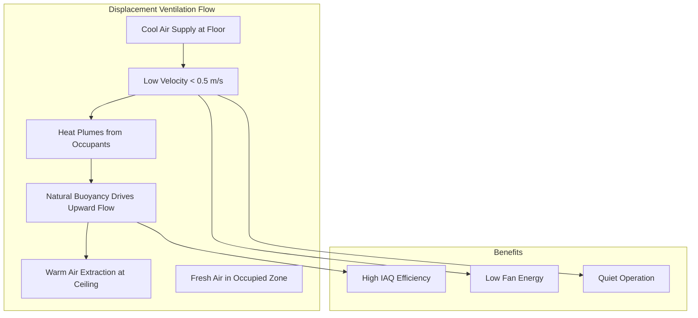

## Thermal Stratification in Tall Worship Spaces

Houses of worship with ceiling heights of 20-60 ft present significant HVAC challenges due to thermal stratification, where buoyant warm air accumulates at the ceiling while occupied zones remain uncomfortable. Understanding the physics of stratification is essential for effective system design.

### Stratification Physics

Thermal stratification occurs due to density differences in air at different temperatures. The buoyancy force per unit volume is:

$$F_b = g(\rho_{cold} - \rho_{hot}) = g\rho_{cold}\left(1 - \frac{T_{cold}}{T_{hot}}\right)$$

where $g = 9.81$ m/s², and temperatures are in Kelvin. For a 10°C temperature difference at typical indoor conditions, the density difference is approximately 3.5%, creating significant buoyant forces that drive vertical stratification.

The vertical temperature gradient in unstratified tall spaces can reach 0.5-1.5°C per meter of height. For a 15 m (50 ft) ceiling, this yields a ceiling-to-floor temperature difference of 7.5-22.5°C, resulting in substantial energy waste and occupant discomfort.

## System Strategies Comparison

| Strategy | Occupied Zone Effectiveness | Energy Efficiency | Capital Cost | Acoustic Impact |
|----------|----------------------------|-------------------|--------------|-----------------|
| Mixing Ventilation (High Throw) | Moderate | Low | Low | High |
| Displacement Ventilation | High | High | Moderate | Low |
| Destratification Fans | Moderate-High | Moderate | Low-Moderate | Moderate |
| Radiant Floor/Pew Heating | Excellent | Very High | High | None |
| Overhead Radiant Panels | High | High | Moderate-High | None |
| Combined Radiant + Displacement | Excellent | Very High | Highest | Low |

## Destratification Fan Systems

Destratification fans mechanically mix stratified air layers, recirculating warm ceiling air to the occupied zone. The fan effectiveness depends on the air circulation rate relative to the space volume.

### Fan Sizing and Placement

The required air circulation rate for destratification is:

$$Q_{circ} = \frac{V \cdot ACH_{destrat}}{60}$$

where $V$ is the space volume (m³), and $ACH_{destrat}$ typically ranges from 2-4 air changes per hour for effective destratification. For a 1500 m³ worship space:

$$Q_{circ} = \frac{1500 \times 3}{60} = 75 \text{ m}^3/\text{min} = 2650 \text{ CFM}$$

Fan placement should follow these principles:

- Position fans 2/3 to 3/4 of the ceiling height
- Space fans at intervals of 8-12 m (25-40 ft) for large spaces
- Direct airflow at 15-20° angle from horizontal to promote mixing without drafts
- Blade tip speed should not exceed 35 m/s (7000 FPM) for acoustic control

The power input for destratification is significantly lower than the heating energy recovered. The coefficient of performance for fan-based destratification is:

$$COP_{destrat} = \frac{Q_{heat\,recovered}}{P_{fan}}$$

Values of 15-30 are typical, making destratification highly cost-effective.

## Radiant Heating for Occupied Zones

Radiant heating systems address stratification by delivering thermal energy directly to occupants and surfaces, bypassing the need to heat the entire air volume. This approach is particularly effective in tall spaces where convective heating is inefficient.

### Radiant Floor and Pew Heating

Radiant floor systems maintain comfort in the occupied zone without heating upper air volumes. The heat flux from a heated floor is:

$$q'' = h_c(T_{floor} - T_{air}) + \epsilon\sigma(T_{floor}^4 - T_{mrt}^4)$$

where $h_c$ is the convective heat transfer coefficient (typically 3-5 W/m²K for floors), $\epsilon$ is emissivity (0.85-0.90 for most materials), $\sigma = 5.67 \times 10^{-8}$ W/m²K⁴, and $T_{mrt}$ is the mean radiant temperature.

For a floor temperature of 27°C (80°F) in a 20°C (68°F) space:

- Convective component: 30-35 W/m²
- Radiant component: 35-40 W/m²
- Total heat flux: 65-75 W/m²

**ASHRAE Standard 55** recommends floor temperatures between 19-29°C (66-84°F) for occupant comfort, with 23-27°C (73-80°F) optimal for sedentary activities like worship services.

### Overhead Radiant Panels

High-intensity or low-intensity radiant panels mounted 4-8 m (12-25 ft) above the floor provide asymmetric radiant heating. The radiant intensity at the occupied zone is:

$$I = \frac{\epsilon\sigma T_{panel}^4 A_{panel} \cos\theta}{4\pi r^2}$$

where $\theta$ is the angle from panel normal, and $r$ is the distance to the target.

Panel mounting height affects coverage and intensity. Lower mounting (4-5 m) provides higher intensity but reduced coverage; higher mounting (6-8 m) provides broader coverage but requires higher panel temperatures.

## Displacement Ventilation vs. Mixing Ventilation

The choice between displacement and mixing ventilation fundamentally affects stratification management in tall spaces.

### Displacement Ventilation

Displacement ventilation supplies cool air (15-18°C) at low velocity (< 0.5 m/s) near the floor, allowing buoyancy forces from heat sources to drive vertical airflow. The system leverages natural stratification rather than fighting it.

The ventilation effectiveness for displacement systems ranges from 1.2-1.6, compared to 1.0 for perfect mixing. This means displacement systems can achieve the same air quality with 40% less outdoor air.

The Archimedes number characterizes the displacement ventilation regime:

$$Ar = \frac{g\beta\Delta T H}{u_0^2}$$

where $\beta$ is the thermal expansion coefficient (≈ 1/300 K⁻¹), $\Delta T$ is the supply-to-room temperature difference, $H$ is the characteristic height, and $u_0$ is the supply velocity. For effective displacement ventilation, $Ar > 10$.

### Mixing Ventilation

Conventional mixing systems supply air at high velocity (5-10 m/s) from elevated positions to entrain room air and create uniform conditions. In tall spaces, this requires:

- High throw diffusers with throw distances of 0.75-1.0 times the ceiling height
- Supply air temperatures 8-12°C below room temperature
- Supply airflow rates 1.5-2.0 times heating/cooling load requirements

Mixing ventilation effectiveness in tall spaces is often 0.8-0.9, indicating short-circuiting between supply and return.

## Cathedral Ceiling Conditioning Strategies

Cathedral ceilings in worship spaces require integrated strategies combining multiple approaches:

**Heating Season Strategy:**
1. Radiant floor or pew heating for primary comfort (60-70% of load)
2. Displacement ventilation for air quality (100% outdoor air during services)
3. Destratification fans during occupancy to enhance uniformity
4. Minimal high-level heating to prevent condensation on cold surfaces

**Cooling Season Strategy:**
1. Displacement or low-velocity mixing ventilation with cool supply air
2. Radiant cooling panels if humidity control is adequate (dew point must be 2-3°C below panel temperature)
3. Stratification is beneficial in cooling mode—warm air naturally rises to ceiling returns

**Unoccupied Period Strategy:**
1. Setback temperatures to 13-16°C (55-60°F) in heating season
2. Destratification fans off during unoccupied periods to preserve stratification and reduce ceiling heat loss
3. Pre-occupancy warm-up 2-4 hours before services using destratification fans

## Energy Performance

Proper stratification management in tall worship spaces yields substantial energy savings. The energy penalty of uncontrolled stratification is:

$$\Delta Q = \dot{m}c_p\Delta T_{strat} = \frac{UA(T_{ceiling} - T_{outdoor})\Delta T_{strat}}{\Delta T_{indoor-outdoor}}$$

For a 15 m tall space with 15°C stratification, 3°C outdoor temperature, and 20°C target indoor temperature, the stratification penalty increases heat loss by approximately 45%.

**ASHRAE Standard 90.1** provides prescriptive requirements for thermal controls in spaces over 6 m (20 ft) tall, mandating destratification systems or alternative strategies demonstrating equivalent performance.

Effective stratification control combined with radiant heating can reduce heating energy consumption by 30-50% compared to conventional all-air systems in tall worship spaces, while improving thermal comfort and reducing acoustic noise from HVAC equipment.

## Design Recommendations

For worship spaces with ceiling heights of 20-60 ft:

1. **Primary heating:** Radiant floor or low-level radiant panels for occupied zone comfort
2. **Ventilation:** Displacement ventilation at 0.3-0.5 m/s supply velocity for acoustic and energy benefits
3. **Stratification control:** Destratification fans operating during occupied periods in heating mode
4. **Controls:** Vertical temperature sensors at floor (1.5 m) and mid-height (8-10 m) to modulate destratification fan operation
5. **Ceiling insulation:** Minimum R-30 (RSI-5.3) to minimize heat loss to unconditioned attic or exterior

This integrated approach addresses the unique thermal physics of tall worship spaces while maintaining comfort, acoustics, and energy efficiency.
