## Overview

Houses of worship present unique HVAC challenges due to highly intermittent occupancy patterns. Typical facilities experience peak occupancy for 2-6 hours per week during services, with minimal or zero occupancy during weekdays. This operational profile creates opportunities for substantial energy savings through strategic setback and recovery protocols, but requires careful engineering to ensure thermal comfort during occupied periods.

The fundamental challenge lies in balancing energy conservation during unoccupied periods with the thermal inertia of massive building envelopes common to worship architecture. Stone, masonry, and concrete construction provide significant thermal mass that resists rapid temperature changes, extending recovery periods but also moderating temperature swings.

## Occupancy Patterns and HVAC Response

```mermaid
gantt
    title Weekly Occupancy Pattern and HVAC Operating Modes
    dateFormat HH:mm
    axisFormat %a %H:%M

    section Sunday
    Unoccupied (Setback) :done, sun1, 00:00, 6h
    Pre-conditioning :active, sun2, 06:00, 3h
    Service (Full Capacity) :crit, sun3, 09:00, 2h
    Service (Full Capacity) :crit, sun4, 11:00, 1.5h
    Post-occupancy :active, sun5, 12:30, 1h
    Setback :done, sun6, 13:30, 10.5h

    section Monday-Friday
    Deep Setback :done, week1, 00:00, 24h

    section Wednesday
    Unoccupied :done, wed1, 00:00, 17h
    Pre-conditioning :active, wed2, 17:00, 1.5h
    Evening Activity :crit, wed3, 18:30, 2h
    Setback :done, wed4, 20:30, 3.5h

    section Saturday
    Deep Setback :done, sat1, 00:00, 24h
```

## Recovery Time Calculation

The time required to recover from setback to occupied setpoint depends on heating/cooling capacity, building thermal mass, and outdoor conditions. The recovery period is calculated as:

$$
t_{\text{recovery}} = \frac{M \cdot c_p \cdot (T_{\text{occupied}} - T_{\text{setback}})}{Q_{\text{HVAC}} - Q_{\text{loss}}}
$$

Where:
- $t_{\text{recovery}}$ = recovery time (hours)
- $M$ = effective thermal mass (kg)
- $c_p$ = specific heat capacity (J/kg·K)
- $T_{\text{occupied}}$ = occupied setpoint (°C)
- $T_{\text{setback}}$ = setback temperature (°C)
- $Q_{\text{HVAC}}$ = available heating/cooling capacity (W)
- $Q_{\text{loss}}$ = building heat loss/gain during recovery (W)

For buildings with significant thermal mass (masonry, concrete), an empirical correction factor of 1.2-1.5 should be applied to account for thermal lag in the building envelope and furnishings.

## Optimal Start Algorithm

Modern building automation systems employ optimal start algorithms to minimize recovery time while ensuring comfort at occupancy. The algorithm calculates the latest possible start time based on:

$$
t_{\text{start}} = t_{\text{occupancy}} - \left( k_1 \cdot \Delta T_{\text{indoor}} + k_2 \cdot \Delta T_{\text{outdoor}} + k_3 \right)
$$

Where:
- $t_{\text{start}}$ = calculated start time
- $t_{\text{occupancy}}$ = scheduled occupancy time
- $\Delta T_{\text{indoor}}$ = indoor temperature error (°C)
- $\Delta T_{\text{outdoor}}$ = outdoor temperature deviation from design (°C)
- $k_1, k_2, k_3$ = empirically determined coefficients

The algorithm learns system performance over time through adaptive tuning, adjusting coefficients to minimize energy consumption while maintaining comfort reliability.

## Conditioning Strategy Comparison

| Strategy | Energy Savings | Comfort Risk | Equipment Runtime | Complexity | Best Application |
|----------|---------------|--------------|-------------------|------------|------------------|
| **Night Setback (5-8°F)** | 15-25% | Low | Moderate | Low | Standard weekly services |
| **Deep Setback (10-15°F)** | 30-45% | Medium | High peak demand | Medium | Facilities with predictable schedules |
| **Optimal Start** | 20-35% | Very Low | Optimized | High | Variable occupancy patterns |
| **Pre-conditioning Only** | 5-15% | Very Low | High | Low | High thermal mass buildings |
| **Adaptive Setback** | 25-40% | Low | Optimized | Very High | Multi-use facilities |
| **DCV + Setback** | 35-50% | Low | Moderate | High | Large sanctuaries (>200 occupants) |

## Demand-Controlled Ventilation (DCV)

ASHRAE Standard 62.1 permits DCV for spaces with variable occupancy exceeding 25 people per 1000 ft². Houses of worship are ideal candidates due to the dramatic variance between occupied and unoccupied ventilation requirements.

Ventilation airflow is modulated based on measured CO₂ concentration:

$$
V_{\text{DCV}} = V_{\text{min}} + \frac{(C_{\text{measured}} - C_{\text{outdoor}}) \cdot A}{(C_{\text{design}} - C_{\text{outdoor}}) \cdot P}
$$

Where:
- $V_{\text{DCV}}$ = required ventilation rate (CFM)
- $V_{\text{min}}$ = minimum ventilation for unoccupied space (CFM)
- $C_{\text{measured}}$ = measured indoor CO₂ (ppm)
- $C_{\text{outdoor}}$ = outdoor CO₂ concentration (~400 ppm)
- $C_{\text{design}}$ = design indoor CO₂ limit (typically 1000 ppm)
- $A$ = floor area (ft²)
- $P$ = occupant density (people/1000 ft²)

During services, CO₂ levels may rise from 450 ppm (unoccupied) to 800-1000 ppm within 30-45 minutes, triggering increased outdoor air intake. Post-occupancy, the system reduces ventilation as CO₂ levels decay.

## Thermal Mass Utilization

Massive construction common in worship architecture provides thermal storage that can be strategically employed:

**Winter Strategy:**
- Pre-heat during off-peak electricity hours (2-6 AM)
- Store thermal energy in masonry walls and floor slabs
- Reduce heating load during peak occupancy through thermal release
- Energy cost savings of 20-35% in time-of-use rate structures

**Summer Strategy:**
- Night purge cooling to reject stored heat to cool outdoor air
- Pre-cool thermal mass before occupancy
- Reduce mechanical cooling load during services
- Effective in climates with diurnal temperature swing >15°F

## Setback Energy Savings

Annual energy savings from temperature setback during unoccupied periods:

$$
E_{\text{saved}} = \frac{UA \cdot \Delta T_{\text{setback}} \cdot h_{\text{setback}} \cdot HDD}{\eta_{\text{heating}}}
$$

For cooling:

$$
E_{\text{saved}} = \frac{UA \cdot \Delta T_{\text{setback}} \cdot h_{\text{setback}} \cdot CDD}{\text{COP}_{\text{cooling}}}
$$

Where:
- $E_{\text{saved}}$ = annual energy savings (BTU)
- $UA$ = building heat loss coefficient (BTU/hr·°F)
- $\Delta T_{\text{setback}}$ = setback temperature difference (°F)
- $h_{\text{setback}}$ = hours per day in setback (hr)
- $HDD$/$CDD$ = heating/cooling degree days
- $\eta_{\text{heating}}$ = heating system efficiency
- $\text{COP}_{\text{cooling}}$ = cooling system coefficient of performance

For a typical 10,000 ft² worship space with 8°F setback for 140 hours per week, annual heating energy savings range from 25-40% depending on climate zone and construction type.

## Design Recommendations

**Equipment Sizing:**
Size systems for 1.15-1.25 times calculated load to ensure adequate recovery capacity. Oversizing beyond 1.3x leads to diminishing returns and increased cycling losses.

**Control Sequences:**
1. Implement optimal start/stop algorithms with 2-week learning period
2. Use wireless occupancy sensors to detect early arrivals
3. Override capability for unscheduled events
4. Separate zones for sanctuary, fellowship hall, and administrative areas

**Sensor Placement:**
Position CO₂ sensors in occupied zone at breathing height (4-6 ft above floor), away from supply air streams and entry doors. Multi-point sensing recommended for sanctuaries exceeding 5,000 ft².

**Monitoring:**
Track recovery time performance weekly to identify system degradation or scheduling optimization opportunities. Alert maintenance when recovery exceeds calculated time by >20%.

## Compliance

ASHRAE Standard 90.1 (Energy Standard for Buildings) requires automatic setback controls for spaces unoccupied >12 hours per week. International Energy Conservation Code (IECC) mandates similar provisions. These requirements align naturally with worship space operation.

ASHRAE Standard 62.1 permits reduced ventilation during unoccupied periods, provided the space is purged to design ventilation rates prior to occupancy or during the first hour of occupancy.

---

**References:**
- ASHRAE Standard 62.1: Ventilation for Acceptable Indoor Air Quality
- ASHRAE Standard 90.1: Energy Standard for Buildings Except Low-Rise Residential Buildings
- ASHRAE Handbook - HVAC Applications, Chapter 5: Places of Assembly
