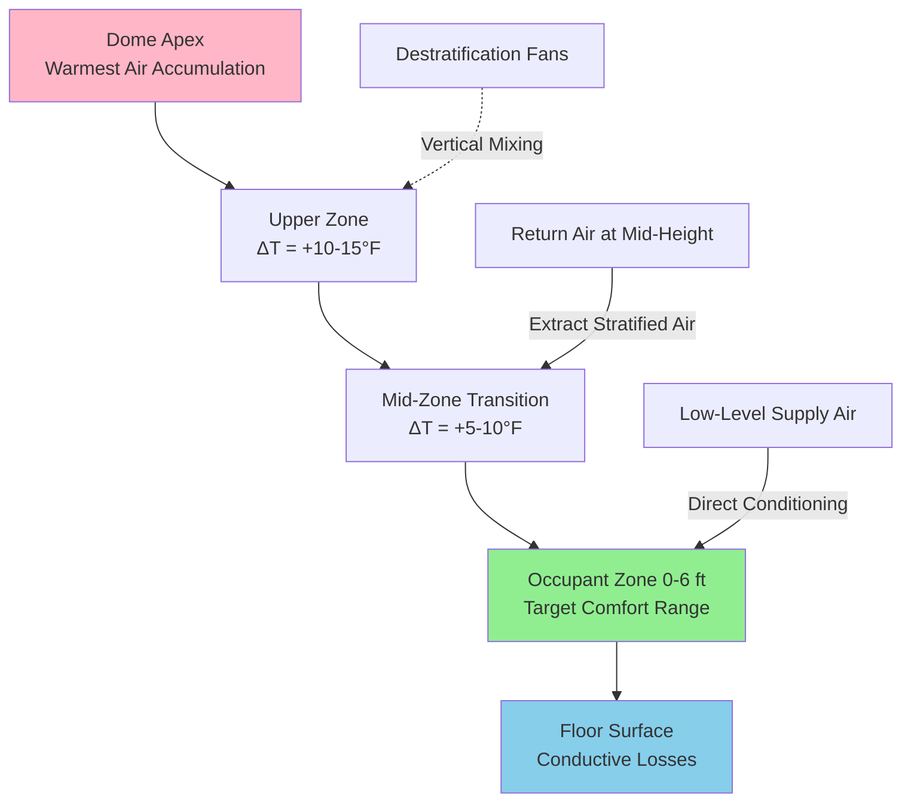

## Overview

Mosque HVAC systems face unique challenges driven by Islamic architectural traditions and worship practices. Floor-level occupancy during prayer (sujud and ruku positions), extreme intermittent loads during five daily prayers and Friday congregations, high-moisture ablution facilities (wudu areas), and large-volume dome structures create distinct thermal and ventilation requirements absent in conventional assembly spaces.

## Floor-Level Air Distribution

### Thermal Physics at Prayer Level

Occupants sitting, kneeling, and prostrating on floor surfaces require conditioned air delivery within 0-24 inches above finished floor—contradicting conventional overhead distribution strategies. The thermal boundary layer development over the prayer hall floor governs comfort:

$$\delta_t \approx 5x \cdot Re_x^{-0.5} \cdot Pr^{-0.33}$$

where $\delta_t$ is the thermal boundary layer thickness, $x$ is distance from the air supply point, $Re_x$ is the Reynolds number, and $Pr$ is the Prandtl number (approximately 0.7 for air).

**Design Strategies:**

| Distribution Method | Advantage | Limitation |
|---------------------|-----------|------------|
| Underfloor air distribution (UFAD) | Optimal floor-level delivery | High first cost, difficult retrofit |
| Low sidewall registers (6-12" AFG) | Direct occupant zone coverage | Poor mixing, potential drafts |
| Displacement ventilation | Natural stratification benefits | Requires high ceilings (>12 ft) |
| Radiant floor heating/cooling | No air motion, even temperature | Slow response to intermittent loads |

### Stratification Management

Large prayer halls with domes create severe thermal stratification. The temperature gradient follows:

$$\frac{dT}{dz} = \frac{Q_{internal}}{k_a \cdot A_{floor}}$$

where $Q_{internal}$ is the internal heat gain, $k_a$ is the thermal conductivity of air (0.026 W/m·K), and $A_{floor}$ is the floor area. In dome structures exceeding 40 feet in height, temperature differentials of 15-25°F between floor and apex are common without destratification.

## Ablution Area (Wudu) Ventilation

### Moisture Load Calculations

Ablution facilities generate significant latent loads from ritual washing of hands, face, arms, and feet. The moisture generation rate per occupant performing wudu:

$$W_{latent} = \dot{m}_{evap} \cdot h_{fg}$$

where $\dot{m}_{evap}$ ranges from 0.15-0.25 lb/min per active washing station and $h_{fg} = 1,050$ BTU/lb at standard conditions.

For a facility with 8 washing stations at 75% simultaneous usage:

$$Q_{latent} = 8 \times 0.75 \times 0.20 \times 1,050 \times 60 = 75,600 \text{ BTU/hr}$$

**Ventilation Requirements:**

- Minimum 1.5 cfm/ft² of ablution area per ASHRAE 62.1
- Local exhaust at 100-150 cfm per washing station
- Supply air psychrometric conditioning to maintain 50-55% RH
- Drainage floor design with slip-resistant surfaces

### Psychrometric Control

The sensible heat ratio (SHR) in ablution areas typically ranges from 0.45-0.60 compared to 0.70-0.80 in the main prayer hall:

$$SHR = \frac{Q_{sensible}}{Q_{sensible} + Q_{latent}}$$

This requires dedicated air handling units with enhanced dehumidification capacity, often incorporating heat pipe heat exchangers or enthalpy recovery to manage the ventilation load efficiently.

## Intermittent Occupancy Load Profiles

### Five Daily Prayers (Salat) Peak Loading

Prayer times create five daily occupancy spikes with Fajr (pre-dawn), Dhuhr (midday), Asr (afternoon), Maghrib (sunset), and Isha (evening). Friday Jumu'ah congregation generates the weekly peak, often 3-5 times normal daily attendance.

```mermaid
gantt
    title Typical Friday Occupancy and HVAC Load Profile
    dateFormat HH:mm
    axisFormat %H:%M

    section Occupancy
    Pre-dawn Fajr (5-10%)          :05:00, 30m
    Morning Low (2-5%)             :06:00, 5h
    Dhuhr Prayer (15-20%)          :12:15, 45m
    Afternoon Low (5-10%)          :13:00, 2h30m
    Asr Prayer (10-15%)            :15:30, 30m
    Evening Transition             :16:00, 2h30m
    Maghrib Prayer (20-25%)        :18:30, 30m
    Evening Activity               :19:00, 1h30m
    Isha Prayer (15-20%)           :20:30, 45m

    section Friday Peak
    Jumu'ah Congregation (100%)    :12:00, 2h
```

### Demand Control Strategies

The extreme load variability (5% to 100% occupancy) necessitates responsive control:

**Thermal Mass Response Time:**

$$\tau = \frac{m \cdot c_p}{UA}$$

For typical mosque construction (masonry walls, concrete floors), thermal time constants exceed 4-6 hours—too slow for prayer-to-prayer response. Active HVAC strategies include:

1. **Pre-conditioning**: Start systems 30-45 minutes before prayer times
2. **CO₂-based demand control ventilation**: Reduce outdoor air during unoccupied periods
3. **Variable refrigerant flow (VRF)**: Zone-level capacity modulation
4. **Thermal energy storage**: Ice or chilled water storage for Friday peak shaving

| Strategy | Energy Savings | Response Time | First Cost Multiplier |
|----------|----------------|---------------|----------------------|
| Fixed schedule | Baseline | N/A | 1.0× |
| CO₂ DCV | 20-30% | 5-10 min | 1.1-1.2× |
| VRF zoning | 25-35% | 2-5 min | 1.4-1.6× |
| Thermal storage | 30-45% (demand charge) | Hours | 1.5-2.0× |

## Dome Structure Thermal Challenges

### Solar Heat Gain Through Domes

Mosque domes, often constructed with minimal insulation for architectural aesthetics, experience severe solar loading. The total heat gain through a dome surface:

$$Q_{dome} = A_{dome} \cdot U \cdot (CLTD) + A_{dome} \cdot SHGC \cdot SHGF$$

where $A_{dome}$ is the curved surface area, $CLTD$ is the cooling load temperature difference accounting for thermal mass, $SHGC$ is the solar heat gain coefficient, and $SHGF$ is the solar heat gain factor.

For a hemispherical dome of radius $r$:

$$A_{dome} = 2\pi r^2$$

A 30-foot radius dome with U-value of 0.25 BTU/hr·ft²·°F and SHGC of 0.60 can contribute 150,000-200,000 BTU/hr during peak summer conditions.

**Mitigation Techniques:**

- Reflective exterior coatings (reduce SHGC to 0.25-0.35)
- Insulation retrofits (target U ≤ 0.10 BTU/hr·ft²·°F)
- Ventilated air cavities between outer shell and interior surface
- Destratification fans with variable speed control

## Shoe Storage and Vestibule Areas

### Odor Control Ventilation

Shoe storage areas require dedicated ventilation for odor control and moisture removal from footwear. Ventilation effectiveness factor:

$$\varepsilon_v = \frac{C_e - C_s}{C_o - C_s}$$

where $C_e$ is the concentration at the exhaust, $C_s$ is the supply concentration, and $C_o$ is the occupant zone concentration.

**Design Criteria:**

- Minimum 0.50 cfm/ft² dedicated exhaust
- Negative pressure relative to prayer hall (-0.03 to -0.05 in. w.c.)
- Exhaust location at low level (shoes stored near floor)
- Direct exhaust to exterior (no recirculation)

## System Selection Criteria

For mosque applications, system selection must balance intermittent load response, floor-level conditioning, and acoustic constraints (particularly during prayer):

**Recommended Approach:**

- **Small mosques (<5,000 ft²)**: Multi-zone VRF with floor-level cassettes or UFAD
- **Medium mosques (5,000-15,000 ft²)**: Dedicated outdoor air system (DOAS) with radiant floor and supplemental air handling
- **Large mosques (>15,000 ft²)**: Central chilled water plant with multiple air handlers, zone-level VAV control, and thermal storage

Acoustic criteria during prayer require NC-30 to NC-35 maximum, necessitating low air velocities (<500 fpm in occupied zones) and vibration-isolated equipment.

## References

- ASHRAE Handbook—HVAC Applications, Chapter 5: Places of Assembly
- ASHRAE Standard 62.1: Ventilation for Acceptable Indoor Air Quality
- ASHRAE Standard 55: Thermal Environmental Conditions for Human Occupancy
