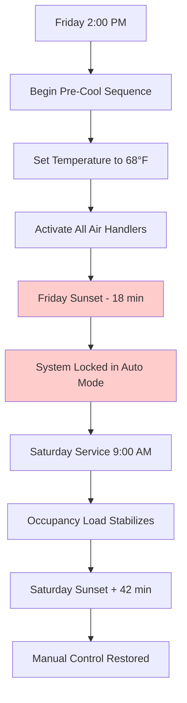
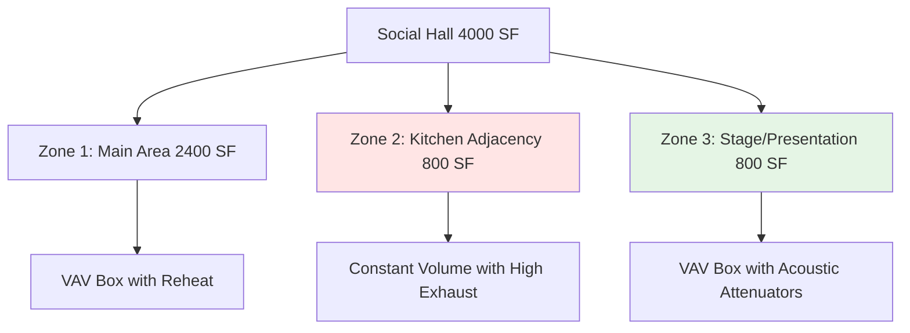

## Overview

Synagogue HVAC design presents unique challenges that blend variable occupancy patterns, strict operational timing constraints, and preservation requirements for religious artifacts. The primary design consideration centers on accommodating extreme load variations between typical Sabbath services (150-300 occupants) and High Holy Days (800-1200 occupants) while maintaining equipment silence during prayer services and adhering to Sabbath operation restrictions.

## Sanctuary Conditioning Fundamentals

Sanctuary spaces require dual-mode operation: normal occupancy and overflow capacity. The sensible heat gain from occupants dominates the load calculation during peak events.

### Peak Load Calculations

The sensible heat gain per person varies with activity level during services:

$$Q_s = N \times q_s$$

Where:
- $Q_s$ = Total sensible heat gain (Btu/hr)
- $N$ = Number of occupants
- $q_s$ = Sensible heat per person = 250 Btu/hr (seated, light activity)

For a 1000-person High Holy Days service:

$$Q_s = 1000 \times 250 = 250,000 \text{ Btu/hr}$$

The latent heat gain becomes significant with high occupancy density:

$$Q_l = N \times q_l = 1000 \times 200 = 200,000 \text{ Btu/hr}$$

This yields a sensible heat ratio (SHR) of:

$$\text{SHR} = \frac{Q_s}{Q_s + Q_l} = \frac{250,000}{450,000} = 0.56$$

This low SHR necessitates substantial dehumidification capacity beyond typical assembly space design.

## Sabbath Pre-Conditioning Strategy

Jewish law prohibits operating electrical switches from Friday sunset through Saturday sunset. This constraint requires automated pre-conditioning sequences.

### Pre-Conditioning Thermal Mass Calculation

The building thermal mass provides temperature stability during the non-adjustable Sabbath period. The temperature drift can be estimated using:

$$\Delta T = \frac{Q \times t}{m \times c_p}$$

Where:
- $\Delta T$ = Temperature change (°F)
- $Q$ = Net heat gain rate (Btu/hr)
- $t$ = Time period (hr)
- $m$ = Effective thermal mass (lb)
- $c_p$ = Specific heat of building materials (0.2 Btu/lb·°F for typical construction)

For a sanctuary with 400,000 lb effective mass experiencing 50,000 Btu/hr net gain over 4 hours:

$$\Delta T = \frac{50,000 \times 4}{400,000 \times 0.2} = 2.5°F$$

This acceptable drift validates the pre-conditioning approach for moderate climates.

## Torah Ark Humidity Control

Torah scrolls require stringent environmental control to prevent parchment degradation. ASHRAE guidelines specify maintaining 45-55% RH with minimal fluctuation.

| Parameter | Specification | Tolerance |
|-----------|--------------|-----------|
| Temperature | 68-72°F | ±2°F |
| Relative Humidity | 50% | ±5% RH |
| Air Changes | 2-4 ACH | Minimum 2 |
| Filtration | MERV 11 minimum | MERV 13 preferred |

### Dedicated Ark Conditioning System

A dedicated air handler serving only the ark space provides superior control:

$$m_a = \frac{Q_l}{\Delta \omega \times h_{fg}}$$

Where:
- $m_a$ = Required airflow (lb/hr)
- $Q_l$ = Latent heat gain (Btu/hr)
- $\Delta \omega$ = Humidity ratio difference (lb_water/lb_air)
- $h_{fg}$ = Latent heat of vaporization = 1060 Btu/lb

For typical ark spaces with minimal internal gains, infiltration moisture dominates. A 200 CFM dedicated system with reheat provides stable conditions year-round.

## High Holy Days Capacity Planning

Rosh Hashanah and Yom Kippur services present peak design conditions occurring 2-3 days per year. The economic analysis balances oversized equipment costs against temporary discomfort.

### Design Strategies Comparison

| Strategy | Capital Cost | Operating Cost | Comfort Level |
|----------|--------------|----------------|---------------|
| 100% Design Capacity | Highest | Moderate | Excellent |
| 70% Design + Pre-Cool | Moderate | Higher | Good |
| 60% Design + Portable Units | Lowest | Highest | Acceptable |
| Two-Stage Equipment | High | Lowest | Excellent |

The recommended approach uses base equipment sized for 70% peak load with aggressive pre-cooling:

The thermal storage approach reduces equipment size by 30-40% while maintaining acceptable conditions.

## Multi-Purpose Social Hall Design

Social halls host weddings, receptions, educational programs, and overflow seating with widely varying loads.

### Variable Air Volume Implementation

VAV systems optimize energy consumption across use cases:

$$CFM_{actual} = CFM_{max} \times \frac{Q_{actual}}{Q_{design}}$$

For a hall with 20,000 Btu/hr design cooling load operating at 40% partial load:

$$CFM_{actual} = 1600 \times 0.40 = 640 \text{ CFM}$$

This turndown capability reduces fan energy by approximately 75% under ASHRAE 90.1-2019 requirements:

$$P_{fan} \propto CFM^{2.5}$$

### Zoning Strategy

Optimal zoning divides the social hall based on occupancy patterns:

Zone 2 requires constant ventilation due to kitchen heat and odors, while Zones 1 and 3 benefit from VAV turndown.

## Acoustic Considerations

Silence during prayer services mandates sound attenuation beyond typical commercial standards. Target noise criteria (NC) levels:

| Space Type | NC Level | Maximum dBA |
|------------|----------|-------------|
| Main Sanctuary | NC-25 | 35 dBA |
| Torah Ark Area | NC-20 | 30 dBA |
| Social Hall | NC-35 | 45 dBA |
| Classrooms | NC-30 | 40 dBA |

Achieving NC-25 requires:
- Duct velocities below 800 FPM in final runouts
- Vibration isolation for all equipment
- Acoustically lined plenums at major branches
- Variable frequency drives (VFD) for constant speed control
- Sound traps at air handler discharge

The pressure drop through sound attenuation devices increases system static pressure by 0.3-0.5 in. w.g., requiring appropriate fan selection.

## Educational Wing Integration

Religious schools operate weekday afternoons and Sunday mornings, creating distinct scheduling from sanctuary functions.

### Independent Systems Recommendation

Separate air handlers for educational spaces provide:
- Independent scheduling control
- Reduced weekend energy consumption
- Simplified maintenance coordination
- Code-compliant classroom ventilation per ASHRAE 62.1

Minimum outdoor air for classrooms:

$$OA_{min} = R_p \times P_z + R_a \times A_z$$

Where:
- $R_p$ = 5 CFM/person (Table 6.2.2.1)
- $P_z$ = Zone population
- $R_a$ = 0.12 CFM/ft² (Table 6.2.2.1)
- $A_z$ = Zone area (ft²)

For a 900 SF classroom with 25 students:

$$OA_{min} = (5 \times 25) + (0.12 \times 900) = 125 + 108 = 233 \text{ CFM}$$

This substantial outdoor air requirement justifies energy recovery systems for educational wings exceeding 5000 CFM total outdoor air.

## System Selection Recommendations

| Building Size | Primary System | Distribution | Control Strategy |
|---------------|----------------|--------------|------------------|
| Under 10,000 SF | Multiple RTUs | CAV with zones | Programmable thermostats |
| 10,000-30,000 SF | Central AHU | VAV with reheat | DDC with BAS |
| Over 30,000 SF | Multiple AHUs | VAV with reheat | Full BAS integration |

All systems require:
- Seven-day programmable control with holiday overrides
- Sabbath lockout capability
- Remote monitoring for off-hours temperature alarms
- Humidity monitoring for Torah ark spaces

## Conclusion

Successful synagogue HVAC design balances highly variable loads, operational timing constraints, and artifact preservation requirements. The key design elements include robust pre-conditioning strategies for Sabbath operation, dedicated humidity control for Torah ark spaces, and economical approaches to infrequent High Holy Days peak loads. Adherence to ASHRAE 62.1 ventilation standards, 90.1 energy requirements, and acoustic targets ensures both regulatory compliance and congregational comfort across the full spectrum of facility uses.
