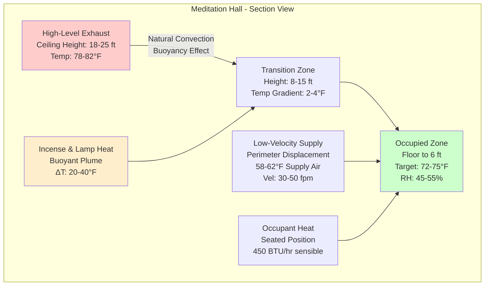
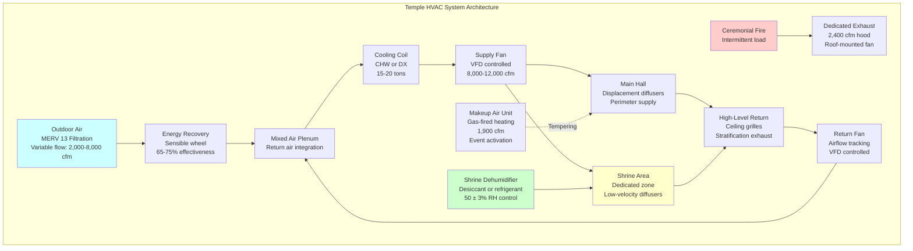

## Overview

Temple HVAC systems must balance thermal comfort for seated worshippers with preservation requirements for religious artifacts while managing combustion products from incense, oil lamps, and ceremonial fires. The combination of high-occupancy assembly spaces, floor-level seating, continuous incense burning, and intermittent high-heat ceremonial activities creates unique design challenges requiring specialized ventilation strategies and stratified conditioning approaches.

## Thermal Load Characteristics

### Heat Gain Components

Temple spaces generate distinct heat load patterns compared to conventional assembly spaces. The sensible heat ratio (SHR) typically ranges from 0.75-0.85, with latent loads dominated by occupant density rather than process sources.

**Occupant Load Calculation:**

For floor seating configurations, occupant density increases significantly compared to pew or chair seating:

$$Q_{occupants} = N \cdot q_{person} \cdot CLF$$

Where:
- $N$ = number of occupants (typically 1 person per 6-8 ft² for floor seating)
- $q_{person}$ = 450 BTU/hr sensible + 200 BTU/hr latent (seated meditation activity level)
- $CLF$ = cooling load factor (0.85-0.95 for peak occupancy periods)

**Combustion Heat Sources:**

Oil lamps and candles contribute localized sensible loads:

$$Q_{flame} = n_{lamps} \cdot \dot{m}_{fuel} \cdot LHV \cdot \eta_{radiative}$$

Where:
- $n_{lamps}$ = number of active flames
- $\dot{m}_{fuel}$ = fuel consumption rate (ghee lamps: 15-25 g/hr per flame)
- $LHV$ = lower heating value (37 MJ/kg for ghee, 44 MJ/kg for paraffin)
- $\eta_{radiative}$ = radiative fraction to space (0.30-0.40)

A typical shrine with 20 oil lamps generates approximately 3,000-4,500 BTU/hr sensible load.

| Heat Source | Load per Unit | Typical Quantity | Total Load |
|-------------|---------------|------------------|------------|
| Occupant (seated) | 450 BTU/hr sensible | 150-300 people | 67,500-135,000 BTU/hr |
| Oil lamp (ghee) | 180-250 BTU/hr | 10-50 lamps | 1,800-12,500 BTU/hr |
| Incense stick | 12-18 BTU/hr | 20-100 sticks | 240-1,800 BTU/hr |
| Ceremonial fire (homa) | 15,000-40,000 BTU/hr | Intermittent | Event-specific |

## Ventilation Requirements

### Incense and Combustion Product Removal

Incense burning produces particulate matter (PM2.5 and PM10) and volatile organic compounds requiring continuous dilution ventilation. ASHRAE Standard 62.1 assembly space requirements (0.06 cfm/ft²) are insufficient for combustion product management.

**Dilution Ventilation Rate:**

$$\dot{V}_{OA} = \frac{G_{emission}}{C_{target} - C_{OA}}$$

Where:
- $G_{emission}$ = total emission rate of contaminants (mg/hr)
- $C_{target}$ = target indoor concentration (µg/m³)
- $C_{OA}$ = outdoor air concentration (typically negligible)

For temples with continuous incense burning, outdoor air rates of 15-25 cfm per person are recommended, representing 2.5-4× the baseline assembly space requirement. This elevated ventilation rate maintains PM2.5 concentrations below 35 µg/m³ (24-hour EPA standard).

### Stratified Ventilation Strategy

Floor seating configurations create opportunities for stratified ventilation, supplying conditioned air at low velocities (<50 fpm) in the occupied zone while extracting contaminated air at ceiling level.



**Stratification Effectiveness:**

The stratification number (St) quantifies thermal stratification:

$$St = \frac{H \cdot \Delta T}{T_{supply} \cdot Fr^2}$$

Where:
- $H$ = ceiling height (ft)
- $\Delta T$ = temperature difference between occupied zone and ceiling (°F)
- $T_{supply}$ = supply air temperature (°R)
- $Fr$ = Froude number (function of supply velocity and room geometry)

Target St > 0.15 for effective stratification in temple halls with ceiling heights exceeding 18 ft.

## Ceremonial Fire Ventilation

### Homa Fire Exhaust

Hindu fire ceremonies (homa/havan) generate intense localized heat and combustion products requiring dedicated exhaust systems. The fire pit typically produces 15,000-40,000 BTU/hr depending on fuel quantity and ceremony duration.

**Capture Hood Design:**

Local exhaust ventilation for ceremonial fires follows industrial ventilation principles:

$$Q_{hood} = V_{face} \cdot A_{face} = 100-150 \text{ fpm} \cdot A_{opening}$$

For a typical portable homa kund (24" × 24" fire pit), a ceiling-mounted canopy hood with minimum 4 ft × 4 ft coverage requires:

$$Q_{hood} = 150 \text{ fpm} \cdot 16 \text{ ft}^2 = 2,400 \text{ cfm}$$

The hood should be positioned 4-6 ft above the fire with a capture velocity sufficient to overcome thermal updraft velocities (typically 300-500 fpm directly above active flames).

```mermaid
flowchart LR
    A[Ceremonial Fire<br/>Homa Kund<br/>20,000-40,000 BTU/hr] --> B[Thermal Plume<br/>Buoyant Rise<br/>400-600 fpm velocity]
    B --> C[Exhaust Hood<br/>Canopy Type<br/>150 fpm face velocity<br/>2,400-3,600 cfm]
    C --> D[Exhaust Duct<br/>Minimum 12" dia.<br/>1,200-1,800 fpm velocity]
    D --> E[Dedicated Exhaust Fan<br/>Class II construction<br/>500°F rated]
    E --> F[Discharge<br/>10 ft above roof<br/>Away from air intakes]

    G[Makeup Air<br/>Tempered to 65-70°F<br/>80% of exhaust flow] -.->|Replaces exhausted air| A

    style A fill:#ffcccc
    style C fill:#ffffcc
    style G fill:#ccffff
```

**Makeup Air Requirements:**

The exhaust system removes substantial conditioned air. Makeup air must be introduced to prevent building depressurization:

$$Q_{makeup} = 0.80 \cdot Q_{exhaust}$$

A 2,400 cfm exhaust system requires approximately 1,900 cfm of makeup air. This makeup air should be tempered to 65-70°F during heating season to avoid occupant discomfort. The makeup air system operates only during ceremonial fire events (typically 1-3 hours duration).

## Artifact and Statue Preservation

### Climate Control Requirements

Religious statues, murals, and artifacts require stable temperature and humidity to prevent material degradation. Different materials exhibit varying sensitivity to environmental fluctuations.

| Material | Temperature Range | RH Range | Maximum Daily Fluctuation |
|----------|-------------------|----------|---------------------------|
| Stone (granite, marble) | 60-75°F | 40-60% | ±5°F, ±10% RH |
| Bronze, brass | 60-75°F | 35-50% | ±5°F, ±5% RH |
| Wood (carved) | 65-72°F | 45-55% | ±3°F, ±5% RH |
| Painted surfaces | 68-72°F | 50-55% | ±2°F, ±3% RH |
| Textile (silk, cotton) | 65-70°F | 45-50% | ±3°F, ±5% RH |

**Equilibrium Moisture Content:**

Wood artifacts respond to humidity changes through moisture content adjustment:

$$EMC = \frac{18}{K} \cdot \frac{k \cdot h}{1 - k \cdot h} + \frac{k_1 \cdot k \cdot h + 2 \cdot k_1 \cdot k_2 \cdot k^2 \cdot h^2}{1 + k_1 \cdot k \cdot h + k_1 \cdot k_2 \cdot k^2 \cdot h^2}$$

Where:
- $EMC$ = equilibrium moisture content (%)
- $h$ = relative humidity (decimal)
- $K$, $k$, $k_1$, $k_2$ = temperature-dependent constants

Dimensional changes in wood carvings follow approximately 1% linear dimension change per 4% EMC change. Maintaining RH within ±5% prevents visible cracking or warping in carved wooden elements.

### Shrine Area Microclimates

Shrine areas housing high-value artifacts benefit from dedicated localized conditioning systems independent of main hall HVAC:

- **Separate temperature setpoint:** 68-70°F (stricter than general assembly space)
- **Dedicated dehumidification:** Maintains 50 ± 3% RH regardless of outdoor conditions
- **Continuous operation:** 24/7 conditioning prevents diurnal cycling that stresses materials
- **Filtration:** MERV 13-16 to remove incense particulates before shrine area entry

## Floor Seating Comfort Considerations

### Low-Level Air Distribution

Floor seating positions occupants closer to supply air diffusers compared to elevated seating. This requires careful attention to supply air temperature and velocity to avoid drafts.

**Comfort Criteria:**

ASHRAE Standard 55 defines thermal comfort boundaries. For seated meditation (metabolic rate 1.0 met, clothing 0.5-0.7 clo for light robes):

- **Operative temperature:** 72-76°F for 0.6 clo clothing
- **Air velocity:** <30 fpm for sedentary activity to prevent draft sensation
- **Radiant asymmetry:** <10°F between floor and ceiling at 6 ft height
- **Vertical air temperature difference:** <5°F between ankle and head height (4 ft for seated)

**Supply Air Temperature Depression:**

To achieve low supply velocities with displacement ventilation:

$$\Delta T_{supply} = T_{zone} - T_{supply} = 10-15°F$$

Lower supply temperatures (58-62°F) allow adequate cooling capacity while maintaining low discharge velocities (30-50 fpm) that prevent draft discomfort for floor-seated occupants.

## System Architecture

### Dual-Mode Operation

Temple HVAC systems should accommodate two distinct operating modes:

**Daily Operation Mode:**
- Continuous ventilation for artifact preservation
- Moderate occupancy (20-50 people)
- Continuous incense and lamp operation
- Outdoor air: 15-20 cfm/person
- Shrine area priority conditioning

**Ceremony/Festival Mode:**
- High occupancy (200-500 people)
- Intensive incense burning
- Ceremonial fire operation (intermittent)
- Outdoor air: 20-25 cfm/person + makeup air
- Full exhaust system activation



**Control Sequence:**

1. **Occupancy sensing** adjusts outdoor air dampers and supply airflow based on CO₂ levels or scheduled occupancy
2. **Shrine area humidity control** operates independently on continuous basis
3. **Ceremonial fire detection** (manual switch or heat detection) activates exhaust hood and makeup air unit
4. **Supply air temperature reset** based on occupied zone temperature maintains 58-62°F supply during cooling

## Design Checklist

### Critical Design Elements

- [ ] Outdoor air rate minimum 15 cfm/person for incense dilution (2.5× ASHRAE 62.1 baseline)
- [ ] Stratified ventilation with supply below 6 ft, exhaust above 15 ft
- [ ] Dedicated ceremonial fire exhaust: 2,400-3,600 cfm per fire pit with 1,900-2,900 cfm tempered makeup air
- [ ] Shrine area isolated conditioning: 68-70°F, 50 ± 3% RH, 24/7 operation
- [ ] Supply air velocity <30 fpm in occupied zone to prevent draft discomfort for seated occupants
- [ ] High-efficiency filtration (MERV 13-16) to remove incense particulates
- [ ] Energy recovery on outdoor air (avoid in mild climates where economizer operation dominates)
- [ ] Dual setpoint strategy: preservation priority during unoccupied periods, comfort priority during ceremonies
- [ ] Independent dehumidification for artifact areas to maintain RH regardless of sensible load
- [ ] Exhaust hood positioning 4-6 ft above fire pit with 150 fpm minimum capture velocity

### Maintenance Considerations

Incense combustion products deposit on coils, filters, and ductwork more rapidly than typical assembly space contaminants:

- **Filter replacement frequency:** Monthly inspection, replacement at 50% of rated life
- **Coil cleaning:** Semi-annual inspection, annual professional cleaning
- **Duct inspection:** Biennial inspection for particulate accumulation
- **Control calibration:** Annual verification of humidity sensors in preservation areas

---

## Components

- Meditation Hall HVAC
- Shrine Area Conditioning
- Assembly Hall Multipurpose
- Educational Wing HVAC
- Ceremonial Space Requirements
- Community Center Integration
