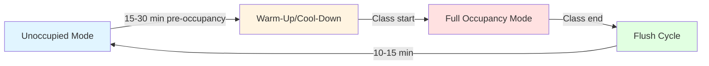

Lecture halls present distinct HVAC challenges stemming from high-density occupancy, intermittent use patterns, stringent acoustic requirements, and the cognitive demands placed on occupants during extended periods of sedentary activity. These environments—ranging from university auditoriums to corporate training centers—require systems that rapidly respond to load changes while maintaining thermal comfort and air quality conducive to learning and attention.

## Occupancy Load Characteristics

Lecture halls exhibit peak sensible and latent heat gains that significantly exceed typical office or residential applications. The metabolic heat generation rate for seated adults engaged in light mental activity is approximately 115 W per person (400 BTU/hr), with a sensible heat ratio of 0.65-0.75 depending on activity level and thermal conditions.

For a 300-person lecture hall, the total occupancy load becomes:

$$Q_{total} = n \times q_{person} = 300 \times 115 = 34,500 \text{ W}$$

$$Q_{sensible} = 34,500 \times 0.70 = 24,150 \text{ W}$$

$$Q_{latent} = 34,500 \times 0.30 = 10,350 \text{ W}$$

This latent load of approximately 10.4 kW translates to roughly 15.6 kg/hr (34.4 lb/hr) of moisture addition to the space, requiring robust dehumidification capacity and elevated outdoor air ventilation rates.

## Ventilation Requirements and Air Quality

ASHRAE Standard 62.1 prescribes outdoor air ventilation rates based on occupancy density and floor area. For lecture halls, the breathing zone outdoor airflow requirement is:

$$V_{bz} = R_p \times P_z + R_a \times A_z$$

Where:
- $R_p$ = 5 cfm/person (people outdoor air rate)
- $R_a$ = 0.06 cfm/ft² (area outdoor air rate)
- $P_z$ = zone population
- $A_z$ = zone floor area

For a 5,000 ft² lecture hall with 300 occupants:

$$V_{bz} = (5 \times 300) + (0.06 \times 5000) = 1500 + 300 = 1800 \text{ cfm}$$

This minimum ventilation rate must be delivered continuously during occupancy to maintain CO₂ levels below 1,000 ppm, the threshold above which cognitive performance begins measurably degrading. Studies demonstrate that elevated CO₂ concentrations (above 1,400 ppm) reduce decision-making performance by 15-50% across multiple cognitive domains.

## Scheduled Occupancy and System Response

Lecture halls typically operate on fixed schedules with sharp transitions between occupied and unoccupied states. This usage pattern enables three operational strategies:

**Pre-occupancy conditioning** brings the space to setpoint before arrival. The required lead time depends on thermal mass and equipment capacity:

$$t_{precool} = \frac{m \times c_p \times \Delta T}{Q_{cooling}}$$

For spaces with high thermal mass (concrete, masonry), pre-conditioning periods of 30-45 minutes are typical.

**Occupied mode** maintains setpoint against peak loads with maximum outdoor air ventilation.

**Flush cycles** post-occupancy purge accumulated CO₂ and odors at elevated airflow rates (150-200% of occupied ventilation) for 10-15 minutes, then the system returns to setback mode.

## Thermal Comfort for Extended Sitting

Extended sedentary periods reduce metabolic heat generation and peripheral circulation, increasing sensitivity to drafts and temperature asymmetry. ASHRAE Standard 55 defines comfort criteria, but lecture hall design requires additional considerations:

| Parameter | Standard Office | Lecture Hall Target |
|-----------|----------------|---------------------|
| Operative Temperature | 68-76°F | 70-74°F (narrower band) |
| Air Velocity at Seated Height | <50 fpm | <30 fpm |
| Vertical Temperature Gradient | <5°F head-to-ankle | <3°F head-to-ankle |
| Radiant Asymmetry | <10°F | <5°F |

Low-velocity displacement ventilation or underfloor air distribution systems minimize drafts at the seated occupant zone while providing effective ventilation. The supply air temperature for displacement systems must satisfy:

$$T_{supply} \le T_{room} - \frac{Q_{room}}{1.1 \times V_{supply}}$$

Typically, supply temperatures of 63-67°F work for displacement systems in lecture halls, compared to 55-58°F for conventional overhead systems.

## Acoustic Requirements

HVAC systems in lecture halls must achieve background sound levels below NC-30 (30 dBA) to ensure speech intelligibility. The reverberation time affects both acoustic quality and perceived sound levels:

$$RT_{60} = \frac{0.049 \times V}{A_{absorption}}$$

Where $V$ is room volume (ft³) and $A_{absorption}$ is total absorption (sabins). Target reverberation times for lecture halls are 0.6-0.8 seconds.

Strategies for acoustic control include:

- **Supply air velocity limitation**: Maintain duct velocities below 1,200 fpm in terminal sections
- **Diffuser selection**: Low-throw, high-induction diffusers reduce discharge noise
- **Duct attenuation**: Lined ductwork or silencers achieve 10-15 dB insertion loss per section
- **Equipment isolation**: Mount air handling units and fans on spring isolators with 95%+ efficiency
- **Variable speed drives**: Eliminate on-off cycling noise and reduce operating speeds during low-load conditions

## System Configurations

Three primary system types serve lecture halls effectively:

| System Type | Advantages | Limitations |
|-------------|-----------|-------------|
| **Constant Volume Reheat** | Simple control, excellent humidity control | Higher energy use, limited part-load efficiency |
| **VAV with CO₂-Based DCV** | Energy efficient, responsive to occupancy | Requires robust sensor networks, minimum airflow constraints |
| **Dedicated Outdoor Air System (DOAS) + Radiant** | Superior comfort, minimal drafts, low acoustics | Higher first cost, condensation risk management |

VAV systems with demand-controlled ventilation use CO₂ sensors to modulate outdoor air intake based on actual occupancy rather than design occupancy. This approach reduces energy consumption during partial occupancy by 30-40% while maintaining code-required ventilation rates per occupant.

The control logic follows:

$$V_{oa} = V_{oa,min} + K \times (CO_2^{measured} - CO_2^{setpoint})$$

Where $K$ is the proportional gain factor, typically calibrated to provide design ventilation at 1,000 ppm CO₂.

## Design Verification

Commission lecture hall HVAC systems by verifying:

- Actual outdoor airflow matches calculated requirements at design occupancy
- Space temperature uniformity within ±1°F horizontally and ±2°F vertically
- Background noise levels meet NC-30 criteria at design airflow
- CO₂ concentration remains below 1,000 ppm during continuous full occupancy
- Pre-occupancy conditioning achieves setpoint within programmed lead time

These performance metrics ensure the system delivers both thermal comfort and indoor air quality necessary for sustained cognitive performance in high-density educational and training environments.
