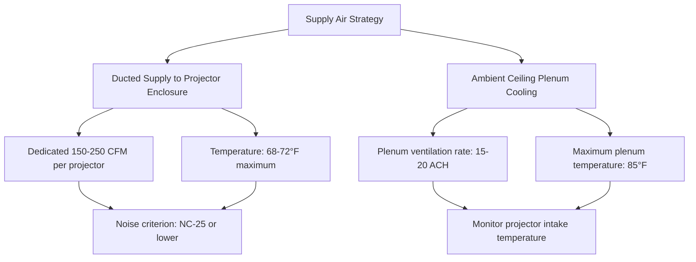
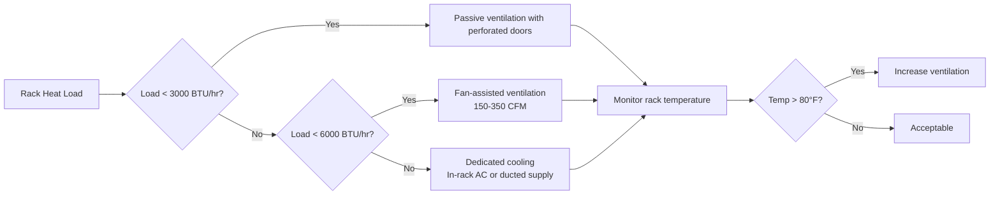
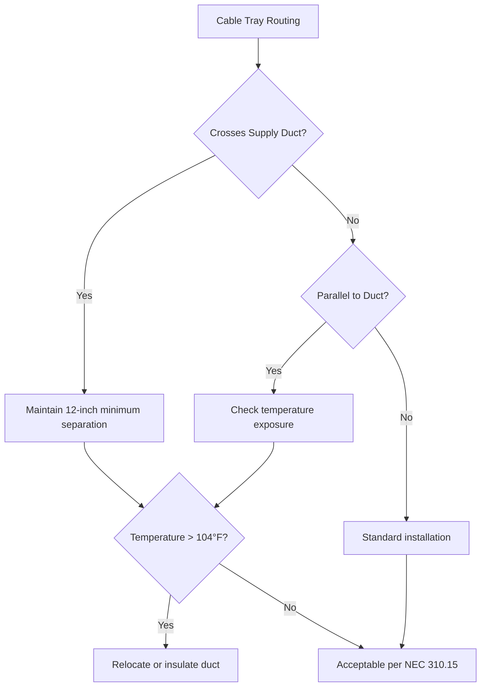

Audiovisual equipment integration presents unique thermal and acoustic challenges in lecture hall HVAC design. Modern AV systems generate substantial heat loads while requiring precise environmental control and minimal acoustic interference.

## Projector Heat Load and Cooling

High-lumen projectors generate significant heat through lamp inefficiency and electronic power dissipation. A typical 6,000-lumen projector consumes 300-400W electrical power, with 70-85% converted to heat.

The sensible heat gain from a projector operating at steady state:

$$Q_{\text{proj}} = P_{\text{elec}} \times \eta_{\text{heat}} \times F_u$$

Where:
- $Q_{\text{proj}}$ = projector heat gain (BTU/hr)
- $P_{\text{elec}}$ = electrical power consumption (W)
- $\eta_{\text{heat}}$ = fraction converted to heat (0.70-0.85)
- $F_u$ = usage factor (typically 0.8-1.0 for lecture halls)

For a 350W projector with 75% heat conversion:

$$Q_{\text{proj}} = 350 \times 3.41 \times 0.75 \times 1.0 = 895 \text{ BTU/hr}$$

### Ceiling-Mounted Projector Cooling Strategies

Ceiling-mounted projectors require dedicated cooling when:
- Projector power exceeds 300W
- Ceiling plenum temperature exceeds 80°F
- Lamp life degradation is unacceptable
- Projector warranty requires specific temperature limits

**Projector Cooling Design Table:**

| Projector Power | Cooling Method | Airflow Required | Supply Temperature | Notes |
|----------------|----------------|------------------|-------------------|-------|
| <200W | Passive plenum | None dedicated | Ambient plenum | Monitor plenum temp |
| 200-400W | Ducted supply or active plenum | 150-200 CFM | 68-72°F | Common for most installations |
| 400-600W | Dedicated ducted supply | 250-350 CFM | 65-70°F | High-lumen projectors |
| >600W | Dedicated mini-split or ducted | 400+ CFM | 65-68°F | Laser projectors, special cases |

## Equipment Rack Ventilation

AV equipment racks concentrate heat-generating components in enclosed spaces. Rack heat loads commonly range from 2,000-8,000 BTU/hr depending on equipment density.

The temperature rise across a ventilated equipment rack:

$$\Delta T = \frac{Q_{\text{rack}}}{1.08 \times \text{CFM}}$$

Where:
- $\Delta T$ = temperature rise through rack (°F)
- $Q_{\text{rack}}$ = total rack heat load (BTU/hr)
- CFM = airflow through rack (ft³/min)

For a 5,000 BTU/hr rack with acceptable 15°F temperature rise:

$$\text{CFM} = \frac{5000}{1.08 \times 15} = 309 \text{ CFM}$$

### Rack Cooling Implementation

**Equipment Rack Ventilation Requirements:**

- **Airflow direction:** Bottom-to-top following natural convection
- **Supply air temperature:** 65-70°F for equipment longevity
- **Maximum internal temperature:** 80°F continuous, 85°F peak
- **Minimum ventilation rate:** 20-30 CFM per 1,000 BTU/hr load
- **Door perforation:** Minimum 60% open area for passive cooling

## Display Screen Heat Contributions

Large-format displays contribute to lecture hall cooling loads. LED displays are more efficient than older LCD technology but still generate measurable heat.

Display heat load estimation:

$$Q_{\text{display}} = P_{\text{rated}} \times 3.41 \times F_u \times (1 - \eta_{\text{light}})$$

For an 86-inch commercial display rated at 450W with 20% light output efficiency:

$$Q_{\text{display}} = 450 \times 3.41 \times 0.9 \times 0.80 = 1,105 \text{ BTU/hr}$$

**Display Type Heat Load Comparison:**

| Display Technology | Power per ft² | Heat Output | Efficiency | Application |
|-------------------|---------------|-------------|------------|-------------|
| LCD (older) | 8-12 W/ft² | 100% of power | Low | Legacy systems |
| LED-backlit LCD | 5-8 W/ft² | 80-85% of power | Moderate | Common current |
| OLED | 4-7 W/ft² | 75-80% of power | Better | Premium applications |
| Direct LED wall | 15-30 W/ft² | 70-75% of power | Variable | Large format |

## Acoustic Coordination: HVAC and Sound Systems

HVAC noise directly impacts lecture hall acoustic performance. ASHRAE Standard 62.1 recommends NC-25 to NC-30 for lecture spaces, but high-quality AV systems may require NC-20 or lower.

The relationship between HVAC noise and required sound system power:

$$\text{SNR}_{\text{required}} = L_{\text{speech}} - L_{\text{background}}$$

Where signal-to-noise ratio should exceed 25 dB for excellent intelligibility, 15-25 dB for good intelligibility.

### Noise Mitigation Strategies

1. **Diffuser selection:** Low-velocity diffusers (300-400 FPM) versus high-velocity (600+ FPM)
2. **Return grille location:** Remote from presentation area, minimum 15 feet from microphones
3. **Duct silencers:** Required when calculated NC exceeds target by >5
4. **Variable volume systems:** Reduce airflow during critical listening periods
5. **Vibration isolation:** All equipment on spring or elastomeric isolators

**HVAC Noise Impact on AV Performance:**

| Background NC Level | Speech Intelligibility | Sound System Requirements | Acceptable Application |
|--------------------|------------------------|---------------------------|------------------------|
| NC-20 | Excellent | Minimal reinforcement | Recording studios, high-end lecture halls |
| NC-25 | Very good | Standard reinforcement | Typical lecture halls, conference rooms |
| NC-30 | Good | Moderate reinforcement | General classrooms, training rooms |
| NC-35 | Fair | Significant reinforcement | Multipurpose spaces, gymnasiums |
| NC-40+ | Poor | Cannot overcome | Unacceptable for AV applications |

## Control Room Environmental Requirements

AV control rooms house sensitive electronics and operators requiring specific conditions per ASHRAE TC 9.9 guidelines:

**Control Room Design Parameters:**

- **Temperature:** 72°F ± 2°F year-round
- **Relative humidity:** 45-55% ± 5%
- **Air changes:** Minimum 15 ACH, up to 20-25 ACH with high equipment density
- **Pressurization:** Slight positive pressure (+0.02 to +0.05 in. w.c.) relative to lecture hall
- **Filtration:** MERV 11-13 minimum for equipment protection

Heat load density in control rooms commonly reaches 40-60 BTU/hr per ft², requiring dedicated cooling even when adjacent spaces are satisfied.

## Cable Tray and Ductwork Coordination

Cable tray routing must coordinate with HVAC distribution to prevent thermal degradation and maintain system performance.

**Coordination Requirements:**

**Cable Temperature Derating Factors:**

- **Standard rating:** 30°C (86°F) ambient for most AV cabling
- **Temperature correction:** Reduce ampacity 10% per 10°F above rated ambient
- **Proximity to ducts:** Maintain minimum 12-inch separation from uninsulated ducts above 120°F surface temperature
- **Plenum cables:** Must use CL2P or CL3P rated for 150°F exposure per NEC Article 725

The thermal impact on cable ampacity:

$$I_{\text{adjusted}} = I_{\text{rated}} \times \sqrt{\frac{T_{\text{rated}} - T_{\text{ambient,rated}}}{T_{\text{rated}} - T_{\text{ambient,actual}}}}$$

ASHRAE Handbook—HVAC Applications Chapter 4 provides detailed guidance on AV equipment heat loads and cooling strategies specific to assembly spaces.

## Integration Best Practices

1. **Early coordination:** HVAC and AV consultants engaged during schematic design
2. **Load documentation:** Require equipment submittals with actual power consumption and heat dissipation data
3. **Zoning strategy:** Separate AV equipment zones from occupant zones for independent control
4. **Monitoring points:** Temperature sensors in critical equipment locations
5. **Commissioning:** Verify acoustic performance with AV system operating at design conditions

Successful AV integration requires simultaneous consideration of thermal loads, acoustic performance, spatial coordination, and electrical infrastructure throughout design and installation phases.
