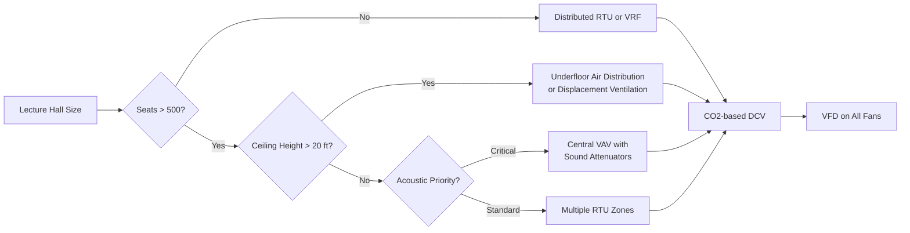

## System Capacity Scaling for Large Lecture Halls

Large lecture halls present unique HVAC challenges due to high occupant density, variable attendance patterns, and acoustic constraints. The fundamental heat load equation scales non-linearly with occupancy:

$$Q_{total} = Q_{sensible} + Q_{latent} = \dot{m}c_p\Delta T + \dot{m}h_{fg}\Delta\omega$$

where $\dot{m}$ is airflow rate (kg/s), $c_p$ is specific heat (1.006 kJ/kg·K), $\Delta T$ is temperature difference, $h_{fg}$ is latent heat of vaporization (2501 kJ/kg), and $\Delta\omega$ is humidity ratio change.

For a fully occupied 500-seat lecture hall, occupant heat generation dominates:

- **Sensible heat per person**: 75 W (seated, light activity)
- **Latent heat per person**: 55 W
- **Total metabolic load**: 500 × 130 W = 65,000 W (18.5 tons)

This represents 60-70% of peak cooling load in large venues, making occupancy-based load variability critical to system design.

## Equipment Sizing for Peak Loads

### Load Components

| Load Component | Small (100 seats) | Medium (500 seats) | Large (1000 seats) |
|----------------|-------------------|--------------------|--------------------|
| Occupant sensible | 7.5 kW | 37.5 kW | 75 kW |
| Occupant latent | 5.5 kW | 27.5 kW | 55 kW |
| Lighting (LED, 10 W/m²) | 4 kW | 15 kW | 30 kW |
| Envelope (climate dependent) | 8-12 kW | 20-30 kW | 40-60 kW |
| Ventilation load | 6-10 kW | 30-50 kW | 60-100 kW |
| **Total peak load** | **31-44 kW** | **130-160 kW** | **260-320 kW** |

### Ventilation Requirements

ASHRAE 62.1 specifies outdoor air requirements for lecture halls:

$$V_{oz} = R_p \times P_z + R_a \times A_z$$

where:
- $R_p$ = 7.5 cfm/person (people outdoor air rate)
- $R_a$ = 0.06 cfm/ft² (area outdoor air rate)
- $P_z$ = design occupant load
- $A_z$ = zone floor area (ft²)

For a 500-seat hall (8,000 ft²):

$$V_{oz} = 7.5 \times 500 + 0.06 \times 8000 = 4,230 \text{ cfm}$$

At 50% occupancy, demand-controlled ventilation (DCV) reduces this to approximately 2,600 cfm, significantly impacting energy consumption.

## Part-Load Efficiency Strategies

Large lecture halls typically operate at partial occupancy 60-80% of operational hours. The coefficient of performance (COP) degradation at part load follows:

$$COP_{part} = COP_{rated} \times PLR \times LF$$

where $PLR$ is part-load ratio and $LF$ is load factor (typically 0.85-0.95 for variable-speed equipment).

### Part-Load Operation Comparison

```mermaid
graph TD
    A[Variable Occupancy] --> B{Detection Method}
    B -->|CO2 Sensors| C[DCV Control]
    B -->|Schedule-Based| D[Fixed Setback]
    B -->|Occupancy Sensors| E[Presence Detection]

    C --> F[Modulate OA Dampers]
    D --> G[Temperature Setback]
    E --> H[Zone Isolation]

    F --> I[30-40% Energy Savings]
    G --> J[15-20% Energy Savings]
    H --> K[25-35% Energy Savings]

    I --> L[Optimal Strategy: Combined DCV + VFD]
    J --> L
    K --> L
```

### Variable-Speed Drive Implementation

The fan power relationship demonstrates cubic energy savings:

$$P_{fan} = \frac{\dot{V} \times \Delta P}{\eta_{fan}} \propto \dot{V}^3$$

Reducing airflow to 60% of design (typical part-load) yields:

$$P_{60\%} = 0.6^3 \times P_{design} = 0.216 \times P_{design}$$

This 78% power reduction at 60% flow makes variable air volume (VAV) with variable frequency drives (VFDs) essential for large lecture halls.

## Central vs Distributed Systems

### Central All-Air Systems

**Advantages:**
- Centralized maintenance access
- Superior humidity control through large cooling coils
- Acoustic isolation (mechanical room remote from occupied space)
- Lower first cost for equipment per ton
- Easier integration of energy recovery

**Disadvantages:**
- Large ductwork requirements (supply ducts typically 0.15-0.20 m²/100 seats)
- Higher fan energy due to distribution losses
- Limited zone control
- Single-point failure risk

### Distributed Systems

**Configuration types:**
- Multiple roof-top units (RTUs) with dedicated zones
- Chilled beam systems with decentralized sensible cooling
- Variable refrigerant flow (VRF) with multiple indoor units

**Performance comparison:**

| Parameter | Central VAV | Distributed RTU | VRF System |
|-----------|-------------|-----------------|------------|
| Energy efficiency (IPLV) | 14-16 EER | 12-14 EER | 16-20 EER |
| Zone control precision | ±2°F | ±1°F | ±0.5°F |
| Acoustic performance | Excellent (NC 25-30) | Good (NC 30-35) | Very Good (NC 25-30) |
| Maintenance complexity | Moderate | Low | High |
| First cost ($/ton) | $1,200-1,500 | $1,000-1,200 | $1,600-2,000 |

### System Selection Decision Flow

## Design Recommendations for High-Efficiency Operation

**For 100-250 seat halls:**
- Multiple small RTUs (3-5 ton each) with individual zone control
- DCV with CO2 sensors (1,000-1,200 ppm setpoint)
- Occupancy-based scheduling with 1-hour warm-up period

**For 250-500 seat halls:**
- Central VAV system with 4-6 zones or distributed VRF
- Dual-duct or series fan-powered boxes for perimeter zones
- Energy recovery ventilator (ERV) with 70-80% effectiveness
- Night setback to 85°F cooling/60°F heating

**For 500-1000 seat halls:**
- Central chilled water plant with variable-primary flow
- Underfloor air distribution at 0.8-1.0 cfm/ft² for improved stratification
- Dedicated outdoor air system (DOAS) with energy recovery
- Thermal energy storage for peak demand reduction
- Building automation integration with lecture scheduling systems

The selection between central and distributed architectures depends primarily on acoustic requirements, maintenance capabilities, and the building's broader HVAC infrastructure. Central systems excel in large venues where ductwork space exists and superior humidity control is essential, while distributed systems provide better part-load efficiency and redundancy for moderate-sized halls.

## Components

- Small Lecture Hall 100 To 250
- Medium Lecture Hall 250 To 500
- Large Lecture Hall 500 To 1000
- Auditorium Style Seating
- Classroom Hybrid Design
- Occupancy Density Planning
- Accessibility Hvac Coordination
