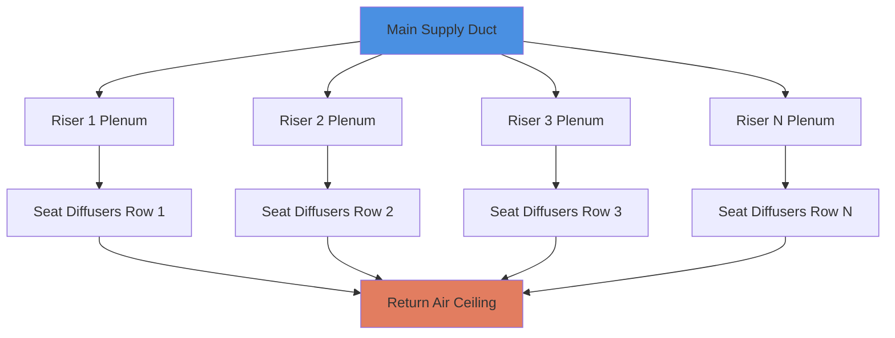
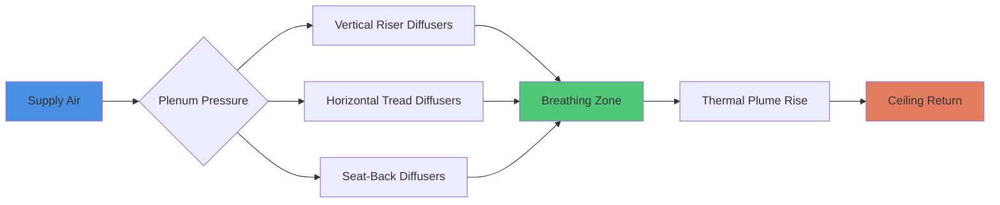

Tiered seating configurations in lecture halls present unique airflow challenges due to stepped floor geometry, vertical temperature gradients, and the need to deliver conditioned air to multiple elevation planes. The sloped space creates complex thermal stratification patterns that differ fundamentally from flat-floor applications.

## Physical Principles of Tiered Space Conditioning

The dominant physical phenomenon in tiered seating is **vertical thermal stratification** driven by buoyancy forces. Warm air from occupants rises through the vertical column, creating a temperature gradient described by:

$$\frac{dT}{dz} = \frac{Q_{sensible}}{A \cdot \rho \cdot c_p \cdot v_z}$$

Where:
- $\frac{dT}{dz}$ = vertical temperature gradient (°F/ft or K/m)
- $Q_{sensible}$ = sensible heat load from occupants (BTU/hr)
- $A$ = horizontal cross-sectional area (ft²)
- $\rho$ = air density (lb/ft³)
- $c_p$ = specific heat of air (BTU/lb·°F)
- $v_z$ = vertical air velocity (ft/min)

In tiered seating, occupants at higher rows experience warmer conditions unless the system actively manages this stratification. The temperature difference between the lowest and highest rows can reach 5-8°F without proper ventilation design.

## Underfloor Air Distribution Systems

Underfloor air distribution (UFAD) exploits the stepped floor structure as a series of horizontal plenums. Air supplied at low velocity (50-100 fpm) beneath each riser creates positive pressure zones that feed vertical diffusers.

### Supply Air Temperature and Flow Rate

UFAD systems in tiered seating typically operate with supply air temperatures of 63-65°F, warmer than conventional overhead systems (55°F). The required supply airflow per occupant is:

$$\dot{m}_{person} = \frac{Q_{sensible,person}}{c_p \cdot \Delta T_{supply}}$$

For a typical occupant generating 250 BTU/hr sensible heat with a 12°F temperature rise:

$$\dot{m}_{person} = \frac{250}{0.24 \cdot 12} = 87 \text{ CFM/person}$$

ASHRAE Standard 62.1 requires minimum ventilation rates of 5 CFM/person for breathing zone outdoor air, but thermal load drives the actual supply rate significantly higher.

### Plenum Pressure Distribution

Each riser cavity acts as a pressurized chamber. The pressure drop along the plenum length follows:

$$\Delta P = f \cdot \frac{L}{D_h} \cdot \frac{\rho v^2}{2}$$

Where $D_h$ is the hydraulic diameter of the riser cavity. Proper balancing requires pressure losses less than 0.05 in. w.g. to maintain uniform diffuser discharge across the row.

## Displacement Ventilation Through Seat Plenums

Displacement ventilation leverages buoyancy-driven flow, introducing cool air at floor level and allowing thermal plumes to carry contaminants upward. The effectiveness depends on the Archimedes number:

$$Ar = \frac{g \cdot \beta \cdot \Delta T \cdot H}{v_0^2}$$

Where:
- $g$ = gravitational acceleration (32.2 ft/s²)
- $\beta$ = thermal expansion coefficient (1/T for ideal gas)
- $\Delta T$ = temperature difference between supply and room (°F)
- $H$ = characteristic height (ft)
- $v_0$ = supply velocity (ft/s)

For displacement ventilation to function effectively, $Ar > 1$, ensuring buoyancy forces dominate over inertial forces. Typical seat-level diffusers discharge at 50-80 fpm with a 10-12°F temperature differential.

### Seat-Mounted Diffuser Design

Floor-mounted or seat-integrated diffusers must satisfy:

1. **Low discharge velocity** to prevent drafts (< 100 fpm in occupied zone)
2. **Adequate throw** to reach ankle level without stagnation
3. **Low noise** (NC 30-35 for lecture halls per ASHRAE Applications Handbook)

The effective draft temperature (EDT) must remain below 3°F:

$$EDT = (T_{air} - T_{set}) - 8(v_{air} - 0.15)$$

Where $v_{air}$ is in m/s. Seat diffusers with discharge velocities of 0.25 m/s (50 fpm) and supply temperatures of 18°C (64°F) maintain acceptable EDT values.

## Thermal Stratification Management

The challenge in tiered seating is maintaining temperature uniformity across vertical elevation changes. The stratification height $h_s$ where temperature begins to rise is:

$$h_s = \frac{Q_{total}}{A \cdot \rho \cdot c_p \cdot \Delta T_{return}}$$

Systems must balance two competing requirements:

| Design Approach | Supply Location | Temperature Gradient | Ventilation Effectiveness | Energy Efficiency |
|----------------|----------------|---------------------|--------------------------|------------------|
| Overhead Mixing | Ceiling level | Uniform | Moderate (0.8-1.0) | Moderate |
| UFAD with Displacement | Floor level | Stratified | High (1.2-1.8) | High |
| Seat-Level Supply | Riser cavities | Controlled gradient | High (1.3-1.6) | High |
| Hybrid Overhead/Underfloor | Combined | Variable | High (1.1-1.4) | Moderate-High |

Displacement ventilation systems achieve higher ventilation effectiveness $\varepsilon_v$:

$$\varepsilon_v = \frac{C_{exhaust} - C_{supply}}{C_{breathing} - C_{supply}}$$

Values of 1.2-1.8 are typical for well-designed displacement systems versus 0.8-1.0 for mixing systems.

## Supply Diffuser Placement in Stepped Floors

Diffuser placement follows the riser geometry. Three primary configurations exist:

1. **Vertical riser face mounting**: Diffusers integrated into the vertical face of each step
2. **Horizontal tread mounting**: Floor-mounted units in the tread surface
3. **Seat-back integration**: Supply through perforated seat backs

### Spacing and Airflow Distribution

Diffuser spacing must account for throw patterns and overlap. For displacement systems:

$$L_{max} = 2 \cdot x_{0.5}$$

Where $x_{0.5}$ is the horizontal distance to 50% velocity decay. Typical seat diffusers achieve $x_{0.5}$ of 3-4 feet, requiring 6-8 foot maximum spacing.

Airflow per diffuser scales with occupancy density:

$$CFM_{diffuser} = \frac{OA_{person} \cdot n_{occupants}}{n_{diffusers}}$$

For 20 CFM/person outdoor air requirement and 2 persons per diffuser: 40 CFM minimum per diffuser.

## Return Air Considerations

Return air location critically affects stratification. Ceiling returns in tiered spaces capture the warmest air, allowing beneficial stratification to reduce cooling loads. The return air temperature in displacement mode is:

$$T_{return} = T_{supply} + \frac{Q_{sensible}}{\dot{m}_{supply} \cdot c_p}$$

With proper displacement flow, return temperatures may reach 78-80°F while maintaining 72-74°F in the breathing zone, improving chiller efficiency.

## Design Guidelines

Per ASHRAE Standard 55, thermal comfort in tiered seating requires:

- Operative temperature: 68-76°F (winter-summer)
- Vertical air temperature difference (ankle to head): < 5°F
- Draft velocity: < 40 fpm at ankle level
- Relative humidity: 30-60%

Achieving these targets in tiered seating demands:

1. Supply air delivery at occupant level (UFAD or displacement)
2. Low-velocity diffusers (50-100 fpm discharge)
3. Adequate airflow per person (60-100 CFM total, 15-20 CFM outdoor air)
4. Pressure-balanced plenum distribution (< 0.05 in. w.g. variation)
5. Ceiling return air location to exploit stratification

The physics of buoyancy-driven flow in stepped geometry makes underfloor displacement ventilation the optimal solution for large tiered lecture halls, combining superior indoor air quality, thermal comfort, and energy efficiency.
