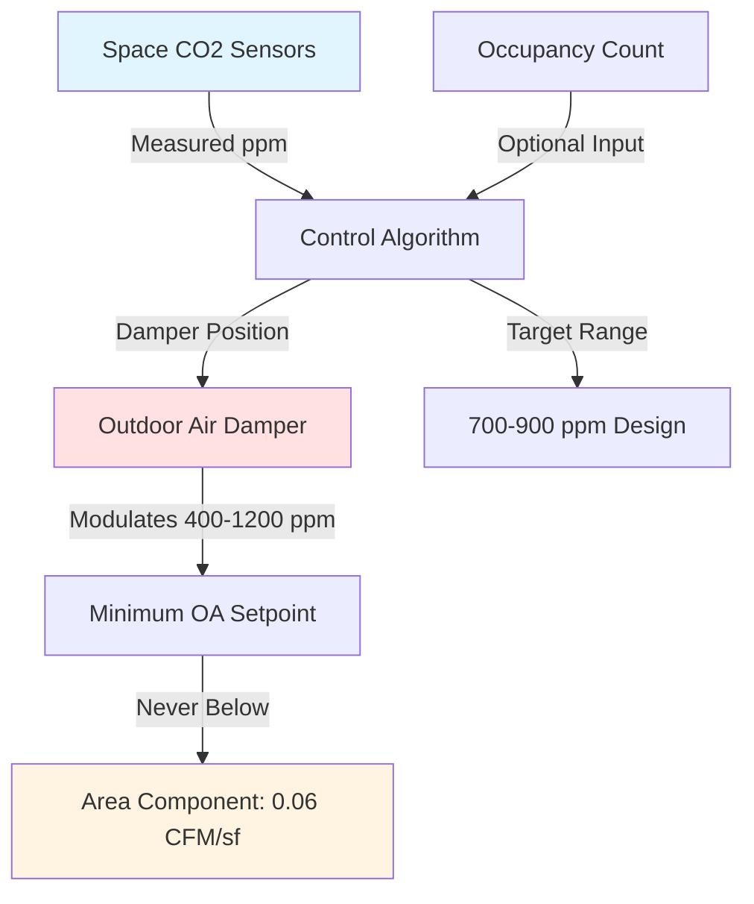
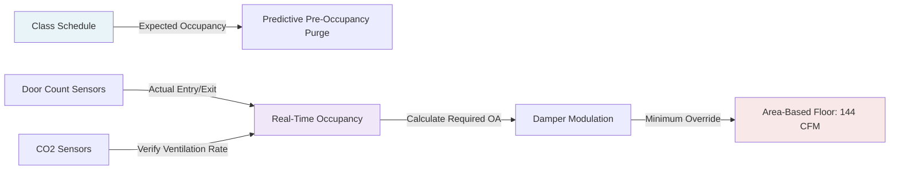

## ASHRAE 62.1 Ventilation Requirements for Lecture Halls

Lecture halls present unique ventilation challenges due to high occupant density, variable scheduling, and extended occupancy periods. ASHRAE Standard 62.1 establishes minimum outdoor air requirements based on both occupant load and floor area to address contaminants from human metabolism and building materials.

### Design Ventilation Rate Calculation

The required outdoor air ventilation rate for lecture halls combines two components:

$$V_{bz} = R_p \times P_z + R_a \times A_z$$

Where:
- $V_{bz}$ = breathing zone outdoor airflow rate (CFM)
- $R_p$ = outdoor air rate per person = 7.5 CFM/person
- $P_z$ = zone population (design occupancy)
- $R_a$ = outdoor air rate per unit area = 0.06 CFM/sf
- $A_z$ = zone floor area (sf)

**Example Calculation:**
For a 2,400 sf lecture hall with 120-person design occupancy:

$$V_{bz} = (7.5 \times 120) + (0.06 \times 2400) = 900 + 144 = 1,044 \text{ CFM}$$

This dual-component approach recognizes that people-generated bioeffluents (primarily CO₂, body odor compounds, and respiratory aerosols) dominate in high-density spaces, while area-dependent emissions from materials, furnishings, and cleaning products provide a continuous background load.

### Breathing Zone Effectiveness and System Ventilation

The breathing zone ventilation rate must be corrected for system-level distribution inefficiencies. ASHRAE 62.1 introduces the zone air distribution effectiveness factor ($E_z$) and system ventilation efficiency ($E_v$):

$$V_{ot} = \frac{V_{bz}}{E_z \times E_v}$$

**Typical Effectiveness Values for Lecture Halls:**

| Distribution System | $E_z$ Factor | Application Notes |
|---------------------|--------------|-------------------|
| Ceiling supply, heat sources at floor | 1.0 | Standard configuration |
| Displacement ventilation | 1.2 | Low-velocity floor supply |
| Underfloor air distribution | 1.2 | Stratified supply below breathing zone |
| Mixing overhead with wall returns | 0.9 | Poor mixing in deep spaces |
| High sidewall supply | 0.8 | Potential short-circuiting |

The system ventilation efficiency ($E_v$) accounts for multiple-zone systems where some zones may be under-ventilated relative to others. For single-zone dedicated outdoor air systems serving lecture halls, $E_v = 1.0$. For multi-zone systems with zone-level recirculation, $E_v$ typically ranges from 0.6 to 0.9 depending on system diversity.

### Air Changes Per Hour in Educational Spaces

While ASHRAE 62.1 does not prescribe air change rates, typical lecture halls operate at:

$$ACH = \frac{V_{supply} \times 60}{Volume}$$

**Typical ACH Ranges:**

| Condition | ACH Range | Ventilation Character |
|-----------|-----------|----------------------|
| Minimum outdoor air only | 2-4 ACH | Bioeffluent control |
| Design total supply | 6-10 ACH | Thermal load management |
| High-density (>40 sf/person) | 8-12 ACH | Enhanced mixing |

A 2,400 sf lecture hall with 12 ft ceilings (28,800 cf) requiring 1,044 CFM outdoor air represents:

$$ACH_{OA} = \frac{1,044 \times 60}{28,800} = 2.2 \text{ ACH (outdoor air only)}$$

Total supply air, including recirculation for cooling loads, typically delivers 6-8 ACH.

### CO₂-Based Demand Controlled Ventilation

Demand controlled ventilation (DCV) modulates outdoor air intake based on measured CO₂ concentrations as a surrogate for occupancy. The steady-state CO₂ concentration in a space follows:

$$C_{space} = C_{outdoor} + \frac{N \times G}{V_{OA} \times 60}$$

Where:
- $C_{space}$ = space CO₂ concentration (ppm)
- $C_{outdoor}$ = outdoor CO₂ concentration ≈ 420 ppm (2025 ambient)
- $N$ = number of occupants
- $G$ = CO₂ generation rate per person ≈ 0.3 CFH at sedentary activity
- $V_{OA}$ = outdoor air ventilation rate (CFM)

For the design condition (120 occupants, 1,044 CFM):

$$C_{space} = 420 + \frac{120 \times 0.3}{1,044/60} = 420 + \frac{36}{17.4} = 422 \text{ ppm}$$

**DCV Implementation Strategy:**

**DCV Control Parameters:**

| Parameter | Value | Basis |
|-----------|-------|-------|
| Outdoor CO₂ baseline | 420 ppm | Current atmospheric |
| Design indoor setpoint | 700-900 ppm | ASHRAE 62.1 compliance at design occupancy |
| Damper minimum position | Area component / Design OA | 144 CFM / 1,044 CFM = 14% |
| Control deadband | ±50 ppm | Prevent hunting |
| Sensor accuracy required | ±75 ppm | ASHRAE guideline |

### Occupancy Sensor Integration

Modern lecture hall ventilation systems integrate occupancy detection through:

1. **Passive Infrared (PIR) Sensors**: Detect occupancy presence but not count
2. **CO₂ Sensing**: Infers occupancy from metabolic loading
3. **Direct Occupant Counting**: Camera-based or door counters
4. **Scheduled Occupancy**: Building management system integration

**Multi-Sensor DCV Logic:**

The control sequence must maintain the area-based component (0.06 CFM/sf) continuously, even during unoccupied periods in multi-zone systems where adjacent spaces remain occupied.

### Ventilation Effectiveness in Practice

Breathing zone effectiveness depends on achieving proper air mixing in the occupied zone. Lecture halls with tiered seating present challenges:

**Factors Affecting $E_z$:**

- **Thermal stratification**: Heat from occupants and equipment rises, reducing mixing
- **Supply air temperature differential**: Cold air supply ($\Delta T$ > 20°F) may stratify
- **Return air location**: High returns in tiered halls may short-circuit supply air
- **Diffuser selection**: High induction diffusers improve mixing

For optimal performance, supply air should enter at moderate velocities (400-600 FPM at diffuser) with throw patterns reaching 75% of room length. Ceiling heights above 12 ft require specific attention to throw calculations:

$$Throw = \frac{V_0}{K} \times \left(\frac{A_k}{A_0}\right)$$

Where terminal velocity at the throw distance should maintain 50 FPM minimum for adequate mixing in the breathing zone.

### Practical Design Considerations

**Pre-Occupancy Purge Strategy:**
Lecture halls benefit from pre-occupancy ventilation purge, operating at 100% outdoor air for 30-60 minutes before scheduled use to reduce contaminant accumulation from previous sessions.

**Transient CO₂ Response:**
During occupancy buildup, CO₂ concentration follows a first-order lag:

$$C(t) = C_{final} \times (1 - e^{-t/\tau})$$

Where time constant $\tau = V/V_{OA}$ (room volume / ventilation rate). For the example hall, $\tau = 28,800/1,044 = 27.6$ minutes, meaning 95% of steady-state CO₂ occurs after approximately $3\tau = 83$ minutes.

**Verification and Commissioning:**
- Traverse outdoor air intake at multiple damper positions
- Verify CO₂ sensor calibration against reference standards
- Document zone airflow at design conditions
- Confirm $E_z$ assumptions through smoke visualization or tracer gas testing

Proper ventilation in lecture halls requires integrating metabolic and material emission rates, correcting for distribution effectiveness, and implementing responsive control strategies that maintain indoor air quality across variable occupancy patterns while optimizing energy consumption.
