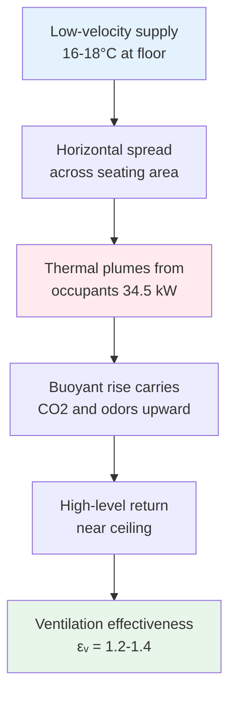
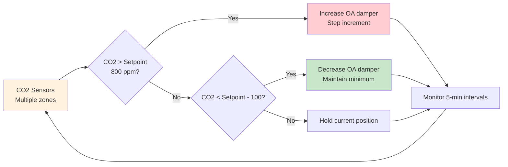

Movie theaters present exceptional HVAC design challenges due to extreme occupancy variations, stringent acoustic requirements, and the physics of conditioning seated audiences in darkened spaces. The intermittent nature of cinema operations creates transient thermal loads that conventional comfort models fail to address adequately.

## Thermal Load Characteristics

Cinema auditoriums experience load swings exceeding 60 W/m² within 30-minute intervals as audiences enter. The metabolic heat generation from occupants dominates the thermal load profile:

$$Q_{total} = Q_{occupants} + Q_{lights} + Q_{equipment} + Q_{envelope}$$

For a typical 300-seat auditorium:

$$Q_{occupants} = N \times q_{met} = 300 \times 115\text{ W} = 34.5\text{ kW}$$

This represents 70-80% of peak sensible load during showtime. The latent component from respiration and perspiration adds approximately 25 W per person, creating significant moisture management demands.

The transient response challenge stems from thermal mass interaction. Wall and seat surfaces absorb radiant heat during occupancy, then release it after patrons depart. This lag creates a 45-90 minute delay between occupancy changes and thermal equilibrium:

$$\frac{dT}{dt} = \frac{Q_{net} - hA(T_{surface} - T_{air})}{mc_p}$$

Systems must pre-cool spaces before showtime to counteract this thermal capacitance effect.

## Acoustic Constraints and System Design

Movie theaters require Noise Criteria ratings between NC 25 and NC 35, among the strictest for commercial buildings. These limits impose severe restrictions on air velocities and equipment selection.

The relationship between duct velocity and regenerated noise follows:

$$L_w = 10\log_{10}(V^6) + K$$

Where $V$ is velocity in m/s and $K$ accounts for duct geometry. Maintaining NC 30 typically restricts duct velocities to 4-5 m/s in occupied zones, compared to 7-10 m/s in conventional commercial spaces.

This velocity constraint directly impacts duct sizing and system pressure requirements:

| Parameter | Conventional Office | Movie Theater | Impact Factor |
|-----------|---------------------|---------------|---------------|
| Main duct velocity | 9 m/s | 4.5 m/s | 2× area required |
| Diffuser neck velocity | 5 m/s | 2.5 m/s | 4× pressure drop reduction |
| Fan static pressure | 750 Pa | 400 Pa | Lower energy, larger ducts |
| Return grille velocity | 3 m/s | 1.5 m/s | 4× grille area |

The acoustic requirement forces displacement ventilation strategies with low-velocity supply and high return placement.

## Ventilation Effectiveness for Seated Occupancy

ASHRAE 62.1 mandates 7.5 L/s per person for theaters, but delivery effectiveness varies dramatically with air distribution strategy. The seated configuration creates distinct thermal zones:

**Breathing Zone Concentration:**

$$\frac{C_e}{C_r} = \frac{1}{\varepsilon_v}$$

Where $\varepsilon_v$ is ventilation effectiveness. Conventional overhead mixing yields $\varepsilon_v = 0.8$, while displacement ventilation achieves $\varepsilon_v = 1.2-1.4$.

The physics favoring displacement systems centers on buoyancy-driven flow. Cool supply air (16-18°C) delivered at floor level spreads horizontally, then rises through the occupied zone as it absorbs heat from occupants:

$$\frac{dh}{dt} = \frac{g\beta\Delta T}{1 + (C_d A / A_c)^2}$$

This creates a vertical temperature gradient of 2-4°C between ankle and head height, maintaining comfort while improving contaminant removal efficiency.

## Odor Control and Air Quality

Cinemas accumulate diverse contaminants: CO₂ from respiration, volatile organic compounds from food concessions, and particulates from carpeting and fabrics. The carbon dioxide concentration rise provides a tracer for ventilation adequacy:

$$\frac{dC}{dt} = \frac{N \times G - Q(C - C_o)}{V}$$

Where:
- $N$ = occupancy (persons)
- $G$ = CO₂ generation rate (0.005 L/s per person)
- $Q$ = ventilation rate (L/s)
- $V$ = room volume (m³)
- $C_o$ = outdoor CO₂ concentration

Maintaining CO₂ below 1000 ppm requires:

$$Q_{min} = \frac{N \times G}{(C_{max} - C_o)} = \frac{300 \times 0.005}{(0.001 - 0.0004)} = 2500\text{ L/s}$$

This exceeds ASHRAE 62.1 minimums (2250 L/s for 300 occupants), indicating odor control often governs ventilation rates.

Demand-controlled ventilation using CO₂ sensors enables energy savings during low-occupancy periods:

## Temperature Uniformity Challenges

Darkened environments eliminate radiant heat exchange with surfaces, making occupants more sensitive to air temperature variations. The mean radiant temperature effect diminishes:

$$T_{operative} = \frac{h_c T_{air} + h_r T_{mrt}}{h_c + h_r}$$

In darkness, $h_r$ approaches zero as longwave radiation exchange decreases, forcing $T_{operative} \approx T_{air}$. This demands tighter air temperature control (±0.5°C) than typical commercial spaces (±1.0°C).

Stratification compounds uniformity challenges. Vertical temperature gradients follow:

$$\frac{dT}{dz} = \frac{Q_{convective}}{kA} - \frac{g}{c_p}$$

Stadium seating amplifies this effect, with elevated rows experiencing 1-2°C warmer conditions than lower seats. Compensating airflow strategies include:

- Dedicated zone control for upper seating sections
- Return air placement at multiple elevations
- Under-seat supply diffusers for personalized conditioning
- Ceiling fans for gentle air circulation (requires acoustic isolation)

## System Selection and Control Strategy

Optimal cinema HVAC systems balance acoustic performance, load response, and energy efficiency:

| System Type | Acoustic Performance | Load Response | Energy Efficiency | Application |
|-------------|---------------------|---------------|-------------------|-------------|
| Variable air volume (VAV) | Good (with low-velocity design) | Excellent | Excellent | Large multiplexes |
| Dedicated outdoor air system (DOAS) + radiant | Excellent (minimal air movement) | Poor (radiant lag) | Good | Premium theaters |
| Underfloor air distribution (UFAD) | Excellent (displacement mode) | Good | Very good | Single-screen venues |
| Chilled beam + DOAS | Excellent (decoupled ventilation) | Fair | Excellent | Modern designs |

Control sequences must anticipate occupancy transitions. Pre-cooling begins 60-90 minutes before showtime to overcome thermal mass delays. Post-show ventilation purges at elevated rates for 15-20 minutes to remove accumulated contaminants before resetting to unoccupied mode.

The intermittent load profile creates unique opportunities for thermal energy storage and load shifting that significantly reduce operating costs in properly engineered systems.

## Standards and Design References

- ASHRAE 62.1: Ventilation for acceptable indoor air quality (7.5 L/s per person)
- ASHRAE 55: Thermal comfort in darkened spaces (reduced radiant exchange)
- AHRI 885: Procedure for estimating occupied space sound levels
- ISO 3382-1: Acoustics measurement in performance spaces (informative for HVAC noise)

Successful movie theater HVAC design requires integrated acoustical and thermal analysis, anticipatory control strategies, and recognition that occupant thermal comfort in seated, darkened environments differs fundamentally from conventional commercial applications.
