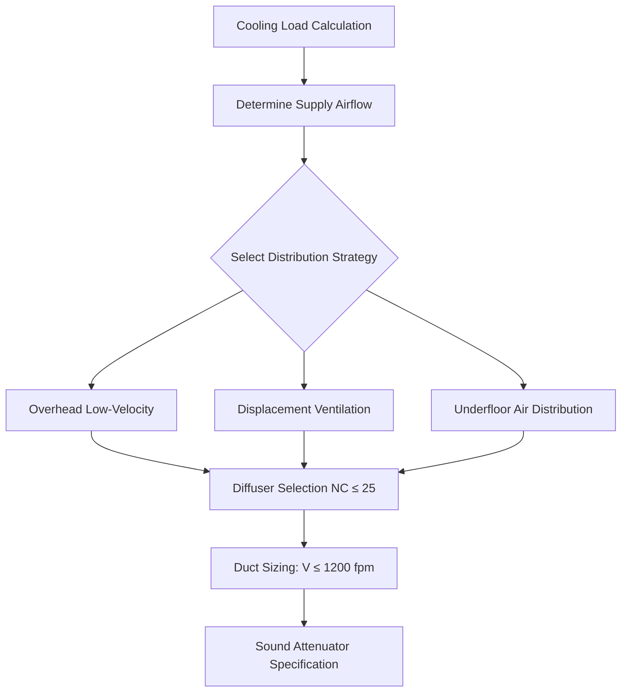
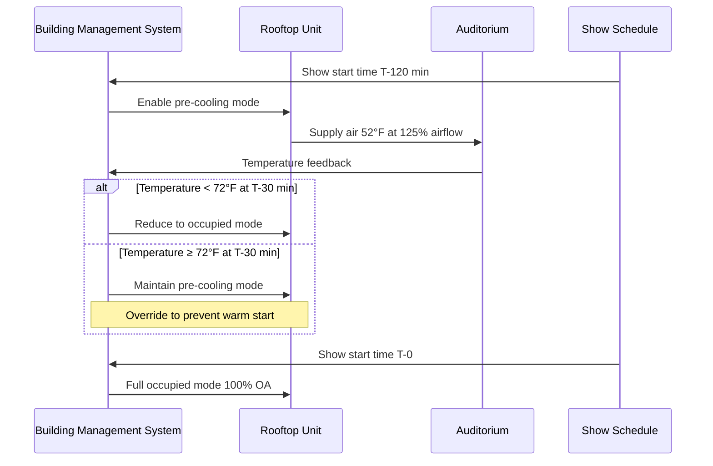

## System Architecture Selection

Theater air conditioning systems face competing requirements: high sensible cooling loads from occupants and equipment, strict acoustic criteria (NC 25-30), and highly variable occupancy schedules requiring rapid pull-down capability.

### Rooftop Units Versus Central Plants

**Rooftop packaged units** dominate theater applications for several physical and economic reasons:

- **Thermal mass elimination**: Direct outdoor air access eliminates the thermal mass of chilled water piping, enabling faster temperature response during pre-cooling
- **Refrigerant circuit efficiency**: Direct expansion refrigeration delivers coefficient of performance (COP) values of 3.0-3.5 at design conditions, compared to 2.5-3.0 for chiller-based systems when accounting for pumping and tower losses
- **Acoustic isolation**: Equipment vibration remains outside the building envelope, reducing structure-borne noise transmission

**Central chilled water plants** provide advantages for large multiplex facilities (8+ screens):

| Parameter | Rooftop Units | Central Plant |
|-----------|---------------|---------------|
| First cost | $15-25/cfm | $25-35/cfm |
| Diversity factor | 1.0 per zone | 0.7-0.8 system-wide |
| Maintenance access | Roof-level | Mechanical room |
| Redundancy | Per-unit failure | System-wide vulnerability |
| Part-load efficiency | Fixed increments | Continuous modulation |

The diversity factor advantage becomes significant for facilities exceeding 40,000 cfm total airflow, where central systems benefit from statistical averaging of peak loads across multiple auditoriums.

### Packaged Versus Split Systems

**Packaged rooftop units** place all refrigeration components in a single enclosure, while **split systems** separate the condensing unit from the air handler.

The heat rejection rate at the condenser follows:

$$Q_{\text{rej}} = Q_{\text{evap}} + W_{\text{comp}} = Q_{\text{evap}} \left(1 + \frac{1}{\text{COP}}\right)$$

For a theater auditorium with 30 tons (360,000 Btu/hr) cooling load at COP = 3.0:

$$Q_{\text{rej}} = 360{,}000 \times \left(1 + \frac{1}{3.0}\right) = 480{,}000 \text{ Btu/hr}$$

**Packaged configuration advantages**:
- Factory-assembled refrigerant piping eliminates field brazing and leak potential
- Single-point responsibility for performance verification
- Reduced installation labor (40-60% versus split systems)
- Integrated economizer dampers and controls

**Split system applications**:
- Indoor air handler placement reduces duct run lengths when rooftop space is constrained
- Separation of heat rejection allows condenser placement at grade level for maintenance access
- Multiple air handlers per condensing unit in small facilities (2-4 screens)

## Low-Velocity Air Distribution

Acoustic criteria drive air distribution design. The relationship between duct velocity and regenerated noise follows:

$$\text{PWL} = 10 \log_{10}(V^6)$$

where PWL is sound power level and V is velocity. Reducing velocity from 2,000 fpm to 1,200 fpm decreases sound power by 14 dB—critical for achieving NC 25-30 targets.

### Supply Air Design Parameters

The supply air temperature rise due to duct heat gain becomes significant in low-velocity systems:

$$\Delta T = \frac{Q_{\text{gain}}}{\.{m} c_p} = \frac{UA(T_{\text{ambient}} - T_{\text{supply}})}{\.{m} c_p}$$

For 100 feet of uninsulated sheet metal duct carrying 10,000 cfm at 55°F in a 95°F plenum space:

- U-value ≈ 0.90 Btu/hr·ft²·°F (bare metal)
- Surface area ≈ 340 ft² (48-inch diameter duct)
- Heat gain = 0.90 × 340 × (95 - 55) = 12,240 Btu/hr
- Air mass flow = 10,000 × 0.075 × 60 = 45,000 lb/hr
- Temperature rise = 12,240 / (45,000 × 0.24) = 1.1°F

This 2% temperature increase requires R-6 insulation or routing through conditioned space to maintain setpoint accuracy.

### Return Air Path Configuration

| Configuration | Application | Acoustic Performance | First Cost |
|---------------|-------------|---------------------|------------|
| Ducted returns | Individual auditoriums | Excellent (isolated paths) | High |
| Plenum returns | Small theaters (<200 seats) | Good (requires baffles) | Medium |
| Corridor returns | Multiplex facilities | Fair (requires transfer grilles) | Low |
| Under-seat returns | Premium installations | Excellent (minimal duct area) | Very high |

**Ducted returns** prevent cross-talk between adjacent auditoriums. The transmission loss requirement follows:

$$\text{TL} = \text{SWL}_{\text{source}} - \text{NC}_{\text{target}} - 10\log_{10}(A/A_0)$$

where A is the room absorption and $A_0$ = 1 ft². For two 400-seat auditoriums with SWL = 85 dB at low frequencies and NC 30 target, the required partition TL exceeds 50 dB at 125 Hz—achievable only with fully ducted returns or massive plenum barriers.

## Pre-Cooling Strategies

Theater occupancy transitions from near-zero to design capacity in 15-30 minutes during show start times. The space thermal mass provides beneficial capacitance:

$$Q_{\text{stored}} = (mc_p)_{\text{air}}(T_1 - T_2) + (mc_p)_{\text{surfaces}}(T_1 - T_2)$$

### Pre-Cooling Calculation Example

400-seat auditorium with 15,000 ft³ volume and 12,000 ft² interior surface area (concrete, gypsum):

**Air thermal mass**:
$$Q_{\text{air}} = 15{,}000 \times 0.075 \times 0.24 \times (78 - 72) = 1{,}620 \text{ Btu}$$

**Surface thermal mass** (1-inch effective depth):
$$Q_{\text{surface}} = 12{,}000 \times \frac{1}{12} \times 144 \times 0.20 \times (78 - 72) = 172{,}800 \text{ Btu}$$

Total stored cooling = 174,420 Btu. This thermal capacitance allows setpoint drift to 78°F during unoccupied periods, then 2-hour pre-cooling at 1.5× design capacity recovers to 72°F before audience arrival while storing 48 tons of cooling in the building mass.

### Pre-Cooling Control Sequence

**Energy implications**: Pre-cooling reduces peak equipment size requirements by 20-30% through thermal mass utilization. The integrated cooling energy remains constant (first law of thermodynamics), but power demand shifts to off-peak periods when outdoor temperatures are 8-12°F lower, improving refrigeration efficiency by 15-25%.

## System Component Integration

**Economizer operation**: Outdoor air economizing provides free cooling when $T_{\text{oa}} < T_{\text{return}} - 2°F$. Given typical theater return air temperatures of 75-78°F and 100% outdoor air requirements during occupied periods, economizer sequences function only during pre-cooling and post-occupancy purge cycles.

**Energy recovery**: Run-around glycol loops or enthalpy wheels recover 50-70% of exhaust energy. The effectiveness-NTU relationship:

$$\epsilon = \frac{1 - e^{-NTU(1-C^*)}}{1 - C^* e^{-NTU(1-C^*)}}$$

For balanced airflows ($C^* = 1$), effectiveness approaches 0.50 at NTU = 1.0, requiring heat exchanger surface area of approximately 2.5 ft² per cfm for practical installations.

**Variable air volume versus constant volume**: VAV systems reduce energy during partial occupancy but compromise ventilation effectiveness. ASHRAE 62.1 requires ventilation rates based on peak occupancy (7.5 cfm/person + 0.06 cfm/ft²), making VAV turndown limited to post-occupancy periods only.

## Conclusion

Theater air conditioning system selection balances acoustic performance, rapid load response, and energy efficiency. Rooftop packaged units dominate through simplicity and first cost advantages, while low-velocity distribution remains non-negotiable for acoustic compliance. Pre-cooling strategies exploit building thermal mass to reduce equipment sizing and shift energy consumption to favorable outdoor conditions, demonstrating the practical application of thermodynamic storage principles.
