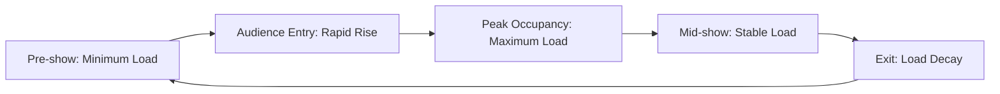

## Overview

Multiplex theaters present unique HVAC challenges due to dynamic, non-coincident loads across multiple auditoriums with staggered showing schedules. Unlike single-screen theaters, multiplexes (8-30 screens) require system architectures that capitalize on load diversity while maintaining individual zone control. The fundamental engineering decision centers on central plant systems versus distributed equipment, with significant implications for energy efficiency, capital cost, and operational flexibility.

## Load Diversity and Non-Coincident Peak Analysis

The primary advantage of multiplex HVAC design stems from load diversity. When auditoriums operate on staggered schedules, peak loads rarely coincide across all spaces simultaneously.

### Diversity Factor Calculation

The aggregate cooling load for a multiplex is:

$$Q_{total} = \sum_{i=1}^{n} Q_{i} \times DF$$

Where:
- $Q_i$ = peak cooling load for auditorium $i$ (tons)
- $n$ = number of auditoriums
- $DF$ = diversity factor (typically 0.70-0.85 for multiplexes)

The diversity factor accounts for non-simultaneous peaks. For a 16-screen multiplex with 30-minute staggered start times, typical $DF = 0.75$, meaning central plant capacity can be 25% smaller than the sum of individual peak loads.

### Transient Load Behavior

Auditorium loads follow a characteristic curve during each showing:

The sensible heat gain rate during audience entry approximates:

$$\frac{dQ_s}{dt} = n_{people} \times \left(\frac{dn}{dt}\right) \times q_{sensible}$$

Where $\frac{dn}{dt}$ is the entry rate (people/minute) and $q_{sensible}$ = 250 BTU/hr-person at typical theater conditions.

## Central Plant vs Distributed Equipment Architecture

| Parameter | Central Plant | Distributed Equipment |
|-----------|---------------|----------------------|
| **Capital Cost** | Higher (15-20% premium) | Lower initial investment |
| **Energy Efficiency** | Superior (EER 14-18) | Moderate (EER 11-13) |
| **Diversity Advantage** | Fully realized | Minimal benefit |
| **Maintenance** | Centralized, efficient | Distributed, labor-intensive |
| **Space Requirements** | Mechanical penthouse | Rooftop/interstitial space |
| **Acoustic Control** | Excellent (remote equipment) | Challenging (local units) |
| **Redundancy Options** | N+1 chiller configuration | Individual unit backup |

### Central Plant Design

Central plant systems utilize chilled water generation with distributed air handling units (AHUs) serving individual auditoriums or groups of smaller auditoriums.

**Typical Configuration:**
- Water-cooled chillers (2-4 units, N+1 redundancy)
- Primary-secondary chilled water pumping
- Variable speed condenser water pumps
- Individual VAV AHUs per auditorium or shared AHUs for smaller screens

**Chilled Water System Sizing:**

Total plant capacity considering diversity:

$$Q_{plant} = \frac{\sum Q_{auditoriums} \times DF + Q_{lobby} + Q_{misc}}{efficiency_{system}}$$

For a 16-screen multiplex:
- Auditoriums: 320 tons × 0.75 = 240 tons
- Lobby/common areas: 80 tons (no diversity)
- Miscellaneous (restrooms, concessions): 20 tons
- **Total plant capacity: 340 tons** (typically 2 × 170-ton chillers)

### Distributed Equipment Approach

Rooftop units (RTUs) serving individual auditoriums or small groups represent the distributed approach. This configuration sacrifices diversity benefits but offers simplicity and lower first cost.

**Characteristics:**
- Individual RTU per auditorium (small screens) or shared RTU for 2-3 auditoriums
- No central chilled water infrastructure
- Limited load diversity exploitation
- Total installed capacity: 400+ tons for same 16-screen facility

## Variable Load Management Strategies

Effective multiplex HVAC systems must respond to dramatically varying loads as audiences enter, occupy, and exit auditoriums.

### VAV System Control

Variable air volume systems provide optimal response to transient loads:

$$\dot{m}_{air} = \frac{Q_{sensible}}{c_p \times (T_{supply} - T_{zone})}$$

As occupancy and internal gains vary, airflow modulates while maintaining supply air temperature. Minimum airflow must satisfy ventilation requirements per ASHRAE Standard 62.1:

$$\dot{V}_{min} = R_p \times P_z + R_a \times A_z$$

Where:
- $R_p$ = 5 cfm/person (theater occupancy)
- $P_z$ = zone population
- $R_a$ = 0.06 cfm/ft² (area component)
- $A_z$ = zone area

### Demand-Based Control Sequences

Sophisticated control strategies enhance efficiency:

1. **Occupancy-Based Reset:** CO₂ sensors detect auditorium occupancy, modulating outdoor air intake between minimum (unoccupied) and design (full occupancy) levels.

2. **Supply Air Temperature Reset:** During low-load periods (pre-show, post-exit), supply air temperature increases from 55°F to 60-62°F, reducing reheat energy and improving dehumidification efficiency.

3. **Economizer Integration:** When outdoor conditions permit (typically $T_{outdoor} < 65°F$ and $h_{outdoor} < h_{return}$), 100% outdoor air operation eliminates mechanical cooling.

## Common Lobby and Corridor Conditioning

Lobby spaces experience continuous, relatively stable loads compared to auditoriums. High ceilings (15-25 ft) and large glazing areas create distinct thermal challenges.

### Lobby Load Components

$$Q_{lobby} = Q_{solar} + Q_{transmission} + Q_{occupancy} + Q_{lighting} + Q_{infiltration}$$

Solar gain through extensive glazing dominates during daytime hours:

$$Q_{solar} = A_{glazing} \times SHGC \times SGHF \times CLF$$

Where:
- $SHGC$ = solar heat gain coefficient (0.25-0.40 for low-e glazing)
- $SGHF$ = solar heat gain factor (180-220 BTU/hr-ft²)
- $CLF$ = cooling load factor (accounts for thermal mass)

### Stratification Control

High lobby ceilings promote thermal stratification. Without intervention, temperature gradients of 10-15°F between floor and ceiling develop, wasting energy by overheating the occupied zone while conditioning the ceiling plenum.

**Mitigation strategies:**
- Displacement ventilation with low-level supply (0.5-1.5 ft AFF)
- Destratification fans for mixing
- Radiant heating in floor or low walls

## Staggered Showing Schedule Impact

Strategic scheduling dramatically affects mechanical system sizing and operating costs.

```mermaid
gantt
    title 16-Screen Staggered Schedule Impact on Aggregate Load
    dateFormat HH:mm
    axisFormat %H:%M

    section Peak Management
    Traditional Coincident Starts    :a1, 19:00, 15m
    Peak Load Spike                  :crit, 19:00, 30m

    section Optimized Staggering
    Staggered Starts (15-min intervals) :a2, 19:00, 4h
    Managed Load Profile                :19:00, 4h
```

### Load Profile Optimization

For a 16-screen multiplex with 15-minute staggered starts:

| Showing Pattern | Peak Aggregate Load | Plant Capacity Required |
|----------------|---------------------|------------------------|
| **Coincident starts** | 320 tons (100%) | 360 tons (1.0 safety factor) |
| **15-min stagger** | 240 tons (75%) | 270 tons (0.75 diversity) |
| **30-min stagger** | 200 tons (62.5%) | 230 tons (0.65 diversity) |

Optimal staggering intervals balance patron convenience against mechanical system efficiency. Most multiplexes achieve 0.70-0.80 diversity factors through natural scheduling variation.

### Transient Response Requirements

Despite staggered schedules, individual auditoriums experience rapid load changes. Systems must respond to occupancy transitions within acceptable temperature drift:

$$\Delta T_{drift} = \frac{Q_{gain} \times \Delta t}{m_{air} \times c_p}$$

For a 300-seat auditorium gaining 75 kW (256,000 BTU/hr) during 10-minute entry period with insufficient airflow, temperature drift can exceed 5°F. Proper VAV response prevents discomfort during these transient events.

## Design Recommendations

**Central plant systems are optimal when:**
- 12+ screens allow significant diversity benefits
- Acoustic performance is critical
- Long-term operating cost minimization is prioritized
- Mechanical penthouse or dedicated plant space is available

**Distributed RTU systems are appropriate when:**
- 8 or fewer screens limit diversity benefits
- Capital budget is constrained
- Roof space accommodates multiple units
- Maintenance staff has RTU service capability

**Key Design Parameters (ASHRAE Handbook - HVAC Applications):**
- Supply air temperature: 55°F (with humidity control)
- Auditorium ACH: 8-12 air changes per hour (occupied)
- Lobby ACH: 4-6 air changes per hour
- Occupant sensible load: 250 BTU/hr-person
- Occupant latent load: 200 BTU/hr-person
- Sound criteria: NC-30 to NC-35 maximum

## Conclusion

Multiplex theater HVAC design leverages load diversity from staggered showing schedules to significantly reduce central plant capacity compared to sum-of-peaks sizing. Central chilled water plants with distributed VAV systems offer superior energy performance and acoustic control for facilities with 12+ screens, while distributed RTU approaches provide simpler, lower-cost solutions for smaller multiplexes. Sophisticated control strategies responding to occupancy transients, combined with proper lobby conditioning, ensure comfort across diverse thermal zones within these complex entertainment facilities.
