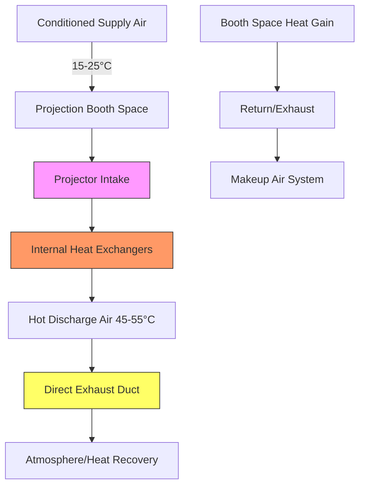

## Overview

Projection booths present concentrated heat loads that require dedicated cooling strategies independent of auditorium HVAC systems. Modern digital and laser projectors generate 3-15 kW of heat in confined spaces, creating elevated room temperatures that can compromise equipment reliability and lifespan. The transition from xenon lamp-based to laser phosphor systems has altered the thermal management landscape, requiring updated ventilation and cooling approaches.

## Digital Projector Heat Dissipation

Digital cinema projectors convert electrical power into light with typical efficiency of 15-25%, meaning 75-85% of input power becomes waste heat. This heat manifests through three primary modes:

**Conductive heat transfer** occurs through the projector chassis to mounting surfaces, though this represents a minor fraction (typically <10%) of total heat rejection. **Convective heat transfer** dominates, as internal fans exhaust heated air directly into the booth space. **Radiative heat transfer** from the projector housing contributes minimally at typical operating temperatures of 40-60°C.

The total heat load calculation follows:

$$Q_{total} = P_{input} \times (1 - \eta_{optical})$$

where $Q_{total}$ is the heat load in watts, $P_{input}$ is the electrical input power, and $\eta_{optical}$ is the optical efficiency (light output divided by electrical input).

For a 6 kW laser projector with 20% optical efficiency:

$$Q_{total} = 6000 \text{ W} \times (1 - 0.20) = 4800 \text{ W} = 16,380 \text{ BTU/hr}$$

### Typical Heat Load Ranges

| Projector Type | Power Input | Heat Output | Cooling Air Required |
|----------------|-------------|-------------|---------------------|
| Small digital (xenon) | 2-4 kW | 6,800-13,600 BTU/hr | 250-500 CFM |
| Large digital (xenon) | 5-7 kW | 17,000-23,900 BTU/hr | 600-850 CFM |
| Laser phosphor | 3-6 kW | 10,200-20,500 BTU/hr | 300-650 CFM |
| RGB laser (premium) | 8-15 kW | 27,300-51,200 BTU/hr | 950-1,800 CFM |

## Laser Projector Cooling Requirements

Laser projectors utilize solid-state light sources that demand precise thermal management. The laser diodes operate optimally at 20-30°C junction temperatures. Deviation beyond manufacturer specifications accelerates lumen depreciation and reduces the 20,000-30,000 hour rated lifespan.

Laser systems employ internal closed-loop liquid cooling or advanced heat pipe technology to transfer heat from laser modules to air-cooled heat exchangers. The booth must remove this rejected heat through:

1. **Dedicated exhaust ventilation** matched to projector airflow specifications
2. **Supply air conditioning** to maintain booth ambient temperature at 15-25°C
3. **Differential pressure control** to prevent auditorium air infiltration

The cooling air temperature rise across the projector follows:

$$\Delta T = \frac{Q_{sensible}}{\.m \times c_p} = \frac{Q_{sensible}}{CFM \times 1.08}$$

For 4,800 W (16,380 BTU/hr) rejected through 500 CFM:

$$\Delta T = \frac{16,380}{500 \times 1.08} = 30.3°F$$

This significant temperature rise necessitates direct exhaust of projector discharge air rather than recirculation within the booth.

## Projection Booth Ventilation Strategy

Effective booth ventilation isolates equipment heat from occupied spaces while maintaining equipment operating conditions. The strategy employs a three-tier approach:

### Ventilation Design Parameters

**Supply airflow** must overcome booth envelope heat gain plus residual equipment heat not captured by direct exhaust. ASHRAE recommends minimum 0.5 CFM/ft² for equipment rooms, but projection booths typically require 2-5 CFM/ft² due to concentrated loads.

**Exhaust airflow** should match or slightly exceed supply (103-110% of supply) to maintain negative pressure of 0.02-0.05 in. w.c. relative to the auditorium. This prevents projector noise transmission and light leakage through booth openings.

**Air distribution** places supply diffusers at low level (floor or lower wall) and general exhaust at high level (ceiling), leveraging thermal buoyancy. Projector exhaust connects directly via rigid ductwork to prevent hot air mixing with booth space.

## Isolated Cooling System Design

Projection equipment cooling operates independently from auditorium systems for several critical reasons:

1. **Schedule independence** - Projectors require cooling during pre-show warm-up and post-show cooldown periods extending beyond auditorium occupancy
2. **Temperature requirements** - Equipment demands 15-25°C while auditoriums maintain 21-24°C with less precision
3. **Redundancy** - Equipment cooling failure should not affect patron comfort
4. **Load variability** - Projection loads remain constant while auditorium loads fluctuate with occupancy

### Dedicated Cooling Approaches

| System Type | Capacity Range | Advantages | Limitations |
|-------------|----------------|------------|-------------|
| Split DX system | 1-3 tons | Simple, economical | Requires outdoor unit access |
| Packaged AC | 1-5 tons | Self-contained | Space constraints |
| Chilled water fan coil | 1-4 tons | Quiet, efficient | Requires central plant |
| Glycol loop with dry cooler | 2-10 tons | Free cooling potential | Higher first cost |

The sensible heat ratio (SHR) for projection booth cooling approaches 0.95-1.0 since minimal moisture enters the sealed space. This high SHR allows smaller equipment selection compared to equivalent latent-inclusive loads.

Equipment capacity calculation:

$$Q_{cooling} = Q_{projector} + Q_{envelope} + Q_{lights} + Q_{misc}$$

For a 200 ft² booth with 5 kW projector:

$$Q_{cooling} = 17,000 + 2,000 + 1,500 + 1,000 = 21,500 \text{ BTU/hr} = 1.8 \text{ tons}$$

Safety factor of 1.15-1.25 yields a 2-2.5 ton unit selection.

## Comparison: Digital vs. Legacy Film Projectors

The transition from film to digital projection fundamentally changed booth thermal characteristics:

| Parameter | Film Projector (Xenon) | Digital/Laser Projector |
|-----------|------------------------|------------------------|
| Peak heat output | 8-12 kW | 3-8 kW |
| Heat profile | Highly variable with lamp changes | Stable over lifespan |
| Exhaust temperature | 60-80°C | 45-60°C |
| Cooling air required | 800-1,200 CFM | 300-800 CFM |
| Lamp replacement heat spike | Yes (additional 2-3 kW) | No |
| Ozone generation | Yes (requires additional ventilation) | No |

Legacy film projectors employed high-intensity xenon short-arc lamps operating at 55-75 bar pressure and 6,000-7,000 K color temperature. These lamps generated intense infrared radiation requiring substantial forced air cooling. Lamp changeouts (every 1,000-2,000 hours) created additional heat loads during the critical initial run-in period.

Modern laser systems eliminate lamp replacement, reduce overall heat output by 25-40%, and provide more consistent thermal profiles. However, laser systems require more precise temperature control—film projectors tolerated booth temperatures up to 35°C while laser systems specify maximum ambient temperatures of 25-30°C.

## Ventilation Booth Requirements per Code

The International Mechanical Code (IMC) Section 403 requires mechanical ventilation for projection rooms at rates sufficient to limit temperature rise and maintain equipment manufacturer specifications. While specific CFM requirements are not mandated, the code requires:

- Exhaust air discharge to outdoors (no recirculation to occupied spaces)
- Makeup air to replace exhausted quantities
- Independent control from auditorium systems
- Compliance with equipment manufacturer installation requirements

ASHRAE Standard 90.1 Energy Standard allows projection booth systems to operate during unoccupied hours when necessary for equipment thermal management, exempt from typical setback requirements.

## Design Recommendations

1. **Size exhaust capacity at 110-120%** of projector manufacturer's specified cooling airflow
2. **Provide dedicated cooling sized for simultaneous projector operation** plus envelope loads
3. **Install temperature monitoring with alarms** at projector intake (should not exceed 25°C)
4. **Separate projector exhaust from general booth exhaust** to enable heat recovery opportunities
5. **Consider redundant cooling** for venues with high revenue impact from downtime
6. **Design for future upgrades** to higher-output RGB laser systems (15-20 kW potential)

The economic value of proper thermal management is substantial—premature lumen depreciation reduces image quality and shortens expensive projector component lifespan. An investment in proper booth cooling yields returns through extended maintenance intervals and preserved image brightness over the projector's operational life.
