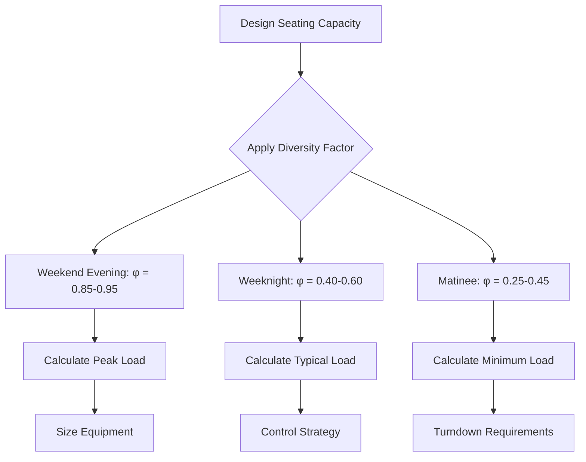
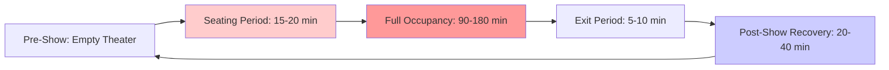

## Seating Density and Occupant Load Fundamentals

Seating density represents the critical design parameter for theater HVAC systems because occupant heat generation dominates the cooling load calculation. Modern movie theaters exhibit seating densities ranging from 0.3 to 0.5 persons per square foot, translating to 2 to 3.3 square feet per person depending on seating configuration and aisle spacing.

Each theater occupant generates approximately **400 Btu/hr sensible heat** and **300 Btu/hr latent heat** during sedentary activity, yielding a total heat gain of 700 Btu/hr per person. This metabolic heat generation creates the dominant thermal load in occupied theaters, far exceeding envelope loads and internal equipment gains.

The sensible heat ratio (SHR) for theater occupancy calculates to:

$$\text{SHR} = \frac{Q_{\text{sensible}}}{Q_{\text{sensible}} + Q_{\text{latent}}} = \frac{400}{400 + 300} = 0.57$$

This relatively low SHR of 0.57 indicates substantial moisture removal requirements, demanding dehumidification capacity beyond typical commercial applications. The high latent load results from respiratory moisture release in the confined theater environment.

## Occupant Load Calculation Methodology

Total sensible and latent loads scale linearly with actual occupancy. For a theater with design capacity $N_{\text{seats}}$ and occupancy factor $\phi$, the total occupant loads are:

$$Q_{\text{sensible,total}} = N_{\text{seats}} \times \phi \times 400 \text{ Btu/hr}$$

$$Q_{\text{latent,total}} = N_{\text{seats}} \times \phi \times 300 \text{ Btu/hr}$$

Stadium seating arrangements with wider row spacing (40-42 inches) reduce effective seating density compared to conventional configurations (36-38 inches) but provide improved air distribution pathways. The reduced density per floor area does not reduce the total theater capacity or peak occupant load.

## Ventilation Requirements and CFM Per Seat

ASHRAE Standard 62.1 establishes outdoor air requirements for theaters based on occupant density. The ventilation rate procedure specifies:

$$\dot{V}_{\text{OA}} = R_p \times P_z + R_a \times A_z$$

Where:
- $R_p$ = 5 CFM per person (breathing zone outdoor air rate)
- $P_z$ = design occupancy (persons)
- $R_a$ = 0.06 CFM per square foot (area component)
- $A_z$ = zone floor area (square feet)

For typical theater applications, the people component dominates. At full occupancy, minimum outdoor air equals **5 CFM per seated person** plus the negligible area component.

Total supply air requirements exceed outdoor air due to thermal load removal. For sensible cooling, the required airflow derives from:

$$\dot{V}_{\text{supply}} = \frac{Q_{\text{sensible}}}{1.08 \times \Delta T}$$

Assuming a 20°F supply-to-space temperature difference and 400 Btu/hr sensible load per person:

$$\dot{V}_{\text{per person}} = \frac{400}{1.08 \times 20} = 18.5 \text{ CFM per person}$$

Therefore, theater HVAC design typically provides **15-20 CFM per seat** for thermal control, well above the 5 CFM outdoor air minimum. Actual supply rates depend on supply air temperature and acceptable temperature differential.

| Seating Configuration | Density (sf/person) | Persons/1000 sf | CFM/Seat (Min OA) | CFM/Seat (Total Supply) |
|----------------------|---------------------|-----------------|-------------------|-------------------------|
| Conventional Rows    | 2.0-2.5             | 400-500         | 5                 | 15-18                   |
| Stadium Seating      | 2.5-3.3             | 300-400         | 5                 | 18-20                   |
| Premium/Luxury       | 3.5-5.0             | 200-285         | 5                 | 20-25                   |

## Diversity Factors and Peak Load Management

Theater attendance varies significantly by time, day, and season. Designing HVAC systems for 100% occupancy during all operating hours results in substantial oversizing and energy waste. Diversity factors account for realistic occupancy patterns.

Recommended diversity factors for theater HVAC design:

| Period | Typical Occupancy Factor (φ) | Design Consideration |
|--------|------------------------------|----------------------|
| Friday/Saturday Evening (Peak) | 0.85-0.95 | Equipment sizing basis |
| Weeknight Evening | 0.40-0.60 | Intermediate capacity |
| Afternoon Matinee | 0.25-0.45 | Minimum turndown |
| Summer Blockbuster (Peak Week) | 0.95-1.00 | Short-term overload capacity |

Equipment selection must balance peak capacity against typical operating conditions. A theater with 300 seats facing 100% design occupancy generates:

- Total sensible load: $300 \times 1.0 \times 400 = 120,000$ Btu/hr
- Total latent load: $300 \times 1.0 \times 300 = 90,000$ Btu/hr
- Total occupant load: 210,000 Btu/hr (17.5 tons)

However, applying a realistic diversity factor of 0.70 for sizing reduces the design load to:

- Design sensible load: $300 \times 0.70 \times 400 = 84,000$ Btu/hr
- Design latent load: $300 \times 0.70 \times 300 = 63,000$ Btu/hr
- Effective design load: 147,000 Btu/hr (12.3 tons)

This represents a 30% reduction in equipment capacity while maintaining adequate cooling for 99% of operating conditions.

## Load Profile and System Implications

The rapid occupancy swing from empty to full during the 15-20 minute seating period creates transient loading conditions. Systems must respond to:

1. **Rapid sensible load increase** as occupants enter (400 Btu/hr × number entering per minute)
2. **Delayed latent load development** as space moisture content rises over 20-30 minutes
3. **Asymmetric load recovery** after show conclusion (occupants leave rapidly, but elevated temperature and humidity persist)

Variable-capacity systems (VRF, modulating RTUs, chilled water with VFDs) effectively track this dynamic loading. Fixed-capacity equipment cycles excessively under partial loads, degrading humidity control and occupant comfort.

The combination of high latent loads, variable occupancy, and rapid load changes makes theater HVAC design distinctly challenging. Proper application of diversity factors, adequate dehumidification capacity, and responsive controls ensures acceptable performance across the full operating range while avoiding excessive equipment costs and energy consumption.
