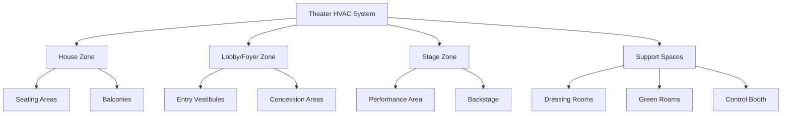

Theater and auditorium HVAC systems face unique engineering challenges driven by extreme occupancy variations, stringent acoustic requirements, and the need to maintain thermal comfort without disrupting performances. These facilities range from small community theaters to 3,000+ seat performing arts centers, each requiring precise environmental control strategies.

## Design Challenges

### Occupancy Load Variations

Theater spaces experience load swings unmatched by most building types. A 1,200-seat auditorium transitions from near-zero occupancy during setup to full capacity within 20 minutes. The sensible heat gain from occupants follows:

$$Q_s = N \times SHG \times CLF$$

Where $N$ represents occupant count, $SHG$ equals the sensible heat gain per person (typically 245 BTU/hr for seated adults in theaters), and $CLF$ is the cooling load factor accounting for thermal mass effects.

For a fully occupied 1,200-seat venue:

$$Q_s = 1200 \times 245 \times 0.85 = 250,000 \text{ BTU/hr}$$

This 21-ton sensible load appears rapidly, demanding aggressive cooling strategies during the first 30 minutes of occupancy.

### Acoustic Integration Requirements

ASHRAE Standard 62.1 mandates 15 CFM per person outdoor air for theaters, but delivery must occur within strict acoustic limits. ASHRAE Applications Handbook Chapter 5 specifies noise criteria (NC) curves for performance spaces:

| Space Type | NC Rating | Max Air Velocity (fpm) |
|------------|-----------|------------------------|
| Concert Hall | NC 20-25 | 300-400 |
| Drama Theater | NC 25-30 | 400-500 |
| Multi-Use Auditorium | NC 30-35 | 500-600 |
| Lobbies | NC 35-40 | 600-700 |

Air velocity limits arise from the relationship between duct velocity and sound power generation:

$$PWL = 10 \log_{10}(V^6) + C$$

Where $PWL$ represents sound power level, $V$ is air velocity, and $C$ includes duct geometry factors. This sixth-power relationship demands oversized ductwork and reduced velocities.

## System Design Strategies

### Zoning Requirements

Effective theater HVAC separates spaces into distinct thermal zones:

Each zone operates under different schedules and load profiles. The house requires maximum capacity only during performances, while lobbies peak 30 minutes before curtain and during intermissions.

### Quick Pulldown Methodology

Pre-cooling strategies reduce air temperature 8-12°F below setpoint before occupancy. The required cooling capacity follows:

$$Q_{total} = Q_{sensible} + Q_{latent} + Q_{pulldown}$$

The pulldown component accounts for structural thermal mass:

$$Q_{pulldown} = \frac{m \times c_p \times \Delta T}{t}$$

Where $m$ represents the effective mass (air plus lightweight furnishings), $c_p$ is specific heat, $\Delta T$ is temperature reduction, and $t$ is pulldown time.

For a 100,000 cubic foot auditorium with 2-hour pre-cool:

$$Q_{pulldown} = \frac{(100,000 \times 0.075 \times 0.24 \times 10)}{2} = 9,000 \text{ BTU/hr}$$

This 0.75-ton load supplements the design cooling capacity during unoccupied periods.

### Air Distribution Approaches

Theater air distribution prioritizes low-velocity, high-volume delivery:

**Underfloor Displacement Ventilation**
- Supply air at 63-65°F through floor grilles at 50-100 fpm
- Natural convection lifts warm air to ceiling return
- Reduces mixing energy and noise generation
- Requires 18-24 inch raised floor

**Overhead Laminar Flow**
- Large ceiling diffusers with extensive throw
- Supply temperatures 10-15°F below space temperature
- Requires 16-20 foot ceiling heights
- Common in renovation projects

**Side-Wall Low-Velocity Distribution**
- Linear slot diffusers along side walls
- Horizontal throw across seating areas
- Velocity decay follows: $V_x = V_0 \times \sqrt{A_0/A_x}$
- Effective for spaces under 60 feet wide

## Lobby-House Separation

Physical and thermal separation between lobbies and auditoriums prevents disruption during performances:

**Pressure Relationships**
Maintain the house at slight positive pressure (0.02-0.03 inches w.c.) relative to lobbies. This pressure differential blocks noise transmission through doorways and prevents unconditioned air infiltration.

The airflow through door gaps follows:

$$Q = C \times A \times \sqrt{\Delta P}$$

Where $C$ is the flow coefficient (typically 0.65), $A$ represents gap area, and $\Delta P$ is pressure differential.

**Thermal Isolation**
Operate lobby and house zones on independent systems with separate temperature controls. Lobbies tolerate wider temperature ranges (68-78°F) while the house maintains tight control (72-74°F).

## Multi-Use Facility Considerations

Multi-use auditoriums hosting concerts, theater, lectures, and sporting events require flexible HVAC configurations:

| Event Type | Ventilation (CFM/person) | Cooling Load | Humidity Control |
|------------|--------------------------|--------------|------------------|
| Concert | 15-20 | High (lighting + occupants) | Standard |
| Theater/Drama | 15 | Medium | Standard |
| Lecture | 15-20 | Low | Standard |
| Sports | 20-25 | Very High | Enhanced (humidity removal) |

Variable air volume (VAV) systems with wide turndown ratios (10:1) accommodate these variations. Direct digital control (DDC) sequences adjust airflow based on occupancy sensors and event scheduling.

## Load Calculation Refinements

Standard cooling load calculations underestimate theater requirements. Apply these adjustment factors:

- **Occupant Diversity**: Use 1.0 (assume full occupancy)
- **Lighting Load**: Include stage lighting at 3-5 watts/sq ft for house area
- **Infiltration**: Double standard values during door openings
- **Safety Factor**: Add 15-20% to final calculated capacity

The total cooling load equation becomes:

$$Q_{total} = (Q_{occupants} + Q_{lights} + Q_{envelope} + Q_{infiltration}) \times 1.15$$

This conservative approach ensures adequate capacity during worst-case performance conditions with full occupancy and maximum stage lighting.

## Control Sequences

Effective theater HVAC control requires event-based scheduling:

**Pre-Event Sequence (T-120 to T-30 minutes)**
- Ramp systems to 100% outdoor air for flush-out
- Reduce space temperature 8-10°F below setpoint
- Verify all zones operational

**Performance Mode (T-30 to T+0)**
- Transition to minimum outdoor air (ASHRAE 62.1 compliance)
- Restore temperature setpoint
- Reduce system noise to NC limits

**Intermission (Scheduled)**
- Increase outdoor air to 50% of maximum
- Boost cooling capacity by 20%
- Maintain performance mode acoustics

This sequencing optimizes comfort while respecting acoustic constraints during live performances.
