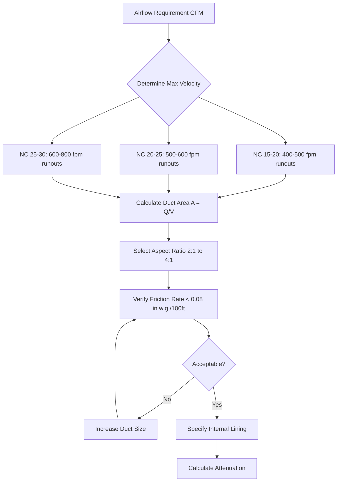
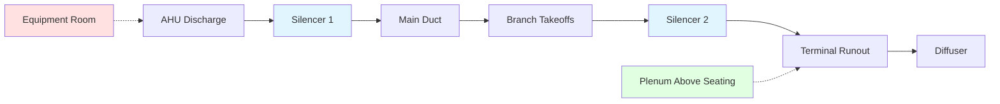
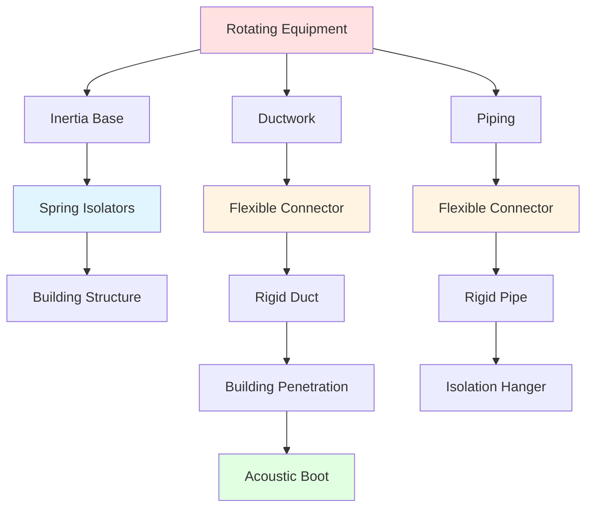

## Acoustics Coordination

Successful HVAC design for theaters and auditoriums requires achieving background noise levels of NC 15-25 while maintaining adequate ventilation and thermal comfort. This demands rigorous coordination between mechanical and acoustical consultants, addressing sound generation, transmission, and vibration throughout the air distribution system.

## Noise Criteria for Performance Spaces

Theater HVAC systems must meet stringent noise criteria that vary by venue type and use.

### Target NC Levels by Space Type

| Venue Type | NC Target | Maximum SPL at 1000 Hz (dB) | Application Notes |
|------------|-----------|------------------------------|-------------------|
| Concert halls | NC 15-20 | 30-35 | Critical for unamplified music |
| Legitimate theaters | NC 20-25 | 35-40 | Dialog intelligibility priority |
| Multipurpose auditoriums | NC 25-30 | 40-45 | Flexible performance use |
| Cinema | NC 30-35 | 45-50 | Film soundtrack masking |

NC (Noise Criteria) curves define the maximum permissible sound pressure level across octave bands from 63 Hz to 8000 Hz. The curve number corresponds approximately to the SPL at mid-frequencies (1000-2000 Hz).

### Physical Basis of NC Criteria

Sound power generated by HVAC equipment converts to sound pressure in occupied spaces according to:

$$L_p = L_w + 10\log_{10}\left(\frac{Q}{4\pi r^2} + \frac{4}{R}\right)$$

where:
- $L_p$ = sound pressure level at receiver (dB)
- $L_w$ = sound power level of source (dB)
- $Q$ = directivity factor (dimensionless)
- $r$ = distance from source (ft)
- $R$ = room constant = $\frac{S\alpha}{1-\alpha}$ (ft²)
- $S$ = total surface area (ft²)
- $\alpha$ = average absorption coefficient

This relationship reveals that achieving low NC levels requires both reducing source sound power and controlling room acoustics.

## Low-Velocity Air Distribution

High air velocities generate turbulent noise in ductwork and terminal devices. Maintaining low velocities throughout the distribution system forms the foundation of quiet HVAC design.

### Velocity Limits for Acoustic Design

| System Component | Maximum Velocity (fpm) | Basis for Limit |
|------------------|------------------------|-----------------|
| Main supply ducts | 1200-1500 | Turbulent noise generation |
| Branch ducts | 800-1000 | Regenerated noise control |
| Final runouts to diffusers | 400-500 | Terminal device noise |
| Return air ducts (above ceiling) | 1000-1200 | Reduced concern vs. supply |
| Return air ducts (in occupied space) | 600-800 | Direct exposure to space |

The sound power generated by turbulent airflow in straight duct sections increases with velocity according to:

$$L_w = K + 60\log_{10}(V) + 10\log_{10}(A)$$

where:
- $K$ = empirical constant (≈ -35 for lined ducts, -25 for unlined)
- $V$ = air velocity (fpm)
- $A$ = duct cross-sectional area (ft²)

This 60 dB per decade relationship demonstrates that halving velocity reduces sound power by 18 dB, illustrating the critical importance of low-velocity design.

### Duct Sizing for Acoustic Performance

Size ducts using friction rates of 0.05-0.08 in. w.g. per 100 ft rather than the 0.1-0.15 in. w.g. typical for commercial systems. This results in larger, quieter ductwork with lower operating costs.

## Duct Silencer Selection and Placement

Duct silencers provide frequency-dependent sound attenuation through absorption and reactive mechanisms.

### Silencer Types and Performance

**Absorptive Silencers** use fiberglass or mineral wool within perforated metal baffles. Sound energy dissipates as viscous and thermal losses when acoustic particle velocity interacts with porous material.

**Reactive Silencers** employ quarter-wave resonators or expansion chambers to reflect sound energy back toward the source through impedance discontinuities.

### Insertion Loss Requirements

Calculate required insertion loss by comparing predicted system sound power to target NC curve:

$$IL_{required} = L_{w,system} - L_p{target} - TL_{path}$$

where:
- $IL_{required}$ = insertion loss needed (dB per octave band)
- $L_{w,system}$ = system sound power (dB)
- $L_{p,target}$ = target sound pressure from NC curve (dB)
- $TL_{path}$ = transmission loss of duct path and room effect (dB)

### Silencer Placement Strategy

Place primary silencers immediately after air-handling equipment to attenuate fan noise. Position secondary silencers near terminal devices to control regenerated noise from fittings and dampers.

### Critical Design Parameters

**Pressure Drop:** Limit silencer pressure drop to 0.25-0.50 in. w.g. to maintain low fan energy.

**Face Velocity:** Keep silencer face velocity below 1000 fpm to prevent self-generated noise.

**Length:** Longer silencers provide greater attenuation but face diminishing returns due to internal losses.

## Vibration Isolation Systems

Vibration from rotating equipment transmits through structural connections, radiating as audible noise from building surfaces.

### Isolation Efficiency

The transmissibility of vibration through isolators follows:

$$T = \frac{1}{\sqrt{(1-r^2)^2 + (2\zeta r)^2}}$$

where:
- $T$ = transmissibility (ratio of transmitted to applied force)
- $r$ = frequency ratio = $\frac{f}{f_n}$
- $f$ = operating frequency (Hz)
- $f_n$ = natural frequency of isolated system (Hz)
- $\zeta$ = damping ratio

Effective isolation requires $r > \sqrt{2}$, typically achieved by selecting isolators with natural frequency $f_n < 0.35f_{operating}$.

### Isolation System Components

| Component | Function | Specification Basis |
|-----------|----------|---------------------|
| Spring isolators | Primary vibration isolation | Static deflection 2-3 inches |
| Neoprene pads | High-frequency attenuation | Shore hardness 40-50 durometer |
| Inertia bases | Mass decoupling | 1.5-2.5× equipment weight |
| Flexible connectors | Duct/pipe isolation | 12-18 inch length minimum |
| Seismic restraints | Code compliance | ASCE 7 seismic design |

### Avoiding Structure-Borne Transmission

Provide continuous isolation from equipment to structure, including flexible duct/pipe connections, isolated hangers, and acoustic seals at penetrations.

## Quiet Diffuser Selection

Diffuser-generated noise dominates the acoustic environment when proper duct design reduces system noise to low levels.

### Diffuser Noise Mechanisms

Turbulent mixing between supply air jets and room air generates broadband noise. Sound power increases rapidly with discharge velocity:

$$L_w = K_d + 50\log_{10}(Q) + 10\log_{10}(P)$$

where:
- $K_d$ = diffuser-specific constant
- $Q$ = airflow (cfm)
- $P$ = total pressure at diffuser (in. w.g.)

### Performance Specifications

Select diffusers with manufacturer-certified NC ratings at actual operating conditions. Request test data per AHRI Standard 880 or ASHRAE Standard 70.

**Critical selection parameters:**
- Maximum NC rating 5-10 points below target (NC 10-15 for NC 20 space)
- Discharge velocity < 300 fpm for perforated diffusers
- Throw velocity < 50 fpm at occupied zone
- Total pressure < 0.05 in. w.g. at diffuser inlet

### Diffuser Types for Critical Acoustics

| Diffuser Type | Typical NC Range | Advantages | Limitations |
|---------------|------------------|------------|-------------|
| Perforated face | NC 10-20 | Lowest noise generation | High cost, large size |
| Linear slot | NC 15-25 | Architectural integration | Directional control limited |
| Displacement | NC 20-30 | Very low velocity | Requires stratification |
| Radial | NC 25-35 | Horizontal throw | Higher velocities required |

## Preventing Acoustic Cross-Talk

Sound transmission between spaces through shared ductwork undermines acoustic separation.

### Cross-Talk Transmission Loss

The attenuation between adjacent spaces connected by ductwork depends on duct length, lining, and geometry:

$$TL_{duct} = \alpha L + TL_{elbow} + TL_{terminal}$$

where:
- $TL_{duct}$ = total transmission loss (dB)
- $\alpha$ = attenuation per unit length (dB/ft)
- $L$ = duct length between spaces (ft)
- $TL_{elbow}$ = loss at elbows (3-8 dB each)
- $TL_{terminal}$ = end reflection loss (0-10 dB)

### Design Strategies

**Minimum Separation:** Maintain 40-50 ft of lined ductwork between critical spaces.

**Acoustic Baffles:** Install sound baffles in ducts serving adjacent quiet spaces to increase TL by 10-20 dB.

**Separate Systems:** Dedicate air handlers to individual performance spaces to eliminate cross-talk paths entirely.

**Avoid Common Plenums:** Never use shared ceiling plenums for return air from acoustically sensitive and noisy spaces.

## Coordination with Acoustic Consultants

Establish acoustic design requirements early in the design process through collaboration with qualified acoustic consultants.

### Design Phase Deliverables

**Schematic Design:**
- NC targets for each space type
- Preliminary equipment selection with sound power data
- Conceptual isolation and silencer strategies

**Design Development:**
- Complete sound power budget
- Duct layout review for acoustic compliance
- Silencer specifications and locations
- Vibration isolation details

**Construction Documents:**
- Final NC calculations
- Equipment submittals with certified sound data
- Commissioning and testing procedures

### Commissioning Verification

Verify acoustic performance through field measurements:
- Octave band sound pressure levels per ASTM E1574
- NC calculation from measured data
- Documentation of compliance with design criteria
- Identification and correction of deficiencies

Successful theater HVAC acoustics demand integration of low-velocity distribution, strategic attenuation, comprehensive vibration isolation, and careful terminal device selection. Meeting NC 15-25 targets requires physics-based analysis and coordination throughout design and construction.
