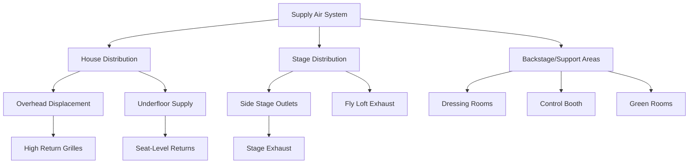

## Thermal Load Characteristics

Theater HVAC systems face unique thermal challenges driven by extreme occupancy density, variable lighting loads, and the need for acoustic compatibility. Peak sensible loads typically reach 450-600 BTU/hr per person during performances, combining metabolic heat generation (400 BTU/hr per seated adult), radiant heat from stage lighting (500-2000 W per fixture), and envelope loads.

The total cooling load follows this relationship:

$$Q_{total} = Q_{occupants} + Q_{lighting} + Q_{equipment} + Q_{envelope} + Q_{infiltration}$$

For a 500-seat theater, occupant load dominates:

$$Q_{occupants} = N \times (SHG + LHG) = 500 \times (250 + 200) = 225{,}000 \text{ BTU/hr}$$

where $SHG$ represents sensible heat gain and $LHG$ represents latent heat gain per person under seated, moderate activity conditions.

## Temperature and Humidity Control

ASHRAE Standard 55 recommends operative temperatures between 68-72°F for theatrical spaces, with relative humidity maintained at 40-50% to ensure audience comfort during extended performances lasting 2-3 hours. The narrow temperature band prevents thermal drift complaints while accommodating the 15-20°F temperature stratification common in high-ceiling auditoriums.

Humidity control becomes critical for two reasons: first, latent loads from respiration ($m_v = 0.2$ lb/hr per person) rapidly increase space moisture content in tightly sealed modern theaters; second, relative humidity below 35% increases static electricity and respiratory discomfort, while levels above 55% promote mold growth in fabric seating and acoustic panels.

The sensible heat ratio (SHR) for theaters typically ranges from 0.65-0.75:

$$SHR = \frac{Q_{sensible}}{Q_{sensible} + Q_{latent}}$$

This relatively low SHR requires cooling coils with sufficient latent capacity, often necessitating lower supply air temperatures (52-54°F) than standard comfort cooling applications.

## Air Distribution Strategies

The fundamental challenge in theater air distribution lies in delivering high ventilation rates (7.5-15 CFM per person per ASHRAE 62.1) while maintaining NC-25 to NC-30 acoustic criteria. This requires supply air velocities below 500 FPM at diffuser face and duct velocities under 1200 FPM in the final 20 feet before terminal devices.

### House vs Stage Conditioning

The auditorium house and stage space require independent HVAC systems due to incompatible requirements:

| Parameter | House (Audience) | Stage | Backstage |
|-----------|------------------|-------|-----------|
| Supply Temperature | 55-58°F | 60-65°F | 55-58°F |
| Air Changes per Hour | 6-8 | 15-20 | 8-12 |
| Acoustic Criteria | NC-25 | NC-35 | NC-30 |
| Pressure Relationship | Negative | Neutral | Positive |
| Humidity Tolerance | 40-50% RH | 35-55% RH | 40-50% RH |

Stage areas experience extreme thermal loads from theatrical lighting (150-300 W/ft² during performances) combined with radiant heat from performers under high-intensity fixtures. The elevated air change rate serves three purposes: diluting heat at the source, preventing thermal plume migration into the house, and exhausting combustion products from pyrotechnic effects.

Pressure relationships prevent stage odors, dust, and smoke effects from entering the audience space. Maintaining the house at -0.02 to -0.03 inches w.c. relative to stage creates an air curtain effect across the proscenium opening.

## Intermission Peak Load Management

Intermissions create the most severe instantaneous loads in theater operation. When 500-800 patrons stand, move to lobbies, and occupy previously vacant spaces, the effective metabolic rate increases from 400 BTU/hr (seated) to 550 BTU/hr (standing, slow walking).

The diversity factor calculation becomes critical:

$$DF = \frac{\text{Actual Peak Load}}{\text{Sum of Individual Peak Loads}}$$

For theaters, the lobby intermission diversity factor typically ranges from 0.6-0.75, as only 60-75% of the audience uses lobby spaces simultaneously. However, the house cooling load during intermission drops by only 20-30% since residual heat stored in seating, carpeting, and interior mass continues to transfer to the space.

The system must pre-cool the space 60-90 minutes before performance to establish thermal storage in building mass. This pre-conditioning period typically operates at 100-110% design airflow with supply temperatures 2-3°F below performance setpoint, removing sensible heat from concrete floors, wall surfaces, and seating materials.

## Backstage and Support Areas

Dressing rooms, green rooms, and control booths require dedicated systems with independent controls. Performers in heavy costumes or makeup under hot lights need supply temperatures 5-8°F lower than standard comfort conditions, often requiring 60-62°F space temperatures.

Control booth cooling presents unique challenges: electronic equipment generates 30-50 BTU/hr per square foot continuously, requiring year-round cooling even during winter performances. The 24/7 equipment operation necessitates redundant cooling with automatic failover to prevent sound/lighting system shutdowns.

Makeup rooms require additional outside air (25 CFM per person minimum) to dilute volatile organic compounds from cosmetics, hair sprays, and adhesives. Local exhaust at makeup stations operating at 75-100 CFM captures these contaminants before dispersing into corridors.

## Ventilation Requirements and Acoustic Integration

ASHRAE Standard 62.1 specifies 7.5 CFM per person minimum for theaters, but acoustic considerations often drive total airflow higher to achieve adequate cooling at elevated supply temperatures necessary for low-velocity distribution.

The acoustic velocity limit manifests in required duct area:

$$A_{duct} = \frac{Q}{V_{max}} = \frac{\text{CFM}}{V_{max} \text{ (FPM)}}$$

For a 10,000 CFM system limited to 1000 FPM: $A_{duct} = 10$ ft², requiring multiple parallel paths or oversized single ducts that increase spatial and cost requirements substantially.

Sound attenuation in theater HVAC systems typically requires 4-6 feet of lined ductwork before each terminal device, acoustic boots at diffuser connections, and vibration isolation for all rotating equipment. Fan discharge sound power levels must not exceed 75 dB in octave bands critical for speech intelligibility (500-2000 Hz).

## Implementation Considerations

Critical design elements for successful theater HVAC systems include:

- **Zoning Strategy**: Separate systems for house, stage, backstage, and lobbies with independent temperature control
- **Pre-Show Purge Cycles**: 90-minute pre-cooling and ventilation purge before scheduled performance start
- **Load Shedding**: Automatic lighting and non-critical equipment load reduction during peak cooling periods
- **Demand Control Ventilation**: CO₂-based modulation of outside air (750-1000 ppm setpoint) to reduce energy during partial occupancy
- **Heat Recovery**: Sensible or enthalpy wheels recovering 50-70% of exhaust energy during heating season
- **Redundancy**: N+1 or 2N equipment configuration for mission-critical cooling and ventilation systems

The interaction between architectural acoustics and HVAC distribution demands early coordination. Acoustic consultants must review duct routing, diffuser selection, and equipment locations during design development to prevent conflicts that compromise either thermal comfort or acoustic performance.