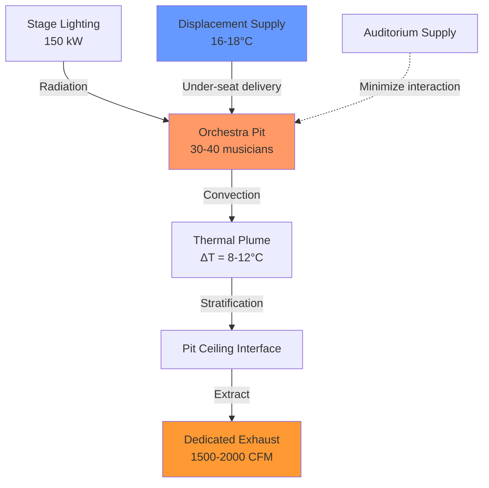

Legitimate theaters housing live performances present unique HVAC challenges demanding simultaneous acoustic transparency, rapid thermal response, and precise environmental control across multiple interconnected zones. Unlike motion picture theaters with consistent sensible loads, Broadway-style venues experience dramatic load fluctuations from stage lighting (50-200 kW), performer metabolic output, and audience density variations during intermissions. The engineering solution requires understanding thermal stratification dynamics, acoustic attenuation principles, and the psychrometric requirements of materials ranging from period costumes to musical instruments.

## Proscenium Theater Load Characteristics

The traditional proscenium configuration creates distinct thermal zones with vastly different requirements:

| Zone | Sensible Load (W/m²) | Latent Load Ratio | ACH | Critical Parameter |
|------|---------------------|-------------------|-----|-------------------|
| Auditorium | 80-120 | 0.30-0.40 | 6-8 | NC-25 maximum |
| Stage | 400-800 | 0.15-0.25 | 15-20 | Smoke clearance |
| Orchestra Pit | 200-300 | 0.35-0.45 | 12-18 | CO₂ < 1000 ppm |
| Fly Loft | 150-250 | 0.10-0.15 | 8-12 | Temperature gradient |
| Dressing Rooms | 60-80 | 0.40-0.50 | 8-10 | Humidity control |

Stage lighting generates radiant heat flux following the Stefan-Boltzmann relationship, with tungsten halogen instruments at 3200K emitting:

$$q_{rad} = \varepsilon \sigma A (T_s^4 - T_{\infty}^4)$$

Where typical 1000W Fresnel fixtures produce approximately 850W as thermal radiation. For a modest Broadway production with 150kW connected lighting load at 70% dimmer level, the instantaneous sensible gain reaches:

$$Q_s = 150 \times 0.70 \times 0.85 = 89 \text{ kW}$$

This heat addition occurs predominantly above the stage plane, creating powerful buoyancy-driven stratification.

## Orchestra Pit Ventilation Strategy

The orchestra pit represents the most thermally hostile microenvironment in the theater. Musicians generate 115-150W sensible and 50-75W latent heat while packed at densities reaching 0.5 m²/person, surrounded by heat-radiating stage lighting above. The confined geometry (typically 1.2-1.8m depth) prevents natural convection, creating a thermal trap.

Effective pit conditioning requires:

**1. Under-seat displacement ventilation** delivering 15-20 L/s per musician at 16-18°C, exploiting thermal plumes rising from performers:

$$\Delta T_{supply} = \frac{q_{sensible}}{\dot{m} c_p} = \frac{150}{(0.018)(1.20)(1005)} = 6.9°C$$

**2. Dedicated exhaust** at the pit ceiling interface capturing stratified heat layer before it migrates to the auditorium.

**3. Carbon dioxide dilution** maintaining concentration below 1000 ppm per ASHRAE 62.1:

$$\dot{V}_{OA} = \frac{G_{CO_2}}{C_{exhaust} - C_{supply}} = \frac{0.005 \times 30}{1000 - 400} = 0.00025 \text{ m}^3/\text{s per person}$$

This translates to minimum 9 L/s per musician for metabolic CO₂ generation, though thermal loads drive higher ventilation rates.

## Fly Loft Thermal Management

The fly loft extending 20-30m above the stage floor creates a massive vertical cavity prone to extreme thermal stratification. During performances, heated air from stage lighting rises at velocities determined by:

$$v = \sqrt{2g \beta \Delta T H}$$

For a temperature differential of 15°C over a 25m height, buoyancy-driven flow reaches 6.8 m/s, creating a hot air reservoir at the grid level potentially exceeding 45°C. This thermal mass radiates downward to the stage, exacerbating performer discomfort.

**Destratification approach:**

- **High-induction mixing** using ceiling-mounted units with throw ratios >4:1 to entrain and circulate the stratified layer
- **Relief exhaust** at the grid level (30-35m elevation) removing the hottest air directly
- **Makeup air introduction** at mid-height (12-15m) preventing downdrafts to the stage

The key relationship balances exhaust volumetric flow with thermal buoyancy:

$$\dot{Q}_{removed} = \rho \dot{V} c_p (T_{exhaust} - T_{ambient})$$

## Scene Shop and Technical Space Ventilation

Scene construction and painting operations generate particulate, VOCs from adhesives and paints, and welding fumes requiring dedicated exhaust. ASHRAE 62.1 mandates 0.75 L/s·m² for woodworking spaces, though thermal loads from machinery and personnel typically drive higher rates.

**Recommended approach:**

| Activity | Exhaust Rate | Filtration | Special Requirement |
|----------|--------------|------------|---------------------|
| General woodworking | 1.0 L/s·m² | 45% MERV 8 | Dust collection at source |
| Spray painting | 15 ACH minimum | 95% MERV 14 | Explosion-proof fans |
| Welding | Local capture + 1.5 L/s·m² | N/A | Fume extraction arms |
| Assembly/rehearsal | 0.75 L/s·m² | 35% MERV 7 | Pressurization to prevent migration |

Maintain scene shop at negative pressure relative to backstage areas to prevent migration of contaminants to performance spaces.

## Costume Storage Humidity Control

Period costumes constructed from natural fibers (wool, silk, cotton) and historical materials require strict humidity control to prevent degradation. The equilibrium moisture content (EMC) of textiles follows:

$$EMC = \left(\frac{1800}{W} \times \frac{KH}{1-KH}\right) + \left(\frac{K_1 KH + 2K_1 K_2 K^2 H^2}{1+K_1 KH + K_1 K_2 K^2 H^2}\right)$$

Practically, maintain costume storage at:

- **Temperature:** 18-20°C (reduces metabolic activity of insects and mold)
- **Relative humidity:** 45-55% (prevents both desiccation and mold growth)
- **Filtration:** MERV 11 minimum (removes particulates and spores)

Use dedicated dehumidification with desiccant wheels or hot gas reheat to maintain dewpoint independent of sensible cooling requirements. For a 200 m² costume storage area with typical construction moisture transmission:

$$\dot{m}_{moisture} = A \times \mu \times \Delta w = 200 \times 0.15 \times (0.012-0.008) = 0.12 \text{ kg/hr}$$

## Acoustic Integration

HVAC system noise transmission to the auditorium represents the primary design constraint. ASHRAE Applications Chapter 48 recommends NC-25 to NC-30 for legitimate theaters. Achieving this requires:

**Duct velocity limitations:**
- Main ducts: 4-6 m/s maximum
- Branch ducts: 3-4 m/s maximum
- Terminal devices: 2-3 m/s maximum

**Attenuation strategy:**

Total sound power attenuation from fan discharge to occupied space must exceed 40-50 dB to achieve design NC levels from typical centrifugal fan installations.

## System Control Philosophy

Legitimate theater HVAC demands rapid response to load changes and performance schedules:

**Pre-performance:** Full capacity pulldown beginning 2-3 hours before curtain, bringing auditorium to 22-23°C

**Performance:** Reduced supply during quiet scenes to minimize noise intrusion, with strategic ventilation bursts during applause

**Intermission:** Maximum capacity for rapid heat removal and CO₂ dilution from dense occupancy

**Post-performance:** Extended operation for 1-2 hours to process thermal mass and prepare for next performance

Implement zone-level DDC with occupancy scheduling, CO₂ demand control, and integration with theatrical lighting control systems for load anticipation.

## Components

- Proscenium Theater Hvac
- Thrust Stage Ventilation
- Arena Theater Air Distribution
- Black Box Theater Systems
- Seating Capacity 100 To 2000
- Stage Area Conditioning
- Backstage Area Hvac
- Dressing Room Ventilation
- Orchestra Pit Hvac
- Balcony Air Distribution
