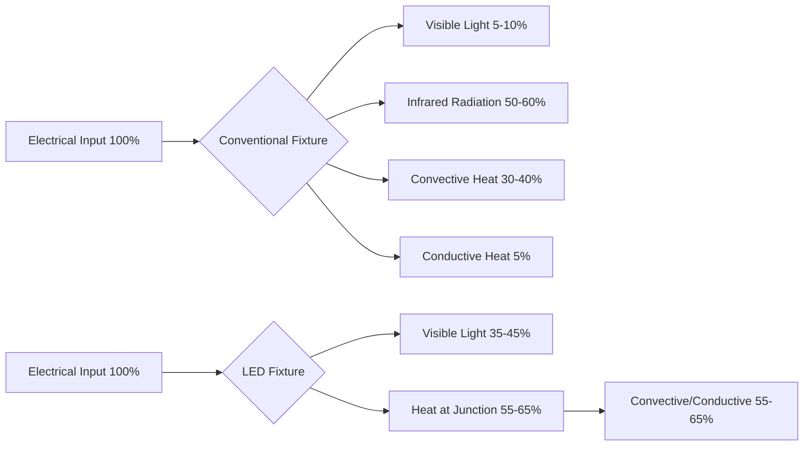
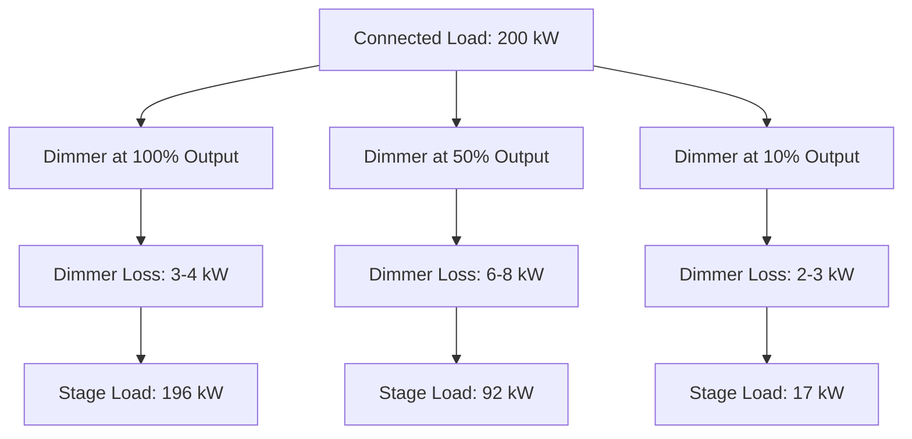
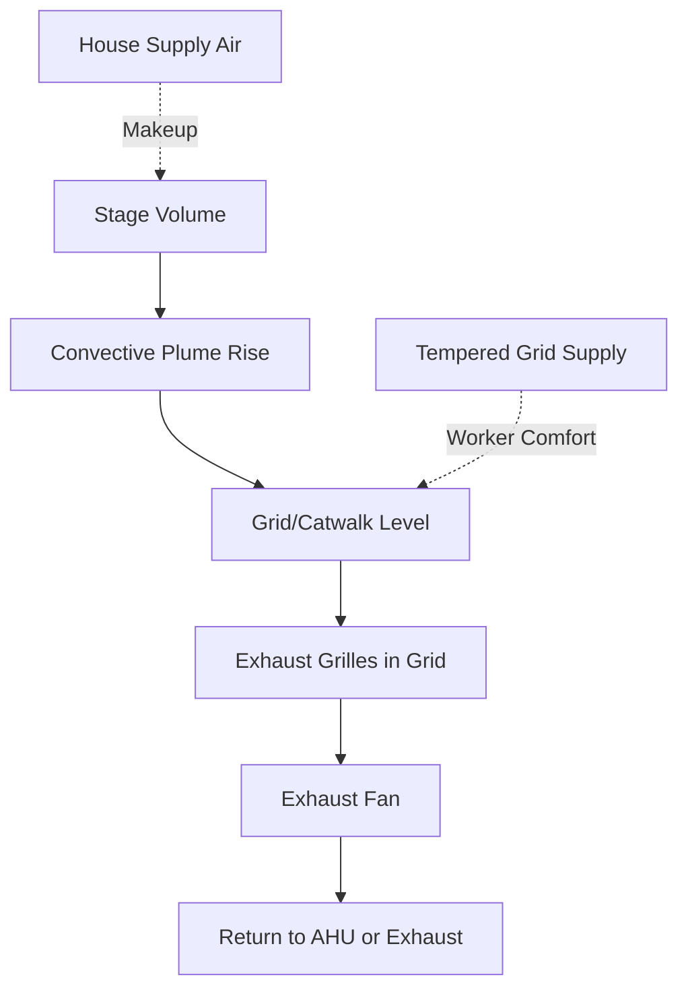

## Fundamental Heat Load Characteristics

Stage lighting represents one of the most significant and variable heat sources in theatrical spaces. Traditional incandescent and tungsten-halogen fixtures convert 90-95% of electrical input into thermal energy, with only 5-10% producing visible light. This inefficiency creates substantial cooling challenges that require careful engineering analysis.

The instantaneous heat gain from lighting follows the fundamental relationship:

$$Q_{lighting} = \sum_{i=1}^{n} P_i \times F_{use} \times F_{allow}$$

Where $Q_{lighting}$ is the total heat gain (W), $P_i$ is the connected load per fixture (W), $F_{use}$ is the usage factor (0-1), and $F_{allow}$ is the ballast/auxiliary allowance factor.

### Typical Fixture Power Densities

Theatrical lighting installations exhibit wide-ranging power densities depending on production requirements:

| Venue Type | Power Density | Connected Load | Design Load |
|------------|---------------|----------------|-------------|
| Small Theater | 1.0-1.5 W/ft² | 40-60 kW | 60-80% |
| Regional Theater | 2.0-3.0 W/ft² | 100-150 kW | 70-90% |
| Major Production | 3.0-5.0 W/ft² | 200-400 kW | 80-100% |

The design load percentage reflects the simultaneous usage factor during maximum production intensity.

## Conventional vs LED Lighting Thermal Performance

The transition from conventional tungsten-halogen to LED fixtures fundamentally alters the thermal load profile and heat rejection characteristics.

### Energy Conversion Comparison

### Fixture-Level Thermal Analysis

For a typical conventional Ellipsoidal Reflector Spotlight (ERS):

$$Q_{total} = P_{lamp} + P_{ballast} = 750\,\text{W} + 50\,\text{W} = 800\,\text{W}$$

The radiant component directly affects performer comfort:

$$Q_{radiant} = 0.55 \times 800 = 440\,\text{W}$$

An equivalent LED fixture producing similar luminous output:

$$Q_{total,LED} = P_{LED} + P_{driver} = 200\,\text{W} + 20\,\text{W} = 220\,\text{W}$$

This represents a 72.5% reduction in heat generation per instrument.

| Parameter | Conventional 750W | LED 200W | Reduction |
|-----------|-------------------|----------|-----------|
| Total Heat | 800 W | 220 W | 72.5% |
| Radiant Heat | 440 W | 22 W | 95% |
| Convective Heat | 280 W | 178 W | 36% |
| Space Load Impact | 800 W | 220 W | 72.5% |

## Dimming System Thermal Effects

Dimmer operation introduces complex thermal behavior that contradicts common assumptions. Silicon Controlled Rectifier (SCR) dimmers dissipate maximum heat when operating at intermediate levels (40-60% output) due to increased phase-angle switching losses.

The dimmer heat dissipation follows:

$$P_{dimmer} = I_{RMS}^2 \times R_{on} + V_{forward} \times I_{avg}$$

Where $R_{on}$ is the SCR on-state resistance and $V_{forward}$ is the forward voltage drop.

### Dimmer Room Load Profile

ASHRAE Handbook - HVAC Applications recommends designing dimmer room cooling for 5-7% of connected load as heat dissipation, occurring in a concentrated equipment room requiring dedicated ventilation.

## Lighting Grid Ventilation Requirements

The lighting grid or catwalk area experiences extreme thermal stratification, with temperatures 15-25°F above occupied space levels due to rising convective plumes and radiant absorption by structural elements.

### Stratification Analysis

The temperature rise above ambient follows buoyancy-driven flow:

$$\Delta T_{stratification} = \frac{Q_{convective}}{(\rho \times c_p \times V_{exhaust})}$$

For a 150 kW lighting load with 60% convective fraction:

$$\Delta T = \frac{90,000\,\text{W}}{(1.2\,\text{kg/m}^3 \times 1005\,\text{J/kg·K} \times 3.5\,\text{m}^3\text{/s})} = 21.3\,\text{°F}$$

### Grid Ventilation Strategy

Design ventilation rates for lighting grids:

| Lighting Density | Ventilation Rate | Air Changes per Hour |
|------------------|------------------|----------------------|
| < 2 W/ft² | 1.5-2.0 cfm/W | 15-25 ACH |
| 2-4 W/ft² | 2.0-2.5 cfm/W | 25-35 ACH |
| > 4 W/ft² | 2.5-3.0 cfm/W | 35-50 ACH |

## Radiant Heat Effects on Performers

The radiant intensity at performer level depends on fixture distance, beam angle, and intensity. The radiant heat flux follows the inverse square law:

$$E = \frac{I_{radiant}}{d^2} \times \cos(\theta)$$

Where $E$ is irradiance (W/m²), $I_{radiant}$ is radiant intensity, $d$ is distance, and $\theta$ is the angle from beam centerline.

A performer 20 feet from a 1000W conventional spotlight receives:

$$E = \frac{550\,\text{W}}{(6.1\,\text{m})^2} \times 1.0 = 14.8\,\text{W/m}^2$$

This exceeds comfortable radiant asymmetry limits (5 W/m²) specified in ASHRAE Standard 55, necessitating increased air velocity or reduced dry-bulb temperature in performance areas.

## Integration with HVAC Systems

The dynamic nature of theatrical lighting requires sophisticated control integration. ASHRAE Standard 189.1 and IECC 90.1 recognize theatrical lighting as process loads exempt from standard lighting power density limits, but cooling system design must accommodate:

1. **Peak Load Design** - Size equipment for maximum credible lighting scenarios (typically 80-90% of connected load)
2. **Turndown Capability** - Provide modulating capacity down to 20-30% for rehearsals and setup
3. **Rapid Response** - Design air distribution for 15-20 minute response to load changes
4. **Zoning Separation** - Isolate stage cooling from house to prevent overcooling audience during dark stage conditions

The total building cooling load adjustment for theatrical lighting:

$$Q_{cooling} = 3.412 \times P_{connected} \times F_{use} \times F_{CLF}$$

Where $F_{CLF}$ is the cooling load factor (0.75-0.95 for instantaneous lighting loads with no thermal mass effects in modern construction).

## Catwalk Environmental Conditions

Catwalk and grid areas require special consideration for maintenance personnel who access fixtures during technical work. While OSHA does not specify temperature limits for these spaces, practical limits of 95-100°F dry-bulb maintain worker safety and productivity.

The heat stress index in these elevated spaces accounts for metabolic work rate (moderate at 300-400 W), radiant exposure from fixtures (50-100 W/m²), and reduced air velocity (< 50 fpm). Spot cooling or personal cooling systems become necessary when ambient temperatures exceed 90°F combined with radiant loads.

---

**Related Topics:** [Theater Ventilation Systems](../../../../../specialty-applications-testing/specialty-hvac-applications/places-of-assembly/theaters-auditoriums/_index.md), [Dimmer Room Cooling](../../../../../specialty-applications-testing/specialty-hvac-applications/places-of-assembly/theaters-auditoriums/_index.md), Occupant Thermal Comfort