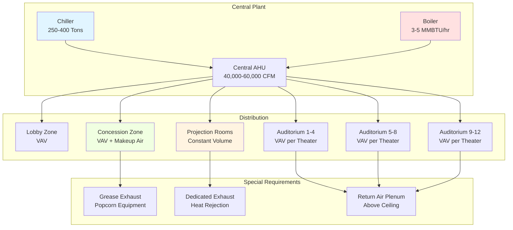

## Overview

Movie theater HVAC systems must accommodate extreme fluctuations in occupancy density, manage substantial equipment heat loads from digital projection systems, maintain acoustic performance, and provide zone-level control across multiple auditoriums. Modern multiplex facilities present unique challenges with simultaneous operation of 8-16 auditoriums, each requiring independent temperature and ventilation control while sharing central equipment.

The primary design challenge lies in the rapid occupancy swings between showings. A 300-seat auditorium transitions from empty to full capacity within 15 minutes, generating instantaneous latent and sensible heat loads that require responsive HVAC control.

## Occupancy and Ventilation Loads

Movie theater occupancy densities significantly exceed typical assembly spaces. Building codes mandate design for maximum occupancy:

$$
\text{Occupant Load} = \frac{\text{Seating Area (ft}^2\text{)}}{7 \, \text{ft}^2/\text{person}}
$$

For a 5,000 ft² auditorium:

$$
\text{Occupant Load} = \frac{5000}{7} \approx 714 \text{ persons}
$$

ASHRAE Standard 62.1 requires outdoor air ventilation rates of 5 cfm per person plus 0.06 cfm/ft² for theaters. Total ventilation requirement:

$$
Q_{oa} = (5 \times 714) + (0.06 \times 5000) = 3570 + 300 = 3870 \, \text{cfm}
$$

This substantial outdoor air requirement drives energy consumption and necessitates heat recovery strategies in most climates.

## Equipment Heat Gains

### Digital Projection Systems

Modern digital cinema projectors generate 1,500-3,500 W of heat, depending on lumens output and technology. High-brightness systems for large screens (40-60 ft) with 3D capability reach the upper range:

$$
Q_{projector} = 3.412 \times \text{Watts} = 3.412 \times 3000 = 10,236 \, \text{BTU/hr}
$$

Projection booth cooling requires dedicated systems with backup provisions, as projector overheating causes immediate show interruption. Booth temperatures must not exceed 95°F under any operating condition.

### Sound System Amplification

Amplifier racks generate 200-400 W per auditorium, contributing additional sensible heat to equipment rooms.

## Acoustic Considerations

HVAC system noise must not exceed NC-30 in auditoriums to avoid interference with film soundtracks. This requires:

- Low-velocity ductwork (maximum 1,200 fpm in occupied spaces)
- Sound attenuators at all zone connections
- Vibration isolation of all mechanical equipment
- Flexible duct connections to prevent structure-borne transmission
- Air terminal devices rated for NC-25 or better

Supply air registers should never be located near screen walls or ceiling speaker zones, as air noise combines destructively with directional audio systems.

## Multiplex HVAC Zoning

Each auditorium requires independent zone control due to staggered showtimes. A typical 12-screen multiplex operates with:

## HVAC Requirements by Auditorium Size

| Auditorium Capacity | Floor Area (ft²) | Cooling Load (Tons) | Heating Load (MBH) | Supply Airflow (CFM) | Outside Air (CFM) | Sound Criterion |
|---------------------|------------------|---------------------|-------------------|---------------------|-------------------|-----------------|
| 100-150 seats | 1,500-2,000 | 8-12 | 80-120 | 3,000-4,500 | 500-750 | NC-30 |
| 200-300 seats | 3,000-4,500 | 15-22 | 150-220 | 6,000-8,500 | 1,000-1,500 | NC-30 |
| 400-500 seats | 6,000-7,500 | 30-40 | 300-400 | 12,000-15,000 | 2,000-2,500 | NC-30 |
| 600+ seats (Premium) | 9,000+ | 50-70 | 500-700 | 18,000-25,000 | 3,000-4,000 | NC-25 |

*Note: Loads assume 100 Btu/hr sensible and 200 Btu/hr latent per person at peak occupancy, plus envelope and equipment gains.*

## Stadium Seating Implications

Modern stadium seating with elevated rear rows creates thermal stratification challenges. Supply air distribution strategies include:

1. **Underfloor displacement ventilation** from stepped risers (preferred for energy efficiency)
2. **High sidewall diffusers** with vertical throw patterns
3. **Ceiling-mounted variable air volume terminals** with directional discharge

The vertical temperature gradient must not exceed 3°F between head height at front and rear rows. This often requires dedicated supply zones for upper seating tiers.

## Concession and Lobby Areas

Concession areas generate substantial sensible and latent loads from popcorn poppers (5-8 kW each), nacho warmers, and beverage dispensers. Dedicated makeup air units provide 150-200% of exhaust airflow to maintain positive pressure relative to auditoriums, preventing odor migration into theaters.

Lobby areas serve as thermal buffer zones and accommodate queuing crowds. Design for 50% of total theater capacity simultaneously present during peak weekend showings.

## Controls and Demand-Based Operation

Modern theater HVAC employs occupancy-based control sequences:

- **Pre-occupancy purge**: 30-minute high-volume ventilation before showtime
- **Show mode**: Reduced airflow (60-70% of design) with CO₂-based demand control ventilation
- **Intermission boost**: Temporary airflow increase for rapid air changes
- **Vacancy setback**: Reduced conditioning between showings with temperature drift limits (±5°F)

These sequences reduce energy consumption by 30-40% compared to constant-volume operation while maintaining IAQ and comfort.

## Energy Recovery

Heat recovery ventilators or energy recovery wheels are essential in climates with more than 2,000 heating degree days or 1,000 cooling degree days. Total effectiveness of 60-70% reduces outdoor air conditioning loads proportionally, with payback periods under 3 years for facilities operating 360+ days annually.

## Design References

ASHRAE Handbook—HVAC Applications, Chapter 5 (Places of Assembly) provides design guidance specific to theaters. Key recommendations include minimum 8 air changes per hour during occupancy, 0.5-1.0 ACH during vacancy, and smoke management provisions per IMC Section 909.

## Special Considerations

**IMAX and Premium Large Format**: Theaters with screens exceeding 60 ft require projectors generating 4,000-6,000 W. Projection booth cooling capacities increase proportionally, often requiring split systems with redundant compressors.

**3D Systems**: Polarization-preserving silver screens have lower emissivity than standard white screens, slightly reducing radiant heat gain but increasing reflected light loads in the space.

**Recliner Seating**: Luxury recliners reduce seating density to 12-15 ft²/person, proportionally reducing occupancy loads but increasing per-seat floor area for ductwork distribution.

---

**File**: `/Users/evgenygantman/Documents/github/gantmane/hvac/content/specialty-applications-testing/specialty-hvac-applications/places-of-assembly/theaters-auditoriums/movie-theaters/_index.md`
