The prescriptive minimum ventilation rate of 1 cubic foot per minute per square foot of floor area (CFM/sqft) represents NFPA 1's conservative approach to battery room safety. This area-based requirement provides a straightforward design criterion that ensures adequate hydrogen dilution independent of detailed electrochemical calculations. Understanding the physical basis for this prescriptive rate requires examining hydrogen generation kinetics, explosion hazard physics, dilution mechanics, and the relationship between floor area and volumetric hydrogen release rates.

## Physical Basis for Area-Based Ventilation

The correlation between floor area and required ventilation airflow derives from the relationship between battery footprint, cell count, charging current capacity, and resulting hydrogen generation.

**Battery density scaling:**

Battery installations exhibit relatively consistent spatial density. A typical stationary battery array occupies:

- Flooded lead-acid: 0.8-1.2 sqft per kWh installed capacity
- VRLA batteries: 0.6-1.0 sqft per kWh installed capacity
- Lithium-ion: 0.4-0.8 sqft per kWh installed capacity

**Power density correlation:**

For a given battery chemistry and application (telecommunications, UPS, utility standby), the installed capacity per unit floor area remains within a predictable range. This allows floor area to serve as a proxy for total hydrogen generation potential.

Consider a 500 kWh flooded lead-acid installation at 1.0 sqft/kWh occupying 500 sqft. The hydrogen generation during equalization charging follows IEEE 484:

$$Q_{\text{H}_2} = \frac{N \cdot I \cdot C \cdot F_{\text{eq}}}{1 \times 10^6}$$

For a 120 VDC system with 60 cells at 400 A equalization current:

$$Q_{\text{H}_2} = \frac{60 \times 400 \times 0.00042 \times 1.5}{1 \times 10^6} = 0.01512 \text{ ft}^3/\text{min}$$

**Dilution requirement:**

To maintain hydrogen concentration below 1.0% (25% of 4.0% LEL) with IEEE 484's minimum safety factor of 4.0:

$$V_{\text{calc}} = \frac{Q_{\text{H}_2} \times 100 \times F_s}{C_{\text{max}}} = \frac{0.01512 \times 100 \times 4.0}{1.0} = 6.05 \text{ CFM}$$

**Comparison to prescriptive rate:**

The NFPA 1 prescriptive requirement for the same 500 sqft room:

$$V_{\text{NFPA}} = 1.0 \text{ CFM/sqft} \times 500 \text{ sqft} = 500 \text{ CFM}$$

The prescriptive rate exceeds the calculated requirement by a factor of 83. This substantial margin accounts for:

1. **Ventilation effectiveness:** Real airflow patterns create dead zones, short-circuiting, and incomplete mixing. The excess airflow compensates for non-ideal distribution.

2. **Future capacity expansion:** Battery systems often grow over their service life. The area-based rate accommodates additional strings without ventilation system modification.

3. **Calculation uncertainties:** Charging currents vary, temperature affects generation rates, and battery aging increases gassing. Conservative margins address these variables.

4. **Single-point failure margin:** Loss of one fan in a multi-fan system should maintain safe dilution. Excess capacity enables redundancy.

## Hydrogen Dilution Physics

The fundamental physics governing hydrogen dilution in battery rooms involves mass transfer, buoyancy-driven convection, and turbulent mixing.

**Mass balance equation:**

For a well-mixed room, the steady-state hydrogen concentration follows:

$$V_{\text{room}} \frac{dC}{dt} = Q_{\text{H}_2} - V_{\text{exh}} \cdot C$$

At steady state ($dC/dt = 0$):

$$C_{\text{ss}} = \frac{Q_{\text{H}_2}}{V_{\text{exh}}}$$

Where:
- $C_{\text{ss}}$ = Steady-state hydrogen concentration (fraction)
- $Q_{\text{H}_2}$ = Hydrogen generation rate (ft³/min)
- $V_{\text{exh}}$ = Exhaust ventilation rate (CFM)
- $V_{\text{room}}$ = Room volume (ft³)

**Target concentration:**

Safety requires maintaining $C_{\text{ss}} \leq 0.01$ (1.0% = 25% LEL). Rearranging:

$$V_{\text{exh}} \geq \frac{Q_{\text{H}_2}}{C_{\text{ss}}} = \frac{Q_{\text{H}_2}}{0.01} = 100 \times Q_{\text{H}_2}$$

IEEE 484 applies an additional safety factor of 4.0:

$$V_{\text{exh}} = 400 \times Q_{\text{H}_2}$$

**Ventilation effectiveness:**

The well-mixed assumption rarely holds in practice. Actual rooms exhibit ventilation effectiveness $\epsilon_v < 1.0$ defined as:

$$\epsilon_v = \frac{C_{\text{exhaust}}}{C_{\text{breathing zone}}}$$

Perfect mixing yields $\epsilon_v = 1.0$. Typical battery rooms with floor-level makeup air and ceiling exhaust achieve $\epsilon_v = 0.6$ to 0.8 due to:

- Buoyancy stratification concentrating hydrogen near ceiling
- Short-circuit airflow paths between inlet and exhaust
- Dead zones behind equipment and in corners
- Thermal plumes from battery heat generation

**Effective ventilation rate:**

The actual dilution capacity:

$$V_{\text{eff}} = \epsilon_v \times V_{\text{nominal}}$$

A 500 CFM system with $\epsilon_v = 0.7$ provides effective dilution equivalent to 350 CFM under ideal mixing. The prescriptive 1 CFM/sqft rate's inherent margin compensates for this reduced effectiveness.

## Air Change Rate Analysis

Battery room ventilation requirements can alternatively be expressed as air changes per hour (ACH), providing insight into the relationship between room geometry and ventilation intensity.

**Air change rate definition:**

$$\text{ACH} = \frac{V_{\text{exh}} \times 60}{V_{\text{room}}}$$

Where:
- ACH = Air changes per hour
- $V_{\text{exh}}$ = Exhaust rate (CFM)
- $V_{\text{room}}$ = Room volume (ft³)

**Example calculation:**

For a battery room with:
- Floor area: 400 sqft
- Ceiling height: 10 ft
- Volume: 4,000 ft³
- NFPA 1 ventilation: 1.0 CFM/sqft × 400 sqft = 400 CFM

The resulting air change rate:

$$\text{ACH} = \frac{400 \times 60}{4000} = 6.0 \text{ air changes/hour}$$

**Geometric effects:**

The prescriptive CFM/sqft rate produces different ACH values depending on ceiling height:

| Ceiling Height | ACH at 1 CFM/sqft |
|----------------|-------------------|
| 8 ft | 7.5 |
| 10 ft | 6.0 |
| 12 ft | 5.0 |
| 15 ft | 4.0 |
| 20 ft | 3.0 |

Higher ceilings reduce ACH for the same CFM/sqft rate. This relationship is intentional—taller rooms provide greater stratification height for hydrogen to rise and dilute before reaching the ceiling exhaust point.

**Comparison to other ventilation applications:**

| Application | Typical ACH | Design Basis |
|-------------|-------------|--------------|
| Battery room (NFPA 1) | 3-8 | Explosive gas dilution |
| Mechanical room | 1-2 | Equipment heat removal |
| Laboratory fume hood room | 6-12 | Contaminant removal |
| Commercial kitchen | 15-30 | Heat and odor removal |
| Paint spray booth | 60-100 | Solvent vapor removal |

Battery rooms fall within moderate ACH range, reflecting continuous low-level hydrogen generation rather than high-volume contaminant production.

## Ventilation Rate Comparison by Battery Type

Different battery chemistries exhibit vastly different hydrogen generation characteristics, influencing whether the prescriptive 1 CFM/sqft rate or calculated IEEE 484 methodology governs design.

**Flooded lead-acid batteries:**

Highest hydrogen generation due to:
- Open cell vents allowing direct gas escape
- Water-based electrolyte subject to electrolysis
- Higher overcharge tolerance (routine equalization charging)

Typical generation during equalization: 0.00042 ft³/min per ampere-cell (IEEE 484 capacity factor C).

**VRLA (valve-regulated lead-acid) batteries:**

Moderate hydrogen generation:
- Sealed construction with pressure relief valves
- Internal oxygen recombination reduces net gassing
- Limited equalization charging (lower voltage, less frequent)

Capacity factor: 0.0003-0.0005 ft³/min per ampere-cell depending on type (AGM vs. gel).

**Lithium-ion batteries:**

Minimal hydrogen generation under normal operation:
- No water electrolysis during charging
- Lithium intercalation/deintercalation is non-gassing
- Hydrogen only released during thermal runaway events

Normal ventilation requirement: 1 CFM/sqft (NFPA 855) for general ventilation, not hydrogen dilution.

### Comparative Ventilation Requirements

Consider three battery rooms, each 300 sqft with 120 VDC, 200 Ah systems:

| Parameter | Flooded Lead-Acid | VRLA (AGM) | Lithium-Ion |
|-----------|-------------------|------------|-------------|
| **Normal Operation** | | | |
| Hydrogen generation | Continuous low-level | Minimal | None |
| Calculated H₂ rate (float) | 0.005 ft³/min | 0.002 ft³/min | 0 ft³/min |
| Required dilution flow | 2 CFM | 0.8 CFM | N/A |
| **Equalization/Fast Charge** | | | |
| Hydrogen generation | Significant | Moderate | None |
| Calculated H₂ rate | 0.015 ft³/min | 0.006 ft³/min | 0 ft³/min |
| Required dilution flow | 6 CFM | 2.4 CFM | N/A |
| **NFPA Prescriptive Rate** | | | |
| Required ventilation | 300 CFM | 300 CFM | 300 CFM |
| **Design Selection** | | | |
| Governing requirement | NFPA 1 CFM/sqft | NFPA 1 CFM/sqft | NFPA 855 1 CFM/sqft |
| Design airflow | 300 CFM continuous | 300 CFM continuous | 300 CFM continuous |
| Safety margin | 50:1 over calculated | 125:1 over calculated | General ventilation |

**Key observations:**

1. For all lead-acid chemistries, the prescriptive rate vastly exceeds calculated hydrogen dilution requirements
2. Lithium-ion battery rooms require ventilation for general air quality and thermal management, not hydrogen dilution
3. The prescriptive approach eliminates battery-specific calculations while ensuring safety

## Makeup Air Requirements and Airflow Patterns

The 1 CFM/sqft exhaust rate must be balanced by equal makeup air to prevent negative room pressurization and ensure proper airflow patterns for hydrogen dilution.

**Pressure differential control:**

Battery rooms should maintain slight negative pressure (-0.02 to -0.05 in. w.c.) relative to adjacent spaces to prevent hydrogen migration into occupied areas. This requires:

$$V_{\text{makeup}} = V_{\text{exhaust}} - V_{\text{exfil}}$$

Where $V_{\text{exfil}}$ represents intentional exfiltration (typically 10-20 CFM) maintaining negative pressure.

For 1 CFM/sqft exhaust in a 400 sqft room:
- Exhaust: 400 CFM
- Makeup air: 385 CFM (allowing 15 CFM exfiltration)
- Resulting pressure: -0.03 in. w.c. (typical)

**Makeup air delivery methods:**

| Method | Configuration | Advantages | Disadvantages |
|--------|---------------|------------|---------------|
| **Passive louver** | Low-level wall grille with backdraft damper | Simple, no mechanical equipment, energy-free | Temperature not controlled, security concerns, insect infiltration |
| **Ducted transfer** | Duct from adjacent conditioned space | Conditioned air, controlled pathway | Requires damper, fire/smoke concerns |
| **Dedicated makeup unit** | Conditioned outdoor air unit | Full temperature control, filtered air | Higher first cost, operating cost, complexity |
| **Relief from space** | Battery room within larger mechanical room | Utilizes existing ventilation | May not provide floor-level introduction |

**Optimal airflow pattern:**

Effective hydrogen dilution requires floor-to-ceiling airflow sweep:

```mermaid
graph TB
    subgraph "Battery Room Airflow Pattern - Vertical Section"
        A[Ceiling Exhaust Point<br/>Captures H₂: ρ = 0.084 kg/m³]
        B[Stratification Zone<br/>H₂ concentration gradient]
        C[Battery Tops<br/>H₂ evolution points<br/>Buoyant rise velocity]
        D[Battery Array<br/>Heat generation: 50-150 W per string]
        E[Floor Level Makeup Air<br/>Inlet within 12 in. of floor]

        E -->|Cool air descends| D
        D -->|Thermal plume + H₂ release| C
        C -->|Buoyant transport<br/>Rise velocity: 0.2-0.5 m/s| B
        B -->|Concentration peaks| A
        A -->|Exhaust to exterior<br/>1.0 CFM/sqft| F[Atmospheric Discharge]
    end

    style A fill:#ff9999
    style C fill:#ffcc99
    style E fill:#99ccff
```

**Inlet/outlet positioning requirements:**

Critical design parameters for effective dilution:

1. **Exhaust location:**
   - Within 12 inches of ceiling
   - Multiple points for rooms >500 sqft
   - Spacing: 25-30 ft maximum between exhaust points
   - Avoid locations directly above batteries (short-circuit rising hydrogen)

2. **Makeup air location:**
   - Within 12 inches of floor
   - Opposite wall from exhaust (maximize sweep distance)
   - Diffused introduction (avoid high-velocity jets disturbing stratification)
   - Temperature: 60-80°F to prevent battery overcooling

3. **Air velocity at battery level:**
   - Target: 20-50 fpm across battery tops
   - Excessive velocity (>100 fpm) overcools batteries, reducing capacity
   - Insufficient velocity (<10 fpm) allows localized hydrogen accumulation

## Temperature Effects on Ventilation Requirements

Battery operating temperature influences both hydrogen generation rate and required ventilation airflow through thermodynamic and electrochemical mechanisms.

**Temperature-dependent hydrogen generation:**

The Arrhenius equation governs electrochemical reaction rates:

$$k(T) = A \cdot e^{-E_a/(R \cdot T)}$$

For battery gassing reactions, empirical temperature correction:

$$Q_{\text{H}_2}(T) = Q_{\text{H}_2}(25°\text{C}) \times [1 + \alpha(T - 25)]$$

Where:
- $\alpha$ = 0.010 to 0.015 per °C (temperature coefficient)
- $T$ = Battery temperature (°C)

**Example calculation:**

Standard generation at 25°C: 0.015 ft³/min

At elevated temperature (35°C) with $\alpha = 0.012$:

$$Q_{\text{H}_2}(35) = 0.015 \times [1 + 0.012(35-25)] = 0.015 \times 1.12 = 0.0168 \text{ ft}^3/\text{min}$$

A 12% increase in hydrogen generation from 10°C temperature rise.

**Ventilation rate temperature dependency:**

The prescriptive 1 CFM/sqft rate remains constant regardless of temperature, providing inherent margin for temperature variations. If using IEEE 484 calculated rates, temperature correction must be applied:

$$V_{\text{req}}(T) = \frac{Q_{\text{H}_2}(T) \times 100 \times F_s}{C_{\text{max}}}$$

**Combined temperature effects:**

Battery rooms experience multiple temperature-related phenomena:

1. **Increased hydrogen generation:** Higher temperature accelerates electrolysis (addressed above)

2. **Reduced air density:** Warmer air has lower density, reducing mass flow for same volumetric flow:

$$\rho_{\text{air}}(T) = \frac{P \cdot M}{R \cdot T}$$

At 25°C (298 K): $\rho$ = 1.184 kg/m³

At 35°C (308 K): $\rho$ = 1.146 kg/m³ (3.2% reduction)

3. **Enhanced buoyancy:** Greater temperature differential between hydrogen and ambient air increases buoyant rise velocity, improving stratification and ceiling-level capture efficiency.

**Design recommendation:**

Size ventilation systems based on maximum anticipated battery temperature (typically 35-40°C for indoor installations, 45-50°C for outdoor enclosures in hot climates). The prescriptive 1 CFM/sqft rate's substantial margin accommodates temperature variations without explicit correction.

## Comparison to Calculated IEEE 484 Methodology

IEEE 484 provides a calculation-based approach allowing ventilation rates tailored to specific battery characteristics, installation size, and charging profiles.

**IEEE 484 calculation procedure:**

1. Determine battery parameters:
   - Number of cells ($N$)
   - Maximum charging current ($I$ in amperes)
   - Battery type capacity factor ($C$)
   - Equalization factor ($F_{\text{eq}}$)

2. Calculate hydrogen generation:

$$Q_{\text{H}_2} = \frac{N \cdot I \cdot C \cdot F_{\text{eq}}}{1 \times 10^6} \text{ ft}^3/\text{min}$$

3. Determine required ventilation with safety factor:

$$V_{\text{req}} = \frac{Q_{\text{H}_2} \times 100 \times F_s}{C_{\text{max}}}$$

Where $F_s \geq 4.0$ and $C_{\text{max}} = 1.0\%$

**When calculated rate exceeds prescriptive minimum:**

Large battery installations with high charging currents can theoretically generate sufficient hydrogen that calculated requirements exceed 1 CFM/sqft.

**Threshold analysis:**

For a room with floor area $A$ (sqft), the calculated rate exceeds prescriptive when:

$$\frac{Q_{\text{H}_2} \times 100 \times F_s}{C_{\text{max}}} > 1.0 \times A$$

Solving for hydrogen generation:

$$Q_{\text{H}_2} > \frac{A \times C_{\text{max}}}{100 \times F_s} = \frac{A \times 1.0}{100 \times 4.0} = \frac{A}{400}$$

For a 500 sqft room:

$$Q_{\text{H}_2} > \frac{500}{400} = 1.25 \text{ ft}^3/\text{min}$$

Using IEEE 484 equation, this requires:

$$1.25 = \frac{N \cdot I \cdot C \cdot F_{\text{eq}}}{1 \times 10^6}$$

For flooded lead-acid ($C = 0.00042$, $F_{\text{eq}} = 1.5$):

$$1.25 = \frac{N \cdot I \cdot 0.00042 \times 1.5}{1 \times 10^6}$$

$$N \cdot I = \frac{1.25 \times 10^6}{0.00042 \times 1.5} = 1.98 \times 10^6 \text{ ampere-cells}$$

**Practical interpretation:**

This represents an extremely large installation:
- 60-cell string at 33,000 A charging current (unrealistic), or
- 1,000-cell array at 1,980 A total (multiple parallel strings)

Most battery rooms never approach the threshold where calculated rates exceed 1 CFM/sqft. The prescriptive rate governs nearly all installations.

### Selection Decision Matrix

| Installation Characteristics | Recommended Approach |
|------------------------------|---------------------|
| **Standard commercial/industrial UPS** | Use NFPA 1 prescriptive 1 CFM/sqft |
| Floor area: 100-1,000 sqft | Calculation not required |
| Battery: 50-200 kWh capacity | Simple, conservative |
| **Large utility substation battery** | Perform IEEE 484 calculation |
| Floor area: >1,000 sqft | Verify against prescriptive |
| Battery: >500 kWh capacity | Use larger of calculated vs. prescriptive |
| Multiple parallel strings | Document basis of design |
| **Small telecommunications** | Use NFPA 1 prescriptive 1 CFM/sqft |
| Floor area: <100 sqft | Minimum practical system size |
| Battery: <25 kWh | Consider passive ventilation if permitted |
| **Lithium-ion energy storage** | Use NFPA 855 prescriptive 1 CFM/sqft |
| Any size | Plus emergency high-volume exhaust |
| Normal operation: No H₂ | 10-20 ACH on thermal runaway detection |

## Code Compliance and Authority Having Jurisdiction

While NFPA 1 specifies 1 CFM/sqft as a prescriptive minimum, local amendments and authority having jurisdiction (AHJ) interpretations may modify requirements.

**Relevant code sections:**

**NFPA 1 (2024 Edition):**
- Section 52.1.9.2: "Ventilation shall be provided at a rate of not less than 1 cubic foot per minute per square foot of floor area."
- Section 52.1.9.3: "Exhaust shall discharge to the exterior of the building."
- Section 52.1.9.4: "Makeup air shall be provided from a source that does not recirculate air from other battery rooms."

**IEEE 484 (2019):**
- Section 5.8.2: Provides calculation methodology
- Section 5.8.3: Recommends minimum safety factor of 4.0
- Appendix B: Example calculations

**NFPA 70 (NEC 2023):**
- Article 480.9: Ventilation requirements reference to NFPA 1
- Article 500: Hazardous location classification (if hydrogen can reach 25% LEL)

**International Mechanical Code (2024):**
- Section 502.9: Battery charging areas
- References NFPA standards for specific ventilation rates

**AHJ variations:**

Common local amendments include:

1. **Increased minimum rate:** Some jurisdictions require 1.5 or 2.0 CFM/sqft for large installations
2. **Redundancy requirements:** Dual fans with automatic switchover for critical facilities
3. **Continuous monitoring:** Mandatory hydrogen sensors with alarm/shutdown
4. **Emergency power:** Ventilation system on emergency/standby power

**Documentation requirements:**

Submit to AHJ for permit approval:
- Battery room layout showing floor area measurement
- Ventilation rate calculation (CFM = floor area × 1.0)
- Exhaust fan schedule with performance curve
- Makeup air source and pathway
- Interlock schematic (if required)
- Equipment electrical classification (Class I Div 2 if applicable)

## Practical Design Considerations

Implementing the 1 CFM/sqft prescriptive rate involves equipment selection, duct design, and control integration.

**Fan sizing:**

Select exhaust fan capacity accounting for:

1. **Base requirement:** Floor area × 1.0 CFM/sqft
2. **Duct losses:** Static pressure from ductwork, louvers, weather cap
3. **Filter losses:** If air filtration provided (uncommon for exhaust)
4. **Altitude correction:** Reduced density at elevation affects fan performance

**Example fan selection:**

Battery room: 350 sqft, sea level, 40 ft duct run with two 90° elbows

Base requirement: 350 CFM

Duct sizing (for ~800 fpm velocity):

$$A_{\text{duct}} = \frac{350}{800} = 0.44 \text{ sqft} \rightarrow 8" \text{ round duct}$$

Static pressure calculation:
- Duct friction: 40 ft × 0.35 in. w.c./100 ft = 0.14 in. w.c.
- Elbows: 2 × 0.15 in. w.c. = 0.30 in. w.c.
- Exhaust louver: 0.10 in. w.c.
- Total: 0.54 in. w.c.

Select fan rated for 350 CFM at 0.60 in. w.c. static pressure (includes 10% margin).

**Equipment selection criteria:**

| Component | Requirement | Rationale |
|-----------|-------------|-----------|
| **Fan construction** | Sparkproof (AMCA B or C) | Prevent ignition if hydrogen present |
| **Motor location** | External to airstream or explosion-proof | Class I Div 2 if area classified |
| **Fan type** | Centrifugal backward-inclined or tube-axial | Reliability, efficiency |
| **Materials** | Aluminum or coated steel impeller | Non-sparking on contact |
| **Drive** | Direct drive preferred | Eliminate belt static generation |
| **Bearing type** | Sealed, permanently lubricated | Reduced maintenance in remote locations |

**Control integration:**

Basic interlock sequence:
1. Prove ventilation airflow before enabling battery charger
2. Monitor airflow via differential pressure switch
3. Alarm on airflow loss, prevent charging until restored

Advanced monitoring:
- Continuous hydrogen sensor at ceiling
- Alarm at 1.0% concentration
- Charger shutdown at 2.0% concentration
- Building management system integration
- Data logging for compliance documentation

## Energy Implications

Continuous operation at 1 CFM/sqft imposes ongoing energy costs for fan power and conditioning makeup air.

**Fan energy consumption:**

Fan power follows:

$$P_{\text{fan}} = \frac{V \times SP}{6356 \times \eta_{\text{fan}} \times \eta_{\text{motor}}}$$

Where:
- $P_{\text{fan}}$ = Fan power (kW)
- $V$ = Airflow (CFM)
- $SP$ = Static pressure (in. w.c.)
- $\eta_{\text{fan}}$ = Fan efficiency (0.50-0.65 for small fans)
- $\eta_{\text{motor}}$ = Motor efficiency (0.80-0.90)

For 350 CFM at 0.60 in. w.c. with $\eta_{\text{fan}} = 0.55$ and $\eta_{\text{motor}} = 0.85$:

$$P_{\text{fan}} = \frac{350 \times 0.60}{6356 \times 0.55 \times 0.85} = \frac{210}{2977} = 0.071 \text{ kW}$$

Annual energy: $0.071 \text{ kW} \times 8760 \text{ hr} = 622 \text{ kWh/yr}$

At $0.12/kWh: $75/year fan energy cost

**Conditioning energy:**

If makeup air requires heating in winter:

Heat load: $Q = 1.08 \times \text{CFM} \times \Delta T$

For 350 CFM with 40°F temperature rise (0°F outdoor to 40°F battery room minimum):

$$Q = 1.08 \times 350 \times 40 = 15,120 \text{ Btu/hr} = 15.1 \text{ MBH}$$

Annual heating (5,000 heating degree-days climate):

$$E_{\text{heat}} = 15,120 \times \frac{5000 \times 24}{65} = 27.9 \times 10^6 \text{ Btu/yr}$$

At natural gas $1.00/therm (100,000 Btu):

Cost: $279/year heating energy

**Total annual energy cost:** ~$350/year for 350 sqft room

This modest cost justifies the conservative prescriptive approach over complex variable-rate systems.

**Energy optimization strategies:**

1. **Variable frequency drive (VFD):** Modulate fan speed based on hydrogen concentration (requires continuous monitoring)
2. **Heat recovery:** Capture exhaust heat for makeup air preheating (rare due to low temperature differential)
3. **Passive makeup air:** Eliminate makeup fan power where climate permits
4. **Efficient fan selection:** Higher-efficiency backward-inclined centrifugal fans

The NFPA 1 prescriptive minimum ventilation rate of 1 CFM/sqft provides a robust, easily implemented safety standard for battery room hydrogen dilution. The substantial margin over calculated requirements accommodates ventilation inefficiencies, future expansion, temperature variations, and aging-related generation increases while imposing modest energy costs. This conservative area-based approach ensures explosion prevention across diverse battery installations without requiring detailed electrochemical analysis for every project.
