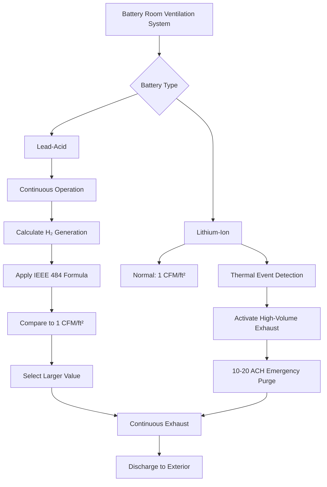
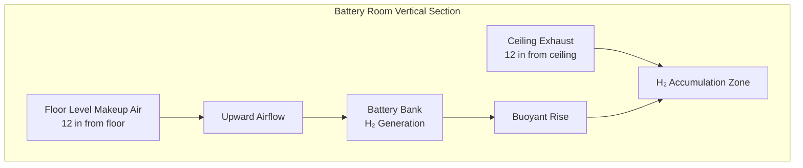
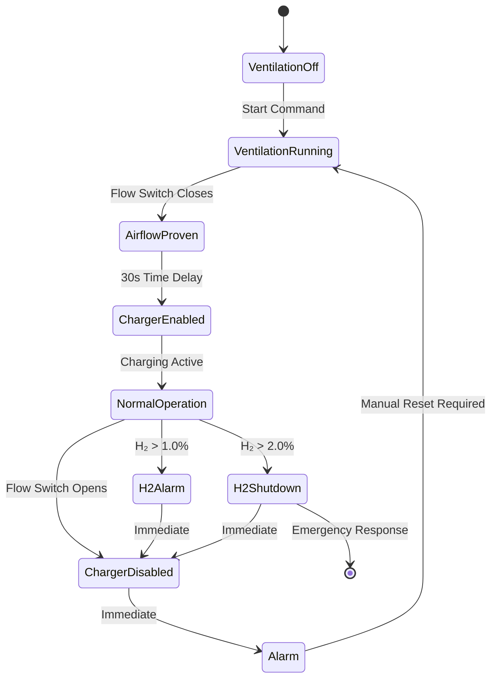

Battery room ventilation systems perform a critical safety function distinct from comfort ventilation: preventing explosive hydrogen accumulation through continuous dilution ventilation. During charging, lead-acid batteries electrolyze water into hydrogen and oxygen gases. Hydrogen, with its exceptionally low density (0.0696 kg/m³) and lower explosive limit of 4.0% by volume, creates catastrophic explosion risk if allowed to accumulate. Proper ventilation design requires quantifying hydrogen generation rates, calculating dilution airflows, positioning exhaust points according to buoyancy physics, and integrating safety interlocks that prevent charging without proven airflow.

## Electrochemical Hydrogen Generation

Lead-acid batteries generate hydrogen through water electrolysis when charging voltage exceeds the gassing voltage threshold. The fundamental electrochemical reaction occurs:

$$2\text{H}_2\text{O} \rightarrow 2\text{H}_2 \uparrow + \text{O}_2 \uparrow$$

This decomposition reaction releases two moles of hydrogen for every mole of oxygen. The volumetric ratio is 2:1, creating a stoichiometric mixture if confined without ventilation.

**Gassing voltage threshold:**

For lead-acid cells at 25°C:
- Flooded cells: Gassing begins at approximately 2.30-2.35 V/cell
- VRLA (valve-regulated lead-acid): Gassing begins at 2.35-2.40 V/cell
- Temperature coefficient: -3 to -5 mV/°C (voltage decreases with rising temperature)

Float charging typically operates at 2.25-2.30 V/cell, producing minimal gassing. Equalization charging at 2.50-2.65 V/cell generates substantial hydrogen evolution, representing the design condition for ventilation calculations.

**Faraday's Law application:**

The theoretical hydrogen generation rate follows Faraday's Law of electrolysis:

$$Q_{\text{H}_2} = \frac{n \cdot I \cdot t}{z \cdot F} \cdot V_m$$

Where:
- $Q_{\text{H}_2}$ = Volume of hydrogen generated (L)
- $n$ = Number of cells
- $I$ = Current per cell (A)
- $t$ = Time (s)
- $z$ = Number of electrons transferred (2 for H₂)
- $F$ = Faraday constant (96,485 C/mol)
- $V_m$ = Molar volume at STP (22.4 L/mol)

**Practical hydrogen generation rate:**

IEEE 484 provides the empirical equation accounting for charging efficiency and battery type:

$$Q = \frac{N \cdot I \cdot C \cdot F_{\text{eq}}}{1 \times 10^6}$$

Where:
- $Q$ = Hydrogen generation rate (ft³/min)
- $N$ = Number of cells in battery string
- $I$ = Charging current per cell (amperes)
- $C$ = Capacity factor (dimensionless coefficient)
- $F_{\text{eq}}$ = Equalization factor

**Capacity factors by battery type:**

| Battery Type | Float Charge | Equalize Charge | Notes |
|--------------|--------------|-----------------|-------|
| Flooded lead-acid | 0.00042 | 0.00042 | Higher gassing rate |
| VRLA (AGM) | 0.0005 | 0.0005 | Internal recombination reduces external gassing |
| VRLA (Gel) | 0.0003 | 0.0003 | Lower gassing than flooded |
| Pure lead | 0.0002 | 0.0002 | Minimal gassing |

Equalization factor $F_{\text{eq}}$ ranges from 1.0 (float) to 1.5 (equalization charge). Conservative design uses 1.5.

## Hydrogen Generation Calculation Example

**System parameters:**
- Battery configuration: 60-cell string (120 VDC nominal)
- Battery type: Flooded lead-acid
- Equalize charge current: 400 A
- Capacity factor: 0.00042
- Equalization factor: 1.5

**Calculation:**

$$Q = \frac{60 \times 400 \times 0.00042 \times 1.5}{1 \times 10^6} = \frac{15.12}{10^6} = 0.00001512 \text{ ft}^3/\text{min}$$

Converting to ft³/hr:

$$Q = 0.00001512 \times 60 = 0.000907 \text{ ft}^3/\text{hr}$$

This represents the baseline hydrogen generation requiring continuous dilution ventilation.

**Multiple battery strings:**

Power plants commonly employ multiple redundant battery strings. For three parallel strings:

$$Q_{\text{total}} = 3 \times 0.000907 = 0.00272 \text{ ft}^3/\text{hr}$$

## Explosion Hazard Physics

Hydrogen presents unique explosion hazards due to its molecular properties and combustion characteristics.

**Lower explosive limit (LEL):**

Hydrogen-air mixtures ignite between 4.0% (LEL) and 75% (UEL) by volume. The wide flammability range creates persistent hazard—most flammable gases have narrow ranges (methane: 5-15%, propane: 2.1-9.5%).

**Minimum ignition energy:**

Hydrogen requires only 0.017 mJ for ignition, compared to:
- Methane: 0.28 mJ
- Propane: 0.26 mJ
- Gasoline vapor: 0.24 mJ

This exceptionally low energy threshold means static discharge, mechanical sparks, or hot surfaces easily ignite hydrogen-air mixtures.

**Laminar burning velocity:**

Hydrogen burns rapidly with laminar burning velocity $S_L = 2.65$ m/s at stoichiometric conditions, compared to methane at 0.38 m/s. This sevenfold higher velocity produces rapid pressure rise during confined explosions.

**Buoyancy and stratification:**

Hydrogen density at 20°C and 1 atm:

$$\rho_{\text{H}_2} = \frac{M \cdot P}{R \cdot T} = \frac{2.016 \times 101,325}{8314 \times 293} = 0.0838 \text{ kg/m}^3$$

Air density under same conditions: $\rho_{\text{air}} = 1.204$ kg/m³

The density ratio:

$$\frac{\rho_{\text{H}_2}}{\rho_{\text{air}}} = \frac{0.0838}{1.204} = 0.0696 \approx 1/14$$

Hydrogen is 14 times lighter than air, creating strong buoyancy force:

$$F_b = (\rho_{\text{air}} - \rho_{\text{H}_2}) \cdot g \cdot V$$

This buoyancy drives rapid upward migration, with hydrogen reaching ceiling points within seconds of release. Exhaust location at ceiling level is mandatory.

## Dilution Ventilation Rate Calculations

Required ventilation airflow must dilute hydrogen to safe concentrations, typically 25% of LEL (1.0% by volume) with adequate safety margin.

**Fundamental dilution equation:**

$$V_{\text{req}} = \frac{Q_{\text{H}_2} \times 100 \times F_s}{C_{\text{max}}}$$

Where:
- $V_{\text{req}}$ = Required ventilation rate (CFM)
- $Q_{\text{H}_2}$ = Hydrogen generation rate (ft³/min)
- $F_s$ = Safety factor (minimum 4.0 per IEEE 484)
- $C_{\text{max}}$ = Maximum allowable concentration (1.0% = 25% LEL)

**Applying to previous example:**

$$V_{\text{req}} = \frac{0.0000151 \times 100 \times 4.0}{1.0} = 0.00604 \text{ CFM}$$

**NFPA 1 prescriptive minimum:**

Regardless of calculated hydrogen generation, NFPA 1 establishes:

$$V_{\text{min}} = 1.0 \text{ CFM/ft}^2 \times A_{\text{floor}}$$

For a 200 ft² battery room:

$$V_{\text{min}} = 1.0 \times 200 = 200 \text{ CFM}$$

**Design ventilation rate selection:**

$$V_{\text{design}} = \max(V_{\text{req}}, V_{\text{min}}) \times F_{\text{design}}$$

Where $F_{\text{design}} = 1.25$ to 1.5 (design margin factor)

Using NFPA minimum (larger value):

$$V_{\text{design}} = 200 \times 1.25 = 250 \text{ CFM}$$

## Lithium-Ion Battery Considerations

Lithium-ion batteries present fundamentally different off-gassing characteristics compared to lead-acid systems.

**Normal operation:**

Lithium-ion cells do not generate hydrogen during normal charging. The lithium intercalation/deintercalation process is non-gassing:

$$\text{LiCoO}_2 + \text{C}_6 \leftrightarrow \text{Li}_{1-x}\text{CoO}_2 + \text{Li}_x\text{C}_6$$

**Thermal runaway conditions:**

During thermal runaway (internal short, overcharge, overheating), lithium-ion cells vent electrolyte vapor and combustible gases including:
- Carbonates (dimethyl carbonate, ethylene carbonate)
- Carbon monoxide (CO)
- Carbon dioxide (CO₂)
- Hydrogen fluoride (HF) from electrolyte decomposition
- Hydrocarbons

**Ventilation design approach:**

| Parameter | Lead-Acid | Lithium-Ion |
|-----------|-----------|-------------|
| Normal operation gassing | Continuous low-level | None |
| Ventilation trigger | Always during charging | Thermal runaway detection |
| Design basis | Dilution of continuous generation | Rapid purge of event emissions |
| Typical rate | 1 CFM/ft² continuous | 10-20 air changes/hour on activation |
| Gas detection | Hydrogen (H₂) | Multiple gas (smoke, CO, VOC) |

NFPA 855 (Standard for the Installation of Stationary Energy Storage Systems) requires:
- Mechanical ventilation for large-scale lithium-ion installations
- Exhaust activation upon detection of off-gassing
- Minimum 1 CFM/ft² for rooms containing lithium-ion batteries
- Enhanced ventilation (10+ ACH) during thermal events

## Exhaust System Design Requirements

Hydrogen's extreme buoyancy dictates exhaust pickup point location. Stratification analysis demonstrates the requirement for ceiling-level exhaust.

**Concentration gradient:**

In a quiescent room with floor-level hydrogen release, vertical concentration follows turbulent diffusion with buoyancy:

$$\frac{\partial C}{\partial t} = D \frac{\partial^2 C}{\partial z^2} + u_b \frac{\partial C}{\partial z}$$

Where:
- $C$ = Hydrogen concentration
- $D$ = Turbulent diffusion coefficient
- $z$ = Vertical coordinate
- $u_b$ = Buoyant velocity

Solution demonstrates exponential concentration increase approaching ceiling.

**Exhaust location requirements:**

- Exhaust inlet within 12 inches of ceiling
- Multiple exhaust points for rooms exceeding 500 ft² floor area
- Spacing: Maximum 25-30 feet between exhaust points
- Avoid dead zones in corners and behind obstructions

**Exhaust discharge location:**

- Minimum 10 feet from air intake louvers
- Minimum 10 feet above roof level
- Minimum 15 feet from property lines, operable openings
- Avoid recirculation into building ventilation systems

**Makeup air provisions:**

Low-level makeup air creates floor-to-ceiling sweep pattern:

- Makeup air inlet within 12 inches of floor
- Located opposite wall from exhaust points
- Passive (grille/louver) or active (ducted supply)
- Airflow velocity at battery tops: 0-50 fpm (avoid excessive cooling)

**Flow pattern analysis:**

## Explosion-Proof Equipment Requirements

NEC Article 500 classifies battery rooms as Class I, Division 2, Group B locations when hydrogen concentration can reach 25% of LEL under abnormal ventilation failure conditions.

**Hazardous area classification:**

Class I: Flammable gases or vapors
Division 2: Abnormal conditions only (ventilation failure)
Group B: Hydrogen and gases of equivalent hazard

**Equipment selection by location:**

| Equipment | Classification Required | Alternatives |
|-----------|------------------------|--------------|
| Exhaust fan motor | Class I, Div 2, Group B | External mount outside room |
| Exhaust fan blades | Sparkproof construction | Non-ferrous (aluminum, brass) or coated steel |
| Lighting fixtures | Vapor-tight, Class I Div 2 | Enclosed and gasketed |
| Switches, receptacles | Class I, Div 2 rated | Mount outside room |
| Temperature sensors | Intrinsically safe circuits | Div 2 suitable |
| Wiring methods | Sealed conduit, explosion-proof fittings | IMC/RMC with sealed fittings |

**Design alternative - unclassified space:**

Some jurisdictions permit unclassified design if engineering analysis demonstrates hydrogen concentration remains below 25% LEL under all credible scenarios including:
- Single point ventilation failure with redundant fan activation
- Continuous hydrogen monitoring with charger interlock
- Alarm and automatic charger shutdown at 1% concentration

This approach requires AHJ approval and comprehensive documentation.

**Fan selection criteria:**

Centrifugal backward-inclined fans with:
- Sparkproof construction (AMCA Spark Resistant Construction)
- Non-ferrous impeller or coated steel
- External motor mount or explosion-proof motor
- Direct drive preferred over belt drive (eliminate static buildup)

## Safety Interlocks and Monitoring Systems

Comprehensive safety systems prevent hydrogen accumulation through layered controls and monitoring.

**Interlock logic sequence:**

**Airflow proving:**

Differential pressure switch monitors exhaust ductwork:
- Minimum $\Delta P$ = 0.1 in. w.c. across airflow station
- Adjustable time delay: 30-60 seconds (prevent nuisance trips)
- Normally open contacts close on proven airflow
- Loss of airflow opens contacts, de-energizes charger

**Hydrogen detection:**

Electrochemical or catalytic sensors continuously monitor hydrogen concentration:
- Sensor location: Ceiling level, within 12 inches of highest point
- Alarm setpoint: 1.0% by volume (25% LEL)
- Shutdown setpoint: 2.0% by volume (50% LEL)
- Calibration interval: Quarterly per manufacturer requirements

**Detection technology comparison:**

| Technology | Range | Accuracy | Response Time | Lifespan |
|------------|-------|----------|---------------|----------|
| Electrochemical | 0-4% | ±0.1% | 15-30 seconds | 2-3 years |
| Catalytic bead | 0-100% LEL | ±5% LEL | 10-20 seconds | 3-5 years |
| Thermal conductivity | 0-100% | ±2% | 5-10 seconds | 5-10 years |

Electrochemical sensors offer best accuracy at low concentrations relevant to safety limits.

**Control sequence requirements:**

1. Ventilation start → 30 second airflow establishment delay
2. Airflow proven → Enable charger circuit
3. Airflow lost → Immediate charger lockout + audible/visual alarm
4. H₂ > 1.0% → Alarm only (charger continues if deemed acceptable)
5. H₂ > 2.0% → Charger shutdown + evacuation alarm
6. Manual reset required after any trip condition

**Redundancy for critical applications:**

- Dual exhaust fans: N+1 configuration with automatic changeover
- UPS power supply: Maintains ventilation during power outages
- Dual hydrogen sensors: Voting logic (2 out of 2 for alarm)
- Independent monitoring: Building automation system + standalone panel

## Temperature Effects on Hydrogen Generation

Battery temperature significantly influences gassing rate through electrochemical kinetics and thermodynamic effects.

**Temperature coefficient:**

Hydrogen evolution increases approximately 10-15% per 10°C temperature rise above 25°C reference. The Arrhenius relationship governs reaction rate:

$$k = A \cdot e^{-E_a/(R \cdot T)}$$

Where:
- $k$ = Reaction rate constant
- $A$ = Pre-exponential factor
- $E_a$ = Activation energy
- $R$ = Universal gas constant (8.314 J/mol·K)
- $T$ = Absolute temperature (K)

**Practical temperature correction:**

$$Q_T = Q_{25} \times \left[1 + \alpha(T - 25)\right]$$

Where:
- $Q_T$ = Generation rate at temperature $T$ (°C)
- $Q_{25}$ = Generation rate at 25°C reference
- $\alpha$ = Temperature coefficient (0.010-0.015 per °C)

For battery room at 35°C with $\alpha = 0.012$:

$$Q_{35} = Q_{25} \times [1 + 0.012(35-25)] = Q_{25} \times 1.12$$

Hydrogen generation increases 12% compared to 25°C reference condition.

**Design implication:**

Battery rooms in warm climates or with inadequate cooling require temperature correction applied to hydrogen generation calculations. Conservative design uses maximum anticipated battery temperature (typically 35-40°C for indoor installations).

## Applicable Codes and Standards

**IEEE 484** (IEEE Recommended Practice for Installation Design and Installation of Vented Lead-Acid Batteries for Stationary Applications):
- Section 5.8: Ventilation requirements
- Hydrogen generation calculation methodology
- Safety factors and design margins
- Equipment selection guidance

**NFPA 1** (Fire Code):
- Section 52.1.9: Battery system rooms
- Prescriptive ventilation rate (1 CFM/ft²)
- Exhaust discharge requirements
- Electrical classification guidance

**NFPA 70** (National Electrical Code):
- Article 480: Battery installation requirements
- Article 500: Hazardous location classification
- Article 501: Class I, Division 2 equipment requirements

**NFPA 855** (Standard for the Installation of Stationary Energy Storage Systems):
- Chapter 4: Lithium-ion battery system requirements
- Ventilation for thermal runaway events
- Detection and suppression integration

**International Mechanical Code (IMC)**:
- Section 502: Hazardous exhaust systems
- Section 510: Hazardous materials storage and use
- Duct construction and clearance requirements

**ASHRAE Applications Handbook**:
- Chapter 23: Industrial applications
- Battery room design considerations

## Design Documentation Package

Complete battery room ventilation design submittals include:

**Calculations:**
- Battery specifications (type, cells, voltage, capacity)
- Charging profile (float voltage, equalize voltage, current)
- Hydrogen generation rate using IEEE 484 methodology
- Temperature correction factors applied
- Ventilation rate determination with safety factors
- Comparison to NFPA 1 prescriptive minimum

**Equipment schedules:**
- Exhaust fan performance data (CFM, SP, bhp)
- Motor specifications and explosion-proof ratings
- Hydrogen sensor specifications and calibration certificates
- Control panel components and ratings
- Dampers, louvers, and accessories

**Drawings:**
- Floor plan showing battery layout, exhaust locations, makeup air
- Vertical section showing stratification zones and exhaust pickup height
- Ductwork routing and discharge location
- Electrical one-line diagram showing interlock circuits
- Control sequence diagram

**Commissioning procedures:**
- Airflow measurement and verification
- Differential pressure switch calibration and setpoint verification
- Hydrogen sensor functional testing (challenge gas)
- Interlock sequence testing (simulate airflow loss)
- Alarm and shutdown function verification
- Documentation of acceptance test results

Battery room ventilation represents a specialized safety-critical HVAC application where proper design prevents catastrophic explosions. Conservative calculation methods, code-compliant equipment selection, robust interlock systems, and comprehensive commissioning ensure hydrogen concentrations remain safely below explosive limits throughout battery service life.
