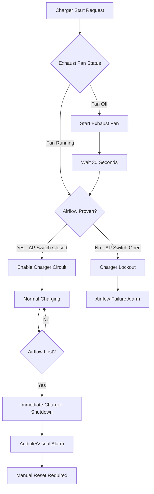
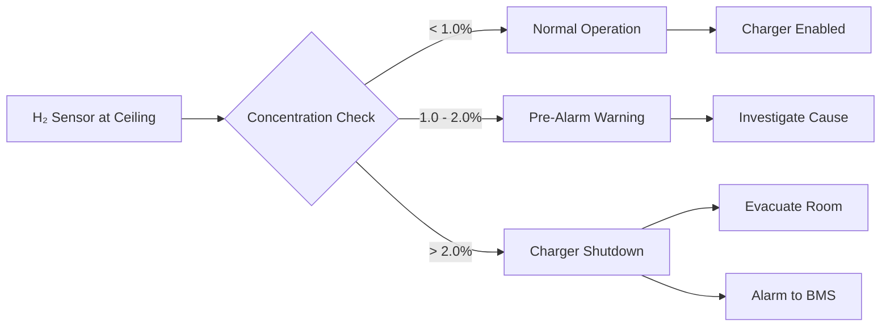
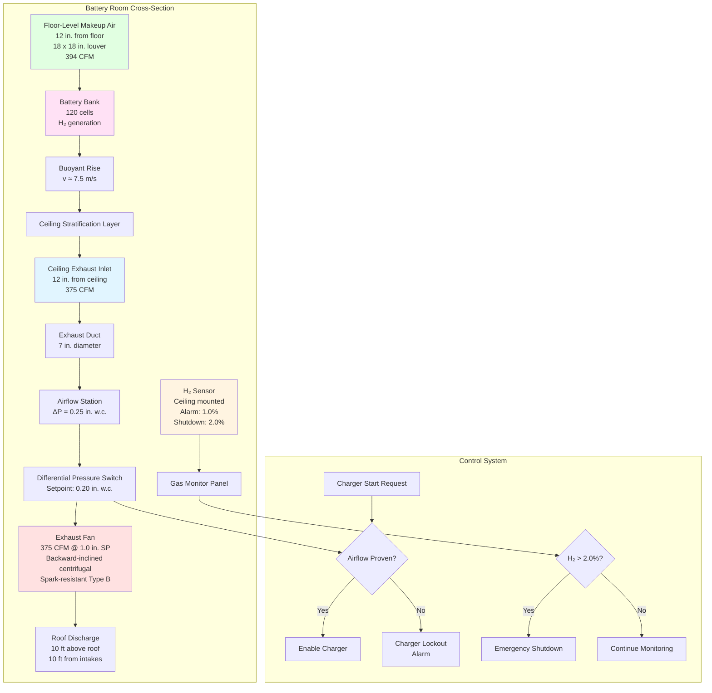

Battery room exhaust systems must continuously remove hydrogen gas to maintain concentrations below explosive limits. Unlike general ventilation that can tolerate intermittent operation, battery room exhaust requires uninterrupted operation during all charging activities. Design centers on three physical principles: calculating sufficient volumetric airflow to dilute hydrogen below 25% of the lower explosive limit (1.0% by volume), positioning exhaust inlets at ceiling level where buoyant hydrogen accumulates, and integrating safety interlocks that prevent charging without proven exhaust airflow. Exhaust system failure creates immediate explosion hazard as hydrogen concentration rises toward the 4.0% LEL threshold within minutes under worst-case charging conditions.

## Exhaust Airflow Rate Calculations

Exhaust volumetric flow rate must exceed the dilution requirement calculated from hydrogen generation rate, safety factors, and maximum allowable concentration limits.

**Dilution ventilation equation:**

The fundamental relationship between hydrogen generation and required exhaust flow derives from mass balance:

$$\dot{V}_{\text{exhaust}} = \frac{\dot{Q}_{\text{H}_2} \times 100 \times F_s}{C_{\text{max}}}$$

Where:
- $\dot{V}_{\text{exhaust}}$ = Required exhaust airflow rate (CFM)
- $\dot{Q}_{\text{H}_2}$ = Hydrogen generation rate (ft³/min)
- $F_s$ = Safety factor (dimensionless)
- $C_{\text{max}}$ = Maximum allowable hydrogen concentration (% by volume)

The factor of 100 converts the fractional concentration to percentage basis for dimensional consistency.

**Safety factor determination:**

IEEE 484 recommends minimum safety factor $F_s = 4.0$ to account for:

- Non-ideal mixing within the battery room (mixing efficiency typically 0.7-0.9)
- Localized concentration peaks near gassing batteries
- Measurement uncertainties in hydrogen generation rates
- Aging effects on battery gassing characteristics
- Ventilation system degradation over service life

Conservative designs employ $F_s = 5.0$ to 6.0 for mission-critical facilities where explosion risk is unacceptable.

**Maximum allowable concentration:**

Industry standard establishes $C_{\text{max}} = 1.0\%$ by volume, representing 25% of the LEL (4.0%). This provides adequate safety margin below the explosive threshold.

More conservative designs target $C_{\text{max}} = 0.5\%$ (12.5% LEL) for:
- Nuclear facilities
- Data centers with no tolerable downtime
- Installations in confined underground spaces
- Locations with ignition sources that cannot be eliminated

**Calculation example - flooded lead-acid battery bank:**

Battery system parameters:
- Configuration: 120-cell string (240 VDC nominal system)
- Battery type: Flooded lead-acid
- Equalization charge current: 500 amperes
- Capacity factor $C = 0.00042$ (flooded lead-acid)
- Equalization factor $F_{\text{eq}} = 1.5$

Hydrogen generation rate from IEEE 484:

$$\dot{Q}_{\text{H}_2} = \frac{N \times I \times C \times F_{\text{eq}}}{1 \times 10^6}$$

$$\dot{Q}_{\text{H}_2} = \frac{120 \times 500 \times 0.00042 \times 1.5}{1 \times 10^6} = \frac{37.8}{10^6} = 3.78 \times 10^{-5} \text{ ft}^3/\text{min}$$

Required exhaust flow with $F_s = 4.0$ and $C_{\text{max}} = 1.0\%$:

$$\dot{V}_{\text{exhaust}} = \frac{3.78 \times 10^{-5} \times 100 \times 4.0}{1.0} = 0.0151 \text{ CFM}$$

**NFPA 1 prescriptive minimum:**

NFPA 1 Fire Code Section 52.1.9 establishes prescriptive ventilation independent of hydrogen calculation:

$$\dot{V}_{\text{min}} = 1.0 \text{ CFM/ft}^2 \times A_{\text{floor}}$$

For a battery room with floor area $A_{\text{floor}} = 300$ ft²:

$$\dot{V}_{\text{min}} = 1.0 \times 300 = 300 \text{ CFM}$$

**Design airflow selection:**

The governing design airflow takes the larger of calculated dilution requirement and prescriptive code minimum, with additional design margin:

$$\dot{V}_{\text{design}} = \max(\dot{V}_{\text{exhaust}}, \dot{V}_{\text{min}}) \times F_{\text{design}}$$

Where $F_{\text{design}} = 1.25$ accounts for duct leakage, filter pressure drop, and fan performance degradation.

$$\dot{V}_{\text{design}} = 300 \times 1.25 = 375 \text{ CFM}$$

The NFPA prescriptive minimum governs for most installations because hydrogen generation rates are typically small relative to room volume. Large battery banks with high charging currents occasionally exceed the prescriptive minimum, requiring calculated dilution flow.

**Multiple battery string consideration:**

Power plants commonly install multiple independent battery strings for redundancy. When N strings occupy a common room, the generation rates sum:

$$\dot{Q}_{\text{total}} = \sum_{i=1}^{N} \dot{Q}_{i}$$

For three identical 120-cell strings:

$$\dot{Q}_{\text{total}} = 3 \times 3.78 \times 10^{-5} = 1.13 \times 10^{-4} \text{ ft}^3/\text{min}$$

$$\dot{V}_{\text{exhaust}} = \frac{1.13 \times 10^{-4} \times 100 \times 4.0}{1.0} = 0.0452 \text{ CFM}$$

The prescriptive minimum still governs for this moderate installation.

## Temperature Correction Factors

Hydrogen evolution rates increase with battery temperature according to electrochemical reaction kinetics. The Arrhenius relationship governs temperature dependence:

$$\dot{Q}_{T} = \dot{Q}_{25} \times \exp\left[\frac{E_a}{R}\left(\frac{1}{298} - \frac{1}{T}\right)\right]$$

Where:
- $\dot{Q}_T$ = Generation rate at temperature T (K)
- $\dot{Q}_{25}$ = Generation rate at 25°C reference (298 K)
- $E_a$ = Activation energy for hydrogen evolution (approximately 25,000 J/mol)
- $R$ = Universal gas constant (8.314 J/mol·K)

**Simplified linear approximation:**

For practical design within the typical battery operating range (20-40°C), a linear temperature correction provides adequate accuracy:

$$\dot{Q}_T = \dot{Q}_{25} \times [1 + \alpha(T - 25)]$$

Where $\alpha = 0.012$ per °C (empirical coefficient for lead-acid batteries).

For a battery room maintained at 35°C:

$$\dot{Q}_{35} = \dot{Q}_{25} \times [1 + 0.012(35-25)] = \dot{Q}_{25} \times 1.12$$

Hydrogen generation increases 12% compared to the 25°C reference condition.

**Design implications:**

Battery rooms in hot climates, with inadequate cooling, or subjected to high ambient temperatures require temperature-corrected hydrogen generation rates. Conservative design uses the maximum anticipated battery temperature:

- Indoor temperature-controlled spaces: 30-35°C
- Outdoor enclosures in hot climates: 40-45°C
- Enclosed cabinets with solar loading: 50-55°C

The exhaust system must handle the elevated generation rate at maximum temperature conditions.

## Ceiling-Level Exhaust Inlet Location

Hydrogen's extremely low density (0.0838 kg/m³ versus 1.204 kg/m³ for air at 20°C) creates strong buoyancy that drives rapid upward migration. Exhaust inlet positioning must capture hydrogen at its accumulation point.

**Buoyancy force analysis:**

The buoyant force on a hydrogen volume element:

$$F_b = (\rho_{\text{air}} - \rho_{\text{H}_2}) \times g \times V$$

For 1 m³ of hydrogen at 20°C:

$$F_b = (1.204 - 0.0838) \times 9.81 \times 1 = 10.99 \text{ N}$$

This substantial upward force causes hydrogen to rise rapidly through still air with terminal velocity approximated by:

$$v_{\text{rise}} \approx \sqrt{\frac{2g h \Delta\rho}{\rho_{\text{air}}}}$$

Where h is the characteristic dimension. For a 3-meter high room:

$$v_{\text{rise}} \approx \sqrt{\frac{2 \times 9.81 \times 3 \times 1.12}{1.204}} = 7.5 \text{ m/s}$$

Hydrogen released at floor level reaches the ceiling within 0.4 seconds.

**Stratification physics:**

In the absence of mechanical mixing, hydrogen forms a stratified layer below the ceiling with concentration decreasing exponentially with distance from the ceiling:

$$C(z) = C_{\text{ceiling}} \times \exp\left(-\frac{z}{\lambda}\right)$$

Where:
- $C(z)$ = Hydrogen concentration at distance z below ceiling
- $C_{\text{ceiling}}$ = Maximum concentration at ceiling
- $\lambda$ = Characteristic decay length (typically 0.3-0.6 m)

This steep concentration gradient demonstrates that exhaust inlet location is critical.

**Exhaust inlet height requirements:**

IEEE 484 and NFPA 1 specify:

- **Maximum distance from ceiling:** 12 inches (305 mm)
- **Optimal location:** Within 6 inches (150 mm) of ceiling
- **Flush ceiling mounting:** Preferred configuration for maximum capture efficiency

Exhaust inlets located mid-height or at floor level fail to capture the stratified hydrogen layer, allowing concentrations to build at the ceiling regardless of exhaust flow rate.

**Multiple exhaust point spacing:**

Large battery rooms require multiple exhaust pickup points to prevent dead zones:

| Room Floor Area | Minimum Exhaust Points | Maximum Spacing |
|-----------------|------------------------|-----------------|
| < 200 ft² | 1 | Single point adequate |
| 200-500 ft² | 2 | 25 feet between points |
| 500-1000 ft² | 3-4 | 25 feet between points |
| > 1000 ft² | Calculate based on coverage | 20-25 feet maximum |

The spacing ensures that hydrogen released at any location within the room migrates to an exhaust inlet within the available buoyant rise time.

**Obstruction considerations:**

Physical obstructions create dead zones where hydrogen accumulates:

- Light fixtures suspended below ceiling
- Cable trays and conduit runs
- Structural beams and joists
- HVAC ductwork crossing the room

Exhaust inlets must be positioned to capture hydrogen from all potential accumulation points, including spaces above obstructions. In congested rooms, additional exhaust points compensate for compromised mixing.

## Exhaust Duct Routing and Discharge Location

Exhaust ductwork must route hydrogen to a safe exterior discharge point without creating secondary hazards.

**Duct material selection:**

Battery room exhaust ducts operate in corrosive environments (sulfuric acid mist from flooded batteries) and potentially explosive atmospheres. Material requirements:

| Material | Application | Advantages | Disadvantages |
|----------|-------------|------------|---------------|
| Galvanized steel | Indoor runs, mild corrosion | Low cost, readily available | Moderate corrosion resistance |
| Stainless steel (304) | Moderate corrosion | Good corrosion resistance | Higher cost than galvanized |
| Stainless steel (316) | Severe acid exposure | Excellent corrosion resistance | Highest cost |
| PVC Schedule 40 | Non-corrosive applications | Corrosion-proof, lightweight | Combustible, lower temp rating |
| Coated steel | Balance of properties | Good protection, moderate cost | Coating damage creates vulnerabilities |

Stainless steel 304 provides optimal balance for most battery room applications. Welded or flanged joints prevent hydrogen leakage better than slip connections.

**Duct sizing principles:**

Duct velocity must balance competing requirements:

- **Minimum velocity:** 1000-1500 fpm to maintain entrainment and prevent settling of acid mist
- **Maximum velocity:** 2000-2500 fpm to limit noise generation and pressure loss
- **Typical design range:** 1200-1800 fpm

For the 375 CFM design example with target velocity 1500 fpm:

$$A_{\text{duct}} = \frac{\dot{V}}{v} = \frac{375}{1500} = 0.25 \text{ ft}^2 = 36 \text{ in}^2$$

$$d = \sqrt{\frac{4A}{\pi}} = \sqrt{\frac{4 \times 36}{\pi}} = 6.77 \text{ inches}$$

Select 7-inch diameter duct (next standard size up).

Actual velocity:

$$v_{\text{actual}} = \frac{375}{\pi(7/12)^2/4} = \frac{375}{0.267} = 1405 \text{ fpm}$$

**Static pressure loss calculation:**

Total system static pressure includes duct friction, fitting losses, and discharge velocity pressure:

$$\Delta P_{\text{total}} = \Delta P_{\text{friction}} + \sum \Delta P_{\text{fittings}} + P_{\text{velocity}}$$

Friction loss in straight duct (Darcy-Weisbach):

$$\Delta P_{\text{friction}} = f \times \frac{L}{D} \times \frac{\rho v^2}{2} \times \frac{1}{12 \times 5.2} \text{ in. w.c.}$$

For 50 feet of 7-inch duct at 1405 fpm with friction factor $f = 0.018$:

$$\Delta P_{\text{friction}} = 0.018 \times \frac{50}{7/12} \times \frac{0.075 \times (1405/60)^2}{2} \times \frac{1}{5.2} = 0.18 \text{ in. w.c.}$$

Fitting losses for two 90° elbows with loss coefficient $K = 0.25$ each:

$$\Delta P_{\text{fittings}} = 2 \times 0.25 \times \frac{(1405)^2}{4005} = 0.25 \text{ in. w.c.}$$

Velocity pressure at discharge:

$$P_{\text{velocity}} = \frac{(1405)^2}{4005} = 0.49 \text{ in. w.c.}$$

Total system pressure:

$$\Delta P_{\text{total}} = 0.18 + 0.25 + 0.49 = 0.92 \text{ in. w.c.}$$

Design fan for 375 CFM at 1.0-1.25 inches w.c. static pressure with margin.

**Discharge location requirements:**

Exhaust discharge must prevent hydrogen re-entrainment into building air intakes and avoid creating hazards near operable openings:

**Code-specified clearances:**

- **Minimum 10 feet** from any air intake louver or operable window
- **Minimum 10 feet** above roof surface (prevents re-entrainment into roof-level intakes)
- **Minimum 15 feet** from property lines
- **Minimum 10 feet** from any ignition source
- **Vertical discharge orientation** (upward) to maximize dispersion

**Discharge velocity for dispersion:**

Adequate discharge velocity ensures rapid hydrogen dilution in outdoor air. Minimum discharge velocity:

$$v_{\text{discharge}} = 2000 \text{ fpm minimum}$$

Higher velocities (2500-3000 fpm) improve dispersion but increase system pressure loss.

**Hydrogen dilution in outdoor air:**

Hydrogen concentration decreases rapidly with distance from discharge due to turbulent diffusion and wind entrainment. For vertical discharge with exit velocity $v_0$ into crosswind $u$, concentration at downwind distance x:

$$C(x) = C_0 \times \frac{v_0}{u} \times \frac{d_0}{x} \times \exp\left(-\frac{u^2 x}{2K_z v_0 d_0}\right)$$

Where:
- $C_0$ = Discharge concentration (1.0% for design case)
- $d_0$ = Discharge diameter
- $K_z$ = Vertical turbulent diffusion coefficient

For typical conditions (5 mph wind, 2500 fpm discharge velocity), hydrogen dilutes to < 0.1% LEL within 10 feet of discharge, confirming code clearance requirements provide adequate safety.

## Exhaust Fan Selection and Configuration

Exhaust fans must operate continuously in corrosive, potentially explosive atmospheres with high reliability requirements.

**Fan type selection:**

| Fan Type | Application Suitability | Advantages | Disadvantages |
|----------|------------------------|------------|---------------|
| Centrifugal backward-inclined | Preferred for most installations | High efficiency, stable operation | Higher cost than other types |
| Centrifugal radial blade | High static pressure applications | Simple construction, rugged | Lower efficiency, higher noise |
| Centrifugal forward-curved | Low-pressure, high-volume | Compact size | Unstable pressure-flow curve |
| Axial propeller | Low-pressure duct-free exhaust | Low cost, simple installation | Poor static pressure capability |
| Tube-axial | Moderate pressure, inline | Space-efficient | Moderate efficiency |

**Recommended selection:** Centrifugal backward-inclined fan provides optimal combination of efficiency (70-80%), stable pressure-flow characteristics, and quiet operation.

**Spark-resistant construction:**

AMCA (Air Movement and Control Association) Spark Resistant Construction requirements:

- **Type A:** Non-ferrous impeller and housing (aluminum, brass, bronze)
- **Type B:** Non-ferrous impeller, ferrous housing with minimum 1/16-inch clearance
- **Type C:** Ferrous impeller and housing with non-sparking coating

Type B construction (aluminum or coated steel impeller in steel housing) provides best balance of cost and safety for battery room applications.

**Motor mounting configurations:**

NEC Class I, Division 2, Group B classification applies to battery rooms during abnormal ventilation failure conditions. Motor mounting affects electrical classification requirements:

**Configuration comparison:**

| Configuration | Motor Location | Motor Rating Required | Advantages | Disadvantages |
|---------------|----------------|----------------------|------------|---------------|
| Direct-drive internal | Inside airstream | Class I, Div 2, Group B | Compact, efficient | Expensive explosion-proof motor |
| Belt-drive internal | Inside airstream | Class I, Div 2, Group B | Adjustable speed via pulley change | Motor and belt in corrosive airstream |
| Direct-drive external | Outside housing | General purpose | Motor in clean environment | Requires shaft seal, potential leak point |
| Belt-drive external | Outside housing | General purpose | Most economical | Belt wear, maintenance required |

**Recommended configuration:** Direct-drive external mount eliminates explosion-proof motor requirement while maintaining high efficiency. Shaft seal must prevent hydrogen leakage from housing to motor compartment.

**Fan performance specification:**

Using previous calculation example (375 CFM at 1.0 in. w.c.):

**Fan duty point:**
- Volumetric flow: 375 CFM
- Static pressure: 1.0 in. w.c. (system resistance)
- Shaft power: $\text{bhp} = \frac{375 \times 1.0}{6356 \times \eta}$

Assuming fan efficiency $\eta = 0.75$:

$$\text{bhp} = \frac{375 \times 1.0}{6356 \times 0.75} = 0.079 \text{ hp}$$

Select 1/4 hp motor (next standard size) to provide adequate margin.

**Motor service factor:** Minimum 1.15 service factor to handle momentary overloads and system resistance variations.

**Redundancy configurations:**

Mission-critical applications require redundant exhaust capacity:

**N+1 configuration:** Two 100% capacity fans with automatic switchover upon primary fan failure. Standby fan starts on:
- Primary fan motor current loss
- Airflow switch trip
- Manual activation

**Continuous dual operation:** Two 60% capacity fans operate continuously, providing 120% total capacity. Single fan failure maintains minimum 60% flow, allowing controlled shutdown and repair.

Cost-benefit analysis determines optimal redundancy level based on criticality of battery system.

## Makeup Air Provisions

Continuous exhaust requires compensating makeup air to prevent negative pressurization, which reduces exhaust effectiveness and creates door operability problems.

**Makeup air flow requirement:**

$$\dot{V}_{\text{makeup}} = \dot{V}_{\text{exhaust}} + \dot{V}_{\text{exfiltration}}$$

Where exfiltration through door gaps and construction leakage typically equals 5-10% of exhaust flow.

For 375 CFM exhaust with 5% exfiltration:

$$\dot{V}_{\text{makeup}} = 375 + 0.05 \times 375 = 394 \text{ CFM}$$

Practical design uses makeup air equal to exhaust flow rate; slight negative pressure (0.01-0.02 in. w.c.) ensures hydrogen does not escape to adjacent spaces.

**Makeup air inlet location:**

Low-level makeup air creates floor-to-ceiling airflow pattern that sweeps hydrogen upward to exhaust inlets:

- **Location:** Within 12 inches of floor level, diagonally opposite exhaust inlet
- **Configuration:** Passive louver or powered supply fan
- **Velocity at battery tops:** 30-50 fpm maximum to avoid excessive battery cooling

**Passive versus powered makeup air:**

| Configuration | Application | Advantages | Disadvantages |
|---------------|-------------|------------|---------------|
| Passive louver | Negative pressure exhaust | Simple, no power consumption | Limited flow control, temperature not controlled |
| Powered supply fan | Balanced or positive pressure | Precise flow control, filtered and tempered air | Higher cost, requires controls |
| Transfer air from adjacent space | Internal battery room | No exterior penetrations | Requires adequate adjacent space ventilation |

**Passive louver sizing:**

Louver free area must limit pressure drop to 0.03-0.05 in. w.c. at design flow:

$$A_{\text{free}} = \frac{\dot{V}_{\text{makeup}}}{v_{\text{louver}}}$$

With louver face velocity 400 fpm:

$$A_{\text{free}} = \frac{394}{400} = 0.985 \text{ ft}^2 = 142 \text{ in}^2$$

Commercial louvers have effective free area 40-60% of nominal size. For 50% effective area:

$$A_{\text{nominal}} = \frac{142}{0.50} = 284 \text{ in}^2$$

Select 18" × 18" louver (324 in² nominal).

**Temperature-controlled makeup air:**

Battery rooms require temperature control to maintain optimal battery performance (20-25°C). In extreme climates, passive makeup air admits excessively hot or cold outdoor air.

Solutions:
1. **Indirect heat trace** on passive louver to temper winter air
2. **Powered supply fan** drawing from temperature-controlled adjacent space
3. **Dedicated makeup air unit** with heating/cooling coils (large installations)

Energy analysis determines cost-effectiveness of active temperature control versus accepting wider battery temperature swings.

## Safety Interlock Systems

Exhaust system failure during charging creates immediate explosion hazard. Safety interlocks prevent charger operation without proven exhaust airflow.

**Airflow proving methods:**

**Differential pressure switch:**

Monitors pressure drop across airflow station in exhaust duct:

$$\Delta P_{\text{station}} = K \times \frac{\rho v^2}{2}$$

Where K = loss coefficient of airflow station (orifice plate, pitot tube array, or flow grid).

For design velocity 1405 fpm through flow grid with $K = 0.5$:

$$\Delta P = 0.5 \times \frac{(1405)^2}{4005} = 0.25 \text{ in. w.c.}$$

Differential pressure switch calibrated to close contacts at $\Delta P > 0.20$ in. w.c., indicating proven airflow.

**Advantages:**
- Direct measurement of airflow
- No moving parts in airstream
- Reliable for continuous operation

**Disadvantages:**
- Requires duct penetrations
- Sensing lines require periodic maintenance
- Condensation in lines can cause false readings

**Current sensing relay:**

Monitors fan motor current; closed contacts indicate motor running.

**Advantages:**
- Simple installation
- No duct penetrations
- Low cost

**Disadvantages:**
- Infers airflow from motor operation (doesn't confirm air movement)
- Fails to detect damper closed, duct blockage, or belt failure
- Not acceptable as sole airflow proving method per IEEE 484

**Airflow switch:**

Paddle-type switch inserted in duct deflects with airflow to close contacts.

**Advantages:**
- Direct airflow sensing
- Visual indication through duct wall
- Adjustable setpoint

**Disadvantages:**
- Obstruction in airstream
- Mechanical wear on paddle hinge
- Subject to acid mist coating

**Recommended configuration:** Differential pressure switch provides most reliable airflow proving. Supplement with motor current relay for redundancy.

**Control logic sequence:**

**Time delay settings:**

- **Fan start to airflow proven:** 30-60 seconds allows fan to reach operating speed and pressure to stabilize
- **Airflow loss to charger trip:** 0 seconds (immediate shutdown upon airflow loss)
- **Manual reset:** Required after any airflow failure to ensure operator awareness

**Hydrogen detection integration:**

Gas detection systems provide secondary protection by monitoring actual hydrogen concentration:

**Dual-channel safety architecture:**

Critical installations employ redundant safety channels:

**Channel A - Airflow Interlock:**
- Primary differential pressure switch
- Backup motor current relay
- Voting logic: Both must confirm airflow

**Channel B - Hydrogen Detection:**
- Dual H₂ sensors
- Independent concentration alarms
- Override capability for charger shutdown

Either channel can prevent charger operation; both channels must clear for normal operation resumption.

## Comparison of Exhaust System Configurations

Different design approaches balance cost, complexity, and reliability:

| Configuration | Equipment | Interlock Method | Makeup Air | Typical Application | Relative Cost |
|---------------|-----------|------------------|------------|---------------------|---------------|
| **Single fan, passive makeup** | 1 exhaust fan, louver | Differential pressure switch | Passive louver | Small UPS battery rooms (< 300 ft²) | Baseline ($) |
| **Single fan, powered makeup** | 1 exhaust fan, 1 supply fan | DP switch on exhaust, current relay on supply | Powered supply with optional tempering | Medium battery rooms (300-800 ft²) | 1.5× ($\$) |
| **Dual fan N+1, passive makeup** | 2 exhaust fans (100% each), louver | DP switch on common duct, auto changeover | Passive louver with larger free area | Critical systems requiring redundancy | 2.0× ($$) |
| **Dual fan N+1, powered makeup** | 2 exhaust fans, 1 supply fan | DP switch, dual current relays, PLC logic | Powered supply with heating/cooling | Large data center or telecom battery plants | 2.5× ($$\$) |
| **Continuous dual, powered makeup** | 2 exhaust fans (60% each continuous), 1 supply fan | Individual DP switches, PLC monitoring | Powered supply with full HVAC | Mission-critical (nuclear, hospital emergency power) | 3.0× ($$$\$) |

**Design selection criteria:**

- **Budget-constrained:** Single fan, passive makeup
- **Standard commercial:** Single fan, powered makeup with basic controls
- **High reliability:** Dual fan N+1 with automatic changeover
- **Mission-critical:** Continuous dual operation with full monitoring

## Battery Room Exhaust System Schematic

## Applicable Standards and Codes

**IEEE 484** - Recommended Practice for Installation Design and Installation of Vented Lead-Acid Batteries for Stationary Applications:
- Section 5.8: Ventilation requirements
- Hydrogen generation calculation methodology
- Safety factors and exhaust airflow determination
- Interlock system requirements

**NFPA 1** - Fire Code:
- Section 52.1.9: Battery system rooms
- Prescriptive ventilation rate: 1 CFM/ft² minimum
- Exhaust discharge clearances
- Makeup air requirements

**NFPA 70** - National Electrical Code:
- Article 480: Storage battery installation
- Article 500: Hazardous (classified) locations
- Article 501: Class I, Division 2 wiring methods
- Group B classification for hydrogen

**International Mechanical Code (IMC)**:
- Section 502.9.1: Battery rooms
- Section 510: Hazardous exhaust systems
- Duct construction requirements

**ASHRAE Applications Handbook**:
- Chapter 23: Industrial applications
- Battery room design guidance

**AMCA Standard 99-0401** - Classification for Spark Resistant Construction:
- Type A, B, C construction definitions
- Testing and certification requirements

Battery room exhaust systems represent safety-critical applications where proper design prevents catastrophic explosions. Calculations must account for hydrogen generation rates under worst-case charging conditions, safety factors addressing mixing imperfections, and code-prescribed minimum ventilation rates. Ceiling-level exhaust placement captures buoyancy-driven hydrogen accumulation, while robust interlock systems ensure charging cannot proceed without proven airflow. Comprehensive understanding of the underlying physics, combined with conservative application of standards, delivers reliable protection throughout battery service life.
