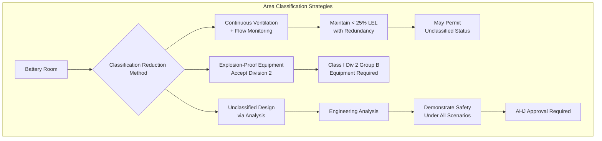
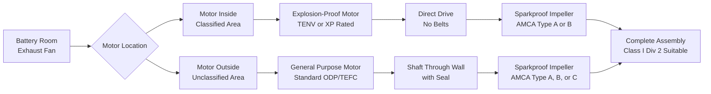
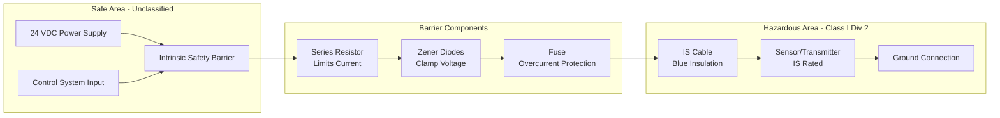
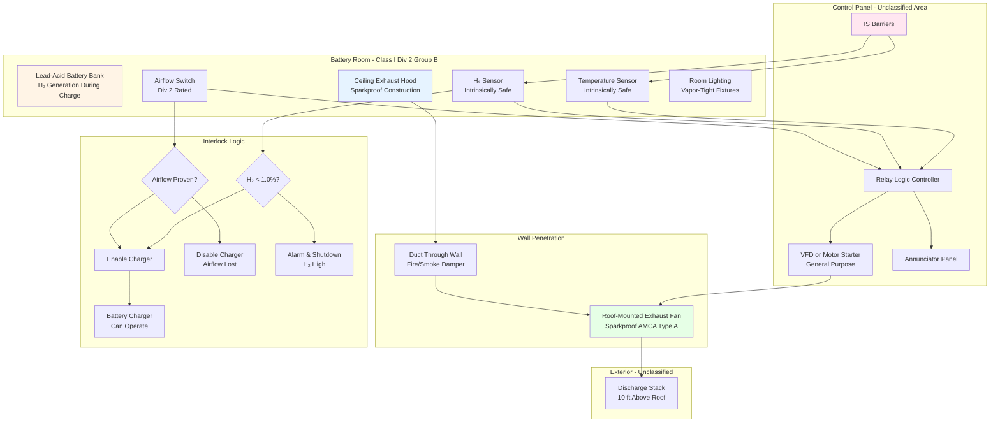

Battery rooms containing hydrogen-generating lead-acid batteries require explosion-proof or suitable equipment rated for Class I, Division 2, Group B hazardous locations per NEC Article 500. During ventilation system failure or abnormal conditions, hydrogen concentration can reach the lower explosive limit (LEL) of 4.0% by volume, creating ignition risk from electrical arcs, mechanical sparks, or hot surfaces. Proper equipment selection, installation methods, and area classification determine whether electrical ignition sources can trigger hydrogen-air explosions. This analysis examines hazardous location classification methodology, explosion-proof equipment requirements, sparkproof construction principles, and design alternatives that maintain safety without requiring fully rated equipment.

## Hazardous Location Classification Fundamentals

NEC Article 500 establishes a systematic framework for classifying locations based on the probability and duration of flammable gas presence. Understanding this classification methodology is essential for determining appropriate equipment ratings.

**Three-axis classification system:**

1. **Class** - Type of hazardous material present
2. **Division** - Probability and duration of hazardous concentration
3. **Group** - Ignition characteristics of specific gas

**Class I locations:**

Class I designates areas where flammable gases or vapors exist or may exist in quantities sufficient to produce explosive or ignitable mixtures. Battery rooms generating hydrogen fall exclusively within Class I.

The fundamental ignition criterion requires simultaneous presence of:
- Fuel (hydrogen) at concentration between LEL and UEL
- Oxidizer (atmospheric oxygen at approximately 21%)
- Ignition source with energy exceeding minimum ignition energy

**Division determination:**

Division classification depends on temporal probability of explosive atmosphere:

| Division | Probability | Typical Conditions | Battery Room Application |
|----------|-------------|-------------------|-------------------------|
| Division 1 | Continuous or intermittent normal operation | Process vents, open vessels, spray booths | Not applicable - hydrogen only during ventilation failure |
| Division 2 | Abnormal conditions only | Ventilation failure, equipment malfunction, container rupture | Battery rooms with continuous ventilation |

Battery rooms with properly functioning continuous ventilation systems qualify as Division 2 because explosive hydrogen concentrations occur only during abnormal conditions (ventilation system failure).

**Group classification by gas properties:**

Group B specifically includes hydrogen and gases with similar hazardous characteristics:

| Group | Representative Gas | MESG (mm) | MIC Ratio | Autoignition (°C) |
|-------|-------------------|-----------|-----------|-------------------|
| A | Acetylene | <0.45 | <0.45 | 305 |
| B | Hydrogen | 0.29 | 0.40 | 500-571 |
| C | Ethylene | 0.65 | 0.60 | 425 |
| D | Methane | 1.14 | 0.80 | 537 |

MESG (Maximum Experimental Safe Gap) represents the maximum clearance between parallel metal surfaces through which a flame will not propagate. Hydrogen's exceptionally small MESG of 0.29 mm means flames propagate through smaller openings than other flammable gases, requiring tighter enclosure tolerances for explosion-proof equipment.

**MIC (Minimum Igniting Current) ratio:**

The ratio of minimum current required to ignite the test gas compared to methane. Hydrogen's 0.40 MIC ratio indicates it requires only 40% of the energy needed to ignite methane, demonstrating its exceptional ignition sensitivity.

## Class I Division 2 Area Extent

Physical boundaries of the hazardous area determine where rated equipment is mandatory versus where general-purpose equipment is acceptable.

**Vertical extent:**

NEC 500.5(B)(2) and engineering practice establish:

- **Within battery room**: Entire room volume from floor to ceiling
- **Adjacent spaces**: Extends to solid barriers (walls, floors, ceilings)
- **Openings**: Hazardous classification extends through openings unless continuously pressurized

The physical basis for whole-room classification derives from hydrogen's extreme buoyancy. Upon release, hydrogen rapidly rises and disperses throughout the upper room volume within seconds. Even floor-level release reaches ceiling concentration in:

$$t_{\text{rise}} = \frac{H}{u_b}$$

Where:
- $H$ = Room height (m)
- $u_b$ = Buoyant rise velocity (m/s)

For hydrogen in air with density ratio $\rho_{\text{H}_2}/\rho_{\text{air}} = 0.0696$:

$$u_b \approx \sqrt{2 g H \left(\frac{\rho_{\text{air}} - \rho_{\text{H}_2}}{\rho_{\text{air}}}\right)} \approx \sqrt{2 \times 9.81 \times H \times 0.93}$$

For a 3-meter high room:

$$u_b \approx \sqrt{2 \times 9.81 \times 3 \times 0.93} = 7.4 \text{ m/s}$$

$$t_{\text{rise}} = \frac{3}{7.4} = 0.4 \text{ seconds}$$

This rapid mixing justifies whole-room classification rather than localized zones.

**Horizontal extent:**

- **Battery room interior**: Entire floor area within walls
- **Doorway threshold**: Extends 3-5 feet beyond open doorways (some authorities)
- **Ventilation intake**: General-purpose equipment acceptable if intake draws from unclassified area
- **Exhaust discharge**: Minimum 10 feet from discharge point to unclassified area boundary

**Design alternatives to reduce classified area:**

## Explosion-Proof Equipment Selection Requirements

Equipment installed within Class I Division 2 locations must meet specific construction and performance standards to prevent ignition of surrounding explosive atmospheres.

**NEC Article 501 Division 2 equipment requirements:**

Equipment must be one of the following:
1. Listed and marked for Class I Division 1 locations (exceeds Div 2 requirements)
2. Listed and marked for Class I Division 2 locations
3. Non-incendive equipment per NEC 500.7(G)
4. General-purpose equipment proven not to produce arcs, sparks, or hot surfaces

**Class I Division 2 Group B rated equipment characteristics:**

| Component | Division 2 Requirement | Physical Basis |
|-----------|----------------------|----------------|
| Motors | Totally enclosed or explosion-proof | Prevent spark emission, contain internal arcs |
| Switches/Contactors | Enclosed to prevent spark exposure | Arc energy >> hydrogen MIE (0.017 mJ) |
| Junction boxes | Threaded rigid conduit entries | Prevent flame propagation through conduit |
| Lighting fixtures | Vapor-tight, enclosed, gasketed | Prevent hot surface ignition (T-Code compliance) |
| Receptacles | Dead-front construction, enclosed | Eliminate plug insertion arcs in atmosphere |
| Controls | Intrinsically safe or Div 2 rated | Limit circuit energy below ignition threshold |

**Temperature classification (T-Code):**

Equipment surface temperatures must remain below hydrogen autoignition temperature (500-571°C depending on source). NEC Table 500.8(C) assigns T-Codes:

| T-Code | Maximum Surface Temperature | Suitable for Hydrogen? |
|--------|----------------------------|----------------------|
| T1 | 450°C | YES - Below 500°C AIT |
| T2 | 300°C | YES - Significant margin |
| T3 | 200°C | YES - Conservative |
| T4 | 135°C | YES - Very conservative |
| T5 | 100°C | YES - Typical industrial equipment |
| T6 | 85°C | YES - Electronics equipment |

Hydrogen requires minimum T1 rating (450°C limit). Most industrial equipment achieves T3 or better, providing adequate safety margin.

**Comparison table: Equipment requirements by division:**

| Equipment Type | Division 1 (Normal Conditions) | Division 2 (Abnormal Only) | General Purpose (Non-Hazardous) |
|----------------|-------------------------------|---------------------------|--------------------------------|
| Exhaust fan motor | Explosion-proof housing, Group B | Totally enclosed non-ventilated (TENV) or explosion-proof | Open drip-proof (ODP) acceptable |
| Motor starter | Explosion-proof or purged enclosure | General purpose in sealed NEMA 4 enclosure | NEMA 1 open enclosure |
| Light fixtures | Explosion-proof with guards | Vapor-tight with enclosed lamps | Standard industrial fixtures |
| Conduit fittings | Explosion-proof seals required | Threaded rigid/IMC with seals at boundaries | Standard fittings, EMT acceptable |
| Temperature sensors | Intrinsically safe barrier | Division 2 suitable or IS | Standard 4-20mA loop |
| Control panel | Purged/pressurized NEMA 4X | NEMA 4 with sealed entries | NEMA 1 standard |

The significant cost and complexity difference between Division 1 and Division 2 equipment motivates careful classification analysis and ventilation system reliability design.

## Sparkproof Fan Construction Principles

Exhaust fans represent the highest-risk mechanical equipment because rotating impellers can generate ignition sources through blade strikes, static discharge, or bearing friction. Sparkproof construction eliminates these hazards.

**AMCA Spark Resistant Construction Standards:**

Air Movement and Control Association (AMCA) Publication 99-0401-86 defines construction requirements for fans handling potentially flammable gases:

**Type A - Sparkproof construction:**

Fan construction where both impeller and housing are non-ferrous (aluminum, brass, bronze) or the impeller is non-ferrous and a minimum 0.063-inch (18 gauge) spacing exists between impeller and housing.

Physical basis: Sparks occur when ferrous metals impact with sufficient energy to exceed the ignition temperature of metal particles:

$$E_{\text{spark}} = \frac{1}{2} m v^2$$

Where:
- $m$ = Mass of impacted particle
- $v$ = Relative velocity at impact

For aluminum impeller striking aluminum housing:
- No ferrous metal present to generate iron sparks
- Aluminum sparks have lower temperature (~660°C melting point vs 1538°C for iron)
- Energy typically below hydrogen MIE

**Type B - Sparkproof construction:**

Ferrous impeller and ferrous housing with non-ferrous (aluminum, brass) ring or band on impeller that contacts housing if rub occurs.

Sacrificial non-ferrous rub ring ensures any contact occurs between dissimilar soft metals, preventing spark generation.

**Type C - Sparkproof construction:**

Ferrous or non-ferrous impeller and housing with minimum 0.125-inch clearance between rotating and stationary parts throughout operating temperature range.

Sufficient clearance prevents contact even during:
- Thermal expansion at elevated temperatures
- Shaft deflection under maximum load
- Bearing wear over equipment life

**Fan selection for battery room exhaust:**

**Static electricity elimination:**

Rotating plastic ductwork or non-conductive impeller materials accumulate static charge through triboelectric effects. Charge accumulation can reach voltage sufficient for electrostatic discharge:

$$V = \frac{Q}{C}$$

Where:
- $V$ = Voltage (V)
- $Q$ = Accumulated charge (C)
- $C$ = Capacitance (F)

Mitigation methods:
- **Conductive impeller materials**: Aluminum, coated steel
- **Grounding**: Continuous electrical path from fan housing through ductwork to ground
- **Bonding jumpers**: Bridge across flexible connections, dampers, transitions
- **Humidity control**: Maintain > 40% RH to reduce static buildup

**Belt drive considerations:**

Belt-driven fans introduce additional ignition sources:
- **Belt friction**: Generates heat at sheave/belt interface
- **Belt slippage**: Can produce temperatures exceeding 200°C
- **Static generation**: Rubber belt moving over sheave accumulates charge

Direct-drive fans eliminate these hazards. If belt drive is unavoidable:
- Use conductive belts (carbon-impregnated)
- Bond sheaves and bearings to ground
- Locate drive components outside classified area when possible
- Install belt slip detectors

## Intrinsically Safe Control Circuits

Intrinsically safe (IS) design limits electrical circuit energy to levels incapable of igniting hydrogen-air mixtures even during fault conditions. This approach permits use of standard sensors and wiring within hazardous areas without explosion-proof enclosures.

**Fundamental intrinsic safety principle:**

Energy stored in electrical circuits must remain below hydrogen minimum ignition energy under all conditions including:
- Short circuit
- Open circuit
- Ground fault
- Component failure

Hydrogen MIE = 0.017 mJ establishes the theoretical maximum stored energy.

**Capacitive energy storage:**

Energy stored in capacitance:

$$E_C = \frac{1}{2} C V^2$$

For intrinsically safe circuits (Class I Division 2 Group B):

$$E_C < 0.017 \text{ mJ}$$

$$\frac{1}{2} C V^2 < 0.017 \times 10^{-3} \text{ J}$$

For a 24 VDC circuit:

$$C < \frac{2 \times 0.017 \times 10^{-3}}{(24)^2} = 5.9 \times 10^{-8} \text{ F} = 59 \text{ nF}$$

Total circuit capacitance (sensor + cable + barrier) must remain below approximately 60 nF.

**Inductive energy storage:**

Energy stored in inductance:

$$E_L = \frac{1}{2} L I^2$$

For intrinsically safe circuits:

$$L < \frac{2 \times 0.017 \times 10^{-3}}{I^2}$$

For a 100 mA loop current:

$$L < \frac{2 \times 0.017 \times 10^{-3}}{(0.1)^2} = 3.4 \text{ mH}$$

**Intrinsically safe barrier design:**

Zener diode barriers limit voltage and current under fault conditions:

**Barrier parameter selection:**

For hydrogen sensor loop (Class I Division 2 Group B):
- Maximum voltage: 28 VDC (zener clamp)
- Maximum current: 100 mA (series resistor)
- Maximum power: 2.8 W (well below ignition threshold)
- Cable capacitance limit: 0.06 μF
- Cable inductance limit: 3 mH

**Installation requirements:**

NEC Article 504 mandates:
- Blue color-coded IS wiring (distinct from non-IS circuits)
- Separation from non-IS circuits (minimum 2 inches or grounded barrier)
- Dedicated IS conduit runs (no mixing with line voltage)
- Barriers installed in unclassified area
- Sensor grounding at single point (prevent ground loops)

## LEL Dilution Calculations for Equipment Selection

Determining required ventilation rates to maintain hydrogen concentration below 25% LEL (1.0% by volume) establishes whether Division 2 classification is appropriate or if unclassified design is achievable.

**Maximum allowable hydrogen concentration:**

Safety standards specify maximum hydrogen concentration limits:

| Standard | Maximum Concentration | Basis | Percentage of LEL |
|----------|---------------------|-------|------------------|
| NFPA 1 | 1.0% by volume | General safety | 25% of 4.0% LEL |
| IEEE 484 | 1.0% by volume | Conservative design | 25% of LEL |
| IBC Section 414 | 2.0% by volume (with monitoring) | Increased limit with continuous monitoring | 50% of LEL |
| Classification boundary | 1.0% by volume | Threshold for Division 2 classification | 25% of LEL |

Maintaining concentration below 1.0% through continuous ventilation supports Division 2 classification because explosive concentrations (>4.0%) occur only during ventilation failure (abnormal condition).

**Dilution equation derivation:**

Mass balance for well-mixed hydrogen dilution:

$$V \frac{dC}{dt} = Q_{\text{H}_2} - Q_v C$$

Where:
- $V$ = Room volume (ft³)
- $C$ = Hydrogen concentration (fraction)
- $Q_{\text{H}_2}$ = Hydrogen generation rate (ft³/min)
- $Q_v$ = Ventilation rate (CFM)

At steady state ($dC/dt = 0$):

$$C_{\text{ss}} = \frac{Q_{\text{H}_2}}{Q_v}$$

Rearranging for required ventilation:

$$Q_v = \frac{Q_{\text{H}_2}}{C_{\text{max}}}$$

Applying safety factor $F_s$ (typically 4.0 minimum):

$$Q_v = \frac{Q_{\text{H}_2} \times F_s}{C_{\text{max}}}$$

Converting to percentage basis:

$$Q_v = \frac{Q_{\text{H}_2} \times 100 \times F_s}{C_{\text{max,\%}}}$$

**Design example calculation:**

Battery system parameters:
- Battery string: 120 cells (240 VDC nominal)
- Battery type: Flooded lead-acid
- Equalize current: 300 A
- Capacity factor $C = 0.00042$ (flooded lead-acid)
- Equalization factor $F_{\text{eq}} = 1.5$

Hydrogen generation rate:

$$Q_{\text{H}_2} = \frac{N \times I \times C \times F_{\text{eq}}}{1 \times 10^6} = \frac{120 \times 300 \times 0.00042 \times 1.5}{1 \times 10^6}$$

$$Q_{\text{H}_2} = \frac{22.68}{10^6} = 0.00002268 \text{ ft}^3/\text{min}$$

Required dilution ventilation (25% LEL target, $C_{\text{max}} = 1.0\%$, safety factor $F_s = 4.0$):

$$Q_v = \frac{0.00002268 \times 100 \times 4.0}{1.0} = 0.00907 \text{ CFM}$$

**NFPA 1 prescriptive minimum comparison:**

Room dimensions: 15 ft × 20 ft = 300 ft²

$$Q_{\text{NFPA}} = 1.0 \text{ CFM/ft}^2 \times 300 = 300 \text{ CFM}$$

Design ventilation rate:

$$Q_{\text{design}} = \max(0.00907, 300) \times 1.25 = 375 \text{ CFM}$$

NFPA prescriptive minimum governs (as typical for small-to-medium battery rooms).

**Ventilation failure scenario analysis:**

With 375 CFM continuous ventilation maintaining steady-state concentration:

$$C_{\text{operating}} = \frac{0.00002268}{375} = 6.0 \times 10^{-8} = 0.000006\%$$

Upon ventilation failure ($Q_v = 0$), concentration rises:

$$C(t) = \frac{Q_{\text{H}_2}}{V} \times t$$

Room volume: $V = 15 \times 20 \times 10 = 3000$ ft³

Time to reach 1.0% (Division 2 classification threshold):

$$t_{1.0\%} = \frac{C_{\text{max}} \times V}{Q_{\text{H}_2}} = \frac{0.01 \times 3000}{0.00002268} = 1,322,751 \text{ min} = 918 \text{ days}$$

Time to reach 4.0% LEL (ignitable concentration):

$$t_{\text{LEL}} = \frac{0.04 \times 3000}{0.00002268} = 5,291,005 \text{ min} = 3,674 \text{ days}$$

This exceptionally long time-to-LEL demonstrates that explosive concentrations occur only during sustained ventilation failure (abnormal condition), supporting Division 2 classification rather than Division 1.

**Transient analysis with interlock:**

If charger interlock shuts down charging upon airflow loss, hydrogen generation ceases:

$$Q_{\text{H}_2} = 0 \text{ (charger off)}$$

Maximum concentration remains at operating value (essentially zero), eliminating hazard entirely. This demonstrates that reliable ventilation monitoring with charger interlock can potentially support unclassified design.

## Explosion-Proof Ventilation System Architecture

Complete system design integrates explosion-proof components into a comprehensive safety architecture.

**Component specifications:**

1. **Exhaust fan assembly:**
   - Centrifugal backward-inclined, AMCA Arrangement 1 (fan mounted on motor shaft)
   - Aluminum impeller, aluminum housing (AMCA Type A sparkproof)
   - Motor: TEFC (totally enclosed fan-cooled), Class I Div 2 Group B rated
   - Direct drive (no belts), permanently lubricated bearings
   - Performance: 375 CFM @ 1.5 in. w.c. static pressure
   - Motor: 1/4 HP, 1725 RPM, 230/460V 3-phase

2. **Exhaust ductwork:**
   - Material: Galvanized steel, welded construction
   - Grounding: Continuous electrical bonding to building ground
   - Routing: Minimize horizontal runs, maintain continuous rise to discharge
   - Transitions: Concentric reducers (avoid abrupt area changes)
   - Supports: Non-sparking plastic or rubber-lined clamps

3. **Hydrogen sensor:**
   - Technology: Electrochemical cell (0-4% range)
   - Accuracy: ±0.1% absolute
   - Location: Within 12 inches of ceiling, central to room
   - Power: 24 VDC via intrinsic safety barrier
   - Output: 4-20 mA (4 mA = 0%, 20 mA = 4%)
   - Alarm setpoints: 1.0% (alarm), 2.0% (shutdown)

4. **Airflow switch:**
   - Type: Differential pressure switch monitoring duct static
   - Setpoint: 0.1 in. w.c. (adjustable)
   - Contacts: SPDT rated for Class I Div 2
   - Time delay: Adjustable 0-60 seconds (prevent nuisance trips)

5. **Control sequence:**
   - Fan start → 30 second delay → airflow proven → enable charger
   - Airflow lost → immediate charger lockout + local alarm
   - H₂ > 1.0% → alarm (charger continues if acceptable to operator)
   - H₂ > 2.0% → charger shutdown + evacuation alarm

## Design Alternatives: Unclassified Status

Some jurisdictions permit battery rooms to be designated unclassified (non-hazardous) if engineering analysis demonstrates hydrogen concentration remains below 25% LEL under all credible failure scenarios.

**Criteria for unclassified designation:**

1. **Redundant ventilation:** N+1 fan configuration with automatic failover
2. **Continuous monitoring:** Hydrogen sensors with proven reliability
3. **Automatic charger shutdown:** Immediate lockout upon airflow loss or H₂ detection
4. **Administrative controls:** Documented maintenance, calibration, testing procedures
5. **Authority having jurisdiction approval:** AHJ must accept analysis and risk assessment

**Failure modes and effects analysis (FMEA):**

| Failure Mode | Probability | Detection | Mitigation | Residual Risk |
|--------------|-------------|-----------|------------|---------------|
| Single fan failure | Medium | Flow switch, second fan auto-starts | Redundant fan maintains ventilation | Low - no H₂ accumulation |
| Power outage | Low | UPS supplies critical systems | Fan and monitoring on UPS backup | Low - charger also loses power |
| H₂ sensor failure | Low | Calibration every 90 days, dual sensors | Redundant sensors, voting logic | Low - degraded mode alarm |
| Flow switch failure | Low | Monthly functional test | Manual inspection, calibration verification | Medium - requires admin controls |
| Multiple simultaneous failures | Very low | Comprehensive monitoring | Administrative evacuation if two failures occur | Low - probability × consequence |

**Economic analysis:**

| Design Approach | Equipment Cost | Installation Cost | Operational Cost | Total 20-Year LCC |
|-----------------|----------------|------------------|------------------|------------------|
| Class I Div 2 equipment | $15,000-25,000 | $8,000-12,000 | Standard maintenance | $28,000-42,000 |
| Unclassified with redundancy | $25,000-35,000 | $12,000-18,000 | Enhanced maintenance + calibration | $45,000-65,000 |
| Division 1 (over-conservative) | $50,000-75,000 | $20,000-30,000 | Specialized maintenance | $85,000-125,000 |

Division 2 classification represents the code-compliant, cost-effective approach for standard battery room applications. Unclassified design suits critical facilities justifying additional capital and operational investment. Division 1 equipment is unnecessary given hydrogen only appears during abnormal conditions.

## Code References and Compliance

**NFPA 70 (National Electrical Code):**

- **Article 480**: Storage batteries - general requirements for battery installation, ventilation, area classification
- **Article 500.5(B)**: Class I Division 2 locations - defines areas where ignitible concentrations exist under abnormal conditions
- **Article 501.10**: Class I Division 2 wiring methods - sealed conduit, explosion-proof fittings required
- **Article 501.125**: Motors and generators in Division 2 - TENV or explosion-proof construction
- **Article 504**: Intrinsically safe systems - energy limitation for circuits in hazardous areas
- **Table 500.8(C)**: Maximum surface temperature vs T-Code - T1 (450°C) minimum for hydrogen

**NFPA 1 (Fire Code):**

- **Section 52.1.9**: Battery systems - prescriptive 1 CFM/ft² ventilation minimum
- **Section 52.1.9.3**: Exhaust discharge location - 10 feet from intakes, property lines

**IEEE 484:**

- **Section 5.8.3**: Ventilation calculations - hydrogen generation rate methodology
- **Section 5.8.4**: Safety factors - minimum 4.0× safety factor for dilution calculations

## Installation and Commissioning Verification

Comprehensive testing verifies explosion-proof system functionality before battery room operation.

**Pre-functional checklists:**

- [ ] All conduit entries sealed per NEC 501.15
- [ ] Threaded rigid (RMC) or intermediate (IMC) conduit used throughout classified area
- [ ] Equipment nameplates verify Class I Div 2 Group B ratings
- [ ] Sparkproof fan construction certified per AMCA 99-0401-86
- [ ] Grounding continuity verified from fan through ductwork to building ground (<1 Ω resistance)
- [ ] Intrinsically safe barriers installed in unclassified area
- [ ] IS wiring blue-coded and separated from non-IS circuits
- [ ] Hydrogen sensor calibrated with certified 2.0% span gas
- [ ] Airflow switch differential pressure setpoint verified
- [ ] Motor rotation correct for exhaust direction

**Functional performance tests:**

1. **Airflow verification:**
   - Measure exhaust flow using pitot traverse or calibrated hood
   - Verify ≥ design CFM at all operating conditions
   - Document static pressure at fan inlet

2. **Interlock sequence:**
   - Simulate airflow loss (close damper or stop fan)
   - Verify immediate charger lockout
   - Confirm alarm annunciation
   - Test manual reset functionality

3. **Hydrogen detection:**
   - Apply 2.0% challenge gas to sensor
   - Verify alarm at 1.0% setpoint (via 4-20 mA output)
   - Verify shutdown at 2.0% setpoint
   - Confirm control panel response

4. **Redundancy verification (if applicable):**
   - Simulate primary fan failure
   - Verify automatic secondary fan start
   - Measure time delay to airflow restoration
   - Confirm no charger interruption during failover

**Documentation package:**

- Equipment submittal data with Class I Div 2 Group B certifications
- Shop drawings showing hazardous area boundaries
- Single-line electrical diagram with interlock logic
- Commissioning test results with measured values
- O&M manuals for explosion-proof equipment
- Calibration certificates for sensors and instrumentation

Battery room explosion-proof ventilation systems prevent catastrophic hydrogen explosions through properly classified equipment, sparkproof mechanical construction, intrinsically safe controls, and comprehensive interlock logic. Conservative application of NEC hazardous location standards, combined with reliable continuous ventilation and monitoring, maintains hydrogen concentration safely below explosive limits throughout battery service life.
