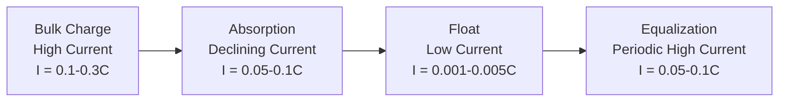
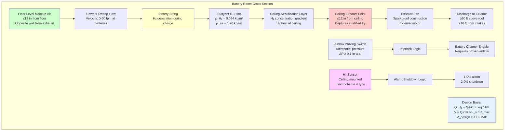

Hydrogen off-gassing during battery charging represents the primary hazard requiring engineered ventilation in stationary battery installations. The electrochemical decomposition of water into hydrogen and oxygen occurs when charging voltage exceeds the gassing threshold of lead-acid cells. Quantifying hydrogen generation rates requires understanding the fundamental electrochemistry, charge current relationships, temperature effects, and battery-specific characteristics. IEEE 1635 and IEEE 484 provide standardized calculation methodologies that account for battery type, charging regime, and operational factors to determine design-basis hydrogen evolution rates.

## Electrochemical Mechanism of Hydrogen Generation

During battery charging, electrical energy converts to chemical energy through electrochemical reactions at the electrode-electrolyte interface. Above a critical voltage threshold, parasitic water electrolysis reactions occur alongside the desired charging reactions.

**Primary charging reaction (lead-acid):**

At the negative plate during charging:

$$\text{PbSO}_4 + 2\text{H}^+ + 2e^- \rightarrow \text{Pb} + \text{H}_2\text{SO}_4$$

At the positive plate during charging:

$$\text{PbSO}_4 + 2\text{H}_2\text{O} \rightarrow \text{PbO}_2 + \text{H}_2\text{SO}_4 + 2\text{H}^+ + 2e^-$$

**Parasitic electrolysis reaction:**

When cell voltage exceeds gassing voltage, water electrolyzes:

At the negative plate:

$$2\text{H}^+ + 2e^- \rightarrow \text{H}_2 \uparrow$$

At the positive plate:

$$2\text{H}_2\text{O} \rightarrow \text{O}_2 \uparrow + 4\text{H}^+ + 4e^-$$

The stoichiometry yields 2 moles H₂ for every 1 mole O₂, creating a 2:1 volumetric ratio of evolved gases.

**Gassing voltage threshold physics:**

The thermodynamic decomposition potential of water at standard conditions:

$$E^0 = 1.229 \text{ V at 25°C}$$

For a lead-acid cell (2.0 V nominal), the gassing voltage appears around 2.30-2.40 V per cell due to:

1. **Overpotential requirements:** Activation overpotential ($\eta_{\text{act}}$) and concentration overpotential ($\eta_{\text{conc}}$) must be overcome before gas evolution proceeds at measurable rates.

2. **Temperature dependence:** The Nernst equation describes voltage-temperature relationship:

$$E = E^0 - \frac{RT}{nF} \ln Q$$

Where:
- $E$ = Cell potential (V)
- $E^0$ = Standard potential (V)
- $R$ = Gas constant (8.314 J/mol·K)
- $T$ = Absolute temperature (K)
- $n$ = Electrons transferred
- $F$ = Faraday constant (96,485 C/mol)
- $Q$ = Reaction quotient

Gassing voltage decreases approximately 3-5 mV per °C temperature increase. At elevated battery temperatures (35-40°C), gassing begins at lower voltages.

**Charge regime comparison:**

| Charge Mode | Voltage per Cell | Gassing Behavior | Hydrogen Generation |
|-------------|------------------|------------------|---------------------|
| Float charge | 2.25-2.30 V | Minimal to none | <1% of equalize rate |
| Recharge (bulk) | 2.35-2.50 V | Moderate at end of charge | 10-30% of equalize rate |
| Equalization | 2.50-2.65 V | Continuous vigorous gassing | Design basis (100%) |
| Fast charge | 2.40-2.60 V | Significant throughout | 50-100% of equalize rate |

Equalization charging represents the worst-case condition for hydrogen generation and establishes the design basis for ventilation calculations.

## Faraday's Law Application to Hydrogen Generation

Faraday's laws of electrolysis provide the theoretical foundation for calculating hydrogen evolution from charging current.

**First Law:** The mass of substance produced at an electrode is proportional to the quantity of electricity (charge) passed.

**Second Law:** The mass of different substances produced by the same quantity of electricity is proportional to their equivalent weights.

**Theoretical hydrogen volume calculation:**

$$V_{\text{H}_2} = \frac{I \cdot t}{n \cdot F} \cdot V_m \cdot N_{\text{cells}}$$

Where:
- $V_{\text{H}_2}$ = Volume of hydrogen at STP (L)
- $I$ = Current per cell (A)
- $t$ = Time (s)
- $n$ = Electrons per molecule H₂ (n = 2)
- $F$ = Faraday constant (96,485 C/mol)
- $V_m$ = Molar volume at STP (22.414 L/mol)
- $N_{\text{cells}}$ = Number of cells

**Hydrogen generation rate (volumetric):**

Taking the time derivative:

$$\dot{V}_{\text{H}_2} = \frac{I \cdot V_m \cdot N_{\text{cells}}}{n \cdot F}$$

Substituting constants:

$$\dot{V}_{\text{H}_2} = \frac{I \cdot 22.414 \cdot N_{\text{cells}}}{2 \cdot 96,485} = 1.162 \times 10^{-4} \cdot I \cdot N_{\text{cells}} \text{ L/s}$$

Converting to ft³/min:

$$\dot{V}_{\text{H}_2} = 2.467 \times 10^{-4} \cdot I \cdot N_{\text{cells}} \text{ ft}^3/\text{min}$$

**Practical efficiency factor:**

Not all charging current produces hydrogen. The current efficiency ($\epsilon$) accounts for:
- Current used for actual battery charging (desired)
- Current consumed by hydrogen/oxygen evolution (undesired)
- Current losses through self-discharge and side reactions

During float charging: $\epsilon_{\text{gassing}} \approx 1$-5%
During equalization: $\epsilon_{\text{gassing}} \approx 15$-30%

Hydrogen generation rate with efficiency factor:

$$\dot{V}_{\text{H}_2,actual} = \epsilon_{\text{gassing}} \cdot 2.467 \times 10^{-4} \cdot I \cdot N_{\text{cells}}$$

## IEEE 1635 and IEEE 484 Calculation Methods

IEEE standards provide empirically-derived equations that incorporate measured battery behavior rather than purely theoretical calculations.

**IEEE 484 empirical equation:**

$$Q_{\text{H}_2} = \frac{N \cdot I \cdot C \cdot F_{\text{eq}}}{1 \times 10^6}$$

Where:
- $Q_{\text{H}_2}$ = Hydrogen generation rate (ft³/min)
- $N$ = Number of cells
- $I$ = Charging current per cell (A)
- $C$ = Capacity factor (dimensionless)
- $F_{\text{eq}}$ = Equalization factor (typically 1.5)

**IEEE 1635 (for VRLA batteries):**

IEEE 1635 provides specific guidance for valve-regulated lead-acid (VRLA) batteries, which employ internal gas recombination:

$$Q_{\text{H}_2,VRLA} = \frac{N \cdot I \cdot K_{\text{VRLA}}}{1 \times 10^6}$$

Where $K_{\text{VRLA}}$ is the VRLA-specific coefficient accounting for recombination efficiency.

**Capacity factor derivation:**

The capacity factor $C$ relates to the current efficiency factor and incorporates empirical corrections:

$$C = f_{\text{battery}} \cdot f_{\text{temp}} \cdot f_{\text{age}}$$

Where:
- $f_{\text{battery}}$ = Battery type coefficient
- $f_{\text{temp}}$ = Temperature correction
- $f_{\text{age}}$ = Aging factor (gassing increases with battery age)

## Hydrogen Generation by Battery Type

Different battery chemistries exhibit distinct hydrogen evolution characteristics based on their electrochemical design and operating principles.

### Flooded Lead-Acid Batteries

Flooded (vented) lead-acid batteries have direct liquid electrolyte contact with plates and allow free gas venting.

**Characteristics:**
- Highest hydrogen generation rate among lead-acid types
- Continuous water loss requires periodic refilling
- Direct gas path from electrodes to vent caps
- No internal recombination mechanism

**Capacity factor:** $C = 0.00042$ (IEEE 484)

**Typical gassing rates:**

At 25°C with equalization charge (2.6 V/cell, 10% of C₁₀ rate):

For 1000 Ah battery (100 A equalization current):

$$Q = \frac{60 \times 100 \times 0.00042 \times 1.5}{10^6} = 3.78 \times 10^{-3} \text{ ft}^3/\text{min}$$

$$Q = 0.227 \text{ ft}^3/\text{hr}$$

### VRLA Batteries (AGM Type)

Absorbed Glass Mat (AGM) batteries immobilize electrolyte in fiberglass mat separators and employ oxygen recombination cycle.

**Oxygen recombination cycle:**

At the positive plate during overcharge:
$$2\text{H}_2\text{O} \rightarrow \text{O}_2 + 4\text{H}^+ + 4e^-$$

Oxygen migrates through starved electrolyte to negative plate:
$$\text{O}_2 + 2\text{Pb} + 2\text{H}_2\text{SO}_4 \rightarrow 2\text{PbSO}_4 + 2\text{H}_2\text{O}$$

This recombination converts evolved oxygen back to water, preventing gas venting under normal conditions.

**Recombination efficiency:** Typically 95-99% during normal operation

**External hydrogen generation:** Only the unreacted hydrogen (1-5%) vents externally

**Capacity factor:** $C = 0.0005$ (slightly higher than theoretical due to incomplete recombination)

**Thermal runaway risk:** Failed recombination can cause thermal runaway with massive gas generation. Ventilation must handle both normal and failure scenarios.

### VRLA Batteries (Gel Type)

Gel batteries use silica-gelled electrolyte, providing even better recombination efficiency than AGM.

**Characteristics:**
- Electrolyte gelled with fumed silica (SiO₂)
- Oxygen transport through microscopic cracks in gel
- Very low water loss
- Lowest gassing rate among lead-acid types

**Capacity factor:** $C = 0.0003$

**Temperature sensitivity:** Gel batteries are more temperature-sensitive. Elevated temperatures can damage gel structure and increase gassing.

### Pure Lead Batteries

Pure lead thin-plate technology uses 99.99% pure lead (versus lead-calcium or lead-antimony alloys) with extremely thin plates.

**Advantages:**
- Minimal grid corrosion
- Lower float voltage (2.23-2.27 V/cell)
- Reduced gassing at float
- Longer service life

**Capacity factor:** $C = 0.0002$ (lowest among lead-acid chemistries)

### Lithium-Ion Batteries

Lithium-ion batteries fundamentally differ from lead-acid in their operating principle and gas generation characteristics.

**Normal operation:** Zero hydrogen generation. The lithium intercalation process is non-gassing:

$$\text{LiC}_6 \leftrightarrow \text{Li}^+ + e^- + \text{C}_6$$

**Abnormal conditions (thermal runaway):**

Electrolyte decomposition at elevated temperatures releases:
- Carbonates and organic solvents (flammable vapor)
- CO, CO₂ (asphyxiant gases)
- HF (toxic gas from LiPF₆ salt decomposition)
- Minimal hydrogen (not the primary concern)

**Ventilation approach:** Event-based rather than continuous. Detection-activated high-volume purge versus continuous dilution for lead-acid.

## Charge Rate Effects on Hydrogen Generation

Hydrogen generation rate exhibits nearly linear relationship with charging current, but current distribution varies by charge stage.

**Charging current profile (constant voltage charging):**

**Current acceptance and gassing:**

| State of Charge | Charge Acceptance | Gassing Current | Notes |
|-----------------|-------------------|-----------------|-------|
| 0-70% SOC | Nearly 100% | <5% of total | Minimal gassing |
| 70-90% SOC | 80-90% | 10-20% of total | Moderate gassing begins |
| 90-100% SOC | 50-70% | 30-50% of total | Significant gassing |
| 100% SOC (equalize) | <30% | >70% of total | Maximum gassing rate |

**Hydrogen generation rate relationship:**

$$Q_{\text{H}_2} = k \cdot I \cdot (1 - \text{SOC})^{-\alpha}$$

Where:
- $k$ = Battery-specific constant
- $I$ = Charging current
- SOC = State of charge (0 to 1)
- $\alpha$ = Empirical exponent (typically 1.5-2.5)

This relationship demonstrates exponential increase in gassing as battery approaches full charge.

**Design implications:**

Equalization charging at 100% SOC provides design-basis hydrogen generation rate, even though it occurs intermittently (monthly or quarterly). Continuous ventilation systems designed for equalization rate safely handle all other charging modes.

## Temperature Effects on Hydrogen Evolution

Battery temperature profoundly affects hydrogen generation through multiple physical mechanisms.

**Thermodynamic effect:**

The Gibbs free energy change for water electrolysis:

$$\Delta G = \Delta H - T\Delta S$$

As temperature increases, the equilibrium potential decreases (Nernst equation):

$$\frac{dE}{dT} = \frac{\Delta S}{nF}$$

For water electrolysis: $\frac{dE}{dT} \approx -0.85 \text{ mV/K}$

**Kinetic effect:**

Reaction rate follows Arrhenius relationship:

$$k(T) = A \exp\left(-\frac{E_a}{RT}\right)$$

Taking the derivative:

$$\frac{dk}{dT} = \frac{E_a}{RT^2} \cdot k$$

For typical activation energies ($E_a = 40$-60 kJ/mol), reaction rate approximately doubles for every 10°C temperature increase (Q₁₀ rule).

**Combined temperature correction:**

IEEE standards recommend temperature correction factor:

$$F_T = 1 + \beta(T - T_{\text{ref}})$$

Where:
- $T$ = Operating temperature (°C)
- $T_{\text{ref}}$ = Reference temperature (25°C)
- $\beta$ = Temperature coefficient (0.010-0.015 per °C)

**Corrected hydrogen generation:**

$$Q_{\text{H}_2,T} = Q_{\text{H}_2,25} \times F_T = Q_{\text{H}_2,25} \times [1 + \beta(T-25)]$$

**Practical example:**

Battery room at 35°C with $\beta = 0.012$:

$$F_T = 1 + 0.012(35-25) = 1.12$$

Hydrogen generation increases 12% compared to 25°C reference.

**Design temperature selection:**

| Climate/Application | Design Temperature | Justification |
|---------------------|-------------------|---------------|
| Air-conditioned telecom facility | 25-30°C | Controlled environment |
| Non-air-conditioned building | 30-35°C | Ambient temperature variations |
| Outdoor enclosure (hot climate) | 40-50°C | Direct solar exposure |
| Outdoor enclosure (cold climate) | 25-30°C | Battery heating maintains minimum temperature |

Conservative design uses maximum anticipated battery temperature over service life.

## Hydrogen Generation Rate Calculation Examples

### Example 1: Flooded Battery String

**System parameters:**
- Battery: 60-cell flooded lead-acid (125 VDC nominal)
- Capacity: 1200 Ah at 8-hour rate
- Equalization charge current: 120 A (0.1C rate)
- Battery type factor: $C = 0.00042$
- Equalization factor: $F_{\text{eq}} = 1.5$
- Operating temperature: 30°C ($\beta = 0.012$)

**Step 1: Calculate baseline hydrogen generation (25°C):**

$$Q_{25} = \frac{N \cdot I \cdot C \cdot F_{\text{eq}}}{10^6} = \frac{60 \times 120 \times 0.00042 \times 1.5}{10^6}$$

$$Q_{25} = \frac{4.536}{10^6} = 4.536 \times 10^{-6} \text{ ft}^3/\text{min}$$

Converting to ft³/hr:

$$Q_{25} = 4.536 \times 10^{-6} \times 60 = 2.72 \times 10^{-4} \text{ ft}^3/\text{hr}$$

**Step 2: Apply temperature correction:**

$$F_T = 1 + 0.012(30-25) = 1.06$$

$$Q_{30} = 2.72 \times 10^{-4} \times 1.06 = 2.88 \times 10^{-4} \text{ ft}^3/\text{hr}$$

**Step 3: Calculate required ventilation (dilution equation):**

$$V_{\text{req}} = \frac{Q_{\text{H}_2} \times 100 \times F_s}{C_{\text{max}}}$$

Where:
- $F_s = 4.0$ (safety factor per IEEE 484)
- $C_{\text{max}} = 1.0\%$ (25% of 4% LEL)

$$V_{\text{req}} = \frac{2.88 \times 10^{-4} \times 100 \times 4.0}{1.0} = 0.115 \text{ ft}^3/\text{hr} = 0.00192 \text{ CFM}$$

**Step 4: Compare to NFPA 1 minimum (1 CFM/ft²):**

Battery room area: 150 ft²

$$V_{\text{NFPA}} = 1.0 \times 150 = 150 \text{ CFM}$$

**Design ventilation rate:**

$$V_{\text{design}} = \max(0.00192, 150) \times 1.25 = 150 \times 1.25 = 187.5 \text{ CFM}$$

Round to standard fan size: **200 CFM**

### Example 2: Multiple VRLA Battery Strings

**System parameters:**
- Configuration: Four parallel VRLA (AGM) strings
- Cells per string: 120 cells (240 VDC nominal)
- Equalization current per string: 80 A
- Battery type factor: $C = 0.0005$ (VRLA AGM)
- Equalization factor: $F_{\text{eq}} = 1.5$
- Operating temperature: 25°C (no correction needed)

**Hydrogen generation per string:**

$$Q_{\text{string}} = \frac{120 \times 80 \times 0.0005 \times 1.5}{10^6} = 7.2 \times 10^{-6} \text{ ft}^3/\text{min}$$

**Total hydrogen generation (4 strings):**

$$Q_{\text{total}} = 4 \times 7.2 \times 10^{-6} = 2.88 \times 10^{-5} \text{ ft}^3/\text{min}$$

$$Q_{\text{total}} = 1.73 \times 10^{-3} \text{ ft}^3/\text{hr}$$

**Required ventilation:**

$$V_{\text{req}} = \frac{1.73 \times 10^{-3} \times 100 \times 4.0}{1.0} = 0.692 \text{ ft}^3/\text{hr} = 0.0115 \text{ CFM}$$

**NFPA 1 minimum (room area = 300 ft²):**

$$V_{\text{NFPA}} = 300 \text{ CFM}$$

**Design rate: 300 × 1.25 = 375 CFM** (NFPA minimum governs)

## Comparison Table: Hydrogen Generation by Battery Type and Charge Rate

| Battery Type | Float Charge (2.27 V/cell) | Bulk Charge (2.4 V/cell) | Equalization (2.6 V/cell) | Capacity Factor | Relative Gassing |
|--------------|--------------------------------|------------------------------|-------------------------------|-----------------|------------------|
| Flooded lead-acid | 0.05-0.1 CFM/1000 Ah | 0.2-0.5 CFM/1000 Ah | 0.8-1.2 CFM/1000 Ah | 0.00042 | 100% (baseline) |
| Lead-calcium flooded | 0.03-0.08 CFM/1000 Ah | 0.15-0.4 CFM/1000 Ah | 0.6-1.0 CFM/1000 Ah | 0.00038 | 90% |
| Lead-antimony flooded | 0.08-0.15 CFM/1000 Ah | 0.3-0.7 CFM/1000 Ah | 1.0-1.5 CFM/1000 Ah | 0.00048 | 115% |
| VRLA AGM | 0.001-0.005 CFM/1000 Ah | 0.1-0.3 CFM/1000 Ah | 0.4-0.8 CFM/1000 Ah | 0.0005 | 70% (external) |
| VRLA Gel | <0.001 CFM/1000 Ah | 0.05-0.2 CFM/1000 Ah | 0.3-0.6 CFM/1000 Ah | 0.0003 | 50% (external) |
| Pure lead thin-plate | <0.001 CFM/1000 Ah | 0.04-0.15 CFM/1000 Ah | 0.2-0.5 CFM/1000 Ah | 0.0002 | 40% |
| Lithium-ion (normal) | 0 CFM | 0 CFM | 0 CFM (no equalization) | N/A | 0% |
| Lithium-ion (thermal runaway) | N/A | N/A | Event-based purge required | N/A | N/A |

*Note: Values assume 100 A charging current and 25°C. Actual rates scale linearly with current and increase ~1.2% per °C above 25°C.*

## Hydrogen Dilution Ventilation System

The following diagram illustrates the complete hydrogen dilution ventilation system showing gas generation, stratification, and dilution airflow paths:

## Monitoring and Detection Systems for Off-Gassing

Continuous hydrogen monitoring provides secondary protection verifying that dilution ventilation maintains safe concentrations.

**Sensor technologies:**

| Technology | Principle | Range | Accuracy | Response Time | Lifespan | Cost |
|------------|-----------|-------|----------|---------------|----------|------|
| Electrochemical | Oxidation at electrode | 0-4% H₂ | ±0.1% | 15-30 s | 2-3 years | $$ |
| Catalytic bead | Combustion heat | 0-100% LEL | ±5% LEL | 10-20 s | 3-5 years | $ |
| Thermal conductivity | Heat transfer difference | 0-100% H₂ | ±2% | 5-10 s | 5-10 years | $$$ |
| Metal oxide semiconductor | Surface resistance change | 0-1000 ppm | ±10% | 30-60 s | 2-5 years | $ |

**Optimal sensor selection for battery rooms:**

Electrochemical sensors provide best balance of accuracy, range, and cost for safety monitoring at concentrations below LEL (0-4%).

**Sensor placement criteria:**

Location requirements based on hydrogen buoyancy physics:
- **Height:** Within 12 inches of ceiling (highest concentration zone)
- **Horizontal position:** At least one sensor per 400 ft² floor area
- **Multiple sensors:** For rooms >500 ft², place sensors in each corner and center
- **Avoid dead zones:** Not behind beams, in corners with poor circulation, or in direct exhaust airflow

**Alarm setpoints:**

$$C_{\text{alarm}} = 0.25 \times \text{LEL} = 0.25 \times 4.0\% = 1.0\%$$

This provides 4:1 safety margin below explosive limit.

$$C_{\text{shutdown}} = 0.50 \times \text{LEL} = 0.50 \times 4.0\% = 2.0\%$$

Immediate charger shutdown and evacuation at this concentration.

**Calibration requirements:**

- Frequency: Quarterly (every 3 months)
- Method: Challenge gas (certified 2.0% H₂ in air)
- Acceptance: Sensor reading within ±10% of challenge gas concentration
- Documentation: Calibration certificate with date, technician, results

## Applicable Standards and References

**IEEE 1635-2018:** IEEE Recommended Practice for the Ventilation and Thermal Management of Batteries for Stationary Applications
- Section 6: Ventilation for hydrogen dilution
- Calculation methods for various battery types
- Temperature effects on generation rates
- Monitoring and control system requirements

**IEEE 484-2019:** IEEE Recommended Practice for Installation Design and Installation of Vented Lead-Acid Batteries for Stationary Applications
- Classic reference for flooded battery ventilation
- Empirical hydrogen generation equations
- Safety factors and design margins

**IEC 62485-2:** Safety requirements for secondary batteries and battery installations – Part 2: Stationary batteries
- International standard for battery room design
- Ventilation calculation methodology
- Gas detection requirements

**UL 1778:** Standard for Uninterruptible Power Supply Equipment
- Requirements for battery compartments in UPS systems
- Ventilation and monitoring specifications

**NFPA 1, Fire Code:**
- Section 52.1.9: Prescriptive ventilation minimum (1 CFM/ft²)
- Applies to all stationary battery installations

**Battery charging standards:**

**IEEE 1187:** IEEE Recommended Practice for Installation Design and Installation of Valve-Regulated Lead-Acid Batteries for Stationary Applications
- VRLA-specific charging recommendations
- Float and equalization voltage specifications
- Temperature compensation requirements

**IEC 61427:** Secondary cells and batteries for renewable energy storage – General requirements and methods of test
- Charging profiles for renewable energy systems
- Cycle life testing protocols

Battery room ventilation design must account for the fundamental electrochemistry of hydrogen evolution during charging. Lead-acid batteries generate hydrogen through water electrolysis when charging voltage exceeds the gassing threshold, with generation rates dependent on battery type, charge current, and temperature. IEEE 1635 and IEEE 484 provide standardized calculation methodologies incorporating empirical battery-specific factors. Conservative design applies safety margins to calculated hydrogen generation rates and compares results to prescriptive code minimums, selecting the larger value. Continuous dilution ventilation with ceiling-level exhaust, proven airflow interlocks, and hydrogen detection systems ensure concentrations remain safely below the 4% explosive limit throughout battery service life.
