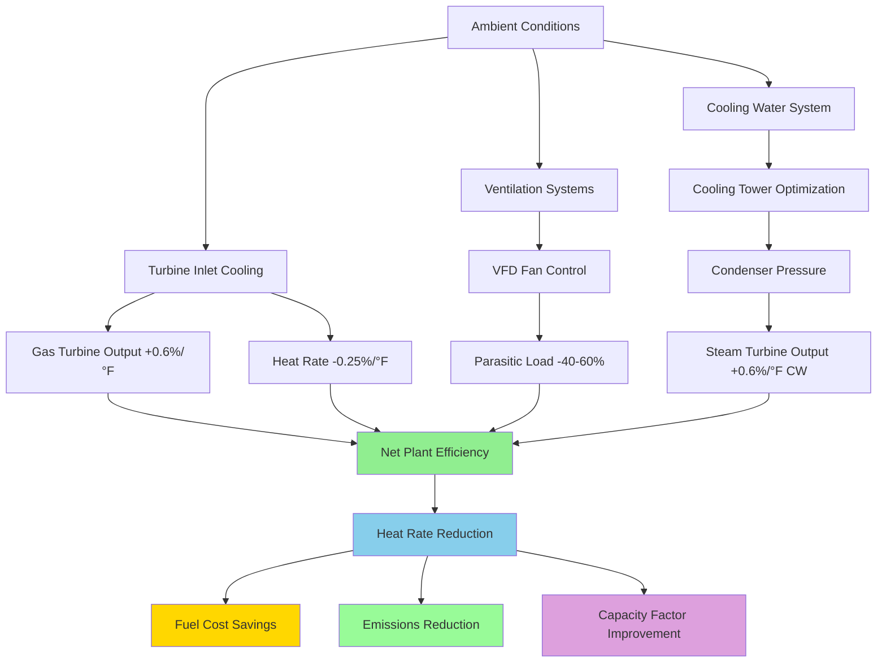

Combined cycle power plants achieve thermal efficiencies of 55-62% by integrating gas turbine (Brayton cycle) and steam turbine (Rankine cycle) systems through heat recovery steam generators (HRSG). HVAC systems directly influence this efficiency through turbine inlet air conditioning, parasitic power consumption, and thermal management of heat-generating equipment. Understanding the thermodynamic relationships between ambient conditions, HVAC interventions, and cycle performance enables quantifiable efficiency optimization.

## Combined Cycle Efficiency Fundamentals

The overall combined cycle efficiency represents the ratio of net electrical output to fuel energy input:

$$\eta_{CC} = \frac{W_{GT} + W_{ST} - W_{aux}}{Q_{fuel}}$$

Where:
- $W_{GT}$ = Gas turbine gross output (kW)
- $W_{ST}$ = Steam turbine gross output (kW)
- $W_{aux}$ = Auxiliary power consumption including HVAC (kW)
- $Q_{fuel}$ = Fuel energy input based on lower heating value (kW)

This expands to component efficiencies:

$$\eta_{CC} = \eta_{GT} + \eta_{ST}(1 - \eta_{GT}) - \frac{W_{aux}}{Q_{fuel}}$$

The steam turbine efficiency term $(1 - \eta_{GT})$ reflects that the Rankine cycle operates on waste heat from the Brayton cycle. Modern combined cycles achieve:

- Gas turbine efficiency: $\eta_{GT}$ = 38-42%
- Steam turbine efficiency contribution: 18-22%
- Auxiliary load penalty: 1.5-3%
- **Net combined cycle efficiency: 55-62%**

## Heat Rate and HVAC Impact

Heat rate quantifies fuel consumption per unit electrical output:

$$HR = \frac{3412.14}{{\eta_{CC}}} \text{ Btu/kWh}$$

At 60% efficiency, heat rate equals 5,687 Btu/kWh. Each 1% efficiency reduction increases heat rate by approximately 95 Btu/kWh, translating to significant fuel cost over annual operation. A 500 MW plant operating at 85% capacity factor consuming 416 Btu/kWh additional fuel represents $3.7 million annual cost at $4/MMBtu gas prices.

HVAC systems influence heat rate through three mechanisms:

**1. Turbine inlet temperature modification**
**2. Parasitic electrical consumption**
**3. Condenser performance via ambient temperature control**

## Turbine Inlet Cooling Thermodynamics

Gas turbine output follows the relationship:

$$W_{GT} = \dot{m}_{air} \cdot c_p \cdot (T_{firing} - T_{exhaust})$$

Where air mass flow rate $\dot{m}_{air}$ varies inversely with inlet air density:

$$\dot{m}_{air} = \rho_{inlet} \cdot V_{compressor}$$

Air density decreases with temperature following the ideal gas law:

$$\rho = \frac{P}{R \cdot T_{inlet}}$$

Combining these relationships, gas turbine output increases approximately **0.5-0.7% per °F reduction** in compressor inlet temperature, while heat rate improves **0.2-0.3% per °F** due to increased cycle pressure ratio.

For a 250 MW (ISO conditions) gas turbine operating at 95°F ambient:

- Cooling inlet air to 55°F (40°F reduction) increases output: 250 MW × 40°F × 0.006/°F = **60 MW gain**
- Heat rate improvement: 0.25%/°F × 40°F = **10% heat rate reduction**

### Evaporative Cooling Efficiency

Evaporative media cooling achieves temperature reduction limited by the wet bulb depression:

$$\Delta T_{max} = T_{db} - T_{wb}$$

Actual temperature reduction depends on media effectiveness:

$$\Delta T_{actual} = \epsilon_{media} \cdot (T_{db} - T_{wb})$$

Where $\epsilon_{media}$ ranges from 0.85-0.95 for rigid media systems. At 95°F dry bulb and 65°F wet bulb:

$$\Delta T_{actual} = 0.90 \times (95 - 65) = 27°F$$

Power increase: 250 MW × 27°F × 0.006/°F = **40.5 MW**

Evaporative cooling parasitic power (pumps, fans) typically consumes 0.3-0.5% of gained output, yielding **net gain of 40-41 MW**.

### Mechanical Chilling Performance

Chiller-based inlet cooling achieves temperature reductions independent of wet bulb temperature:

$$COP_{chiller} = \frac{Q_{cooling}}{W_{compressor}}$$

Typical centrifugal chillers achieve COP of 5.0-6.5 at 45°F supply conditions. For 40°F temperature reduction on 1,000,000 lb/hr inlet air:

$$Q_{cooling} = \dot{m} \cdot c_p \cdot \Delta T = 1,000,000 \times 0.24 \times 40 = 9,600,000 \text{ Btu/hr}$$

Chiller power requirement at COP = 5.5:

$$W_{chiller} = \frac{9,600,000}{3412.14 \times 5.5} = 511 \text{ kW}$$

Net output gain: 60,000 kW - 511 kW = **59,489 kW (99.1% net gain)**

Mechanical chilling economics depend on electricity pricing and capacity market revenues. Peak-period inlet cooling during $150/MWh pricing with $50/MWh off-peak chiller operation yields $100/MWh margin justifying installation.

## Efficiency Factor Comparison

| Parameter | Evaporative Cooling | Mechanical Chilling | Thermal Storage | No Inlet Cooling |
|-----------|--------------------|--------------------|----------------|-----------------|
| **Temperature reduction** | 15-27°F (climate dependent) | 30-45°F (consistent) | 25-40°F (limited duration) | 0°F |
| **Output gain (250 MW base)** | 22-41 MW | 45-68 MW | 38-60 MW | 0 MW |
| **Parasitic consumption** | 0.2-0.4 MW | 8-12 MW | 2-4 MW (charging) | 0 MW |
| **Net efficiency impact** | +8.8-16.2% | +14.8-22.4% | +15.2-22.4% | Baseline |
| **Water consumption** | 600-900 gal/hr | 150-250 gal/hr | 100-200 gal/hr | 0 gal/hr |
| **Capital cost ($/kW)** | $80-120 | $400-600 | $500-800 | $0 |
| **Best application** | Arid climates | High-value peak periods | Capacity markets | Water scarcity |

## Parasitic Load Optimization

Auxiliary power consumption reduces net plant output. HVAC systems represent 15-25% of total auxiliary load in combined cycle facilities. Major HVAC-related parasitic loads include:

**Gas turbine enclosure ventilation:** 200-400 kW (fans)
**HRSG area ventilation:** 150-300 kW (fans)
**Steam turbine hall ventilation:** 100-250 kW (fans)
**Control room and electrical cooling:** 300-600 kW (chillers, fans)
**Inlet air filtration pressure drop:** 100-200 kW (increased compressor work)

Variable frequency drives reduce ventilation fan energy consumption by 40-60% during partial load operation following the fan affinity laws:

$$P_{fan} = P_{design} \times \left(\frac{CFM_{actual}}{CFM_{design}}\right)^3$$

Reducing airflow to 70% of design decreases power to 34% of design: $(0.70)^3 = 0.343$

For a 300 kW ventilation system operating at 70% flow for 6,000 hours annually:

$$Energy_{saved} = 300 \text{ kW} \times (1 - 0.343) \times 6,000 \text{ hr} = 1,182,600 \text{ kWh/yr}$$

At $40/MWh average electricity value: **$47,304 annual savings**

## Condenser Performance and Ambient Conditions

Steam turbine back-pressure directly affects Rankine cycle efficiency per the Carnot limit:

$$\eta_{Carnot} = 1 - \frac{T_{condenser}}{T_{boiler}}$$

Condensing pressure varies with cooling water temperature. Each 1°F increase in condenser temperature increases turbine exhaust pressure by approximately 0.04 in. Hg, reducing output by 0.5-0.7%.

HVAC systems impacting condenser performance:

**Cooling tower optimization:** VFD-controlled fans modulate to minimum wetbulb approach (typically 7-10°F), reducing parasitic fan power while maintaining condenser vacuum.

**Cooling water intake structure:** Ventilation prevents solar heating of intake water, maintaining design temperature. Each 5°F intake water temperature increase reduces steam turbine output by 2.5-3.5%.

## HVAC Efficiency Optimization Strategies

**Integrated optimization approach:**

1. **Inlet cooling during peak periods:** Deploy mechanical chilling or thermal storage when marginal electricity value exceeds incremental fuel cost plus parasitic consumption cost.

2. **Demand-based ventilation:** CO sensors and temperature monitoring modulate ventilation rates to actual thermal loads rather than design maximum, reducing annual fan energy 25-35%.

3. **Free cooling economizers:** Control room and electrical area cooling utilizes ambient air when outdoor temperature falls below 55-60°F, eliminating chiller operation during 40-60% of annual hours in temperate climates.

4. **Heat recovery integration:** HRSG blowdown heat and turbine building exhaust air preheat combustion air or service water, recovering 200-500 MMBtu/hr.

5. **Filtration optimization:** Self-cleaning filter systems maintain inlet pressure drop below 4 in. H₂O versus 6-8 in. H₂O for conventional filters, reducing compressor work equivalent to 0.8-1.2% output gain.

## Performance Standards and Specifications

**ASME PTC 22** (Gas Turbine Performance Test Code) establishes standard reference conditions:

- Inlet temperature: 59°F (15°C)
- Barometric pressure: 14.696 psia (101.325 kPa)
- Relative humidity: 60%

Performance corrections for non-standard conditions:

$$W_{corrected} = W_{measured} \times \sqrt{\frac{T_{std}}{T_{actual}}} \times \frac{P_{actual}}{P_{std}}$$

**ISO 2314** (Gas Turbine Acceptance Tests) requires inlet temperature measurement accuracy of ±0.5°F, directly impacting HVAC system instrumentation calibration requirements.

**NFPA 850** establishes ventilation rates and emergency purge requirements affecting HVAC system sizing and control sequences.

**ASHRAE 169** climate zone classifications inform inlet cooling technology selection based on annual wet bulb temperature distributions and economic analysis of cooling degree-hours.

## Efficiency Calculation Example

500 MW (ISO) combined cycle plant with inlet cooling evaluation:

**Base case (95°F ambient, no cooling):**
- Gas turbine output: 330 MW (derated from 345 MW ISO)
- Steam turbine output: 165 MW
- Auxiliary load: 7.5 MW
- Net output: 487.5 MW
- Heat rate: 6,250 Btu/kWh
- Efficiency: 54.6%

**With evaporative cooling to 70°F:**
- Gas turbine output: 345 MW × [1 + (25°F × 0.006)] = 397 MW
- Steam turbine output: 165 MW (minimal change)
- Auxiliary load: 7.8 MW (includes cooling pumps)
- Net output: 554.2 MW
- Heat rate improvement: 25°F × 0.25%/°F = 6.25%
- New heat rate: 5,859 Btu/kWh
- Efficiency: 58.2%

**Annual economic impact (85% capacity factor):**
- Additional annual generation: 496,000 MWh
- Fuel savings at $4/MMBtu: $7.8 million
- Water cost at $2/1000 gal: $0.4 million
- **Net annual benefit: $7.4 million**

HVAC system optimization in combined cycle plants delivers measurable efficiency improvements through thermodynamic first principles, translating ambient condition management into reduced heat rates, increased output, and improved plant economics.
