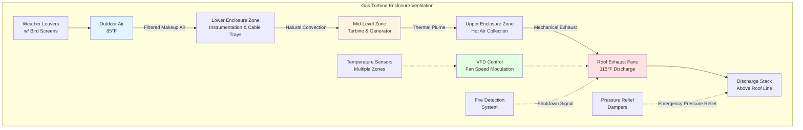

Gas turbine performance exhibits extreme sensitivity to inlet air temperature, making HVAC systems direct revenue-generating assets rather than auxiliary support equipment. Each degree of inlet temperature reduction translates to measurable increases in power output and thermal efficiency. The enclosure ventilation system simultaneously protects instrumentation, manages heat loads, and ensures combustion air quality meets stringent turbine manufacturer specifications.

## Thermodynamic Basis for Inlet Cooling

Gas turbine power output depends fundamentally on compressor mass flow rate and pressure ratio. Inlet air density decreases with temperature according to the ideal gas law, directly reducing mass flow through the compressor at constant volumetric flow:

$$\rho = \frac{P}{RT}$$

Where:
- $\rho$ = Air density (lb/ft³)
- $P$ = Absolute pressure (psia)
- $R$ = Gas constant for air (53.35 ft·lbf/lbm·°R)
- $T$ = Absolute temperature (°R)

Compressor work increases with inlet temperature because higher molecular kinetic energy requires additional compression energy:

$$W_c = \dot{m} c_p (T_2 - T_1) = \dot{m} c_p T_1 \left[\left(\frac{P_2}{P_1}\right)^{\frac{\gamma-1}{\gamma}} - 1\right]$$

Where:
- $W_c$ = Compressor work (Btu/hr)
- $\dot{m}$ = Mass flow rate (lb/hr)
- $c_p$ = Specific heat at constant pressure (0.24 Btu/lb·°F)
- $T_1$ = Compressor inlet temperature (°R)
- $T_2$ = Compressor discharge temperature (°R)
- $\gamma$ = Ratio of specific heats (1.4 for air)

Power output degradation follows empirically from field data:

$$\frac{\Delta P}{P_{\text{ISO}}} \approx -0.006 \times (T_{\text{inlet}} - 59)$$

Where power decreases 0.6% per degree Fahrenheit above ISO conditions (59°F, 14.7 psia, 60% RH). A 170 MW turbine operating at 95°F ambient loses approximately 21.6 MW compared to ISO rating.

Heat rate (fuel consumption per unit power) also degrades with temperature:

$$\frac{\Delta HR}{HR_{\text{ISO}}} \approx 0.002 \times (T_{\text{inlet}} - 59)$$

Representing 0.2% heat rate penalty per degree above ISO. Combined effects create substantial economic incentive for inlet cooling during high-temperature periods.

## Inlet Cooling Technologies

### Evaporative Cooling Systems

Evaporative media or fogging systems cool air through water evaporation, approaching the wet bulb temperature limit. The cooling process follows psychrometric principles where sensible heat converts to latent heat:

$$Q_{\text{evap}} = \dot{m}_{\text{water}} h_{fg}$$

Where:
- $Q_{\text{evap}}$ = Cooling capacity (Btu/hr)
- $\dot{m}_{\text{water}}$ = Water evaporation rate (lb/hr)
- $h_{fg}$ = Latent heat of vaporization (≈1,050 Btu/lb at 80°F)

Media effectiveness determines approach to wet bulb:

$$\eta_{\text{media}} = \frac{T_{\text{db,in}} - T_{\text{db,out}}}{T_{\text{db,in}} - T_{\text{wb,in}}}$$

Where:
- $\eta_{\text{media}}$ = Media effectiveness (typically 85-95%)
- $T_{\text{db,in}}$ = Dry bulb inlet temperature (°F)
- $T_{\text{db,out}}$ = Dry bulb outlet temperature (°F)
- $T_{\text{wb,in}}$ = Wet bulb inlet temperature (°F)

Evaporative cooling performs optimally in arid climates with large wet bulb depression. Phoenix, Arizona with 105°F dry bulb and 65°F wet bulb achieves 34-38°F temperature reduction. Houston, Texas with 95°F dry bulb and 82°F wet bulb achieves only 11-12°F reduction.

**Design considerations:**

- Media thickness 6-12 inches for 85-95% effectiveness
- Water quality requirements: <100 ppm total dissolved solids to prevent scaling
- Drift eliminators limit water carryover to <0.001% of airflow
- Bleed-off controls maintain concentration ratio 3-5:1
- Winter bypass prevents icing and excessive humidification

### Inlet Chilling (Mechanical Refrigeration)

Mechanical chillers cool inlet air below wet bulb temperature, effective regardless of ambient humidity. Chiller capacity balances power augmentation against parasitic consumption:

$$\text{Net Power Gain} = P_{\text{augmentation}} - P_{\text{chiller}}$$

Typical chiller coefficient of performance (COP) ranges 4.0-5.5 for air conditioning applications:

$$\text{COP} = \frac{Q_{\text{cooling}}}{W_{\text{compressor}}}$$

Chiller power consumption typically equals 3-5% of turbine power gain, yielding net benefit. For 15 MW augmentation from 30°F inlet cooling:

- Chiller load: 15,000 kW × 3,412 Btu/kWh = 51.2 MMBtu/hr
- Chiller power (COP = 5.0): 51.2 MMBtu/hr ÷ 5.0 ÷ 3,412 = 3.0 MW
- Net gain: 15.0 - 3.0 = 12.0 MW

Economic viability depends on power price differential between on-peak and off-peak periods. Systems optimally operate during maximum demand hours when capacity value exceeds fuel cost.

**Chiller configurations:**

- Direct expansion (DX) coils: Refrigerant evaporates directly in inlet duct coils
- Chilled water systems: Central chiller plant serves cooling coils via hydronic distribution
- Thermal energy storage: Ice storage charged off-peak provides cooling on-peak without continuous chiller operation

### Inlet Cooling Technology Comparison

| Technology | Temperature Reduction | Climate Suitability | Parasitic Power | Water Consumption | Capital Cost |
|------------|---------------------|---------------------|-----------------|-------------------|--------------|
| Evaporative media | 15-25°F | Arid (<30% RH) | 0.1-0.2% | 2-4 gpm/MW | $50-100/kW |
| High-pressure fogging | 20-30°F | Arid to moderate | 0.2-0.3% | 3-5 gpm/MW | $75-150/kW |
| Mechanical chilling | 25-40°F | All climates | 3-5% | 0.5-1 gpm/MW | $250-400/kW |
| Absorption chilling | 20-35°F | All climates | 0.5-1% | 1-2 gpm/MW | $300-500/kW |
| Thermal storage (ice) | 30-45°F | All climates | 2-3% (average) | 0.5-1 gpm/MW | $400-600/kW |

Capital cost represents incremental cost per kW of peak power augmentation. Water consumption varies with ambient conditions and cooling load.

## Combustion Air Filtration

Gas turbines ingest 400-600 lb of air per second in large industrial units. Airborne particulate causes compressor blade erosion, fouling, and performance degradation. Filtration systems must achieve ISO 8573-1 Class 4 air quality while minimizing pressure drop:

**Particulate concentration limits (ISO 8573-1 Class 4):**
- 0.1-0.5 μm particles: ≤20 mg/m³
- 0.5-1.0 μm particles: ≤8 mg/m³
- 1.0-5.0 μm particles: ≤6 mg/m³

Multi-stage filtration achieves required cleanliness:

**Pre-filter (Stage 1):** Removes particles >10 μm with 80-90% efficiency. Weather louvers prevent rain and snow ingress. Typical pressure drop 0.2-0.4 in. w.g. clean, 0.8-1.2 in. w.g. dirty.

**Main filter (Stage 2):** Bag or cartridge filters capture 1-10 μm particles with 95-99% efficiency. Pressure drop 0.4-0.8 in. w.g. clean, 2.0-3.0 in. w.g. at replacement threshold.

**Final filter (Stage 3):** High-efficiency filters remove submicron particles >0.3 μm with 99%+ efficiency. Pressure drop 0.3-0.6 in. w.g. clean, 1.5-2.5 in. w.g. dirty.

**Pulse cleaning systems:** Automated reverse-pulse air jets remove accumulated dust from cartridge filters, extending service intervals and reducing pressure drop. Cleaning cycles activate on differential pressure setpoint (typically 4-6 in. w.g. total system).

Total filter system pressure drop impacts turbine performance. Each inch of water column pressure drop reduces power output approximately 0.25-0.40%. Clean filter design targets 1.0-1.5 in. w.g. total, with replacement triggered at 4-6 in. w.g.

## Gas Turbine Enclosure Ventilation

Enclosure ventilation removes heat generated by turbine auxiliaries, maintains safe ambient conditions for instrumentation and personnel, and provides combustion air makeup in non-isolated inlet configurations.

### Heat Load Sources

**Turbine casing radiation:** Despite external insulation (4-6 inches mineral fiber), turbine casings operate at 400-600°F surface temperature, radiating 1-3% of turbine output to enclosure.

**Generator losses:** Air-cooled generators reject winding losses, core losses, and windage to ambient. Generator efficiency 98-99% means 1-2% of output appears as heat. For 170 MW generator at 98.5% efficiency: 170 MW × 0.015 × 3,412 Btu/kWh = 8.7 MMBtu/hr.

**Auxiliary equipment:** Lube oil coolers (typically water-cooled), hydraulic systems, gear boxes, and starter motors contribute additional heat.

**Enclosure insulation:** Inadequate enclosure insulation increases radiant heat gain. Well-insulated enclosures limit heat load to 2-3% of turbine output; poorly insulated enclosures reach 5-7%.

Total enclosure heat load calculation for 170 MW turbine:

$$Q_{\text{enclosure}} = 170,000 \text{ kW} \times 0.03 \times 3,412 = 17.4 \text{ MMBtu/hr}$$

Equivalent to 1,450 tons of cooling capacity requiring substantial ventilation airflow.

### Ventilation Design Strategy

Enclosure operates at slight negative pressure (-0.05 to -0.10 in. w.g.) relative to atmosphere, preventing hot exhaust gas leakage while allowing controlled outdoor air infiltration. Mechanical exhaust fans maintain pressure differential:

$$Q_{\text{vent}} = \frac{Q_{\text{heat}}}{1.08 \times \Delta T}$$

Where:
- $Q_{\text{vent}}$ = Ventilation airflow (CFM)
- $Q_{\text{heat}}$ = Heat load (Btu/hr)
- $\Delta T$ = Temperature rise (°F)
- 1.08 = Constant (0.24 Btu/lb·°F × 60 min/hr × 0.075 lb/ft³)

For 17.4 MMBtu/hr with 30°F rise (85°F outdoor, 115°F enclosure):

$$Q_{\text{vent}} = \frac{17,400,000}{1.08 \times 30} = 537,000 \text{ CFM}$$

Typical enclosure dimensions (80 ft × 60 ft × 40 ft = 192,000 ft³) require:

$$\text{ACH} = \frac{537,000 \times 60}{192,000} = 168 \text{ air changes per hour}$$

High air change rates reflect concentrated heat loads in compact enclosures.

### Ventilation System Configuration

**Makeup air introduction:** Low-level wall louvers with gravity-actuated backdraft dampers admit outdoor air. Louvers equipped with:
- Weather protection preventing rain ingress
- Bird and rodent screens (0.5-inch mesh)
- Coarse filters removing large debris
- Acoustic attenuation limiting noise escape

**Exhaust fan location:** Roof-mounted centrifugal or axial exhaust fans extract hot air from upper enclosure zone. Fan selection criteria:
- High-temperature construction (Class B or F insulation rated 130-155°C)
- Spark-resistant construction (AMCA Spark Resistant Type A or B)
- Variable frequency drives modulating capacity with temperature
- Redundant fans ensuring minimum ventilation during maintenance

**Control strategy:** Multiple temperature sensors throughout enclosure provide input to master controller. VFD-controlled fans modulate speed maintaining maximum enclosure temperature 120-140°F depending on equipment specifications. Summer conditions require maximum fan speed; winter conditions reduce to minimum ventilation preventing stratification.

**Fire protection integration:** Fire detection systems interlock with ventilation, shutting exhaust fans and closing dampers to prevent fire spread. Halon or clean agent suppression systems (where permitted) require enclosure tightness maintained by damper closure.

## Acoustic Considerations

Gas turbines generate 95-110 dBA at 3 feet from casing. Enclosure design provides 25-40 dB attenuation preventing community noise impact. HVAC penetrations compromise acoustic performance requiring treatment:

**Intake louvers:** Acoustically lined louver assemblies with internal baffles and absorptive material attenuate 15-25 dB across speech frequencies (500-2000 Hz).

**Exhaust stacks:** Dissipative silencers installed in discharge ductwork provide 20-30 dB insertion loss. Silencer length 5-10 feet depending on required attenuation.

**Ductwork:** Duct-mounted sound attenuators with fiberglass or mineral wool lining reduce breakout noise transmission.

Acoustic treatment increases system pressure drop, requiring fan capacity margin. Budget 0.5-1.0 in. w.g. for intake silencing, 1.0-2.0 in. w.g. for exhaust silencing.

## Standards and Design References

**ISO 2314 (Gas Turbine Acceptance Tests):** Establishes performance test conditions requiring inlet air temperature measurement within ±0.5°F accuracy. Inlet conditioning systems must maintain stable, uniform temperature distribution during test periods.

**ASME PTC 22 (Gas Turbine Performance Test Code):** Defines correction factors translating field performance to ISO conditions. Requires documentation of inlet temperature, pressure, humidity, and fuel composition.

**NFPA 850 (Generation of Electric Power):** Section 9.2 specifies gas turbine enclosure ventilation requirements including minimum air change rates, hazardous area classification, and fire protection system integration.

**ISO 8573-1 (Compressed Air Purity):** Establishes particulate, moisture, and oil contamination classes for compressed air systems. Class 4 particulate limits apply to turbine inlet filtration.

**Manufacturer specifications:** OEM requirements supersede general standards. GE, Siemens, Mitsubishi, and other manufacturers publish inlet air quality specifications, maximum enclosure temperatures, and ventilation criteria in site requirement documentation.

Gas turbine inlet conditioning and enclosure ventilation represent sophisticated thermodynamic optimization where HVAC engineering directly impacts megawatt output and operational revenue. Proper system design maximizes power production while protecting multimillion-dollar turbine assets.
