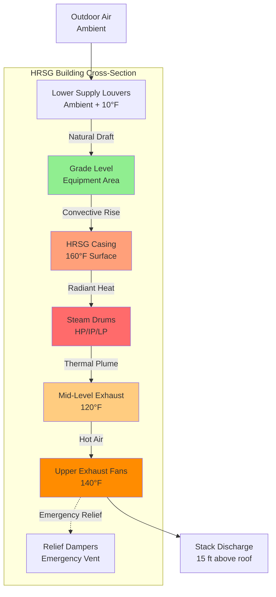

Heat recovery steam generators operate with exhaust gas temperatures ranging from 1000-1100°F at the inlet to 200-300°F at the stack, creating extreme thermal environments requiring engineered ventilation solutions. HRSG enclosures experience heat loads from multiple sources: radiant emission from high-temperature casings, convective transfer from steam piping operating at 400-1050°F, and latent heat release from steam leaks at drum connections and valve packings. The HVAC engineering challenge involves managing heat densities exceeding 75-125 Btu/hr-ft² while maintaining safe working temperatures and preventing condensation during transient conditions.

## Heat Load Analysis

HRSG enclosure heat loads derive from three primary mechanisms, each requiring distinct calculation approaches.

**Radiant heat transfer** from HRSG casing surfaces dominates the thermal load. The casing surface temperature typically ranges from 140-180°F depending on insulation thickness and ambient conditions. Radiant heat flux follows the Stefan-Boltzmann relationship:

$$q_{rad} = \epsilon \sigma A (T_s^4 - T_\infty^4)$$

where:
- $\epsilon$ = surface emissivity (0.85-0.95 for oxidized steel, 0.25-0.35 for aluminum cladding)
- $\sigma$ = Stefan-Boltzmann constant (0.1714×10⁻⁸ Btu/hr-ft²-°R⁴)
- $A$ = casing surface area (ft²)
- $T_s$ = surface temperature (°R)
- $T_\infty$ = ambient temperature (°R)

For typical HRSG dimensions (60 ft height, 25 ft width, 80 ft length) with average casing temperature of 160°F and enclosure air at 100°F:

$$q_{rad} = 0.90 \times 0.1714 \times 10^{-8} \times 14{,}000 \times (620^4 - 560^4) = 1{,}850{,}000 \text{ Btu/hr}$$

**Convective heat transfer** from steam piping contributes significant load, particularly in drum and superheater sections. The convective component calculates as:

$$q_{conv} = h \cdot A \cdot (T_{pipe} - T_{air})$$

where the convective coefficient $h$ for natural convection from horizontal pipes ranges from 1.2-1.8 Btu/hr-ft²-°F depending on pipe diameter and temperature differential.

For a 500 MW combined cycle plant, typical HRSG steam piping inventory includes:
- High-pressure steam (1800 psi, 1050°F): 800 ft of 14-16" pipe
- Intermediate-pressure steam (450 psi, 650°F): 1200 ft of 18-20" pipe
- Low-pressure steam (50 psi, 300°F): 1500 ft of 24-28" pipe

Total piping convective load typically adds 400,000-700,000 Btu/hr depending on insulation effectiveness.

**Steam leak latent heat** represents the variable component. A minor steam leak at high-pressure conditions releases approximately 800 Btu/lb of latent heat. A leak rate of 50 lb/hr (typical for aging packings) contributes 40,000 Btu/hr while creating localized humidity requiring dilution ventilation.

The total HRSG enclosure heat load combines as:

$$Q_{total} = Q_{rad} + Q_{conv} + Q_{steam} + Q_{equipment}$$

where $Q_{equipment}$ includes feed pumps, circulation pumps, and control panels typically contributing 150,000-250,000 Btu/hr.

## Ventilation System Design

HRSG ventilation employs stratified multi-level exhaust to manage thermal gradients efficiently. Hot air accumulates at upper levels near steam drums while cooler replacement air enters at grade level, establishing natural convective flow.

**Natural ventilation** provides base load cooling through strategically positioned louvers and relief openings. The driving pressure differential from thermal buoyancy calculates as:

$$\Delta P = 7.64 h \left(\frac{1}{T_{out}} - \frac{1}{T_{in}}\right)$$

where $h$ = vertical distance between inlet and outlet (ft) and temperatures in absolute scale (°R).

For an HRSG building with 50 ft stack height, outdoor temperature of 95°F (555°R), and upper level temperature of 140°F (600°R):

$$\Delta P = 7.64 \times 50 \times \left(\frac{1}{555} - \frac{1}{600}\right) = 0.052 \text{ in. w.g.}$$

This pressure drives airflow through the ventilation path with flow rate determined by:

$$Q = C \cdot A \sqrt{\frac{2 \Delta P}{\rho}}$$

where $C$ = discharge coefficient (0.60-0.65 for louvers), $A$ = free area, and $\rho$ = air density.

**Mechanical ventilation** supplements natural flow during high ambient temperatures or low wind conditions when natural draft proves insufficient.

## Ventilation Requirements by Zone

HRSG enclosures contain distinct thermal zones requiring tailored ventilation strategies:

| Zone | Temperature Limit | Heat Density | Ventilation Rate | Strategy |
|------|------------------|--------------|------------------|----------|
| Upper steam drum level | 140°F | 90-130 Btu/hr-ft² | 15-20 ACH | Mechanical exhaust, lower supply |
| Mid-level superheater | 130°F | 70-95 Btu/hr-ft² | 12-16 ACH | Combined natural/mechanical |
| Lower evaporator section | 120°F | 50-75 Btu/hr-ft² | 10-14 ACH | Natural ventilation preferred |
| Economizer/feed area | 110°F | 30-50 Btu/hr-ft² | 8-12 ACH | Natural ventilation |
| Blowdown tank room | 120°F | 85-110 Btu/hr-ft² | 12-18 ACH | Dedicated mechanical exhaust |
| Deaerator platform | 130°F | 60-90 Btu/hr-ft² | 10-15 ACH | Steam leak mitigation |

Air change rates derive from the sensible heat equation:

$$ACH = \frac{Q}{V \cdot \rho \cdot c_p \cdot \Delta T} \times 60$$

where:
- $Q$ = zone heat load (Btu/hr)
- $V$ = zone volume (ft³)
- $\rho$ = air density (0.075 lb/ft³ at sea level)
- $c_p$ = specific heat (0.24 Btu/lb-°F)
- $\Delta T$ = supply to exhaust temperature rise (°F)

## Humidity Control

Steam leaks introduce moisture requiring active management. The dilution ventilation rate for humidity control calculates independently from thermal requirements:

$$Q_{humid} = \frac{m_{leak} \cdot (W_{leak} - W_{max})}{W_{supply} - W_{max}}$$

where:
- $m_{leak}$ = steam leak mass flow rate (lb/hr)
- $W_{leak}$ = humidity ratio at leak point (lb H₂O/lb dry air)
- $W_{max}$ = maximum acceptable humidity ratio (typically 0.020 lb/lb for 60% RH at 100°F)
- $W_{supply}$ = supply air humidity ratio (lb/lb)

For a 50 lb/hr steam leak from 450 psi intermediate pressure drum:
- Leak completely vaporizes into zone air: $W_{leak}$ approaches saturation
- Maximum zone condition: 100°F, 60% RH corresponds to $W_{max}$ = 0.020 lb/lb
- Outdoor supply air at 95°F, 50% RH: $W_{supply}$ = 0.0169 lb/lb

$$Q_{humid} = \frac{50 \times (1.0 - 0.020)}{0.0169 - 0.020} = -15{,}306 \text{ cfm}$$

The negative result indicates supply air has higher humidity than target, requiring dehumidification or dryer climate conditions. In practice, HRSG ventilation in humid climates operates continuously at design rates, accepting elevated humidity levels (65-70%) in non-electrical zones while protecting electrical equipment through local air conditioning.

## Fire Protection Integration

NFPA 850 mandates HRSG ventilation systems interface with fire detection and suppression. Key requirements include:

**Smoke detection** triggers ventilation system response:
- Normal operation: Mechanical fans continue operating to purge smoke
- High smoke density: Fans shut down to prevent flame spreading through ductwork
- Post-suppression: Fans restart for smoke evacuation

**Natural ventilation openings** must remain functional during power loss, requiring gravity or counterweighted dampers rather than motor-operated types.

**Hydrogen detector integration** for hydrogen-cooled generators located in adjacent turbine buildings requires ventilation interlock preventing hydrogen migration into HRSG areas.

## Equipment Selection

**Exhaust fans** for HRSG applications operate in sustained 120-140°F ambient with periodic excursions to 160°F during upset conditions. Fan construction requires:
- Class B or F motor insulation (311-356°F rating)
- High-temperature bearings with synthetic lubricants
- Spark-resistant construction (AMCA Type A) for zones with combustible gas potential
- Seismic qualification per ASCE 7 for essential facilities

**Supply louvers** providing natural ventilation area require:
- Free area ratio ≥ 0.70 to minimize pressure drop
- Corrosion-resistant construction (aluminum or stainless steel) for coastal environments
- Insect screening (0.25" maximum mesh) without significantly reducing free area
- Storm-resistant design for 150 mph wind zones per ASCE 7

**Relief dampers** for emergency ventilation activate through:
- Fusible links (165°F rating) for fire-induced overpressure
- Pneumatic operators on temperature high alarm (adjustable 125-145°F)
- Manual override capability for testing and maintenance

## Supplementary Firing Impact

HRSGs equipped with duct burners experience elevated exhaust gas temperatures (1600-1800°F at burner outlet) increasing radiant heat emission from the HRSG casing. Supplementary firing operation typically increases enclosure heat load by 25-35% requiring proportional ventilation capacity increase.

Temperature sensors monitoring upper-level air temperature modulate mechanical exhaust fans to maintain setpoint during firing transitions. Variable frequency drives enable fan capacity modulation from 40-100%, matching ventilation rate to actual heat load rather than operating continuously at design maximum.

## Standards References

**NFPA 850** (Generation of Electric Power) Section 8.4 establishes ventilation requirements including minimum air change rates, smoke detection integration, and emergency ventilation provisions.

**ASME PTC 4.4** (Gas Turbine Heat Recovery Steam Generators) defines thermal performance testing protocols including ambient condition measurement affecting HVAC system verification.

**ASHRAE Applications Handbook Chapter 28** (Power Plants) provides heat load estimation methods and ventilation design guidance specific to HRSG installations.

**OSHA 29 CFR 1910.146** (Permit-Required Confined Spaces) applies to HRSG internal access requiring ventilation air quality verification before entry.

HRSG building ventilation represents critical thermal management infrastructure where precise engineering directly influences maintenance safety, equipment reliability, and operational flexibility across all plant load conditions.
