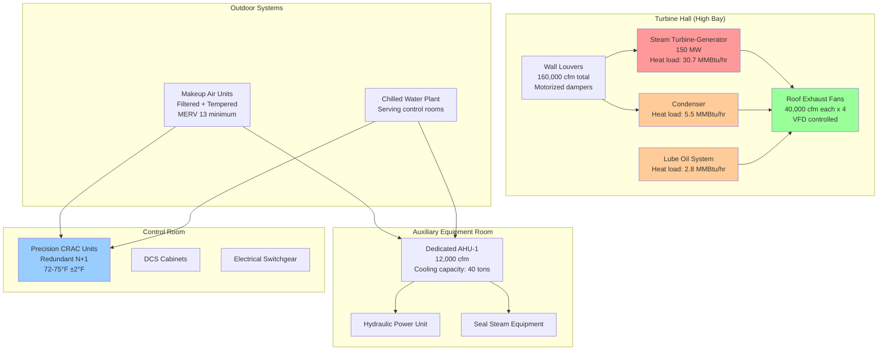

Steam turbine buildings in combined cycle power plants present unique HVAC challenges stemming from high radiant and convective heat loads, elevated humidity from steam leakage, and critical auxiliary equipment requiring precision climate control. The turbine-generator typically occupies a high-bay structure with heat densities ranging from 3-8% of turbine nameplate capacity, while adjacent electrical and control rooms demand tight temperature and humidity tolerances.

## Heat Load Analysis

The steam turbine building heat load comprises several distinct components requiring individual quantification for accurate HVAC system sizing.

**Turbine-generator radiation and convection:**

The primary heat source originates from the turbine casing and steam piping surfaces. Heat transfer follows the combined radiation and convection relationship:

$$Q_{turbine} = A \cdot \varepsilon \cdot \sigma \cdot (T_s^4 - T_\infty^4) + h_c \cdot A \cdot (T_s - T_\infty)$$

Where:
- $Q_{turbine}$ = total heat transfer rate (Btu/hr)
- $A$ = external surface area of turbine and piping (ft²)
- $\varepsilon$ = surface emissivity (0.85-0.95 for oxidized steel)
- $\sigma$ = Stefan-Boltzmann constant (0.1714×10⁻⁸ Btu/hr·ft²·°R⁴)
- $T_s$ = surface temperature (°R)
- $T_\infty$ = ambient air temperature (°R)
- $h_c$ = convection coefficient (1.0-2.5 Btu/hr·ft²·°F depending on air velocity)

For preliminary design, turbine-generator heat rejection approximates 5-7% of turbine output for installations with standard insulation:

$$Q_{design} = 0.05 \text{ to } 0.07 \times P_{turbine}$$

A 150 MW steam turbine therefore contributes approximately:

$$Q_{design} = 0.06 \times 150,000 \text{ kW} \times 3412 \text{ Btu/kWh} = 30.7 \times 10^6 \text{ Btu/hr}$$

**Condenser heat gain:**

Surface condensers reject 50-60% of total cycle heat input. While the majority transfers to cooling water, the condenser shell radiates heat to the surrounding space. Typical condenser shell temperatures range from 100-120°F, contributing 0.5-1.0% of rejected heat to building load.

**Auxiliary equipment:**

Lube oil coolers, hydraulic power units, seal steam condensers, and gland steam exhausters add localized heat sources. These equipment loads typically sum to 1-2% of turbine output.

**Building envelope loads:**

Solar radiation, transmission through walls and roof, and infiltration complete the load profile. In hot climates, envelope loads can equal 20-30% of internal equipment loads.

## Turbine Hall Ventilation Strategies

The turbine hall requires ventilation system design balancing heat removal effectiveness against capital cost and operating energy consumption. The fundamental ventilation heat removal equation:

$$Q_{vent} = \dot{m} \cdot c_p \cdot \Delta T = \rho \cdot \dot{V} \cdot c_p \cdot (T_{exhaust} - T_{supply})$$

Where:
- $Q_{vent}$ = heat removal rate (Btu/hr)
- $\dot{m}$ = mass flow rate (lb/hr)
- $c_p$ = specific heat of air (0.24 Btu/lb·°F)
- $\rho$ = air density at supply conditions (lb/ft³)
- $\dot{V}$ = volumetric flow rate (cfm)
- $T_{exhaust}$ = exhaust air temperature (°F)
- $T_{supply}$ = supply air temperature (°F)

Air change rate relates to volumetric flow and building volume:

$$ACH = \frac{\dot{V} \times 60}{V_{building}}$$

For a turbine hall with volume of 500,000 ft³ requiring 10 ACH:

$$\dot{V} = \frac{10 \times 500,000}{60} = 83,333 \text{ cfm}$$

If supply air enters at 85°F and exhaust air exits at 95°F, heat removal capacity:

$$Q_{vent} = 83,333 \times 60 \times 0.075 \times 0.24 \times (95-85) = 9.0 \times 10^6 \text{ Btu/hr}$$

### Ventilation System Comparison

| Ventilation Strategy | Capital Cost | Operating Cost | Heat Removal Effectiveness | Applicability |
|---------------------|--------------|----------------|---------------------------|---------------|
| Natural ventilation (roof monitors + wall louvers) | Low ($50-100/cfm) | Zero | 60-70% (wind/temperature dependent) | Moderate climates, low humidity |
| Power-assisted natural (exhaust fans + wall louvers) | Medium ($100-150/cfm) | Low (fan power only) | 75-85% | Most climates, humidity < 70% |
| Mechanical supply/exhaust (fans both ends) | High ($200-300/cfm) | Medium (dual fan power) | 85-95% | High humidity, extreme climates |
| Evaporative cooling + mechanical ventilation | High ($250-350/cfm) | Medium-High (water + power) | 90-95% | Arid climates (RH < 40%) |
| Direct expansion cooling | Very High ($400-600/cfm) | High (compressor power) | 95-98% | Critical control areas only |

Natural ventilation exploits stack effect and wind pressure differentials. The stack effect driving pressure:

$$\Delta P_{stack} = C \cdot h \cdot \left(\frac{1}{T_{outside}} - \frac{1}{T_{inside}}\right)$$

Where:
- $\Delta P_{stack}$ = available pressure (in. w.g.)
- $C$ = 7.64 (constant for standard air)
- $h$ = height between inlet and outlet (ft)
- $T$ = absolute temperature (°R)

For a 60 ft tall turbine hall with inside temperature of 95°F and outside temperature of 75°F:

$$\Delta P_{stack} = 7.64 \times 60 \times \left(\frac{1}{535} - \frac{1}{555}\right) = 0.031 \text{ in. w.g.}$$

This modest pressure differential limits natural ventilation effectiveness, typically requiring mechanical assistance for reliable performance.

## HVAC System Architecture

## Zone-Specific Design Requirements

**Turbine hall (high bay):**

Design conditions maintain space temperature below 95°F during peak summer operation and above 50°F during winter to prevent condensation on equipment surfaces. Ventilation rates of 6-10 ACH typically suffice, with exhaust fans located at the roof peak to capture thermal plume. Supply air enters through low-level wall louvers, establishing floor-to-ceiling air movement pattern.

Temperature stratification in high-bay spaces follows:

$$\frac{dT}{dz} \approx \frac{Q_{total}}{A_{floor} \cdot h \cdot \rho \cdot c_p \cdot \dot{V}}$$

Stratification gradients of 0.3-0.8°F per vertical foot are common, requiring exhaust temperature measurements at actual fan location rather than occupancy level.

**Condenser area:**

The condenser bay requires enhanced ventilation due to concentrated heat loads and potential steam leakage. Design provides 12-15 ACH with dedicated exhaust capacity independent of main turbine hall systems. Humidity control maintains RH below 60% to prevent corrosion of structural steel and electrical equipment.

Dew point monitoring prevents condensation:

$$T_{dewpoint} = T - \frac{100 - RH}{5}$$

For 85°F space temperature at 60% RH:

$$T_{dewpoint} = 85 - \frac{100 - 60}{5} = 77°F$$

All surfaces must remain above 77°F to prevent condensation, influencing insulation requirements for chilled water piping and cool surfaces.

**Generator and exciter enclosure:**

Air-cooled generators require ventilation air quantities based on:

$$\dot{V}_{generator} = \frac{Q_{generator}}{\rho \cdot c_p \cdot \Delta T_{allowable}}$$

Typical generator losses range 0.5-0.8% of rating. For a 160 MVA generator at 0.6% loss:

$$Q_{generator} = 0.006 \times 160,000 \text{ kVA} \times 3412 \text{ Btu/kVA} = 3.3 \times 10^6 \text{ Btu/hr}$$

Allowing 20°F temperature rise:

$$\dot{V}_{generator} = \frac{3.3 \times 10^6}{0.075 \times 60 \times 0.24 \times 20} = 152,777 \text{ cfm}$$

Hydrogen-cooled generators instead use closed-loop hydrogen circulation with external heat exchangers, reducing ventilation requirements to envelope losses only.

**Lube oil and hydraulic systems:**

Lube oil reservoirs typically maintain 110-130°F oil temperature via closed-loop cooling with shell-and-tube heat exchangers. Heat rejection to cooling water removes bearing friction losses and pump work. Room ventilation provides 8-12 ACH for safety dilution in case of oil mist release, with oil vapor detection interlocked to emergency exhaust fans.

Fire protection requirements per NFPA 850 mandate automatic fire suppression (typically water spray or gaseous agent) with smoke detection and emergency ventilation purge capability.

**Control and electrical rooms:**

Precision HVAC systems maintain 72-75°F ±2°F with relative humidity 40-50% ±5%. Heat loads derive primarily from DCS cabinets, variable frequency drives, and switchgear. Design provides 1.5-2.0 cfm per square foot of floor area with ASHRAE 62.1 minimum outside air requirements.

Redundancy follows N+1 configuration minimum, with dual independent CRAC units each sized for full load. Automatic changeover occurs on unit failure or maintenance shutdown. Chilled water supply from central plant includes backup chillers ensuring continuous operation.

## Filtration and Air Quality

Steam turbine buildings require balanced filtration protecting equipment while minimizing pressure drop and fan energy. Turbine hall ventilation typically employs MERV 8-11 filters on makeup air, removing large particulate while maintaining reasonable pressure drop (0.3-0.8 in. w.g. clean).

Control rooms demand MERV 13-14 filtration protecting electronic equipment from fine particulate accumulation. Filter pressure drop monitoring triggers replacement at 1.5-2.0 in. w.g., preventing excessive fan energy consumption.

Coastal installations add special considerations for salt-laden air. Corrosion protection requires enhanced filtration (MERV 13 minimum on all makeup air) and periodic internal equipment wash-down cycles.

## Emergency and Safety Systems

Steam turbine buildings incorporate fire detection and suppression systems with HVAC interlocks per NFPA 850. Upon fire detection, control sequences:

1. Shut down normal ventilation fans
2. Close fire/smoke dampers in rated barriers
3. Activate emergency exhaust (if applicable)
4. Maintain control room pressurization
5. Continue precision cooling for shutdown equipment monitoring

Hydrogen leak detection (for hydrogen-cooled generators) activates emergency ventilation providing minimum 4 complete air changes within 7.5 minutes, diluting hydrogen concentration below 25% of lower explosive limit (1% by volume).

## Standards and References

**NFPA 850** - Standard for Fire Protection of Electric Generating Plants establishes turbine building fire protection, ventilation during fire conditions, and hydrogen safety requirements.

**ASHRAE Applications Handbook, Chapter 27** - Power Plants provides design guidance for turbine building ventilation, equipment cooling, and auxiliary system HVAC requirements.

**IEEE 666** - Design Guide for Electric Power Service Systems for Generating Stations specifies environmental conditions for electrical equipment including temperature, humidity, and cleanliness requirements.

**ASME PTC 6** - Steam Turbines Performance Test Code defines test conditions and corrections, influencing building environmental control during performance verification.

Steam turbine building HVAC design requires integration of high-volume ventilation for heat removal with precision climate control for critical auxiliary systems. Proper thermal analysis and system selection directly impact plant reliability, equipment longevity, and operational efficiency.
