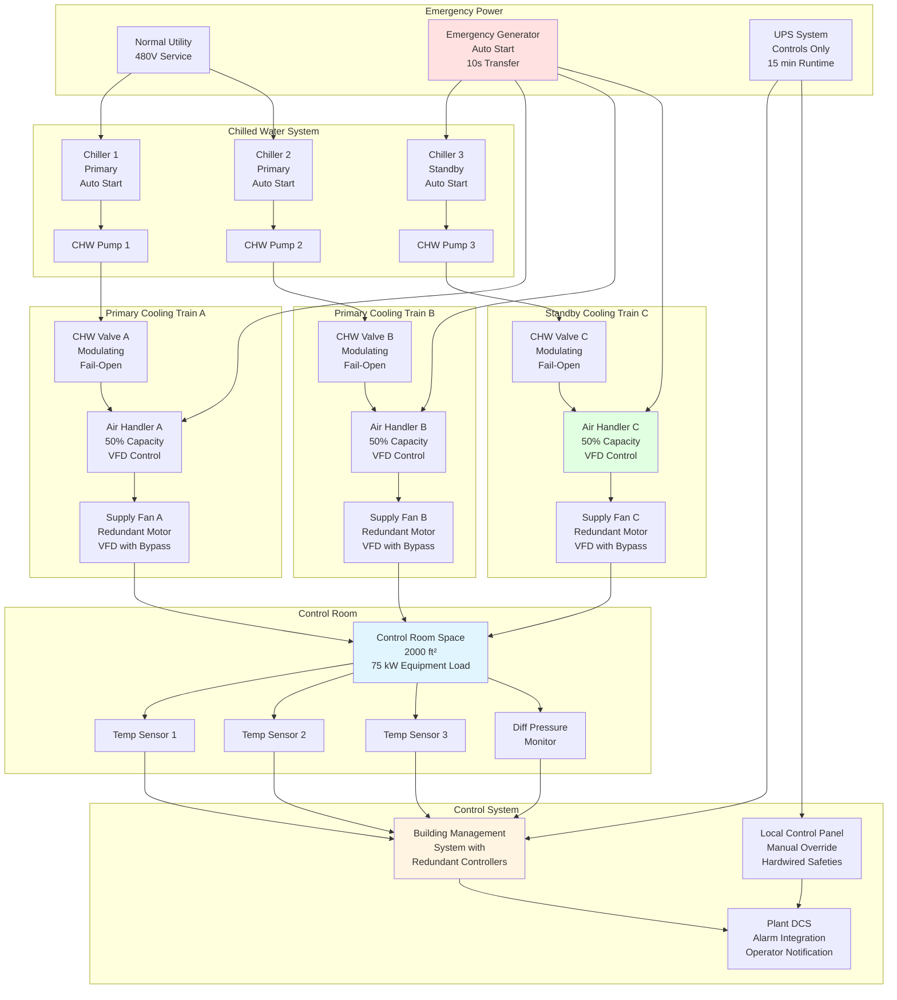

Power plant control rooms operate continuously without interruption for months or years between planned outages. HVAC system reliability directly impacts plant availability—control room temperature excursions force operator evacuation and plant shutdown within minutes. The engineering challenge centers on eliminating single points of failure while maintaining precise environmental control under all operating conditions, equipment failures, and maintenance scenarios.

## Continuous Cooling Load Characteristics

Control room heat loads exhibit minimal variation across 24-hour cycles and seasonal changes. Unlike commercial buildings with occupancy-driven load profiles, control rooms maintain steady-state conditions:

**Electronic Equipment**: Distributed control systems, programmable logic controllers, network switches, operator workstations, and monitoring equipment operate continuously at constant power consumption. This produces time-invariant sensible heat load:

$$Q_{\text{equip}} = \sum_{i=1}^{n} P_i \times 3.413 \text{ BTU/hr per W}$$

where $P_i$ represents actual power consumption of each device. Modern digital control systems generate 75-150 W/ft² compared to legacy analog systems at 30-50 W/ft².

**Occupancy Loads**: Personnel loads vary with shift schedules but contribute minor fraction of total load. For 2,000 ft² control room with 4 operators:

$$Q_{\text{occupants}} = N \times 250 \text{ BTU/hr} = 4 \times 250 = 1,000 \text{ BTU/hr sensible}$$

This represents less than 5% of typical 50,000-100,000 BTU/hr total cooling load.

**Envelope Loads**: Control rooms occupy interior building locations minimizing solar and transmission loads. When exterior exposure exists, high-performance envelope construction limits conduction:

$$Q_{\text{wall}} = U \times A \times \Delta T$$

For R-20 wall (U = 0.050 BTU/hr·ft²·°F), 200 ft² exterior area, 20°F temperature difference:

$$Q_{\text{wall}} = 0.050 \times 200 \times 20 = 200 \text{ BTU/hr}$$

**Total Sensible Load**: Dominated by equipment heat gain, producing near-constant cooling demand:

$$Q_{\text{total}} = Q_{\text{equip}} + Q_{\text{occupants}} + Q_{\text{envelope}} + Q_{\text{lighting}} + Q_{\text{infiltration}}$$

For representative control room: 75,000 BTU/hr base load with ±5% variation across 24-hour period.

## Continuous Operation Design Criteria

### Zero Downtime Tolerance

Control room HVAC systems cannot tolerate scheduled or unscheduled downtime. Temperature rise calculations demonstrate time-critical nature:

**Thermal Response to Cooling Failure**: Heat accumulation rate depends on cooling load density and space thermal mass:

$$\frac{dT}{dt} = \frac{Q_{\text{load}}}{m \times c_p}$$

For 2,000 ft³ control room (10 ft ceiling), air mass: $m = 2,000 \times 0.075 = 150$ lb

With 75,000 BTU/hr cooling load and specific heat $c_p = 0.24$ BTU/lb·°F:

$$\frac{dT}{dt} = \frac{75,000}{150 \times 0.24} = 2,083 \text{ °F/hr} = 35 \text{ °F/min}$$

This simplified calculation (neglecting thermal mass of equipment, furniture, and structure) demonstrates rapid temperature rise potential. Actual rise rates of 10-20°F/hr commonly observed upon cooling failure demonstrate immediate threat to equipment and operations.

**Acceptable Temperature Range**: Electronic equipment specifications typically allow 50-95°F operation but optimal reliability requires 70-75°F. Many facilities establish high temperature alarm at 78-80°F and automatic plant shutdown at 85-90°F, providing 30-90 minute response window before forced shutdown.

### Reliability Requirements

Critical facility HVAC systems achieve reliability through redundancy, component quality, and systematic maintenance:

**Mean Time Between Failures (MTBF)**: Commercial HVAC equipment exhibits MTBF of 20,000-40,000 hours (2.3-4.6 years) depending on component quality and operating conditions. For control room requiring 99.9% availability over 8,760 hours annually:

$$\text{Allowable downtime} = 8,760 \times 0.001 = 8.76 \text{ hours/year}$$

Single equipment train with 30,000-hour MTBF and 4-hour mean time to repair (MTTR) provides:

$$\text{Availability} = \frac{\text{MTBF}}{\text{MTBF} + \text{MTTR}} = \frac{30,000}{30,004} = 0.9999 = 99.99\%$$

However, this assumes immediate failure detection, parts availability, and skilled technicians on-site—unrealistic for most facilities.

**Redundancy Impact on Reliability**: N+1 configuration with three 50% capacity units provides continued operation during single failure. System availability increases dramatically:

$$A_{\text{system}} = 1 - (1 - A_{\text{unit}})^{n-k}$$

where $n$ = total units, $k$ = minimum units required for operation.

For three units, two required, each with 0.999 availability:

$$A_{\text{system}} = 1 - (1 - 0.999)^{3-2} = 1 - (0.001)^1 = 0.999$$

This calculation oversimplifies by neglecting common mode failures, but demonstrates redundancy effectiveness.

## Redundancy Configurations Comparison

| Configuration | Units Installed | Unit Capacity | Total Capacity | Operable After Single Failure | Maintenance Capability | Relative First Cost | Operating Efficiency | Failure Tolerance |
|---------------|-----------------|---------------|----------------|--------------------------------|------------------------|---------------------|----------------------|-------------------|
| **N (No Redundancy)** | 2 | 50% each | 100% | 50% | None without shutdown | 1.0× | Excellent at full load | None |
| **N+1 (Basic)** | 3 | 50% each | 150% | 100% | One unit | 1.5× | Good (2 of 3 running) | Single failure |
| **N+1 (Conservative)** | 3 | 60% each | 180% | 120% | One unit | 1.8× | Good (2 of 3 running) | Single failure + margin |
| **N+2** | 4 | 50% each | 200% | 100% | Two units | 2.0× | Fair (2 of 4 running) | Two simultaneous failures |
| **2N (Full Redundancy)** | 4 | 50% each | 200% | 100% | One complete system | 2.0× | Fair (one system idle) | Complete system failure |
| **2N+1** | 5 | 50% each | 250% | 100% | One complete system + one unit | 2.5× | Fair (multiple units idle) | Any two unit failure |

**Configuration Selection Guidelines**:

- **N+1 Basic**: Commercial facilities, 99.5-99.9% availability target, limited budget
- **N+1 Conservative**: Industrial facilities, power plants, 99.9% availability, oversizing provides load growth capacity
- **N+2**: Critical industrial, infrastructure facilities requiring maintenance flexibility
- **2N**: Nuclear facilities, defense installations, mission-critical applications requiring complete system redundancy
- **2N+1**: Highest reliability requirements, facilities where downtime cost exceeds system cost premium

## System Architecture for Continuous Operation

## Preventive Maintenance Without Downtime

Redundant system architecture enables component maintenance without affecting environmental conditions:

### Planned Maintenance Windows

**Rotating Equipment Service**: Air handlers, pumps, and chillers require quarterly to annual maintenance including filter replacement, belt inspection, bearing lubrication, and performance verification. N+1 redundancy allows isolation of individual units:

1. Verify redundant unit operational status
2. Transfer cooling load to operating units
3. Isolate unit requiring service (close valves, open electrical disconnect)
4. Perform maintenance activities
5. Functional test before returning to service
6. Restore to automatic operation

**Critical Spares Inventory**: On-site spares for long-lead or critical components enable rapid repair:

- Control boards and actuators (4-8 week lead time)
- Fan motors and drives (2-4 week lead time)
- Chilled water valves and actuators (1-2 week lead time)
- Temperature and humidity sensors (immediate replacement)
- Air filters (continuous inventory, quarterly consumption)

### Predictive Maintenance Strategies

**Vibration Monitoring**: Bearing condition monitoring on rotating equipment detects degradation before failure. Elevated vibration trends trigger component replacement during planned maintenance window rather than emergency repair.

**Performance Trending**: Continuous monitoring of supply air temperature, chilled water valve position, fan power consumption, and differential pressure reveals degradation:

- Fouled cooling coils require higher chilled water flow (valve position) for same cooling capacity
- Dirty filters increase fan power consumption and reduce airflow
- Refrigerant charge loss reduces cooling capacity and increases compressor runtime

**Thermal Imaging**: Annual infrared thermography surveys identify electrical connection deterioration, bearing overheating, and valve malfunction before catastrophic failure.

## Critical Facility Standards and Requirements

**ASHRAE Standard 90.1**: Energy efficiency requirements provide exemptions for critical systems including control rooms. Exemptions recognize that redundancy and continuous operation priorities supersede energy optimization for mission-critical applications.

**NFPA 75 - Standard for Protection of Information Technology Equipment**: Establishes environmental requirements:

- Temperature: 64.4-80.6°F (18-27°C) recommended, 59-89.6°F (15-32°C) allowable
- Relative humidity: 40-55% recommended, 20-80% allowable
- Rate of change: 9°F/hr (5°C/hr) maximum
- Dew point: 41.9-59°F (5.5-15°C) recommended

Power plant control rooms typically exceed these guidelines, maintaining tighter 72-75°F range.

**IEEE 323 - Qualifying Class 1E Equipment for Nuclear Power Generating Stations**: Nuclear facilities require equipment qualification for temperature, humidity, radiation, and seismic conditions. Control room HVAC equipment must maintain functionality following design basis events.

**Uptime Institute Tier Standards**: Data center classifications provide framework applicable to control rooms:

- **Tier III**: Concurrently maintainable (N+1 minimum), 99.982% availability
- **Tier IV**: Fault tolerant (2N or 2(N+1)), 99.995% availability

Most power plant control rooms meet or exceed Tier III criteria; nuclear facilities approach Tier IV.

## Failure Mode Analysis and Mitigation

**Single Component Failures**:

- **Air handler failure**: Remaining units automatically increase capacity to maintain temperature setpoint
- **Chilled water valve failure**: Unit operates at reduced capacity; BMS increases remaining unit output
- **Fan motor failure**: Standby unit activates; alarmed to maintenance for repair scheduling
- **Temperature sensor failure**: Control logic switches to redundant sensor; alarmed for replacement

**Cascading Failures**:

- **Chiller plant failure**: Dedicated control room chiller or temporary cooling (portable units) maintains operation during extended chiller outage
- **Electrical supply interruption**: Emergency generator supplies HVAC equipment within 10-30 seconds; UPS maintains control system operation during transfer
- **Multiple simultaneous failures**: 2N redundancy prevents environmental impact; N+1 systems may require temporary portable cooling or controlled shutdown

**Common Mode Failures**: Single events affecting multiple components require additional safeguards:

- **Control system failure**: Local standalone thermostats override BMS, maintaining basic temperature control
- **Chilled water contamination**: Redundant chillers on separate loops prevent total cooling loss
- **Fire suppression activation**: Air handlers automatically shut down during suppression, restart after agent cleared

## Operational Considerations for Continuous Availability

**Load Balancing Strategy**: Operating multiple smaller units at partial capacity rather than minimum number at full capacity provides:

- Improved efficiency through compressor unloading
- Reduced thermal cycling and component wear
- Faster response to load changes
- Lower acoustic noise levels

**Seasonal Adjustment**: Systems designed for peak summer conditions operate at partial load during moderate weather. VFD control reduces fan energy consumption proportional to load reduction. Chilled water temperature reset (raising supply temperature during low loads) improves chiller efficiency.

**Performance Verification Testing**: Quarterly functional tests verify:

- Automatic switchover to standby equipment upon primary failure
- Alarm functionality and operator notification
- Emergency power automatic transfer and operation
- Control system failover to backup controllers
- Temperature and humidity control accuracy

**Documentation Requirements**: Operating procedures, maintenance schedules, equipment specifications, and control sequences documented for operations and maintenance staff. Annual review ensures accuracy as equipment or operating conditions change.

---

**Engineering successful 24/7 control room HVAC systems requires systematic elimination of failure modes through redundancy, quality component selection, comprehensive monitoring, and disciplined maintenance practices. The investment in reliability infrastructure prevents far costlier consequences of environmental control loss: plant shutdown, equipment damage, and personnel safety risks.**
