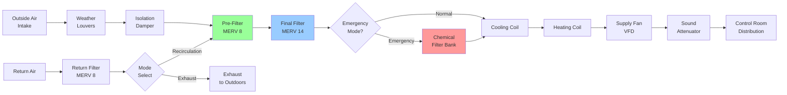

Power plant control room filtration systems protect critical electronic equipment and personnel from airborne particulate contamination, ensuring reliable operation of instrumentation and operator safety during normal and emergency conditions. The filtration strategy must balance high removal efficiency against system pressure drop, energy consumption, and filter replacement intervals while maintaining continuous operation capability.

## Fundamental Filtration Physics

Air filtration operates through four primary particle capture mechanisms, each dominant within specific particle size ranges.

### Particle Capture Mechanisms

**Inertial impaction** dominates for particles >1 μm where particle momentum causes deviation from streamlines at fiber surfaces. Efficiency increases with particle size and air velocity.

**Interception** occurs when particles following streamlines pass within one radius of fiber surfaces. Critical for particles 0.3-1.0 μm.

**Diffusion** governs capture of particles <0.3 μm where Brownian motion causes random particle trajectories, increasing contact probability with fibers. Efficiency increases as particle size decreases.

**Electrostatic attraction** enhances capture when fibers or particles carry electrical charge, improving efficiency across all size ranges in electrostatically charged media.

The **Most Penetrating Particle Size (MPPS)** occurs at approximately 0.3 μm where neither inertial nor diffusion mechanisms dominate, representing the minimum efficiency point for mechanical filters.

## Particulate Removal Efficiency

Filter performance quantification uses penetration and efficiency relationships.

### Single-Pass Efficiency

The fraction of particles removed in one pass through the filter:

$$\eta = \frac{C_{upstream} - C_{downstream}}{C_{upstream}} = 1 - P$$

where:
- $\eta$ = single-pass efficiency (dimensionless, 0-1)
- $C_{upstream}$ = particle concentration entering filter (particles/volume)
- $C_{downstream}$ = particle concentration exiting filter (particles/volume)
- $P$ = penetration fraction (dimensionless, 0-1)

### Arrhenius Efficiency Expression

For penetration through filter media of thickness $L$:

$$P = e^{-\alpha L}$$

where:
- $\alpha$ = filtration coefficient (1/length)
- $L$ = media thickness (length)

This exponential relationship demonstrates that doubling media thickness does not double efficiency but provides diminishing returns.

### Multi-Stage System Efficiency

Control rooms employ series filtration stages. For $n$ filters in series:

$$\eta_{total} = 1 - \prod_{i=1}^{n}(1 - \eta_i) = 1 - \prod_{i=1}^{n}P_i$$

For two-stage filtration with MERV 8 pre-filter ($\eta_1 = 0.70$) and MERV 14 final filter ($\eta_2 = 0.85$):

$$\eta_{total} = 1 - (1-0.70)(1-0.85) = 1 - (0.30)(0.15) = 0.955$$

The system achieves 95.5% efficiency despite neither stage exceeding 85% individually.

### Fractional Efficiency

Filters exhibit size-dependent efficiency. ASHRAE 52.2 tests measure efficiency across three particle ranges:

$$\eta_{composite} = \frac{\sum_{i=1}^{3}(E_i \times \Delta C_i)}{\sum_{i=1}^{3}\Delta C_i}$$

where:
- $E_i$ = efficiency in size range $i$
- $\Delta C_i$ = particle count in size range $i$

## ASHRAE 52.2 Testing Standard

ASHRAE Standard 52.2 provides standardized methodology for filter performance evaluation, replacing the obsolete dust spot and arrestance methods.

### Test Procedure

**Particle generation:** Polydisperse potassium chloride aerosol with controlled size distribution (0.3-10 μm).

**Measurement points:** Upstream and downstream concentrations measured simultaneously with optical particle counters.

**Particle size ranges:**
- Range 1: 0.30-1.0 μm
- Range 2: 1.0-3.0 μm
- Range 3: 3.0-10.0 μm

**Loading protocol:** Synthetic dust loading at controlled intervals with efficiency measurement at initial condition and throughout dust loading cycle until terminal pressure drop.

**Minimum Efficiency Reporting Value (MERV):** Rating from 1-16 based on worst-case (minimum) efficiency across the three size ranges.

### MERV Rating Correlation

| MERV | Range 1 (0.3-1 μm) | Range 2 (1-3 μm) | Range 3 (3-10 μm) | Typical Application |
|------|-------------------|------------------|-------------------|---------------------|
| 8    | <20%             | 20-35%           | 70-75%            | Pre-filtration |
| 11   | 20-35%           | 65-80%           | 80-90%            | Superior commercial |
| 13   | 50-65%           | 85-90%           | 90-95%            | Hospital, control rooms |
| 14   | 75-85%           | 90-95%           | 95-98%            | High-efficiency control rooms |
| 16   | >95%             | >95%             | >95%             | Approaches HEPA performance |

Control rooms typically specify MERV 13-14 for final filtration stages.

## Control Room Filtration Architecture

## Filter Selection for Industrial Environments

Power plant control rooms face unique contamination challenges requiring application-specific filter selection.

### Filter Media Comparison

| Filter Type | Efficiency Range | Initial ΔP | Dust Holding | Moisture Resistance | Cost Factor | Control Room Suitability |
|-------------|-----------------|-----------|--------------|---------------------|-------------|-------------------------|
| Pleated Synthetic | MERV 8-13 | 0.3-0.8 in w.c. | Moderate | Good | 1.0× | Excellent for pre/final |
| Extended Surface | MERV 11-14 | 0.4-0.9 in w.c. | High | Excellent | 1.5× | Ideal for final stage |
| Rigid Box | MERV 13-15 | 0.5-1.2 in w.c. | Very High | Excellent | 2.0× | Nuclear/critical facilities |
| Mini-Pleat | MERV 14-15 | 0.6-1.0 in w.c. | Moderate-High | Good | 1.8× | Compact installations |
| HEPA | 99.97% @ 0.3 μm | 1.0-2.0 in w.c. | Low-Moderate | Fair | 4.0× | Nuclear, emergency mode |
| Activated Carbon | N/A | 0.2-0.5 in w.c. | N/A (chemical) | Poor | 3.0× | Emergency toxic gas |
| Electrostatic | MERV 8-12 | 0.1-0.3 in w.c. | Moderate | Poor | 1.2× | Not recommended (humidity) |

**Note:** Pressure drops listed at rated airflow when clean. Operating pressure increases with dust loading.

### Selection Criteria

**Particulate type:** Coal-fired plants face fly ash (>1 μm), gas turbines face combustion particulates (<1 μm), nuclear plants require HEPA capability.

**Humidity environment:** Coastal or cooling tower drift exposure requires synthetic media with moisture resistance. Cellulose-based media fails when wet.

**Temperature extremes:** Outside air filters may face -40°F to 120°F. Media must maintain structural integrity and efficiency across temperature range.

**Dust loading rate:** High-contamination environments require extended surface area filters (8-12 in depth) to achieve acceptable service life.

**Pressure drop budget:** System fans must overcome filter pressure drop. Higher efficiency generally correlates with higher pressure drop and energy consumption.

## Pressure Drop Analysis

Filter pressure drop increases with face velocity and dust loading, consuming fan energy and reducing airflow.

### Clean Filter Pressure Drop

Initial pressure drop across clean media:

$$\Delta P_{clean} = K \times \frac{\rho V^2}{2g_c}$$

where:
- $\Delta P_{clean}$ = pressure drop (lbf/ft²)
- $K$ = loss coefficient (dimensionless, media-dependent)
- $\rho$ = air density (lbm/ft³)
- $V$ = face velocity (ft/s)
- $g_c$ = gravitational constant (32.174 lbm·ft/lbf·s²)

Typical face velocity: 300-500 fpm (1.5-2.5 m/s) for extended surface filters.

### Loaded Filter Pressure Drop

As dust accumulates, pressure drop increases:

$$\Delta P_{loaded} = \Delta P_{clean} + K_d \times m_{dust}$$

where:
- $K_d$ = dust loading coefficient (in w.c. per oz/ft²)
- $m_{dust}$ = dust mass per unit filter area (oz/ft²)

Filters require replacement when pressure drop reaches 2-3 times clean value or manufacturer-specified maximum (typically 1.5-2.0 in w.c. for final filters).

## System Design Considerations

### Face Velocity Limits

Excessive face velocity reduces efficiency and service life:

| Filter Type | Maximum Face Velocity | Typical Design Velocity |
|-------------|----------------------|------------------------|
| Pre-filter (MERV 8) | 600 fpm | 400-500 fpm |
| Final filter (MERV 13-14) | 500 fpm | 300-400 fpm |
| HEPA filter | 300 fpm | 250 fpm |
| Activated carbon | 400 fpm | 200-300 fpm |

Under-sizing filter area to reduce initial cost increases face velocity, pressure drop, and operating cost while reducing filter life.

### Filter Bank Sizing

Required filter area:

$$A_{filter} = \frac{Q}{V_{face} \times 60}$$

where:
- $A_{filter}$ = filter face area (ft²)
- $Q$ = airflow rate (cfm)
- $V_{face}$ = face velocity (ft/s)

For 10,000 cfm control room with MERV 14 final filter at 350 fpm:

$$A_{filter} = \frac{10,000}{350} = 28.6 \text{ ft}^2$$

Standard 24×24×12 in filters provide 4 ft² each, requiring 8 filters minimum. Design typically includes 10-12 filters for operational margin.

### Differential Pressure Monitoring

Each filter stage requires continuous pressure drop measurement:

**Magnehelic gauges:** Analog indication at air handler for local monitoring. Range 0-2 in w.c. typical for final filters.

**Differential pressure transmitters:** Electronic signal to BMS for trending, alarming, and predictive maintenance scheduling. 0-10 VDC or 4-20 mA output standard.

**Alarm setpoints:**
- Pre-filter: 0.8-1.0 in w.c. (replacement required)
- Final filter: 1.5-2.0 in w.c. (replacement required)
- System total: Based on fan curve and airflow degradation threshold

### Service Life Estimation

Filter replacement frequency depends on contamination loading:

$$t_{service} = \frac{(\Delta P_{final} - \Delta P_{initial}) \times A_{filter}}{K_d \times Q \times C_{average}}$$

where:
- $t_{service}$ = service life (hours)
- $C_{average}$ = average particulate concentration (mass/volume)
- Other terms as previously defined

Typical service life:
- Pre-filters: 3-6 months
- Final filters: 12-24 months
- HEPA filters: 3-5 years (emergency mode only)
- Carbon filters: 2-4 years (depends on chemical exposure)

Actual life varies with local air quality. Urban/industrial sites may see 50% reduction versus rural locations.

## Emergency Mode Filtration

During toxic gas release, fire, or other external hazards, control rooms transition to recirculation mode with enhanced filtration.

### Chemical Filtration

Activated carbon adsorption removes gaseous contaminants:

$$q_e = k_f \times C^{1/n}$$

where:
- $q_e$ = equilibrium loading capacity (mass adsorbate/mass carbon)
- $k_f$ = Freundlich capacity coefficient (depends on adsorbent-adsorbate pair)
- $C$ = gas concentration (mass/volume)
- $n$ = Freundlich intensity parameter (typically 1.5-4)

Carbon beds typically provide 4-6 in depth with 0.5-2 second contact time. Breakthrough testing required for specific contaminants.

### HEPA Filtration

Nuclear facilities require HEPA filtration (99.97% efficiency @ 0.3 μm) for radioactive particulate protection during design basis accidents.

Filter construction: Continuous pleated media, aluminum or stainless steel frame, neoprene or silicone gaskets. Tested per MIL-STD-282 or equivalent.

System design pressure drop budget must accommodate HEPA pressure drop (1.0 in w.c. clean minimum) while maintaining required airflow under emergency conditions.

## Maintenance and Testing

**Visual inspection:** Monthly inspection for media damage, gasket seal integrity, frame deformation.

**In-place testing:** Annual HEPA filter testing using PAO or DOP aerosol challenge with downstream scanning to identify leaks.

**Filter replacement protocol:**
1. System transition to backup unit (N+1 operation)
2. Isolation damper closure
3. Filter bank depressurization
4. Individual filter replacement (dirty to clean direction)
5. Gasket inspection and cleaning
6. Pressure drop verification
7. Return to service with gradual load transfer

**Documentation:** Filter replacement logs include date, pressure drops (before/after), filter types/quantities, labor hours, and disposal method (especially for contaminated filters).

Proper filtration system design and maintenance ensures control room equipment reliability and personnel safety throughout normal operation and emergency scenarios, forming a critical element of power plant availability and regulatory compliance.
