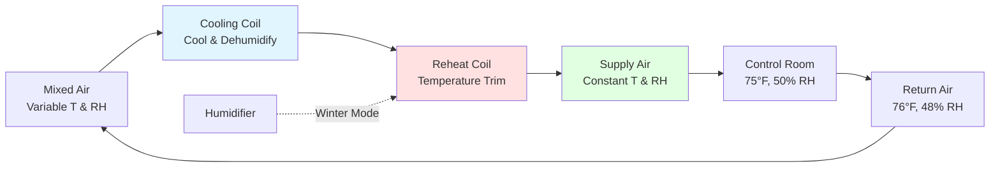
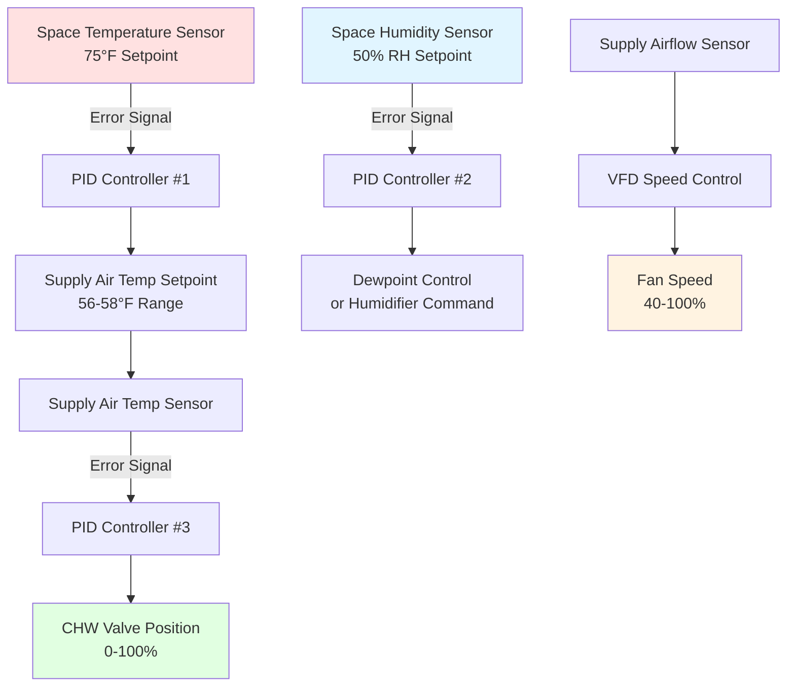

Precision environmental control in power plant control rooms demands thermal and humidity stability exceeding conventional comfort HVAC systems by an order of magnitude. Electronic control equipment requires ±2°F temperature tolerance and ±5% relative humidity tolerance to maintain reliable operation, while operators require comfortable conditions during continuous 12-hour shifts. The simultaneous satisfaction of equipment protection requirements and human comfort standards drives sophisticated control strategies grounded in heat transfer physics and psychrometric principles.

## Temperature Control Physics

### Heat Transfer Fundamentals

Electronic equipment heat rejection follows convective heat transfer principles where sensible cooling capacity must continuously match instantaneous heat generation rates to maintain stable temperature.

The fundamental heat balance equation governing control room thermal stability:

$$Q_{cooling} = Q_{equipment} + Q_{envelope} + Q_{occupants} + Q_{ventilation}$$

Where each term represents instantaneous heat flow in BTU/hr or watts.

**Equipment heat loads** dominate total cooling requirements, typically comprising 70-85% of total heat gain. Modern distributed control systems (DCS) generate heat through:

- Processor power dissipation: $P = V \times I \times (1 - \eta)$ where inefficiency appears as thermal energy
- Power supply losses: 15-25% of DC output power converts to heat
- Display panel backlighting and electronics
- Hard drive mechanical friction and electrical losses

A typical DCS cabinet housing processors, power supplies, I/O modules, and networking equipment generates 3,000-5,000 W continuous heat load. Control rooms with 20-30 equipment cabinets produce 60,000-150,000 W (17-43 tons) from electronics alone.

**Envelope heat gain** through walls, roofs, and windows follows Fourier's law of thermal conduction:

$$Q_{cond} = U \times A \times \Delta T$$

Where:
- $U$ = overall heat transfer coefficient (BTU/hr·ft²·°F)
- $A$ = surface area (ft²)
- $\Delta T$ = temperature difference across assembly (°F)

Control rooms typically occupy interior building locations minimizing envelope exposure. When exterior walls exist, high-performance assemblies (U ≤ 0.05 BTU/hr·ft²·°F) limit conductive gains to <5% of total cooling load.

**Occupant sensible heat** varies with activity level and ambient temperature. Seated operators in 75°F environment generate approximately 250 BTU/hr sensible heat each through metabolic processes.

**Ventilation load** results from introducing outdoor air for pressurization and indoor air quality:

$$Q_{vent} = 1.08 \times CFM \times \Delta T$$

At design conditions (95°F outdoor, 75°F indoor, 1,000 CFM outside air), ventilation sensible load equals 21,600 BTU/hr (1.8 tons).

### Thermal Mass and Temperature Stability

Temperature stability—the critical design objective—depends on system thermal mass and control loop response characteristics.

The rate of temperature change when cooling capacity and heat generation become unbalanced follows:

$$\frac{dT}{dt} = \frac{Q_{net}}{m \times c_p}$$

Where:
- $Q_{net}$ = net heat gain or loss (BTU/hr)
- $m$ = thermal mass (lb)
- $c_p$ = specific heat capacity (BTU/lb·°F)

Control room thermal mass includes:

| Component | Mass Contribution | Specific Heat |
|-----------|------------------|---------------|
| Air volume (10,000 ft³) | 750 lb | 0.24 BTU/lb·°F |
| Equipment (30 cabinets) | 15,000 lb | 0.12 BTU/lb·°F |
| Raised floor structure | 8,000 lb | 0.20 BTU/lb·°F |
| Concrete slab | 45,000 lb | 0.22 BTU/lb·°F |

Total thermal mass: **68,750 lb** with effective specific heat ≈ 0.19 BTU/lb·°F

Thermal capacitance: $C_{thermal} = 68,750 \times 0.19 = 13,063$ BTU/°F

If cooling fails completely with 200,000 BTU/hr continuous heat generation:

$$\frac{dT}{dt} = \frac{200,000}{13,063} = 15.3 \text{ °F/hr}$$

This calculation reveals control rooms reach unacceptable temperatures (>85°F equipment limit) within 40-50 minutes of total cooling loss, emphasizing redundancy requirements.

## Humidity Control Psychrometrics

### Moisture Balance and Latent Loads

Humidity control maintains relative humidity within 40-55% range protecting electronic components from electrostatic discharge (low humidity) and condensation (high humidity) while ensuring operator comfort.

The moisture balance equation:

$$W_{removal} = W_{ventilation} + W_{occupants} + W_{infiltration} - W_{humidification}$$

Where moisture flows are expressed as lb H₂O/hr or grains/hr (7,000 grains = 1 lb).

**Occupant latent heat** varies with activity and temperature. Seated operators at 75°F generate 200 BTU/hr latent heat corresponding to:

$$W_{occupant} = \frac{200 \text{ BTU/hr}}{1,060 \text{ BTU/lb}} = 0.189 \text{ lb/hr} = 1,323 \text{ grains/hr}$$

For 8 operators: 10,584 grains/hr moisture addition.

**Ventilation moisture** depends on outdoor air humidity ratio. At summer design conditions (95°F DB, 78°F WB, W = 0.0141 lb/lb), introducing 1,000 CFM outdoor air into 75°F, 50% RH space (W = 0.0093 lb/lb) adds:

$$W_{vent} = 1,000 \times 60 \times 0.075 \times (0.0141 - 0.0093) = 216 \text{ lb/day} = 9.0 \text{ lb/hr}$$

This represents 63,000 grains/hr moisture ingress requiring continuous dehumidification.

**Infiltration moisture** remains minimal due to positive space pressurization preventing uncontrolled air leakage into conditioned space.

### Psychrometric Processes for Precision Control

Achieving independent temperature and humidity control requires decoupled sensible and latent conditioning processes.

**Cooling and dehumidification** occurs when air contacts chilled water coil surface below dewpoint temperature. Moisture condenses from air stream while sensible cooling reduces dry-bulb temperature.

The coil leaving condition follows the coil apparatus dewpoint (ADP), typically 52-56°F. Mixed air entering at 76°F, 50% RH (dewpoint 55°F) requires coil ADP below 55°F to dehumidify effectively.

Coil sensible heat ratio (SHR):

$$SHR = \frac{Q_{sensible}}{Q_{total}} = \frac{Q_{sensible}}{Q_{sensible} + Q_{latent}}$$

Control room loads with high equipment heat and minimal moisture generation exhibit SHR = 0.85-0.95, requiring relatively warm coil operation avoiding excessive dehumidification.

**Reheat** restores supply air temperature after deep cooling for dehumidification. In low-latent load applications, minimal subcooling occurs, eliminating reheat requirement most operating hours.

During winter with cold, dry outdoor air, **humidification** prevents space humidity from falling below 40% RH minimum. Steam injection humidifiers provide precise control without introducing biological contaminants risk from evaporative systems.

### Humidity Ratio Control Strategy

Maintaining constant space humidity ratio (absolute moisture content) simplifies control and improves stability compared to relative humidity control.

At 75°F design temperature, 50% RH corresponds to humidity ratio W = 0.0093 lb H₂O/lb dry air.

Supply air humidity ratio must equal space humidity ratio for steady-state conditions:

$$W_{supply} = W_{space} = 0.0093 \text{ lb/lb}$$

With known sensible cooling load and required supply-to-space temperature difference (typically 15-20°F), supply air temperature becomes:

$$T_{supply} = T_{space} - \frac{Q_{sensible}}{1.08 \times CFM}$$

For 200,000 BTU/hr sensible load and 10,000 CFM airflow:

$$T_{supply} = 75 - \frac{200,000}{1.08 \times 10,000} = 75 - 18.5 = 56.5°F$$

Supply air at 56.5°F and W = 0.0093 lb/lb corresponds to approximately 80% RH—achievable without reheat energy penalty.

## Equipment Heat Load Distribution

### Spatial Load Concentration

Unlike conventional buildings with relatively uniform heat distribution, control rooms exhibit extreme spatial load concentration around equipment cabinets.

**Cabinet-level heat flux** reaches 500-1,000 W/ft² of floor area directly beneath equipment racks, while unoccupied zones generate minimal heat. This concentration pattern drives distribution design.

| Zone Type | Area (ft²) | Heat Flux (W/ft²) | Total Load (W) |
|-----------|-----------|-------------------|----------------|
| DCS cabinets | 300 | 800 | 240,000 |
| Operator workstations | 400 | 150 | 60,000 |
| Meeting area | 200 | 20 | 4,000 |
| Circulation | 600 | 5 | 3,000 |
| **Total** | **1,500** | **205 avg** | **307,000** |

### Temporal Load Variations

Control room heat loads demonstrate high stability compared to commercial buildings with variable occupancy and lighting schedules.

**Equipment operates continuously** at steady-state power consumption. Modern power management features (processor throttling, display dimming) produce <10% variation between peak and minimum loading.

**Occupant loads vary** with shift changes, meetings, and operational contingencies. Design for maximum occupancy (12-16 personnel) ensures adequate capacity during abnormal events requiring additional operators.

**Seasonal envelope load swing** remains minimal for interior spaces. Exterior control room walls experience summer peak solar gain and winter conductive loss, but high-performance envelope construction limits seasonal variation to <15% of total load.

The 24-hour load profile demonstrates remarkable stability:

```mermaid
gantt
    title Control Room Heat Load Profile (24-Hour Period)
    dateFormat HH:mm
    axisFormat %H:%M

    section Load (kW)
    Equipment (constant) :active, eq, 00:00, 24h
    Base occupants (8 people) :active, occ1, 00:00, 24h
    Additional occupants (4 people) :crit, occ2, 08:00, 8h
    Additional occupants (4 people) :crit, occ3, 16:00, 8h
```

Continuous base load (equipment + minimum occupancy) = 265 kW (76 tons)
Peak load (full occupancy) = 280 kW (80 tons)
Load variation: **5.7%**—effectively constant from HVAC sizing perspective.

## Control System Integration

### Multi-Loop Control Architecture

Precision environmental control requires cascaded control loops addressing:

1. **Primary loop**: Space temperature control
2. **Secondary loop**: Space humidity control
3. **Tertiary loops**: Supply air temperature, chilled water valve position, fan speed

**Proportional-Integral-Derivative (PID) control** provides stable, precise regulation. For space temperature control:

$$u(t) = K_p \times e(t) + K_i \int_0^t e(\tau)d\tau + K_d \frac{de(t)}{dt}$$

Where:
- $u(t)$ = controller output (supply temp setpoint adjustment)
- $e(t)$ = error signal (measured temp - setpoint)
- $K_p$ = proportional gain
- $K_i$ = integral gain
- $K_d$ = derivative gain

Typical tuning parameters for control room temperature control:
- $K_p$ = 3.0 (3°F supply temp change per 1°F space temp error)
- $K_i$ = 0.5 per minute (eliminates steady-state offset)
- $K_d$ = 0.1 minutes (dampens oscillations)

### Sensor Placement and Averaging

Temperature and humidity measurement accuracy directly affects control precision.

**Multiple sensor averaging** eliminates local anomalies and provides representative space conditions. Install 4-6 temperature sensors throughout control room at equipment height (4-6 feet above floor), avoiding:
- Direct supply air impingement locations
- Heat-producing equipment surfaces
- Exterior wall cold surfaces
- Return air grilles

Control algorithm averages readings:

$$T_{space} = \frac{1}{n}\sum_{i=1}^n T_i$$

This averaging approach reduces single-sensor failure impact and improves spatial representation.

**Humidity sensors** require calibration maintenance every 6-12 months. Capacitive RH sensors drift ±3% annually. Deploy three sensors with automated deviation alarming detecting calibration drift or sensor failure.

### Deadband and Throttling Range

**Control deadband** prevents excessive control activity and equipment cycling. Set space temperature deadband at ±0.5°F around 75°F setpoint:
- Cooling enables at 75.5°F
- Heating enables at 74.5°F (if installed)

**Throttling range** defines the error magnitude producing full controller output. For chilled water valve control with 58°F supply air setpoint:
- Valve fully open (maximum cooling) at 62°F supply air
- Valve fully closed at 56°F supply air
- Throttling range: 6°F

Narrow throttling ranges increase control precision but may cause instability. Wide ranges improve stability at the expense of precision. The 6°F range balances competing objectives.

## Operator Comfort Integration

### Thermal Comfort Physics

Human thermal comfort depends on six parameters: air temperature, radiant temperature, humidity, air velocity, metabolic rate, and clothing insulation.

The **predicted mean vote (PMV)** model quantifies thermal sensation:

$$PMV = f(M, W, T_a, T_r, RH, v_{air}, I_{clo})$$

For control room operators:
- Metabolic rate (M) = 1.2 met (seated office work)
- Clothing insulation ($I_{clo}$) = 0.7 clo (business casual)
- Air velocity ($v_{air}$) = 30-50 fpm (low but perceptible)

At 75°F air temperature, 75°F mean radiant temperature, 50% RH, and 40 fpm air velocity, PMV = 0 (neutral thermal sensation). This condition satisfies ASHRAE Standard 55 thermal comfort criteria for >90% occupant acceptance.

**Radiant temperature asymmetry** occurs when equipment cabinets generate radiant heat (surface temperatures 85-95°F) while operators sit 3-5 feet away. Radiant heat transfer follows Stefan-Boltzmann law:

$$Q_{rad} = \sigma \times \epsilon \times A \times (T_{hot}^4 - T_{cold}^4)$$

A 6 ft × 6 ft cabinet face at 90°F (550°R) radiates toward operator at 75°F (535°R):

$$Q_{rad} = 0.1714 \times 0.85 \times 36 \times (550^4 - 535^4) = 3,420 \text{ BTU/hr}$$

This radiant exchange warms operators on the equipment side while cooling operators on room side, creating local discomfort despite acceptable average air temperature.

**Localized air distribution** using adjustable diffusers near operator workstations allows individual velocity adjustment (20-60 fpm) compensating for radiant asymmetry and personal preference.

### Air Velocity and Turbulence

Supply air velocity affects occupant comfort through convective heat transfer coefficient variation.

The convective heat transfer coefficient for human body in moving air:

$$h_c = 2.38 \times v_{air}^{0.5}$$

Where $h_c$ has units BTU/hr·ft²·°F and $v_{air}$ is in fpm.

| Air Velocity (fpm) | $h_c$ (BTU/hr·ft²·°F) | Perceived Cooling |
|-------------------|----------------------|------------------|
| 20 | 10.6 | Still air, possible stuffiness |
| 40 | 15.0 | Comfortable air movement |
| 60 | 18.4 | Noticeable air movement |
| 100 | 23.8 | Strong air movement, drafty |

Target 30-50 fpm at operator workstations provides comfortable convective cooling without draft sensation.

**Turbulence intensity** affects perceived air movement and draft risk. Turbulence intensity (Tu) represents velocity fluctuation magnitude:

$$Tu = \frac{\sigma_v}{\bar{v}} \times 100\%$$

Where $\sigma_v$ is standard deviation of velocity and $\bar{v}$ is mean velocity.

ASHRAE Standard 55 recommends Tu < 40% at occupied zones. Low-turbulence diffusers and adequate mixing distance (>8 feet from supply outlet to occupied zone) achieve acceptable turbulence levels.

## Temperature Rate of Change Limits

### Thermal Shock Prevention

Electronic components experience thermal stress when subjected to rapid temperature changes. Temperature cycling causes:
- Solder joint fatigue through differential thermal expansion
- Circuit board warping and delamination
- Connector contact resistance variation
- Electrolytic capacitor shortened lifespan

Industry standards limit temperature rate of change to **<5°F/hr** during normal operation and **<10°F/hr** during emergency conditions.

The rate of change limit drives HVAC control response characteristics during:
- Seasonal switchover (cooling to heating mode)
- Equipment maintenance transitions
- Load step changes (major equipment energization)
- Outdoor temperature swings

**Control system ramp rate limiting** prevents aggressive setpoint changes:

$$\frac{dT_{setpoint}}{dt} \leq 3 \text{ °F/hr}$$

If control room temperature is 78°F and target is 75°F, controller reduces setpoint at 3°F/hr, reaching target in 60 minutes rather than aggressive immediate correction.

### Load Step Response

When major equipment energizes (e.g., adding 50 kW DCS cabinet), space temperature begins rising unless cooling capacity increases proportionally.

The closed-loop control response time constant:

$$\tau = \frac{C_{thermal}}{UA + 1.08 \times CFM}$$

For control room with $C_{thermal}$ = 13,063 BTU/°F and cooling capacity equivalent to UA + airflow term = 15,000 BTU/hr·°F:

$$\tau = \frac{13,063}{15,000} = 0.87 \text{ hours} = 52 \text{ minutes}$$

After 50 kW (170,500 BTU/hr) load step, space temperature rises following first-order response:

$$T(t) = T_{initial} + \Delta T_{final}(1 - e^{-t/\tau})$$

With adequate control capacity, $\Delta T_{final}$ remains within ±1°F, achieving 63% of change in 52 minutes and 95% in 2.6 hours—well within acceptable thermal stability criteria.

## Performance Verification and Commissioning

Precision control system performance requires functional testing demonstrating:

**Temperature stability test**: Monitor space temperature continuously for 72 hours under steady-state conditions. Verify temperature remains within ±1.5°F of setpoint with <3°F/hr rate of change.

**Humidity stability test**: Monitor space RH continuously for 72 hours. Verify RH remains within ±7% of setpoint (43-57% for 50% RH setpoint).

**Load step response**: Simulate 25% load increase/decrease and measure temperature recovery time and overshoot magnitude.

**Sensor failure simulation**: Disable individual temperature sensors and verify control maintains stability using remaining sensors.

**Equipment failure response**: Simulate cooling unit failure and verify automatic switchover to redundant equipment with <2°F temperature excursion.

Successful commissioning validates precision control capability before placing critical electronic systems in service, preventing costly downtime from environmental excursions.

## Standards and References

**ASHRAE Handbook—HVAC Applications**, Chapter 28: Power plant HVAC systems including control room environmental requirements and design guidance.

**ASHRAE Standard 55**: Thermal Environmental Conditions for Human Occupancy, establishing comfort criteria for occupied spaces including control rooms.

**ISA-S71.04**: Environmental Conditions for Process Measurement and Control Systems, specifying temperature and humidity limits for industrial electronic equipment (50-95°F, 10-90% RH operating range).

**NFPA 75**: Standard for the Fire Protection of Information Technology Equipment, recommending 64-80°F and 40-55% RH for data processing equipment protection.

**IEEE 323**: Qualifying Class 1E Equipment for Nuclear Power Generating Stations, including environmental qualification testing requirements.

**Telcordia GR-63-CORE**: Network Equipment-Building System (NEBS) Requirements establishing environmental criteria for telecommunications equipment applicable to control systems (5-40°C operating, 5-85% RH).

Precision environmental control integrates thermal physics, psychrometric processes, and control theory to deliver the environmental stability demanded by critical power plant control systems while simultaneously maintaining operator comfort throughout continuous operation.
