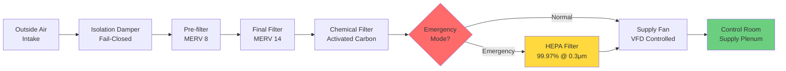
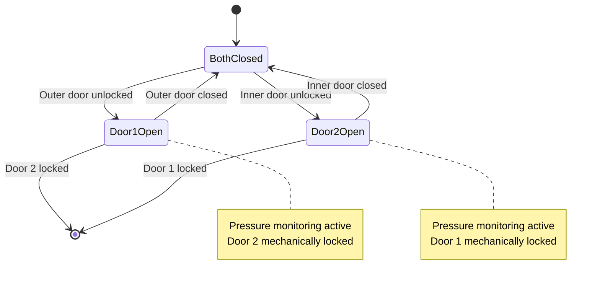

Positive pressurization forms the primary defense mechanism protecting power plant control rooms from external atmospheric threats including smoke, toxic gases, particulate contamination, and radionuclides. The pressurization system must maintain precise differential pressure across building envelope penetrations while accommodating door operation, personnel movement, and emergency isolation scenarios.

## Pressure Differential Physics

The pressure difference between control room and adjacent spaces creates an outward airflow through envelope openings, preventing contaminated air infiltration. The relationship between pressure differential and airflow through openings follows the orifice flow equation:

$$Q = C_d A \sqrt{\frac{2 \Delta P}{\rho}}$$

Where:
- $Q$ = volumetric airflow rate through opening (cfm)
- $C_d$ = discharge coefficient (0.6-0.65 for typical building openings)
- $A$ = effective leakage area (ft²)
- $\Delta P$ = pressure differential (lbf/ft²)
- $\rho$ = air density (0.075 lbm/ft³ at standard conditions)

This square-root relationship demonstrates that doubling the pressure differential increases protective airflow by only 41%, emphasizing the importance of envelope tightness over excessive pressurization.

## Target Pressure Differentials

Power plant control rooms maintain stratified pressure cascades relative to surrounding spaces.

| Adjacent Space | Pressure Differential | Airflow Direction |
|----------------|----------------------|-------------------|
| Outdoors | 0.10-0.15 in. w.c. | Out through envelope |
| Equipment rooms | 0.05-0.08 in. w.c. | Out through doors |
| Office areas | 0.03-0.05 in. w.c. | Out through doors |
| Corridors | 0.02-0.03 in. w.c. | Out through doors |

Nuclear control rooms per IEEE 323 maintain 0.125-0.25 in. w.c. relative to outdoors, with alarm points at 0.10 in. w.c. minimum. These elevated differentials provide additional protection during design basis accident scenarios.

## Makeup Air System Design

### Airflow Requirements

The makeup air system must overcome envelope leakage while maintaining design pressure differential:

$$Q_{makeup} = Q_{leakage} + Q_{exhaust} + Q_{infiltration}$$

For control room pressurization calculations:

$$Q_{leakage} = K_{env} \times A_{env} \times (\Delta P)^{0.65}$$

Where:
- $Q_{leakage}$ = envelope leakage airflow (cfm)
- $K_{env}$ = envelope leakage coefficient (typically 0.1-0.3 for tight construction)
- $A_{env}$ = total envelope area (ft²)
- $\Delta P$ = target pressure differential (in. w.c.)

The 0.65 exponent represents empirical turbulent-laminar flow transition through building cracks and penetrations.

### Filtration Train Configuration

The three-stage filtration (pre-filter, final filter, chemical filter) operates continuously during normal mode. HEPA filters activate only during emergency isolation to minimize pressure drop and fan energy during normal operation. Nuclear facilities maintain continuous HEPA filtration per ASME AG-1 requirements.

## Pressure Control Strategies

### Modulating Control Method

Pressure-independent control maintains constant differential pressure despite varying envelope leakage:

$$Q_{supply} = Q_{base} + K_p (P_{setpoint} - P_{measured}) + K_i \int (P_{setpoint} - P_{measured}) dt$$

The proportional-integral (PI) controller modulates supply fan speed via VFD to maintain pressure setpoint. Typical control parameters:
- Proportional gain $K_p$: 200-400 cfm/in. w.c.
- Integral gain $K_i$: 50-100 cfm/(in. w.c. · min)
- Control dead band: ±0.01 in. w.c.

### Pressure Sensing Configuration

Multiple differential pressure sensors provide redundant measurement and spatial averaging:

1. **Primary sensor:** Control room to outdoors (building automation system input)
2. **Secondary sensor:** Control room to corridor (backup control)
3. **Local indicator:** Wall-mounted magnehelic gauge (operator reference)
4. **Alarm sensor:** Independent safety system input (critical alarm)

Sensor locations avoid dead air spaces, door swing zones, and supply/return air influence. Tubing runs minimize liquid condensation through sloped routing and moisture traps.

## Door Operation and Vestibule Design

### Single Door Pressure Loss

Door opening temporarily connects control room to adjacent space, causing pressure decay. The pressure loss rate depends on door area and opening duration:

$$\frac{dP}{dt} = -\frac{Q_{loss}}{V_{room}} \times \frac{\rho R T}{P_{initial}}$$

For a 7 ft × 3 ft door fully open for 5 seconds, typical pressure recovery time reaches 15-30 seconds after door closure, depending on makeup air capacity.

### Vestibule Configuration

High-traffic entrances employ pressure vestibules maintaining intermediate pressure zones:

**Three-zone pressure cascade:**
- Control room: +0.10 in. w.c. (relative to outdoors)
- Vestibule: +0.05 in. w.c. (relative to outdoors)
- Corridor: 0.00 in. w.c. (neutral pressure)

Vestibule supply air volume must overcome leakage through both door sets while maintaining intermediate pressure. Typical vestibule dimensions: 6-8 ft deep × door width, with dedicated supply diffuser and no return/exhaust.

## Door Interlock Systems

### Sequential Access Control

Door interlocks prevent simultaneous opening of vestibule doors, maintaining contamination barrier:

### Hardware Implementation

**Magnetic lock system:**
- Electromagnetic locks (1,200-1,500 lbf holding force) on both doors
- Key card or biometric access releases single door
- Positional door switches confirm closed status
- Control logic prevents second door unlock until first door closed
- Emergency egress button releases both locks (fire alarm override)

**Mechanical interlock:**
- Deadbolt extending from Door 1 frame blocks Door 2 operation
- Door 2 deadbolt reciprocally blocks Door 1
- No electrical power required (failsafe operation)
- Manual override key accessible from inside only

## Emergency Isolation Mode

### Toxic Gas Detection

External air monitors trigger emergency isolation when threshold exceeded:

| Contaminant | Detection Threshold | Action |
|-------------|---------------------|--------|
| Carbon monoxide | 35 ppm (8-hr TWA) | Close outside air damper |
| Chlorine | 0.5 ppm (15-min STEL) | Emergency isolation mode |
| Ammonia | 25 ppm (15-min STEL) | Emergency isolation mode |
| Smoke (optical) | 5%/ft obscuration | Emergency isolation mode |

Upon emergency isolation:
1. Outside air damper closes (<5 second actuation)
2. System switches to 100% recirculation
3. HEPA/chemical filtration activates
4. Pressure maintained using stored compressed air (bottle cascade)
5. Habitability timer starts (12-72 hour capacity)

### Pressurization Without Makeup Air

During emergency isolation, pressure maintenance requires alternative air source:

$$V_{bottle} = \frac{Q_{leakage} \times t_{hab} \times P_{atm}}{P_{bottle} - P_{atm}}$$

For 1,500 cfm leakage, 24-hour habitability, and 2,400 psig bottles:
$$V_{bottle} = \frac{1,500 \times 1,440 \times 14.7}{2,400 - 14.7} = 13,300 \text{ ft}^3 = \text{eighteen } 300\text{-ft}^3 \text{ bottles}$$

Nuclear facilities employ dedicated breathing air systems or inert gas purge for extended habitability without makeup air.

## Envelope Tightness Requirements

Control room envelope construction targets <0.2 cfm/ft² at 0.1 in. w.c. test pressure. Critical sealing locations:

- Cable/conduit penetrations: Intumescent putty or modular seal systems
- Piping penetrations: Link seal mechanical compression systems
- Door frames: Continuous gasket with compression threshold
- Window frames: Welded or structurally glazed (operable windows prohibited)
- Wall-floor-ceiling joints: Sealed from interior with elastomeric caulk
- HVAC ductwork: Pressure-rated dampers at envelope penetration

Blower door testing during commissioning verifies envelope performance before system turnover.

## Performance Verification and Testing

### Acceptance Testing Protocol

1. **Static pressure test:** Verify design differential with all doors closed, normal occupancy simulation
2. **Door operation test:** Confirm pressure recovery within 30 seconds after door closure
3. **Emergency isolation test:** Verify damper closure time and transition to recirculation mode
4. **Habitability test:** Document pressure maintenance duration in isolation mode
5. **Interlock verification:** Test sequential door operation and lockout function

### Continuous Monitoring

Building automation system trending tracks:
- Differential pressure (5-minute intervals, alarm if <0.08 in. w.c. for >15 minutes)
- Supply fan speed (indicator of envelope degradation if increasing trend)
- Door opening frequency (correlation with pressure excursions)
- Outside air damper position (verification of isolation mode)

Annual verification testing confirms continued envelope integrity and pressurization system performance per original design specifications.

Properly designed and maintained pressurization systems provide reliable contamination exclusion, ensuring control room habitability during normal operation and emergency scenarios critical to continued power plant operation.
