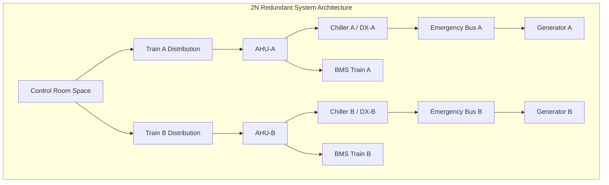
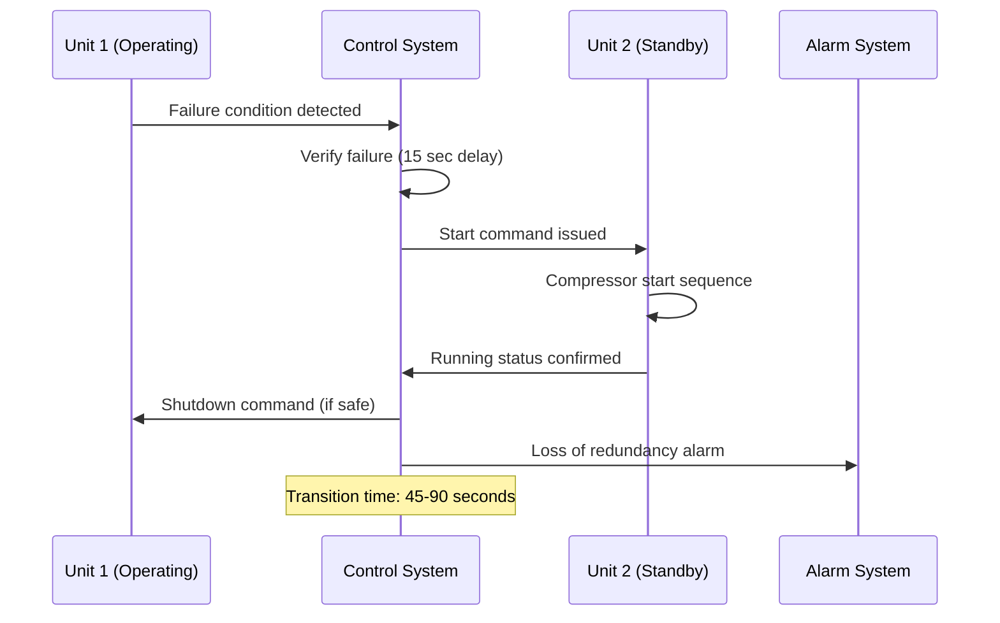

Power plant control room HVAC systems demand absolute continuity of service. Equipment failure resulting in temperature excursions can cause instrumentation malfunction, data corruption, or forced shutdown of generation assets. Redundancy architectures ensure uninterrupted environmental control through strategic equipment duplication, automatic failover mechanisms, and backup power integration.

## Redundancy Configuration Types

### N+1 Redundancy Architecture

N+1 redundancy provides the minimum required cooling capacity (N) plus one additional standby unit (+1). For control rooms, this typically manifests as three independent cooling units where two operate continuously and one remains in hot standby.

**Load distribution for 100-ton control room:**

| Configuration | Unit Capacity | Operating Units | Standby Units | Total Installed |
|---------------|---------------|-----------------|---------------|-----------------|
| N+1 (50% units) | 50 tons each | 2 units | 1 unit | 150 tons |
| N+1 (100% units) | 100 tons each | 1 unit | 1 unit | 200 tons |
| 2N | 100 tons each | 2 units | 0 units | 200 tons |

The 50% capacity approach operates both primary units continuously, sharing the load. This configuration provides:

- Extended equipment life through reduced cycling
- Balanced runtime on all equipment
- Lower single-unit capacity requirements
- Gradual degradation if one unit fails (50% capacity remains)

**Reliability calculation for N+1 with 50% units:**

The system fails only when two units are simultaneously unavailable. Using exponential reliability:

$$R_{system}(t) = 1 - [1 - R_{unit}(t)]^2 \cdot [1 + 2R_{unit}(t)]$$

For units with MTBF = 20,000 hours and one-month mission time (720 hours):

$$R_{unit}(720) = e^{-720/20000} = 0.9648$$

$$R_{system}(720) = 1 - [1 - 0.9648]^2 \cdot [1 + 2(0.9648)] = 0.99987$$

System availability exceeds 99.98% monthly, representing less than 9 minutes of potential downtime.

### 2N Redundancy Architecture

2N redundancy provides two complete, independent systems (2 × N), each capable of full design load. This configuration is standard for nuclear control rooms and high-consequence facilities.

**Key 2N characteristics:**

- Physical separation between redundant trains (separate mechanical rooms)
- Independent electrical feeds from different emergency buses
- Separate chilled water plants or direct expansion circuits
- Isolated ductwork and air distribution systems
- Redundant control systems with manual override

**2N reliability calculation:**

System fails only when both trains fail simultaneously (assuming independence):

$$R_{2N}(t) = 1 - [1 - R_{train}(t)]^2$$

For train reliability of 0.98 over mission duration:

$$R_{2N}(t) = 1 - [1 - 0.98]^2 = 0.9996$$

This represents 99.96% availability compared to 98% for single-train systems.

## Automatic Failover Systems

### Failure Detection Mechanisms

Automatic switchover requires rapid, reliable failure detection across multiple parameters:

**Critical monitoring points:**

| Parameter | Normal Range | Failover Trigger | Response Time |
|-----------|-------------|------------------|---------------|
| Supply air temperature | 72-74°F | >76°F for 2 min | <60 seconds |
| Discharge air temperature | 55-58°F | >65°F for 1 min | <30 seconds |
| Fan status | Running | Stopped | Immediate |
| Compressor status | Running | Stopped >30 sec | <30 seconds |
| Refrigerant pressure | Normal | Low/high alarm | <45 seconds |
| Chilled water flow | Design GPM | <50% design | <30 seconds |

**Logic sequence for automatic failover:**

### Bumpless Transfer Strategies

Maintaining environmental stability during failover prevents thermal shock to electronics:

**Thermal inertia calculation:**

The control room thermal mass provides buffering during unit changeover. For a typical control room:

$$C_{thermal} = m \cdot c_p = \rho \cdot V \cdot c_p$$

Where:
- $\rho$ = air density = 0.075 lb/ft³
- $V$ = room volume = 30,000 ft³
- $c_p$ = specific heat = 0.24 Btu/lb·°F

$$C_{thermal} = 0.075 \times 30,000 \times 0.24 = 540 \text{ Btu/°F}$$

With heat generation of 120,000 Btu/hr (35 kW):

$$\frac{dT}{dt} = \frac{Q}{C_{thermal}} = \frac{120,000 \text{ Btu/hr}}{540 \text{ Btu/°F}} = 222 \text{ °F/hr} = 3.7 \text{ °F/min}$$

This allows approximately 30-45 seconds for failover before noticeable temperature rise, provided equipment thermal mass and building structure are included.

**Improved transfer methods:**

1. **Overlap operation:** Standby unit starts before primary stops, ensuring continuous cooling
2. **Modulated shutdown:** Primary unit ramps down as backup reaches capacity
3. **Pre-cooling:** Standby unit operates at low capacity, ready for immediate full load
4. **Lead-lag rotation:** Units alternate weekly, keeping standby equipment exercised

## Backup Power Integration

### Emergency Generator Coordination

Control room HVAC loads connect to emergency power systems with specific start priorities:

**Typical load sequence:**

| Priority | Equipment | Start Delay | Connected Load |
|----------|-----------|-------------|----------------|
| 1 | Supply fan (VFD at 50%) | 0 sec | 5 kW |
| 2 | Chilled water pumps | 5 sec | 3 kW |
| 3 | Compressor 1 (or chiller) | 10 sec | 25 kW |
| 4 | Supply fan (VFD to 100%) | 15 sec | 10 kW |
| 5 | Compressor 2 (if dual circuit) | 30 sec | 25 kW |

Sequenced starting prevents generator overload during voltage recovery.

**Generator sizing calculation:**

Total HVAC load plus safety margin:

$$P_{generator} = \frac{P_{HVAC} + P_{other}}{\eta_{gen} \cdot PF} \times 1.25$$

For 68 kW HVAC + 50 kW lighting/controls:

$$P_{generator} = \frac{68 + 50}{0.92 \times 0.85} \times 1.25 = 190 \text{ kW}$$

A 200 kW generator provides adequate capacity with margin for motor starting and future loads.

### UPS Integration for Control Systems

HVAC control systems require uninterrupted power during generator transfer (8-10 seconds):

**UPS-backed components:**
- Building management system controllers
- Variable frequency drives (control boards)
- Actuators and damper motors
- Sensors and transmitters
- Alarm panels and annunciators

Typical control load: 2-5 kW requiring 15-minute UPS capacity minimum.

## Reliability Calculations and Predictions

### Mean Time Between Failures (MTBF)

System MTBF derives from component reliability using series-parallel analysis:

**Component MTBF values (typical):**

| Component | MTBF (hours) | Annual Failure Rate |
|-----------|--------------|---------------------|
| Compressor | 50,000 | 0.175 |
| Fan motor | 100,000 | 0.088 |
| Control valve | 80,000 | 0.110 |
| VFD | 75,000 | 0.117 |
| Controller | 150,000 | 0.058 |

For series components (all must function):

$$\frac{1}{MTBF_{series}} = \sum_{i=1}^{n} \frac{1}{MTBF_i}$$

Single cooling unit MTBF:

$$\frac{1}{MTBF_{unit}} = \frac{1}{50000} + \frac{1}{100000} + \frac{1}{80000} + \frac{1}{75000} = 0.0000571$$

$$MTBF_{unit} = 17,500 \text{ hours (2.0 years)}$$

For N+1 parallel redundancy:

$$MTBF_{N+1} = \frac{MTBF_{unit}^2}{2} = \frac{17,500^2}{2} = 153 \text{ million hours}$$

This theoretical value demonstrates the dramatic reliability improvement from redundancy.

### Availability Analysis

Availability accounts for both failure rate and repair time:

$$A = \frac{MTBF}{MTBF + MTTR}$$

With MTTR = 8 hours for emergency repair:

Single unit: $A_{unit} = \frac{17,500}{17,500 + 8} = 0.9995$ (99.95%)

N+1 system experiencing one failure per 2 years with immediate switchover:

$$A_{N+1} = \frac{17,500}{17,500 + 0.5} = 0.99997$$

Annual downtime reduces from 4.4 hours to 15 minutes through redundancy.

## Redundancy Failure Modes

### Common Cause Failures

Redundant systems remain vulnerable to failures affecting all equipment simultaneously:

**Common threats:**
- Loss of facility power (generator failure)
- Chilled water plant failure (for water-cooled systems)
- Control system network failure
- Condenser water supply interruption
- Refrigerant contamination affecting all circuits
- Extreme outdoor temperature exceeding equipment limits

**Mitigation strategies:**
- Diverse cooling methods (split systems + chilled water)
- Independent control networks (hardwired backup)
- On-site emergency chilled water storage
- Geographic separation of equipment
- Different refrigerants in redundant systems

## Maintenance Considerations

Redundancy enables maintenance without environmental impact:

**Scheduled maintenance protocol:**
1. Transfer load to redundant equipment
2. Verify stable operation for 30 minutes
3. Isolate unit requiring service
4. Perform maintenance with adequate time
5. Functional test before returning to service
6. Restore redundancy and verify automatic failover

Annual maintenance includes failover testing under controlled conditions to validate automatic operation and verify transfer time meets requirements.

## Design Best Practices

**Physical separation:** Locate redundant units in separate fire zones with rated barriers

**Independent utilities:** Separate electrical panels, refrigerant circuits, and piping systems

**Capacity verification:** Annual performance testing confirms each unit can handle full design load

**Documentation:** Maintain as-built drawings, control sequences, and failover logic for operators

**Operator training:** Ensure 24/7 staff understands redundancy operation and manual override procedures

Properly designed redundant HVAC systems achieve five-nines availability (99.999%) for power plant control rooms, ensuring continuous environmental control supporting critical generation assets throughout equipment lifecycles and unplanned failures.
