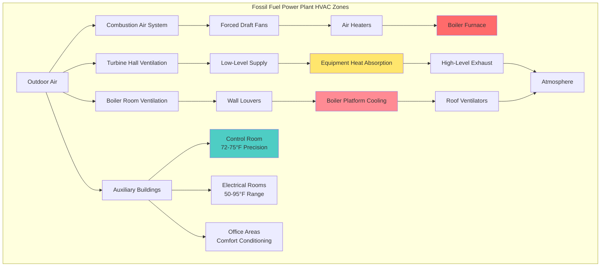

Fossil fuel power plants generate electricity through combustion-driven thermodynamic cycles, creating extreme HVAC challenges from massive heat rejection requirements, combustion air handling, corrosive atmospheres, and equipment protection needs. The HVAC systems in these facilities directly impact generation efficiency, equipment longevity, and personnel safety across multiple operational zones with distinct environmental requirements.

## Thermodynamic Basis of Heat Loads

Fossil fuel plants convert chemical energy to electrical energy through the Rankine cycle for steam plants or Brayton-Rankine combined cycles. The fundamental energy balance governs all HVAC load calculations.

### First Law Energy Balance

Heat input from fuel combustion splits between useful electrical output and rejected heat:

$$Q_{fuel} = W_{electrical} + Q_{rejected} + Q_{stack}$$

Where:
- $Q_{fuel}$ = Heat input from fuel (BTU/hr)
- $W_{electrical}$ = Electrical power output (BTU/hr, 1 kW = 3412 BTU/hr)
- $Q_{rejected}$ = Heat rejected to condenser cooling water (BTU/hr)
- $Q_{stack}$ = Heat lost in flue gas (BTU/hr)

Typical thermal efficiency for fossil plants:
- Subcritical coal: 33-37%
- Supercritical coal: 38-42%
- Natural gas combined cycle: 55-60%
- Simple cycle gas turbine: 30-35%

For a 500 MW coal plant at 38% efficiency:

$$Q_{fuel} = \frac{500 \text{ MW} \times 3412 \text{ BTU/hr per kW}}{0.38} = 4.49 \times 10^9 \text{ BTU/hr}$$

$$Q_{rejected} = Q_{fuel} \times (1 - \eta - \eta_{stack}) = 4.49 \times 10^9 \times 0.50 = 2.25 \times 10^9 \text{ BTU/hr}$$

This rejected heat creates the thermal environment requiring ventilation and cooling.

### Equipment Heat Radiation

Despite insulation, high-temperature equipment radiates heat to the turbine hall following Stefan-Boltzmann radiation law:

$$q_{rad} = \epsilon \sigma A (T_{surface}^4 - T_{ambient}^4)$$

Where:
- $\epsilon$ = Emissivity (0.05-0.10 for insulated surfaces)
- $\sigma$ = Stefan-Boltzmann constant (0.1714 × 10⁻⁸ BTU/hr·ft²·R⁴)
- $A$ = Surface area (ft²)
- $T$ = Absolute temperature (°R = °F + 460)

A 24-inch diameter steam pipe at 150°F surface temperature (insulated from 600°F steam) with 100 feet length in an 80°F turbine hall:

$$A = \pi D L = \pi \times 2 \times 100 = 628 \text{ ft}^2$$

$$q_{rad} = 0.08 \times 0.1714 \times 10^{-8} \times 628 \times [(610)^4 - (540)^4] = 38,400 \text{ BTU/hr}$$

Conduction through insulation adds additional heat transfer following:

$$q_{cond} = \frac{2\pi k L (T_{steam} - T_{surface})}{\ln(r_o/r_i)}$$

## HVAC Zone Classification

Fossil fuel plants divide into distinct environmental zones, each with unique HVAC requirements:

## HVAC Requirements by Plant Type

| Parameter | Coal-Fired | Natural Gas Combined Cycle | Oil-Fired Steam | Simple Cycle Gas Turbine |
|-----------|------------|---------------------------|-----------------|-------------------------|
| **Thermal Efficiency** | 33-42% | 55-60% | 35-40% | 30-35% |
| **Turbine Hall Heat Load** | 50-70 BTU/hr per kW | 25-40 BTU/hr per kW | 45-65 BTU/hr per kW | 20-30 BTU/hr per kW |
| **Combustion Air per MW** | 1.2-1.6 million CFM | 0.8-1.0 million CFM | 1.1-1.5 million CFM | 1.5-2.0 million CFM |
| **Boiler Room Temp** | 110-120°F | N/A (HRSG outdoors) | 105-115°F | N/A |
| **Fuel Handling HVAC** | Extensive (coal dust control) | Minimal (pipeline gas) | Moderate (tank farm ventilation) | Minimal |
| **Emissions Equipment** | SCR, baghouse, FGD requiring HVAC | SCR requiring cooling | Precipitator requiring ventilation | Minimal SCR |
| **Makeup Air Quality** | Heavy filtration (coal dust) | Standard filtration | Standard filtration | High-efficiency (turbine inlet) |
| **Typical Unit Size** | 300-800 MW | 400-1200 MW | 50-400 MW | 50-300 MW |

## Combustion Air System Design

Combustion air represents the largest volumetric flow in fossil fuel plants, driven by stoichiometric combustion requirements.

### Stoichiometric Air Requirements

Complete combustion requires theoretical air based on fuel composition:

$$A_{stoich} = \frac{11.5 C + 34.5(H - O/8) + 4.3 S}{100}$$

Where C, H, O, S are weight percentages of carbon, hydrogen, oxygen, and sulfur in fuel.

For typical bituminous coal (75% C, 5% H, 10% O, 1% S):

$$A_{stoich} = \frac{11.5(75) + 34.5(5 - 10/8) + 4.3(1)}{100} = 10.0 \text{ lb air/lb fuel}$$

Actual combustion uses 15-20% excess air ensuring complete combustion:

$$A_{actual} = A_{stoich} \times (1 + EA)$$

Where EA = excess air fraction (0.15-0.20 for coal, 0.05-0.10 for gas).

### Volumetric Flow Calculation

Convert mass flow to volumetric flow accounting for air density:

$$Q_{CFM} = \frac{\dot{m}_{air} \times 60}{{\rho}_{air}}$$

Where:
- $\dot{m}_{air}$ = Air mass flow (lb/min)
- $\rho_{air}$ = Air density at inlet conditions (lb/ft³)

Standard air density at 70°F, sea level: 0.075 lb/ft³

For 500 MW coal plant burning 200 tons coal/hr with 18% excess air:

$$\dot{m}_{air} = \frac{200 \times 2000}{60} \times 10.0 \times 1.18 = 78,667 \text{ lb/min}$$

$$Q_{CFM} = \frac{78,667 \times 60}{0.075} = 62.9 \times 10^6 \text{ CFM at standard conditions}$$

At actual inlet conditions (95°F summer design), density reduces:

$$\rho_{95F} = 0.075 \times \frac{530}{555} = 0.0716 \text{ lb/ft}^3$$

$$Q_{CFM,actual} = 62.9 \times 10^6 \times \frac{0.075}{0.0716} = 65.9 \times 10^6 \text{ CFM}$$

### Forced Draft Fan Design

Forced draft fans overcome pressure drop through:
- Air heater: 4-8 in. w.c.
- Ductwork and dampers: 2-4 in. w.c.
- Windbox and burners: 6-10 in. w.c.
- Total static pressure: 12-22 in. w.c.

Fan power requirement:

$$BHP = \frac{Q \times \Delta P}{6356 \times \eta_{fan}}$$

Where:
- Q = Airflow (CFM)
- ΔP = Total static pressure (in. w.c.)
- $\eta_{fan}$ = Fan efficiency (0.80-0.85 for large centrifugal fans)

For 33 million CFM at 18 in. w.c., 82% efficiency:

$$BHP = \frac{33 \times 10^6 \times 18}{6356 \times 0.82} = 113,500 \text{ HP}$$

Typically divided across 4-6 parallel fans with variable speed drives.

## Turbine Hall Ventilation Load Calculations

Turbine hall heat loads derive from equipment losses and radiated heat. The sensible heat balance determines ventilation airflow:

$$Q_{vent} = \frac{q_{total}}{1.08 \times \Delta T}$$

Where:
- $Q_{vent}$ = Ventilation airflow (CFM)
- $q_{total}$ = Total heat load (BTU/hr)
- ΔT = Temperature rise (°F)
- 1.08 = Constant for air at standard conditions (0.075 lb/ft³ × 0.24 BTU/lb·°F × 60 min/hr)

### Heat Load Components

**Generator Losses**: Electrical generator efficiency typically 98.5-99.0%, with losses appearing as heat:

$$q_{gen} = P_{output} \times \frac{1-\eta_{gen}}{\eta_{gen}} \times 3412$$

For 500 MW generator at 98.7% efficiency:

$$q_{gen} = 500,000 \times \frac{0.013}{0.987} \times 3412 = 22.5 \times 10^6 \text{ BTU/hr}$$

**Turbine Casing Radiation**: Despite insulation, turbine casings radiate approximately 1-2% of steam enthalpy drop as heat to turbine hall.

**Auxiliary Equipment**: Lube oil coolers, seal steam systems, feedwater pumps, and piping contribute 10-20% of total turbine hall load.

### Natural vs. Mechanical Ventilation

**Stack Effect Driving Pressure**: Temperature difference between indoor and outdoor air creates buoyancy-driven flow:

$$\Delta P_{stack} = 7.64 \times H \times \left(\frac{1}{T_{outdoor}} - \frac{1}{T_{indoor}}\right)$$

Where:
- ΔP = Available pressure (in. w.c.)
- H = Height from inlet to outlet (ft)
- T = Absolute temperature (°R)

For 80-foot tall turbine hall, 85°F outdoor, 105°F indoor:

$$\Delta P_{stack} = 7.64 \times 80 \times \left(\frac{1}{545} - \frac{1}{565}\right) = 0.040 \text{ in. w.c.}$$

This modest pressure drives substantial airflow through large openings. Natural ventilation provides 60-80% of required airflow, with mechanical ventilation supplementing during calm conditions or extreme temperatures.

## Boiler Room Environmental Control

Boiler rooms in coal and oil plants experience extreme temperatures from furnace radiation, high-temperature piping, and auxiliary equipment. Unlike turbine halls where equipment sets maximum temperature limits, boiler room design balances worker access requirements against heat load magnitude.

### Design Criteria

**Summer Operation**: Limit boiler room temperature to 115-120°F maximum at occupied platforms and access ways. Higher temperatures acceptable in unoccupied areas near furnace walls.

**Winter Operation**: Maintain 60-70°F minimum protecting equipment and enabling maintenance access.

**Air Velocity**: Maintain 200-400 fpm air velocity at occupied platforms preventing heat stress from radiant loads.

### Ventilation Strategy

**Cross-Flow Ventilation**: Wall louvers on one side supply makeup air, with exhaust louvers or powered roof ventilators on opposite side creating cross-flow pattern.

**Vertical Ventilation**: Low-level air introduction with high-level exhaust utilizing stack effect. Particularly effective in multi-story boiler structures where vertical distances create strong buoyancy.

**Spot Cooling**: Portable or permanent air conditioning units provide cooling at specific work locations for extended maintenance activities.

## Electrical and Auxiliary Building HVAC

Supporting buildings require conventional HVAC with modifications for power plant environments.

### Switchgear and MCC Rooms

Electrical equipment generates heat proportional to losses:

**Transformer Heat Gain**:
$$q_{transformer} = kVA_{rating} \times (1-\eta) \times 3412$$

Typical transformer efficiency: 98.5-99.5%

**Switchgear and MCC Heat Gain**: 2-5% of rated capacity as heat, approximately 50-150 W/ft² of floor area for high-density installations.

Temperature limits: 40-104°F per NEMA standards, with 50-95°F recommended for optimal equipment life.

### Control Building Integration

Control buildings often share structure with turbine hall, requiring positive pressure and isolation preventing dust and contamination migration from industrial areas to precision control rooms.

**Pressure Cascade**: Office areas (+0.02 in. w.c.) → Control room (+0.05 in. w.c.) → Cable spreading room (+0.03 in. w.c.)

## Emissions Equipment HVAC Considerations

Modern fossil plants include extensive emissions control requiring dedicated HVAC:

**Selective Catalytic Reduction (SCR)**: Catalyst operates at 600-750°F. Enclosure ventilation during outages and preheat systems for cold starts.

**Baghouse/Precipitator**: Temperature control prevents acid dew point condensation (typically 250-350°F flue gas). Insulation and heat tracing on hoppers.

**Flue Gas Desulfurization (FGD)**: Wet scrubber areas require corrosion-resistant ventilation handling moisture and acidic atmosphere. Material selection critical (FRP, stainless steel).

## Industry Standards and References

**ASHRAE Handbook - HVAC Applications, Chapter 28**: Authoritative guidance on power plant HVAC system design, load calculations, and equipment selection specific to generation facilities.

**NFPA 850**: Standard for Fire Protection of Electric Generating Plants, including HVAC requirements for fire prevention and smoke control.

**IEEE 666**: Design Guide for Electric Power Service Systems for Generating Stations, covering HVAC for electrical equipment rooms.

**ASME PTC 4**: Fired Steam Generators Performance Test Code, establishes combustion air measurement and efficiency testing procedures.

**API 580/581**: Risk-Based Inspection standards applicable to power plant pressure equipment, informing HVAC design for equipment access and environmental control.

**EPRI Technical Reports**: Electric Power Research Institute publishes extensive research on power plant optimization including HVAC system efficiency improvements and best practices.

**Manufacturer Equipment Manuals**: Turbine manufacturers (GE, Siemens, Mitsubishi, Doosan) specify ambient temperature limits, ventilation requirements, and HVAC design parameters for specific generating units.
