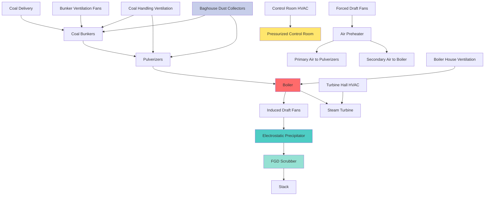

## Overview

Coal-fired power plants present unique HVAC challenges due to the explosive nature of coal dust, massive combustion air requirements, high heat loads, and stringent air quality standards. The HVAC systems must manage coal dust concentrations below the lower explosive limit (LEL), provide adequate dilution ventilation, and supply millions of cubic feet per minute of combustion air while maintaining safe working environments throughout the facility.

## Coal Dust Control and Ventilation

Coal dust explosibility depends on particle size, moisture content, and volatile matter. The minimum explosive concentration (MEC) for bituminous coal dust typically ranges from 40-60 g/m³ (0.04-0.06 oz/ft³), with ignition energies as low as 10-40 mJ. NFPA 850 requires maintaining coal dust concentrations well below these thresholds through continuous dilution ventilation.

### Coal Dust Ventilation Calculations

The required ventilation rate for coal dust control follows first-principles mass balance:

$$Q = \frac{\dot{m}_{\text{dust}}}{C_{\text{safe}} - C_{\text{ambient}}}$$

Where:
- $Q$ = required ventilation rate (m³/s)
- $\dot{m}_{\text{dust}}$ = coal dust generation rate (kg/s)
- $C_{\text{safe}}$ = safe dust concentration, typically 10% of LEL (kg/m³)
- $C_{\text{ambient}}$ = ambient dust concentration (kg/m³)

For coal handling operations with known transfer rates:

$$Q_{\text{handling}} = K \cdot \dot{m}_{\text{coal}} \cdot \left(\frac{1}{C_{\text{target}}}\right)$$

Where:
- $K$ = dust generation factor (typically 0.001-0.005 for enclosed conveyors)
- $\dot{m}_{\text{coal}}$ = coal transfer rate (kg/s)
- $C_{\text{target}}$ = target dust concentration (kg/m³)

The capture velocity at dust generation points:

$$V_{\text{capture}} = \frac{1}{60} \left(100 + 100\sqrt{S}\right)$$

Where:
- $V_{\text{capture}}$ = capture velocity (m/s)
- $S$ = hood opening area (m²)

## Coal Handling Area Ventilation Requirements

| **Area** | **Ventilation Rate** | **Air Changes/Hour** | **Design Criteria** | **Special Requirements** |
|----------|---------------------|---------------------|---------------------|-------------------------|
| Coal Bunkers | 4-6 ACH | 4-6 | Dust < 10 mg/m³ | Explosion-proof equipment |
| Pulverizer Room | 12-20 ACH | 12-20 | Dust < 5 mg/m³ | High air velocity (>1 m/s) |
| Conveyor Galleries | 8-12 ACH | 8-12 | Dust < 15 mg/m³ | Continuous monitoring |
| Crusher House | 15-20 ACH | 15-20 | Dust < 8 mg/m³ | Local exhaust hoods |
| Transfer Points | 60-90 m³/min per point | N/A | Capture velocity 1.5-2.5 m/s | Baghouse filtration |
| Coal Storage Silos | 2-4 ACH | 2-4 | Dust < 20 mg/m³ | Pressure relief vents |

## Combustion Air Systems

The combustion air requirement for coal-fired boilers derives from stoichiometric combustion equations. For bituminous coal with typical composition (C: 75%, H: 5%, O: 8%, S: 3%, moisture: 9%):

$$A_{\text{theoretical}} = 11.5C + 34.5\left(H - \frac{O}{8}\right) + 4.3S$$

Where $A_{\text{theoretical}}$ is theoretical air in kg air/kg coal.

Actual combustion air with excess air:

$$Q_{\text{combustion}} = \dot{m}_{\text{coal}} \cdot A_{\text{theoretical}} \cdot (1 + EA) \cdot \frac{\rho_{\text{air}}}{3600}$$

Where:
- $EA$ = excess air fraction (typically 0.15-0.25)
- $\rho_{\text{air}}$ = air density (kg/m³) at inlet conditions

For a 500 MW coal plant burning 200 tonnes/hour of coal, combustion air requirements exceed 2,000,000 m³/hr (1,200,000 CFM).

## Coal Plant HVAC System Architecture

## Forced and Induced Draft Fan Systems

Forced draft (FD) fans supply combustion air, while induced draft (ID) fans maintain negative pressure in the boiler and exhaust flue gases.

**FD Fan Sizing:**

$$P_{\text{FD}} = \Delta P_{\text{ductwork}} + \Delta P_{\text{air preheater}} + \Delta P_{\text{burners}}$$

Typical FD fan pressure: 3-5 kPa (12-20 in. w.g.)

**ID Fan Sizing:**

$$P_{\text{ID}} = \Delta P_{\text{boiler}} + \Delta P_{\text{ESP}} + \Delta P_{\text{FGD}} + \Delta P_{\text{ductwork}} + \Delta P_{\text{stack}}$$

Typical ID fan pressure: 5-8 kPa (20-32 in. w.g.) for modern plants with emissions controls.

Fan power requirements:

$$P_{\text{fan}} = \frac{Q \cdot \Delta P}{\eta_{\text{fan}} \cdot \eta_{\text{motor}}}$$

Where efficiency values are typically $\eta_{\text{fan}}$ = 0.85-0.90 and $\eta_{\text{motor}}$ = 0.94-0.96 for large motors.

## Pulverizer Ventilation

Pulverizers require heated primary air at 300-350°C to dry coal and transport pulverized fuel to burners. The air-to-coal ratio in pulverizers:

$$R_{\text{air/coal}} = 1.8 \text{ to } 2.2 \text{ kg air/kg coal}$$

Primary air quantity:

$$Q_{\text{primary}} = \dot{m}_{\text{coal}} \cdot R_{\text{air/coal}} \cdot \frac{T_{\text{primary}}}{T_{\text{ambient}}}$$

Pulverizer explosion protection requires:
- Oxygen concentration monitoring (trip at 16-17% O₂)
- Temperature monitoring (trip at 70-80°C above normal)
- Inert gas injection capability (CO₂ or N₂)
- Explosion venting to safe areas

## Boiler House Ventilation

The boiler house requires substantial ventilation to remove radiant heat and maintain safe working temperatures. Heat gain from boiler surfaces:

$$Q_{\text{radiant}} = \epsilon \cdot \sigma \cdot A_{\text{surface}} \cdot (T_{\text{surface}}^4 - T_{\text{ambient}}^4)$$

Where:
- $\epsilon$ = surface emissivity (0.7-0.9 for insulated surfaces)
- $\sigma$ = Stefan-Boltzmann constant (5.67×10⁻⁸ W/m²·K⁴)
- $A_{\text{surface}}$ = boiler exterior surface area (m²)

Required ventilation for heat removal:

$$Q_{\text{boiler house}} = \frac{Q_{\text{radiant}}}{\rho \cdot c_p \cdot \Delta T}$$

Typical boiler house ventilation: 15-25 ACH with natural and mechanical ventilation combined.

## NFPA 850 Compliance Requirements

NFPA 850 (Standard for Fire Protection for Electric Generating Plants) mandates:

1. **Coal Dust Control**: Maintain accumulations below 0.8 mm (1/32 inch) depth
2. **Ventilation Monitoring**: Continuous airflow verification in dust-prone areas
3. **Explosion Protection**: Explosion venting, suppression, or isolation systems
4. **Ignition Source Control**: Eliminate sources >450°C in coal dust areas
5. **Emergency Ventilation**: Backup power for critical ventilation systems
6. **Air Quality Monitoring**: CO, O₂, and combustible gas detection

## Flue Gas Treatment Systems

**Electrostatic Precipitator (ESP) Ventilation:**

ESPs operate at 150-180°C and require minimal external ventilation but need enclosure ventilation for maintenance access (4-6 ACH).

**Flue Gas Desulfurization (FGD) Ventilation:**

Wet FGD systems create high humidity environments requiring:
- Forced ventilation: 8-12 ACH
- Corrosion-resistant materials
- Mist elimination
- Temperature control to prevent condensation

## Safety and Environmental Considerations

**Explosion Prevention Hierarchy:**
1. Eliminate ignition sources (preferred)
2. Prevent explosive atmospheres through ventilation
3. Protect against explosion propagation
4. Provide explosion suppression systems

**Thermal Comfort in High Heat Areas:**

Effective temperature for heat stress evaluation:

$$ET = T_{\text{db}} - 0.4(T_{\text{db}} - T_{\text{wb}})$$

Where $T_{\text{db}}$ = dry-bulb temperature and $T_{\text{wb}}$ = wet-bulb temperature. Target ET < 30°C for continuous work.

Coal power plant HVAC systems represent the integration of industrial ventilation, combustion air supply, dust control, and environmental compliance into coordinated systems that ensure safe, efficient, and reliable power generation while meeting stringent regulatory requirements for worker safety and air quality.
