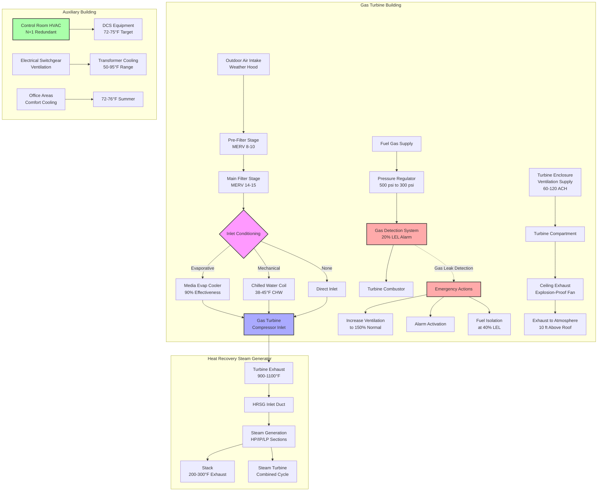

## Natural Gas Power Plant HVAC Fundamentals

Natural gas-fired power plants utilize combustion turbines (gas turbines) as prime movers, either in simple cycle configuration for peaking duty or combined cycle configuration for baseload generation. These facilities present distinct HVAC challenges driven by explosive gas hazards, combustion air requirements exceeding 1 million CFM per unit, and turbine performance sensitivity to inlet air conditions.

The primary HVAC concerns in natural gas plants differ fundamentally from coal or nuclear facilities. Gas turbine inlet air quality and temperature directly determine power output and heat rate. A 1°F increase in inlet air temperature reduces output by 0.5-0.7% while increasing heat rate (fuel consumption per kWh) by 0.3-0.5%. For a 250 MW gas turbine, each degree represents 1.25-1.75 MW capacity loss worth $1.25-1.75 million annually in avoided capacity costs.

Hazardous area ventilation addresses methane gas accumulation from pipe flanges, valve packing, pressure regulator venting, and potential leaks. Natural gas (primarily methane, CH₄) has a lower explosive limit (LEL) of 5.0% by volume in air. NFPA 37 (Standard for the Installation and Use of Stationary Combustion Engines and Gas Turbines) mandates ventilation maintaining gas concentrations below 25% LEL (1.25% by volume) in occupied spaces and below 100% LEL (5.0%) in unoccupied enclosures with continuous gas detection.

## Gas Turbine Combustion Air Systems

### Thermodynamic Basis of Air Temperature Effects

Gas turbine power output derives from the Brayton cycle, with work output proportional to mass flow rate through the turbine. The compressor section consumes 50-60% of turbine shaft power compressing inlet air from atmospheric pressure (14.7 psia) to 15-30 atmospheres.

Compressor work follows:

$$W_c = \dot{m} \cdot c_p \cdot (T_2 - T_1) = \dot{m} \cdot c_p \cdot T_1 \left[\left(\frac{P_2}{P_1}\right)^{\frac{\gamma-1}{\gamma}} - 1\right]$$

Where:
- $W_c$ = compressor work (kW)
- $\dot{m}$ = air mass flow rate (kg/s)
- $c_p$ = specific heat at constant pressure (1.005 kJ/kg·K for air)
- $T_1$ = inlet temperature (K)
- $T_2$ = discharge temperature (K)
- $P_1$, $P_2$ = inlet and discharge pressures (kPa)
- $\gamma$ = specific heat ratio (1.4 for air)

Since $\dot{m} = \frac{\rho \cdot Q}{1}$ and air density decreases with temperature following $\rho = \frac{P}{R \cdot T}$, higher inlet temperature reduces mass flow for a given volumetric flow, decreasing both net power output and thermal efficiency.

Net turbine power:

$$P_{net} = P_{turbine} - P_{compressor} = \eta_{mech} \cdot (\dot{m} \cdot c_p \cdot T_3 - W_c)$$

Where $T_3$ is turbine inlet temperature (1200-1500°C for modern turbines).

### Inlet Air Filtration Systems

Gas turbines tolerate zero particulate ingestion. Compressor blade erosion from 10 ppm particulate concentration reduces efficiency 1-2% per 1000 operating hours. Multi-stage filtration removes particles while minimizing pressure drop, which consumes power and reduces output.

**Filter House Design**:
- Weather hood or inlet louver: Prevents rain/snow entrainment
- Pre-filter stage: MERV 8-10, removes particles >10 μm
- Main filter stage: MERV 14-15, removes 95% of particles >1 μm
- Final filter stage: MERV 16 or HEPA, removes 99.97% of particles >0.3 μm
- Total pressure drop: 4-8 in. w.c. clean, 10-14 in. w.c. dirty

Pressure drop through filtration directly reduces available pressure ratio across compressor. Each inch of water column pressure loss reduces output approximately 0.25-0.4%. Filter maintenance intervals balance pressure drop penalty against filter replacement costs.

### Evaporative Inlet Air Cooling

Evaporative cooling exploits water's latent heat of vaporization (1055 BTU/lb at 60°F) to cool inlet air approaching wet bulb temperature. This process follows psychrometric relationships where cooling potential equals dry bulb minus wet bulb temperature.

**Media-Type Evaporative Coolers**: Water flows over rigid cellulose media while air passes through wetted surface. Heat and mass transfer occur simultaneously:

$$q = h_{fg} \cdot \dot{m}_w = \dot{m}_a \cdot c_p \cdot (T_{db,in} - T_{db,out})$$

Where:
- $q$ = cooling capacity (BTU/hr)
- $h_{fg}$ = latent heat of vaporization (1055 BTU/lb)
- $\dot{m}_w$ = water evaporation rate (lb/hr)
- $\dot{m}_a$ = air mass flow rate (lb/hr)
- $T_{db,in}$, $T_{db,out}$ = dry bulb temperatures (°F)

Effectiveness ranges from 85-95% for media systems:

$$\epsilon = \frac{T_{db,in} - T_{db,out}}{T_{db,in} - T_{wb,in}}$$

For 95°F dry bulb, 65°F wet bulb conditions at 90% effectiveness:
$$T_{db,out} = 95 - 0.90(95-65) = 68°F$$

This 27°F reduction increases turbine output 13.5-18.9% compared to uncooled operation.

**Fogging Systems**: High-pressure pumps (1000-3000 psi) atomize demineralized water into 10-20 micron droplets injected into inlet duct. Complete evaporation occurs within 10-15 feet, approaching 100% saturation effectiveness. Overspray (droplets not evaporating) causes compressor blade erosion, requiring precise control and high-quality water treatment (conductivity <1 μS/cm, total dissolved solids <1 ppm).

### Mechanical Inlet Chilling

Refrigeration-based inlet cooling achieves temperatures below wet bulb, effective in humid climates where evaporative cooling provides minimal benefit. Vapor compression or absorption chillers produce 38-45°F chilled water circulated through finned coil heat exchangers.

Cooling capacity requirement:

$$q_{cooling} = 1.08 \cdot Q \cdot \Delta T = 1.08 \cdot Q \cdot (T_{ambient} - T_{target})$$

For 500,000 CFM turbine inlet cooled from 95°F to 50°F:
$$q_{cooling} = 1.08 \times 500,000 \times (95-50) = 24,300,000 \text{ BTU/hr} = 2,025 \text{ tons}$$

Parasitic power consumption for chiller plant (0.6-0.8 kW/ton) and cooling tower fans/pumps reduces net output gain. Economic analysis compares increased generation revenue against operating costs. Inlet chilling typically operates during peak demand periods (5-8 hours daily) when wholesale electricity prices justify operating costs.

## Hazardous Area Ventilation and Gas Detection

### Natural Gas Properties and Hazard Classification

Methane (primary component of natural gas) exhibits:
- Molecular weight: 16.04 g/mol (lighter than air: 28.97 g/mol)
- Density at STP: 0.042 lb/ft³ (air: 0.075 lb/ft³)
- Buoyancy: Rises and accumulates at high points, ceiling pockets
- Lower explosive limit (LEL): 5.0% by volume
- Upper explosive limit (UEL): 15.0% by volume
- Autoignition temperature: 1004°F
- Minimum ignition energy: 0.29 mJ

Natural gas fuel supply areas containing equipment that may release gas under normal operation constitute Class I, Division 2 or Zone 2 hazardous locations per NFPA 70 (NEC) Article 500. Areas with continuous or frequent gas release classify as Class I, Division 1 or Zone 1.

### NFPA 37 Ventilation Requirements

NFPA 37 Section 6.3 establishes minimum ventilation for gas turbine enclosures and fuel gas equipment rooms:

**Mechanical Ventilation Rate**:

$$Q_{vent} = \frac{Q_{gas,max} \cdot 10,000}{C_{max} \cdot \epsilon}$$

Where:
- $Q_{vent}$ = required ventilation rate (CFM)
- $Q_{gas,max}$ = maximum potential gas release rate (CFM)
- $C_{max}$ = maximum allowable gas concentration (typically 1.25% = 25% LEL)
- $\epsilon$ = mixing effectiveness factor (0.5-0.7 for typical configurations)
- 10,000 = conversion factor

For fuel gas equipment room with 10 CFM maximum potential leak rate:
$$Q_{vent} = \frac{10 \times 10,000}{1.25 \times 0.6} = 133,333 \text{ CFM}$$

Actual installations typically provide 1-2 air changes per minute for enclosed gas turbine buildings, or 60-120 air changes per hour.

**Continuous Gas Detection**: NFPA 37 requires gas detection activating alarms at 20% LEL (1.0% methane) and initiating emergency ventilation or fuel shutoff at 40% LEL (2.0% methane). Detectors locate at:
- Ceiling level (methane accumulation points)
- Fuel gas equipment locations
- Confined spaces and potential dead zones
- Spacing: Maximum 20-foot coverage radius per detector

### Hazardous Area Ventilation Design

| **Design Parameter** | **Occupied Equipment Room** | **Unoccupied Enclosure** | **Outdoor Installation** |
|---|---|---|---|
| **Target Concentration** | <1.25% (25% LEL) | <5.0% (100% LEL) | N/A - Natural Dispersion |
| **Air Changes/Hour** | 60-120 (1-2/min) | 30-60 (0.5-1/min) | N/A |
| **Ventilation Mode** | Continuous mechanical | Continuous or on-demand | Natural ventilation |
| **Air Distribution** | Floor-level supply, ceiling exhaust | Multiple exhaust points high | Louvers, roof vents |
| **Ignition Source Control** | Class I, Div 2 electrical | Class I, Div 1 or 2 | General purpose |
| **Gas Detection** | Required, 20% LEL alarm | Required, 40% LEL shutdown | Recommended |
| **Emergency Ventilation** | 150% normal rate on detection | 200% normal rate on detection | N/A |

**Mixing Effectiveness**: Proper air distribution prevents stagnant zones where gas accumulates despite adequate total ventilation. Supply air introduction at floor level creates upward flow pattern carrying released gas to ceiling-level exhaust. Computational fluid dynamics (CFD) modeling verifies gas dispersion for complex geometries.

**Exhaust System Design**:
- Exhaust fans: Sparkless construction, explosion-proof motors
- Ductwork: No pockets or low points trapping gas
- Discharge location: 10 feet above roof, 25 feet from air intakes
- Backdraft dampers: Prevent reverse flow during fan shutdown
- Emergency power: Exhaust fans on standby generator

## Natural Gas Plant HVAC System Configuration

## Combustion Air Requirements

Gas turbines consume air at stoichiometric ratios far exceeding heating applications. Complete combustion of methane:

$$\text{CH}_4 + 2\text{O}_2 + 7.52\text{N}_2 \rightarrow \text{CO}_2 + 2\text{H}_2\text{O} + 7.52\text{N}_2$$

Stoichiometric air-fuel ratio: 17.2:1 by mass. Gas turbines operate at 50-60:1 (lean combustion) reducing NOₓ formation and providing turbine cooling.

For 250 MW simple cycle gas turbine at 11,000 BTU/kWh heat rate:
- Fuel consumption: $\frac{250,000 \times 11,000}{1,000 \text{ BTU/ft}^3} = 2,750$ SCFM natural gas
- Combustion air: $2,750 \times 50 \times \frac{28.97}{16.04} = 248,000$ SCFM at STP
- Actual inlet air (95°F): $248,000 \times \frac{555}{535} = 257,000$ CFM

Total turbine inlet airflow exceeds 1,000,000 CFM including excess air for cooling, with combustion air representing 25% of total flow.

## Turbine Enclosure HVAC Design

Simple cycle peaking units often use outdoor installations with weather enclosures. Combined cycle baseload units typically occupy partially or fully enclosed buildings requiring mechanical ventilation.

**Heat Load Sources**:
- Turbine casing radiation: 30-50 BTU/hr per kW installed capacity
- Generator losses: 0.5-1.0% of output (1.25-2.5 MW for 250 MW unit)
- Auxiliary equipment: Lube oil system, hydraulic pumps, cooling systems
- Solar load: Significant for metal building enclosures

Total heat load for 250 MW turbine building: 10-15 million BTU/hr.

Ventilation rate from sensible heat equation:

$$Q = \frac{q}{1.08 \times \Delta T} = \frac{12,500,000}{1.08 \times 20} = 578,000 \text{ CFM}$$

For 100 ft × 150 ft × 60 ft enclosure (900,000 ft³), this represents 38 air changes per hour, meeting NFPA 37 minimum for hazardous area ventilation.

**Ventilation System Components**:
- Supply air: Low-level wall louvers with motorized dampers, filtered (MERV 8)
- Exhaust: Roof-mounted axial fans (100,000-150,000 CFM each)
- Winter heating: Steam or hot water unit heaters maintaining 50°F minimum
- Controls: Temperature-modulated exhaust fan speed, staged supply dampers
- Gas detection interlock: Override to maximum ventilation on alarm

## Control Room and Auxiliary Spaces

Control rooms, electrical equipment rooms, and offices within gas turbine plants require conventional HVAC independent of process areas. Control room design follows principles outlined in main power plant HVAC section, with N+1 redundancy, precision temperature control (72-75°F ± 2°F), and continuous operation.

Electrical switchgear rooms housing 13.8 kV or 115-500 kV equipment require temperature control preventing condensation and managing transformer losses. Ventilation maintains 50-95°F with lower limit preventing moisture condensation on cold surfaces during unit shutdown.

## Standards and Code Requirements

**NFPA 37 (2021)**: Installation and Use of Stationary Combustion Engines and Gas Turbines establishes:
- Section 6.3: Ventilation requirements for turbine enclosures
- Section 7.2: Fuel gas piping and safety
- Section 8.1: Gas detection and alarm systems
- Appendix C: Ventilation calculation methodology

**NFPA 70 (NEC)**: Article 500 defines hazardous location classification for areas containing fuel gas equipment, determining electrical system requirements affecting HVAC fan motors and controls.

**NFPA 850**: Recommended Practice for Fire Protection for Electric Generating Plants addresses fire protection interfacing with HVAC systems including smoke purge ventilation.

**API RP 500/505**: Classification of locations for electrical installations in petroleum facilities provides guidance for gas turbine plants handling natural gas, establishing Division/Zone classifications.

**ISO 2314**: Gas Turbine Acceptance Tests specifies standard inlet conditions and correction factors for performance testing, informing inlet cooling system design.

**ASHRAE Applications Handbook Chapter 28**: Power Plants provides design guidance for gas turbine facilities including combustion air filtration, inlet cooling systems, and building ventilation.

**OSHA 29 CFR 1910.110**: Storage and Handling of Liquefied Petroleum Gases (applicable to LNG backup fuel systems) establishes safety requirements affecting HVAC design for fuel storage areas.

Turbine manufacturers (GE, Siemens, Mitsubishi Heavy Industries) publish installation manuals specifying maximum inlet air temperature, permissible filtration pressure drop, enclosure ventilation rates, and control room HVAC requirements as contractual conditions affecting warranty and performance guarantees.
