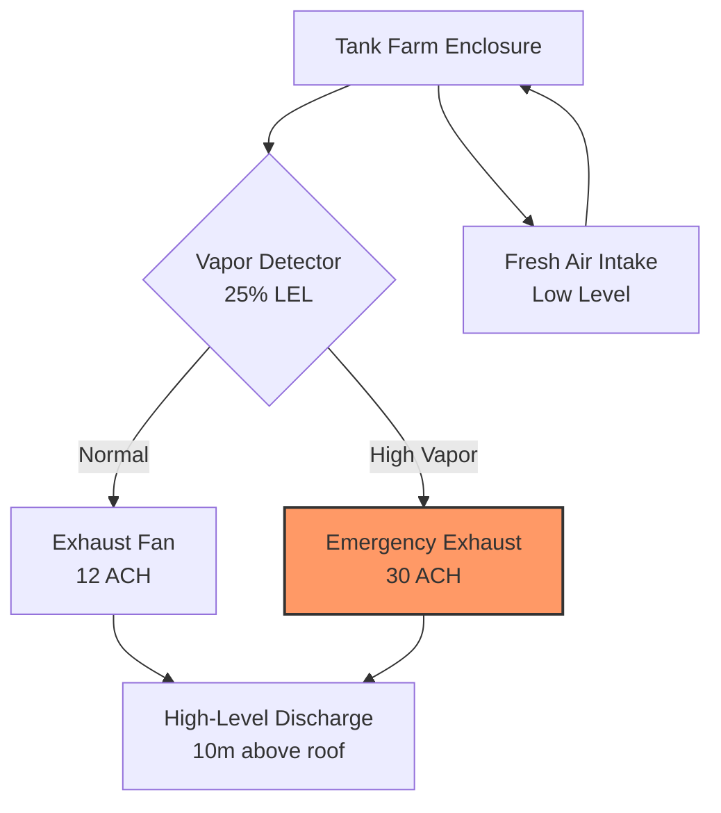

## Overview

Oil-fired power plants present unique HVAC challenges related to fuel viscosity control, vapor containment, combustion air delivery, and emissions control infrastructure. Heavy fuel oil (HFO) systems require temperatures of 90-120°C for proper atomization, while volatile lighter oils demand explosion-proof ventilation. The combustion process generates sulfur dioxide (SO₂), nitrogen oxides (NOₓ), and particulate matter requiring extensive environmental control systems with dedicated HVAC infrastructure.

## Combustion Air Requirements

### Stoichiometric Air Calculation

For complete combustion of fuel oil, the theoretical air requirement depends on the fuel composition:

$$A_{theo} = \frac{11.5C + 34.5\left(H - \frac{O}{8}\right) + 4.3S}{100}$$

Where:
- $A_{theo}$ = theoretical air (kg/kg fuel)
- $C$, $H$, $O$, $S$ = mass percentages of carbon, hydrogen, oxygen, and sulfur

Actual combustion air requirements include excess air to ensure complete combustion:

$$A_{actual} = A_{theo}(1 + EA)$$

Where $EA$ = excess air ratio (typically 0.15-0.25 for oil-fired boilers).

For typical heavy fuel oil (C: 85%, H: 11%, O: 1%, S: 3%), the theoretical air requirement is approximately 14.3 kg air/kg fuel. With 20% excess air, the actual requirement becomes 17.2 kg/kg fuel.

### Combustion Air System Design

Combustion air fans must overcome:
- Filter pressure drop: 200-400 Pa
- Air preheater pressure drop: 800-1200 Pa
- Windbox and burner resistance: 1000-2000 Pa
- Furnace pressure (negative): -50 to -200 Pa

Total static pressure requirement: 2000-3800 Pa, with forced draft fans typically rated at 100-150 kPa for adequate margin.

## Fuel Oil Handling and Heating Systems

### Heavy Fuel Oil Temperature Control

Heavy fuel oil viscosity must be reduced to 15-20 cSt at the burner tip for proper atomization. The relationship between temperature and viscosity follows:

$$\log(\log(\nu + 0.8)) = A - B\log(T)$$

Where:
- $\nu$ = kinematic viscosity (cSt)
- $T$ = absolute temperature (K)
- $A$, $B$ = fuel-specific constants

| Oil Type | Storage Temp | Pumping Temp | Atomization Temp | Typical Viscosity at 50°C |
|----------|--------------|--------------|------------------|---------------------------|
| Light Fuel Oil (LFO) | Ambient | Ambient | 40-60°C | 5-10 cSt |
| Heavy Fuel Oil (HFO) 180 | 40-50°C | 60-80°C | 90-110°C | 180 cSt |
| Heavy Fuel Oil (HFO) 380 | 50-70°C | 80-100°C | 110-130°C | 380 cSt |

### Fuel Oil Heating Load Calculation

The heat required to raise fuel oil temperature:

$$Q = \dot{m} c_p (T_2 - T_1)$$

Where:
- $Q$ = heating power (kW)
- $\dot{m}$ = fuel flow rate (kg/s)
- $c_p$ = specific heat capacity (1.8-2.1 kJ/kg·K for fuel oil)
- $T_1$, $T_2$ = initial and final temperatures (°C)

For a 500 MW plant consuming 40 kg/s of HFO 380, heating from 60°C storage to 120°C atomization:

$$Q = 40 \times 2.0 \times (120 - 60) = 4800 \text{ kW}$$

Additional capacity of 25-30% accounts for heat losses and startup demands, resulting in a total heating system capacity of approximately 6000 kW.

## Tank Farm Ventilation

### Vapor Space Ventilation

Fuel oil storage tanks generate hydrocarbon vapors requiring ventilation to prevent explosive atmospheres. The vapor evolution rate increases exponentially with temperature:

$$\dot{V}_{vapor} = K \cdot A \cdot P_{vapor}$$

Where:
- $\dot{V}_{vapor}$ = vapor generation rate (m³/h)
- $K$ = mass transfer coefficient
- $A$ = liquid surface area (m²)
- $P_{vapor}$ = vapor pressure at storage temperature

### Ventilation Design Criteria

Tank farm buildings require:
- Minimum 12 air changes per hour (ACH) continuous ventilation
- Emergency ventilation: 30 ACH upon vapor detection
- Explosion-proof electrical equipment (Class I, Division 2)
- Lower explosive limit (LEL) monitoring with alarm at 25% LEL
- Temperature control: 15-30°C to minimize vapor generation

Exhaust discharge velocity must exceed 15 m/s to ensure adequate dispersion. Discharge points should be located at least 10 meters above the highest adjacent structure and away from air intakes by minimum 15 meters horizontal distance.

## Emissions Control HVAC Infrastructure

### Flue Gas Desulfurization (FGD) System

SO₂ removal systems require controlled temperature and humidity conditions:

| Parameter | Wet Scrubber | Dry Scrubber |
|-----------|--------------|--------------|
| Inlet Gas Temp | 120-180°C | 120-180°C |
| Scrubber Operating Temp | 50-60°C | 65-80°C |
| Outlet Gas Temp | 50-60°C (saturated) | 70-90°C |
| Cooling Water Flow | 100-150 m³/h per MW | Not required |
| SO₂ Removal Efficiency | 95-98% | 90-95% |

The wet scrubbing process involves spray cooling and chemical absorption:

$$\text{SO}_2 + \text{CaCO}_3 + \frac{1}{2}\text{H}_2\text{O} \rightarrow \text{CaSO}_3 \cdot \frac{1}{2}\text{H}_2\text{O} + \text{CO}_2$$

Heat removal from flue gas in the scrubber:

$$Q_{cool} = \dot{m}_{gas}[c_{p,gas}(T_{in} - T_{out}) + h_{fg}\Delta\omega]$$

Where:
- $\dot{m}_{gas}$ = flue gas mass flow rate (kg/s)
- $c_{p,gas}$ = specific heat of flue gas (1.05 kJ/kg·K)
- $T_{in}$, $T_{out}$ = inlet and outlet temperatures (°C)
- $h_{fg}$ = latent heat of vaporization (2440 kJ/kg)
- $\Delta\omega$ = increase in humidity ratio (kg water/kg dry gas)

### Selective Catalytic Reduction (SCR) System

NOₓ reduction requires precise temperature control at the catalyst bed:

- Optimal catalyst temperature: 300-400°C
- Ammonia injection temperature: 280-320°C
- Gas residence time: 0.3-0.5 seconds
- Temperature uniformity: ±15°C across catalyst cross-section

Temperature below 280°C causes ammonia slip and sulfate formation. Above 420°C, catalyst sintering occurs, reducing effectiveness.

### Electrostatic Precipitator (ESP) HVAC

Particulate removal efficiency depends on maintaining optimal flue gas conditions:

$$\eta = 1 - e^{-\frac{\omega A}{Q}}$$

Where:
- $\eta$ = collection efficiency
- $\omega$ = particle migration velocity (cm/s)
- $A$ = collection plate area (m²)
- $Q$ = gas flow rate (m³/s)

ESP buildings require:
- Ambient temperature control: 15-35°C for electrical equipment
- Hopper heating: 150-180°C to prevent ash bridging
- Insulation: minimum R-value of 3.5 m²·K/W to reduce heat loss
- Vibrator motor cooling: forced ventilation to maintain <60°C

## Comparison with Other Fossil Fuel Plants

| Parameter | Oil-Fired | Coal-Fired | Natural Gas Combined Cycle |
|-----------|-----------|------------|----------------------------|
| Fuel Storage HVAC | Heated tanks, vapor control | Dust suppression, fire protection | Minimal (pipeline delivery) |
| Combustion Air Temp | 300-350°C | 250-300°C | 400-500°C (gas turbine) |
| Excess Air Required | 15-25% | 20-30% | 15-20% (gas turbine) |
| SO₂ Emissions | 1000-3000 mg/Nm³ (no FGD) | 500-2000 mg/Nm³ (no FGD) | <5 mg/Nm³ |
| FGD System Required | Yes (high sulfur oils) | Yes (most coals) | No |
| Particulate Emissions | 50-150 mg/Nm³ (no ESP) | 200-500 mg/Nm³ (no ESP) | <5 mg/Nm³ |
| Stack Gas Reheat | Required (wet FGD) | Required (wet FGD) | Not applicable |
| HVAC Energy % of Output | 1.5-2.0% | 2.0-2.5% | 0.8-1.2% |

Oil plants have lower particulate loading than coal but higher sulfur content than natural gas. This results in smaller ESP systems but larger FGD systems compared to coal plants. Natural gas plants eliminate most emissions control HVAC infrastructure entirely.

## Auxiliary Building Ventilation

### Boiler Building

The boiler building houses the combustion chamber, fuel preparation equipment, and control systems:

- Normal ventilation: 6-8 ACH
- Heat gain from equipment: 0.5-1.0% of boiler rating
- Summer design: maintain <40°C in operating areas
- Winter design: minimum 15°C in occupied spaces
- Pressurization: +25 Pa relative to outdoors to minimize infiltration

### Fuel Oil Pump Room

Dedicated ventilation prevents vapor accumulation:

- Continuous ventilation: 15 ACH minimum
- Explosion-proof equipment (Class I, Division 1)
- Exhaust from low level (hydrocarbon vapors are heavier than air)
- Emergency ventilation: 30 ACH upon leak detection
- No recirculation permitted
- Discharge to safe location, minimum 15 m from air intakes

## Design Standards and References

Relevant ASHRAE and industry standards:

- ASHRAE 90.1: Energy Standard for Buildings Except Low-Rise Residential Buildings
- NFPA 30: Flammable and Combustible Liquids Code (tank farm design)
- NFPA 37: Standard for the Installation and Use of Stationary Combustion Engines and Gas Turbines
- API 650: Welded Tanks for Oil Storage (thermal considerations)
- EPA 40 CFR Part 60: Standards of Performance for New Stationary Sources (emissions requirements)

Oil-fired power plants demand sophisticated HVAC systems addressing fuel viscosity management, explosion hazard mitigation, and extensive emissions control infrastructure. The physics of combustion, heat transfer, and mass transfer govern system sizing and operational parameters, requiring careful engineering integration with the overall plant design.
