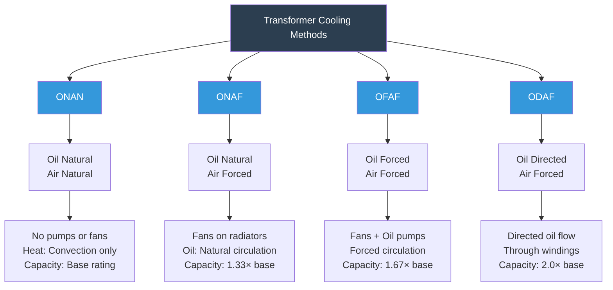
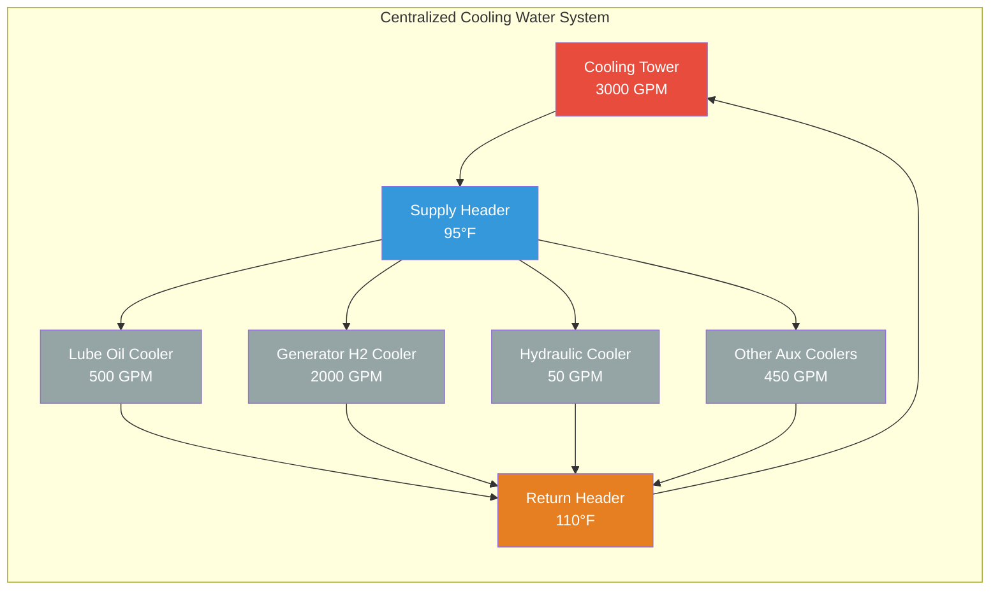

# Equipment Cooling in Turbine Halls

Auxiliary equipment cooling in power generation facilities manages heat rejection from turbine bearings, lubrication systems, generators, transformers, and hydraulic systems that operate continuously at elevated temperatures. Unlike the general turbine hall ventilation that addresses space conditioning, equipment cooling systems provide dedicated heat removal from specific machinery to maintain operating temperatures within manufacturer-specified limits—typically bearing oil temperatures below 160°F, generator stator windings below 311°F (Class F insulation), and hydraulic fluid below 140°F. Equipment cooling employs closed-loop liquid cooling circuits, forced-air heat exchangers, and direct water cooling depending on heat flux density, temperature requirements, and equipment criticality.

## Lube Oil Cooling Systems

### Oil Cooler Heat Load Calculation

Turbine-generator lube oil systems remove frictional heat from journal bearings and thrust bearings through forced circulation. Heat generation in fluid film bearings follows hydrodynamic theory:

**Bearing friction power:**

$$P_{friction} = \mu \times \omega \times \frac{A \times V^2}{h}$$

Where:
- $\mu$ = Dynamic viscosity of oil (lb/ft-s)
- $\omega$ = Shaft angular velocity (rad/s)
- $A$ = Bearing surface area (ft²)
- $V$ = Surface velocity (ft/s)
- $h$ = Oil film thickness (ft)

**Simplified bearing heat generation:**

For preliminary design, bearing heat generation approximates:

$$Q_{bearing} = 0.001 \times HP_{shaft} \times 2545$$

Where $HP_{shaft}$ is the shaft horsepower transmitted through the bearing.

**Total lube oil system heat load:**

$$Q_{oil,total} = \sum Q_{bearings} + Q_{pump} + Q_{coupling}$$

Typical components:
- Journal bearings: 8-12 bearings × 25,000-75,000 Btu/hr each
- Thrust bearing: 150,000-300,000 Btu/hr (carries axial load)
- Oil pumps (mechanical inefficiency): 50,000-100,000 Btu/hr
- Gear couplings/reduction gears: 100,000-250,000 Btu/hr

**Total system load for 500 MW unit:** 800,000-1,500,000 Btu/hr

### Oil Cooler Sizing

**Required heat transfer area:**

Oil coolers use shell-and-tube or plate-and-frame heat exchangers. The required surface area derives from:

$$Q = U \times A \times \Delta T_{lm}$$

Where:
- $Q$ = Heat duty (Btu/hr)
- $U$ = Overall heat transfer coefficient (Btu/hr-ft²-°F)
- $A$ = Heat transfer surface area (ft²)
- $\Delta T_{lm}$ = Log mean temperature difference (°F)

**Log mean temperature difference (LMTD):**

$$\Delta T_{lm} = \frac{(T_{oil,in} - T_{water,out}) - (T_{oil,out} - T_{water,in})}{\ln\left(\frac{T_{oil,in} - T_{water,out}}{T_{oil,out} - T_{water,in}}\right)}$$

**Example calculation:**

For a lube oil cooler with:
- Oil flow: 500 GPM (ISO VG 32 turbine oil)
- Oil inlet: 140°F
- Oil outlet: 120°F
- Cooling water inlet: 85°F
- Cooling water outlet: 110°F

Heat duty:

$$Q = \dot{m}_{oil} \times c_{p,oil} \times \Delta T_{oil}$$

$$Q = 500 \times 8.33 \times 60 \times 0.48 \times (140-120) = 2,398,080 \text{ Btu/hr}$$

LMTD calculation:

$$\Delta T_1 = 140 - 110 = 30°F$$
$$\Delta T_2 = 120 - 85 = 35°F$$

$$\Delta T_{lm} = \frac{30 - 35}{\ln(30/35)} = \frac{-5}{-0.1542} = 32.4°F$$

For shell-and-tube oil cooler with $U = 150$ Btu/hr-ft²-°F:

$$A = \frac{Q}{U \times \Delta T_{lm}} = \frac{2,398,080}{150 \times 32.4} = 493 \text{ ft}^2$$

### Cooling Water Requirements

**Water flow rate calculation:**

$$\dot{m}_{water} = \frac{Q}{c_{p,water} \times \rho_{water} \times \Delta T_{water}}$$

For the above example:

$$\dot{m}_{water} = \frac{2,398,080}{1.0 \times 8.33 \times 60 \times (110-85)} = 192 \text{ GPM}$$

**Typical cooling water parameters:**

| Parameter | Range | Notes |
|-----------|-------|-------|
| Supply temperature | 75-95°F | Depends on cooling tower/river |
| Return temperature | 100-115°F | 15-25°F rise typical |
| Flow velocity | 3-7 ft/s | Prevents fouling, limits erosion |
| Pressure drop | 10-25 psi | Shell and tube side combined |
| Fouling factor | 0.001-0.003 | Depends on water quality |
| Material | 90-10 Cu-Ni, SS316 | Corrosion resistance |

## Generator Cooling Systems

### Generator Cooling Methods Comparison

Large generators require substantial cooling due to I²R losses in stator windings, rotor windings, and core losses. Cooling method selection depends on generator size and efficiency requirements.

| Cooling Method | Power Range | Coolant | Heat Transfer Coeff | Cooling Capacity | Applications |
|----------------|-------------|---------|---------------------|------------------|--------------|
| Air-cooled (open) | <10 MW | Air | 5-15 Btu/hr-ft²-°F | Low | Small industrial generators |
| Air-cooled (closed) | 10-50 MW | Air (internal circuit) | 10-20 Btu/hr-ft²-°F | Moderate | Medium industrial/utility |
| Hydrogen-cooled | 50-500 MW | Hydrogen (60-75 psig) | 40-80 Btu/hr-ft²-°F | High | Large utility turbine-generators |
| Water-cooled stator | 300-1500 MW | Deionized water | 300-600 Btu/hr-ft²-°F | Very high | Largest utility generators |
| Hybrid (H₂ + H₂O) | >800 MW | H₂ for rotor, H₂O for stator | Combined | Highest | Ultra-large capacity |

### Hydrogen-Cooled Generator Heat Loads

**Generator losses requiring cooling:**

Total losses equal input power minus output power:

$$Q_{gen,losses} = \frac{P_{output}}{\eta} - P_{output} = P_{output} \times \left(\frac{1-\eta}{\eta}\right)$$

For 500 MW generator at 98.5% efficiency:

$$Q_{gen,losses} = 500,000 \times \left(\frac{1-0.985}{0.985}\right) = 7,614 \text{ kW} = 25,985,000 \text{ Btu/hr}$$

**Loss distribution:**

- Stator copper losses (I²R): 40-45% → 10,400,000 Btu/hr
- Rotor copper losses: 15-20% → 4,680,000 Btu/hr
- Core losses (hysteresis, eddy currents): 25-30% → 7,020,000 Btu/hr
- Friction and windage: 5-10% → 1,950,000 Btu/hr
- Stray load losses: 5-10% → 1,950,000 Btu/hr

**Hydrogen cooling circuit heat removal:**

$$Q_{H_2} = \dot{m}_{H_2} \times c_{p,H_2} \times \Delta T_{H_2}$$

Properties of hydrogen at 60 psig, 100°F:
- $c_{p,H_2} = 3.42$ Btu/lb-°F (significantly higher than air's 0.24 Btu/lb-°F)
- $\rho_{H_2} = 0.0285$ lb/ft³ at 60 psig

For hydrogen temperature rise of 25°F (80°F inlet, 105°F outlet):

$$\dot{m}_{H_2} = \frac{Q_{H_2}}{c_{p,H_2} \times \Delta T_{H_2}} = \frac{20,000,000}{3.42 \times 25} = 233,918 \text{ lb/hr}$$

### Hydrogen Cooler Design

**Air-cooled hydrogen heat exchangers:**

Hydrogen-to-air coolers mounted on generator frame:

$$Q = U \times A \times \Delta T_{lm}$$

Typical values:
- $U = 25-45$ Btu/hr-ft²-°F (gas-to-gas heat exchanger)
- $\Delta T_{lm} = 35-50°F$ (hydrogen to ambient air)
- Required area: $A = 15,000-25,000$ ft² for 500 MW generator

**Water-cooled hydrogen heat exchangers:**

More compact design using hydrogen-to-water heat exchangers:

- $U = 80-150$ Btu/hr-ft²-°F (hydrogen-to-water)
- $\Delta T_{lm} = 25-40°F$
- Required area: $A = 5,000-10,000$ ft² for 500 MW generator

**Cooling water flow for generator:**

$$\dot{m}_{water} = \frac{Q_{H_2}}{c_{p,water} \times \rho_{water} \times \Delta T_{water}}$$

For 20,000,000 Btu/hr with 15°F temperature rise:

$$\dot{m}_{water} = \frac{20,000,000}{1.0 \times 8.33 \times 60 \times 15} = 2,665 \text{ GPM}$$

## Bearing Cooling Air Systems

### Bearing Temperature Control

Journal and thrust bearings require ambient air temperature control to ensure proper oil film viscosity and prevent thermal expansion issues.

**Critical bearing temperature limits:**

| Component | Maximum Temperature | Consequence of Exceeding |
|-----------|-------------------|--------------------------|
| Bearing oil (drain) | 160°F | Viscosity breakdown, oxidation |
| Bearing metal (babbitt) | 250°F | Babbitt melting, bearing failure |
| Bearing housing (exterior) | 180°F | Oil coking, seal degradation |
| Ambient air (bearing area) | 110°F | Reduced cooling capacity |

**Bearing cooling airflow requirement:**

Heat dissipated from bearing housing to surrounding air:

$$Q_{bearing,air} = h \times A_{housing} \times (T_{housing} - T_{air})$$

Where:
- $h$ = Convection coefficient (2-6 Btu/hr-ft²-°F for natural convection, 8-20 for forced)
- $A_{housing}$ = External surface area of bearing housing (ft²)
- $T_{housing}$ = Housing surface temperature (°F)
- $T_{air}$ = Ambient air temperature (°F)

**Forced cooling airflow calculation:**

To maintain 110°F maximum ambient around bearing:

$$Q_{air} = 1.08 \times CFM \times \Delta T$$

For bearing housing dissipating 50,000 Btu/hr with 25°F temperature rise:

$$CFM = \frac{Q_{air}}{1.08 \times \Delta T} = \frac{50,000}{1.08 \times 25} = 1,852 \text{ CFM per bearing}$$

**Bearing cooling air distribution:**

- Supply temperature: 70-80°F (air-conditioned)
- Supply velocity: 400-800 FPM at bearing pedestal
- Duct sizing: 12-18 inch diameter per bearing
- Exhaust: Natural convection to turbine hall or ducted exhaust

## Transformer Cooling Systems

Power transformers converting generator voltage (13.8-24 kV) to transmission voltage (115-765 kV) reject substantial heat from core and winding losses.

### Transformer Loss Calculations

**No-load losses (core losses):**

Magnetization losses from hysteresis and eddy currents in transformer core:

$$P_{core} = k_{h} \times f \times B_{max}^{1.6} + k_{e} \times f^2 \times B_{max}^2 \times t^2$$

Typically 0.1-0.2% of transformer MVA rating as heat.

**Load losses (copper losses):**

I²R losses in primary and secondary windings:

$$P_{copper} = I^2 \times R = \left(\frac{S}{V}\right)^2 \times R$$

Typically 0.4-0.6% of transformer MVA rating at full load.

**Total transformer heat dissipation:**

For 600 MVA generator step-up transformer:
- Core losses: 600,000 kVA × 0.0015 = 900 kW = 3,070,000 Btu/hr
- Copper losses (full load): 600,000 × 0.005 = 3,000 kW = 10,236,000 Btu/hr
- **Total: 3,900 kW = 13,306,000 Btu/hr**

### Transformer Cooling Methods

**Cooling method comparison:**

| Method | Oil Circulation | Air Cooling | Heat Removal | Typical Size | Power Consumption |
|--------|----------------|-------------|--------------|--------------|-------------------|
| ONAN | Natural convection | Natural convection | Base capacity | <50 MVA | None |
| ONAF | Natural convection | Forced fans | 1.33× base | 50-200 MVA | 20-50 kW fans |
| OFAF | Forced pumps | Forced fans | 1.67× base | 200-500 MVA | 50-150 kW total |
| ODAF | Directed flow pumps | Forced fans | 2.0× base | >500 MVA | 150-300 kW total |
| ODWF | Directed flow | Water-cooled | 2.5× base | >1000 MVA | Pumping energy |

**Oil pump sizing for OFAF/ODAF:**

$$GPM_{oil} = \frac{Q_{transformer}}{c_{p,oil} \times \rho_{oil} \times \Delta T_{oil} \times 60}$$

For 13,306,000 Btu/hr with 20°F oil temperature rise:

Properties of transformer oil at 150°F:
- $c_{p,oil} = 0.48$ Btu/lb-°F
- $\rho_{oil} = 7.1$ lb/gal

$$GPM_{oil} = \frac{13,306,000}{0.48 \times 7.1 \times 20 \times 60} = 3,252 \text{ GPM}$$

Typical installation: 2-4 pumps (50% redundancy), 800-1,100 GPM each.

## Hydraulic Oil Cooling

Turbine governing systems and emergency trip systems use high-pressure hydraulic oil (1,000-1,500 psig) requiring dedicated cooling.

### Hydraulic System Heat Load

**Heat generation sources:**

Pressure drop across control valves and throttling losses:

$$Q_{hydraulic} = \Delta P \times Q_{flow} \times \frac{1}{1,714}$$

Where:
- $\Delta P$ = Pressure drop (psi)
- $Q_{flow}$ = Flow rate (GPM)
- Factor converts to Btu/hr

**Example calculation:**

EHC (Electro-Hydraulic Control) system with:
- Operating pressure: 1,500 psig
- Flow through control valves: 50 GPM
- Pressure drop: 1,200 psi (throttling to low pressure)

$$Q_{hydraulic} = 1200 \times 50 \times \frac{1}{1,714} = 35,009 \text{ Btu/hr}$$

Additionally, pump inefficiency adds heat:

$$Q_{pump} = \frac{HP_{pump} \times 2,545}{\eta_{pump}} - HP_{pump} \times 2,545$$

For 50 HP hydraulic pump at 85% efficiency:

$$Q_{pump} = \frac{50 \times 2,545}{0.85} - 50 \times 2,545 = 22,397 \text{ Btu/hr}$$

**Total hydraulic cooling load:** 35,009 + 22,397 = 57,406 Btu/hr

### Hydraulic Oil Cooler Sizing

Plate-and-frame heat exchangers preferred for compact installation:

$$A = \frac{Q}{U \times \Delta T_{lm}}$$

Typical values for hydraulic oil cooler:
- $U = 120-180$ Btu/hr-ft²-°F (plate heat exchanger)
- Hydraulic oil: 130°F in, 110°F out
- Cooling water: 85°F in, 100°F out
- $\Delta T_{lm} = 22.7°F$ (calculated per previous method)

$$A = \frac{57,406}{150 \times 22.7} = 16.9 \text{ ft}^2$$

Small plate heat exchanger with 20-30 plates provides adequate surface area.

## Equipment Cooling System Integration

### Centralized vs. Distributed Cooling

**Centralized system advantages:**

- Common cooling tower and circulation pumps
- Reduced capital cost for large installations
- Simplified maintenance (single cooling water treatment system)
- Efficient heat rejection at varying loads

**System design parameters:**

| Component | Specification | Notes |
|-----------|---------------|-------|
| Cooling tower capacity | 3,000-5,000 tons | For 500 MW plant |
| Supply water temperature | 85-95°F | Ambient dependent |
| Return water temperature | 105-115°F | 15-25°F rise |
| Circulation pumps | 3,000-5,000 GPM | 2×100% redundant |
| Pump head | 80-120 ft | Piping losses + exchanger ΔP |
| Water treatment | Chemical/filtration | Prevent scaling, corrosion |
| Backup cooling | Emergency diesel pumps | Loss of normal power |

### Emergency Cooling Requirements

Critical equipment requires cooling during emergency shutdown and startup conditions.

**Turning gear operation:**

After turbine trip, turning gear rotates shaft at 3-5 RPM to prevent thermal bowing while rotor cools over 8-24 hours.

**Bearing cooling during turning gear:**

$$Q_{bearing,TG} = 0.15 \times Q_{bearing,normal}$$

Reduced load due to low speed, but cooling must continue until shaft cools to <200°F.

**Emergency cooling water sources:**

- Diesel-driven cooling water pumps: 100% capacity
- Backup from fire protection system: Temporary supply
- Emergency cooling tower basin capacity: 8-24 hours of evaporation makeup
- Seismic-qualified piping and equipment: Ensures post-earthquake operation

## Design Standards and Specifications

**Industry standards for equipment cooling:**

- **ISO 3977**: Gas Turbines – Procurement
  - Auxiliary cooling system requirements
  - Performance testing protocols
- **API 614**: Lubrication, Shaft-Sealing, and Oil-Control Systems and Auxiliaries
  - Lube oil cooler specifications
  - Oil flow and temperature requirements
- **IEEE C50.13**: Standard for Cylindrical-Rotor 50 Hz and 60 Hz Synchronous Generators
  - Generator cooling requirements by size
  - Hydrogen purity and pressure specifications
  - Stator cooling water conductivity limits
- **IEEE C57.12.00**: Standard for Liquid-Immersed Distribution, Power, and Regulating Transformers
  - Transformer cooling class designations
  - Temperature rise limits
  - Cooling equipment specifications
- **NEMA SM 24**: Steam Turbines for Mechanical Drive Service
  - Bearing temperature limits
  - Lubrication system requirements
- **HEI Standards**: Heat Exchange Institute
  - Shell-and-tube heat exchanger design
  - Fouling factors for various services
- **ASME PTC 19.5**: Flow Measurement
  - Cooling water flow measurement for performance testing

**Typical design criteria:**

| Equipment | Max Operating Temp | Cooling Medium | Flow Rate Range | Redundancy |
|-----------|-------------------|----------------|-----------------|------------|
| Turbine bearings | 160°F oil drain | Cooling water | 150-300 GPM | N+1 coolers |
| Generator (H₂) | 311°F stator (Class F) | Water-cooled H₂ | 2,000-3,000 GPM | N+1 coolers |
| Generator (air) | 266°F stator (Class F) | Direct air | 30,000-50,000 CFM | Redundant fans |
| Transformer | 150°F top oil | ONAN/ONAF/OFAF | N/A or forced | N+1 fans/pumps |
| Hydraulic system | 130°F reservoir | Cooling water | 20-80 GPM | Dual coolers |

Equipment cooling systems form the critical thermal management infrastructure ensuring continuous, reliable operation of turbine-generator auxiliaries by precisely controlling temperatures within narrow operating windows through engineered heat exchangers, dedicated cooling circuits, and redundant cooling capacity to prevent catastrophic failures from overheating during normal operation and emergency conditions.
