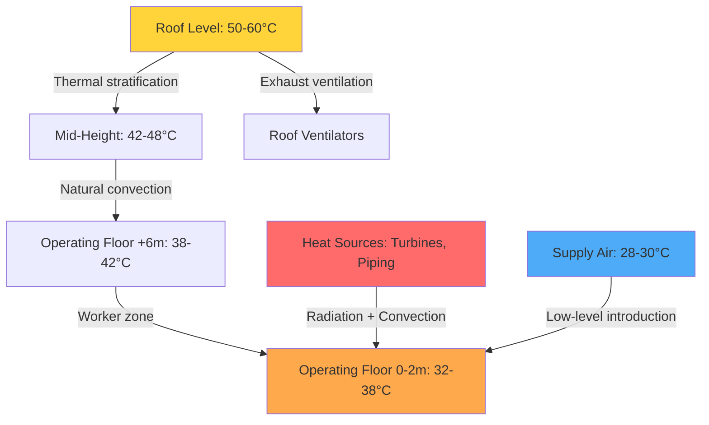
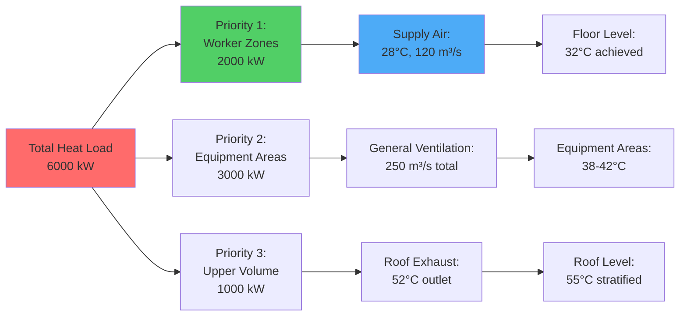

Turbine halls represent one of the most challenging industrial ventilation applications due to extreme heat loads from high-temperature equipment, massive building volumes, and the dual requirement of maintaining equipment reliability while providing acceptable worker comfort. Heat loads range from 200 to 500 W/m² of floor area, with individual turbine-generator sets radiating 1-3% of their nameplate capacity as heat to the surrounding space.

## Heat Load Characterization

The primary heat sources in turbine halls are turbine casings, steam piping, feedwater heaters, generators, and auxiliary equipment. The heat transfer from these sources occurs through three mechanisms: radiation, convection, and conduction.

### Turbine Casing and Steam Piping Heat Emission

For insulated turbine casings and high-pressure steam piping operating at 540-565°C, the surface temperature after insulation typically reaches 50-60°C. The heat loss per unit area follows:

$$q'' = \varepsilon \sigma (T_s^4 - T_\infty^4) + h_c(T_s - T_\infty)$$

Where:
- $q''$ = heat flux (W/m²)
- $\varepsilon$ = surface emissivity (0.85-0.95 for oxidized metal or insulation)
- $\sigma$ = Stefan-Boltzmann constant (5.67×10⁻⁸ W/m²·K⁴)
- $T_s$ = surface temperature (K)
- $T_\infty$ = ambient air temperature (K)
- $h_c$ = convective heat transfer coefficient (5-10 W/m²·K for natural convection)

For a typical insulated surface at 55°C in a 35°C environment:

$$q'' = 0.9 \times 5.67 \times 10^{-8}(328^4 - 308^4) + 7.5(55-35) = 120 + 150 = 270 \text{ W/m}^2$$

Large turbine-generator sets may have 500-800 m² of exposed surface area, yielding total heat loads of 135-215 kW per unit.

## Ventilation Rate Calculations

The required ventilation rate for heat removal follows the fundamental sensible heat equation:

$$\dot{Q}_s = \dot{m} c_p \Delta T = \rho \dot{V} c_p (T_{exhaust} - T_{supply})$$

Solving for volumetric flow rate:

$$\dot{V} = \frac{\dot{Q}_s}{\rho c_p (T_{exhaust} - T_{supply})}$$

For standard air properties ($\rho$ = 1.2 kg/m³, $c_p$ = 1005 J/kg·K) and a simplified form:

$$\dot{V} \text{ (m}^3\text{/s)} = \frac{\dot{Q}_s \text{ (kW)}}{1.2 \times (T_{exhaust} - T_{supply})}$$

**Critical Design Parameters:**

| Parameter | Typical Range | Design Consideration |
|-----------|---------------|---------------------|
| Total heat load | 2-8 MW | Varies with plant capacity (100-1000 MW) |
| Supply air temperature | 25-30°C | Limited by outdoor air conditions |
| Exhaust air temperature | 45-55°C | Balance between air quantity and stratification |
| Air change rate | 6-15 ACH | Higher for smaller halls, lower for large volumes |
| Temperature rise | 15-25 K | Larger ΔT reduces airflow but increases stratification |

For a turbine hall with 6 MW total heat load and 20 K temperature rise:

$$\dot{V} = \frac{6000}{1.2 \times 20} = 250 \text{ m}^3\text{/s or } 900{,}000 \text{ m}^3\text{/hr}$$

## Thermal Stratification and Temperature Gradients

Turbine halls exhibit severe thermal stratification due to their height (20-40 m) and concentrated heat sources at the operating floor. The temperature gradient in naturally stratified spaces follows:

$$\frac{dT}{dz} = \frac{q'''}{k_{eff} \cdot A}$$

Where $k_{eff}$ represents the effective thermal conductivity of air including convective effects. Measured gradients range from 1.5-3.0 K/m.

### Stratification Control Strategies

| Strategy | Temperature Gradient | Worker Comfort | Energy Efficiency |
|----------|---------------------|----------------|-------------------|
| Natural ventilation only | 2.5-3.0 K/m | Poor (38-40°C at floor) | Excellent |
| Low-level supply + roof exhaust | 1.5-2.0 K/m | Acceptable (32-36°C at floor) | Very good |
| Destratification fans + ventilation | 0.8-1.2 K/m | Good (30-34°C at floor) | Good |
| Spot cooling at workstations | Variable | Excellent (26-28°C local) | Moderate |

## Worker Comfort Zones vs Equipment Areas

The turbine hall must be divided into distinct thermal zones based on occupancy patterns and equipment requirements.

**Zone Classification:**

1. **Continuous Occupancy Zones** (control rooms, offices): 22-26°C, 30-60% RH per ASHRAE Standard 55
2. **Intermittent Work Zones** (operating floor walkways): 28-32°C acceptable for light work per ISO 7243
3. **Equipment-Only Zones** (turbine pedestals, cable galleries): 35-45°C acceptable, no comfort requirement
4. **Critical Equipment** (generators, electrical switchgear): Maximum 40-45°C per manufacturer specifications

## Summer Peak Load Considerations

Summer conditions impose maximum stress on turbine hall ventilation systems due to elevated outdoor air temperatures and increased power generation demand.

**Peak Load Amplification Factors:**

$$\dot{Q}_{summer} = \dot{Q}_{base} \times (1 + f_{generation} + f_{ambient} + f_{solar})$$

Where:
- $f_{generation}$ = 0.05-0.15 (higher output during peak demand)
- $f_{ambient}$ = 0.10-0.20 (reduced heat transfer from equipment at higher ambient)
- $f_{solar}$ = 0.05-0.10 (solar gain through roof and walls)

Total summer load increases: 20-45% above base design.

**Summer Design Approach:**

The available temperature rise decreases as outdoor air temperature increases:

$$\Delta T_{available} = T_{max,allowable} - T_{outdoor}$$

For a 35°C design outdoor temperature and 50°C maximum exhaust temperature, $\Delta T_{available}$ = 15 K versus 20-25 K in moderate conditions. This requires:

$$\dot{V}_{summer} = \dot{V}_{design} \times \frac{\dot{Q}_{summer}}{\dot{Q}_{design}} \times \frac{\Delta T_{design}}{\Delta T_{summer}}$$

This can increase airflow requirements by 60-80% during peak summer conditions, necessitating variable-speed fan systems or staged ventilation capacity.

**Summer Mitigation Strategies:**

1. **Evaporative cooling** of supply air: Reduces supply temperature by 5-8 K in dry climates
2. **Thermal mass utilization**: Night ventilation purges stored heat from concrete structures
3. **Load scheduling**: Maintenance activities scheduled for cooler periods
4. **Supplemental spot cooling**: Portable evaporative coolers for work areas during peak periods

The physics-based design of turbine hall heat removal systems requires careful analysis of heat transfer mechanisms, buoyancy-driven flows, and the interaction between mechanical ventilation and natural stratification patterns. Successful designs prioritize worker safety through thermal comfort while maintaining equipment reliability under extreme summer conditions.
